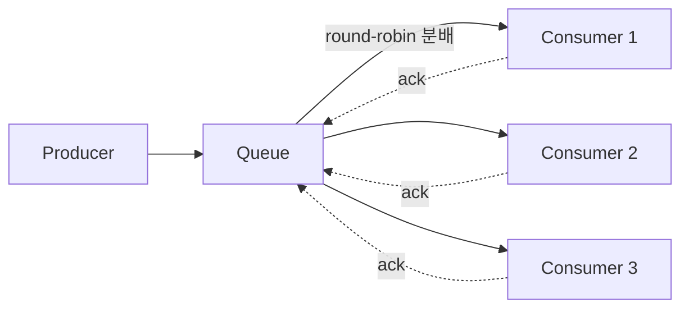

# Competing Consumers 패턴

## 핵심 정의
Competing Consumers 패턴은 하나의 Point-to-Point 채널(큐)에 여러 소비자(consumer) 인스턴스를 붙여 놓고, 메시지가 도착하면 그중 하나만 가져가 처리하도록 만드는 패턴이다. 소비자들이 같은 메시지를 두고 서로 "경쟁"하듯 가져간다고 해서 이런 이름이 붙었다. 처리 시간이 오래 걸리는 작업 하나가 전체 큐를 막지 않도록, 브로커·파티션·다운스트림 용량 내에서 소비자 추가로 처리량(throughput)을 수평 확장하는 것이 목적이다.

이 패턴은 [[Pub-Sub와 Point-to-Point]]에서 다룬 P2P 모델의 실무 구현 형태라고 볼 수 있다. Pub-Sub의 서로 다른 논리 구독은 각각 이벤트를 받으며, 하나의 shared subscription/서비스별 큐 안에서는 여러 워커가 경쟁할 수 있다. 따라서 하나의 pub-sub 토폴로지 안에서도 두 패턴을 조합한다.

## 동작 원리 / 구조

일반 ACK 기반 큐의 예에서 브로커는 큐에 쌓인 메시지를 연결된 소비자 중 하나에게 배타적으로 전달하고, 소비자가 처리를 마치고 확인 응답(ack)을 보내야 그 메시지를 완전히 제거한다. ack 전에 소비자가 죽으면 메시지는 다른 소비자에게 재전달(redelivery)된다.



**RabbitMQ**: 여러 소비자가 같은 큐를 구독하면 기본적으로 라운드로빈(round-robin)으로 메시지를 분배한다. 다만 이는 "누가 얼마나 바쁜지"를 고려하지 않는 분배 정책이며 소비자 우선순위·prefetch 여유도 반영하므로, `basic.qos`의 prefetch count를 조정해 소비자별 미확인(unacked) 메시지 수를 제한해야 실제로 공정한 분배(fair dispatch)가 이루어진다. prefetch를 1로 두면 소비자는 이전 메시지를 ack해야 다음 메시지를 받으므로, 느린 소비자에게 메시지가 쌓이는 대신 자연스럽게 다른 소비자로 부하가 넘어간다. 반대로 prefetch를 높게 잡으면 처리량은 늘지만 특정 소비자가 오래 붙잡고 있는 메시지가 많아져 분배 불균형이 생길 수 있다.

```java
// Spring AMQP 예시: 동시성과 prefetch를 함께 조정
@Bean
public SimpleRabbitListenerContainerFactory containerFactory(ConnectionFactory cf) {
    SimpleRabbitListenerContainerFactory factory = new SimpleRabbitListenerContainerFactory();
    factory.setConnectionFactory(cf);
    factory.setConcurrentConsumers(3);
    factory.setMaxConcurrentConsumers(10);
    factory.setPrefetchCount(1); // 공정 분배 우선
    // @RabbitListener(containerFactory = "containerFactory", queues = "task-queue")로 선택
    return factory;
}
```

**Kafka**: 일반 컨슈머 그룹(consumer group) 자체가 Competing Consumers를 구현하는 방식이다. 다만 RabbitMQ처럼 메시지 단위로 경쟁하는 것이 아니라 파티션(partition) 단위로 소유권이 배정되므로, 그룹 내 최대 병렬도는 파티션 수로 제한된다. 파티션 배정과 리밸런싱(rebalancing)에 대한 세부 내용은 [[파티션과 컨슈머 그룹]]에서 다룬다. Kafka 4.2+ Share Groups는 한 파티션을 여러 소비자가 함께 소비하고 개별 ACK하며 순서 보장을 완화하는 별도 선택지다.

## 실무 관점
- 처리량을 늘려야 할 때 코드를 바꾸지 않고 소비자 인스턴스(워커)만 늘리면 되므로, 배치 처리·이미지 변환·이메일 발송처럼 독립적으로 처리 가능한 작업에 적합하다.
- 순서 보장이 필요한 작업에는 기본적으로 맞지 않는다. 여러 소비자가 동시에 처리하면 완료 순서가 뒤섞이기 때문에, 순서가 중요한 도메인은 [[멱등성과 메시지 순서 보장]]에서 다루는 파티션 키 전략이나 단일 소비자 제약이 필요하다.
- 흔한 실수: RabbitMQ에서 prefetch를 작업에 비해 크게 두고 소비자를 늘리면, 먼저 붙은 소비자가 큐에 있는 메시지를 대량으로 선점해가 버려 나머지 소비자가 놀게 되는 "쏠림" 현상이 생긴다. 기본값은 계층마다 다르다. AMQP의 0은 무제한, Spring AMQP 2.0+ 기본은 250, RabbitMQ 4.3 quorum queue의 상한은 2,000이다. 부하·메시지 크기에 맞춰 설정한다.
- 흔한 실수: 소비자 수를 무작정 늘리면 처리량이 계속 증가할 것이라 기대하지만, Kafka는 파티션 수, 다운스트림 DB 커넥션 풀이나 외부 API의 동시 처리 한도가 실제 병목이 되는 경우가 많다. 소비자 확장은 병목 지점을 함께 늘려야 효과가 있다.
- 튜닝 포인트: RabbitMQ는 prefetch count와 소비자 수의 조합, ACK 타임아웃(4.3 quorum의 `consumer-timeout` 정책 등, 큐 타입·버전별 지원 확인), Kafka는 파티션 수와 `max.poll.records`, 컨슈머 인스턴스 수의 비율이 핵심이다.
- 장애 패턴: 소비자 하나가 특정 메시지를 처리하다 반복적으로 예외를 던지면(poison message), ack 없이 재시도가 반복되며 다른 소비자에게도 같은 메시지가 옮겨 다니다 전체 큐 처리가 지연될 수 있다. [[Dead Letter Queue]]로 격리하는 재시도 한도 설계가 필요하다.

## 심화 Q&A

### Q. RabbitMQ 소비를 취소하면 처리 중인 메시지도 즉시 다른 워커로 넘어가는가?
RabbitMQ 4.3의 `basic.cancel`은 이후 신규 전달을 중단하지만 이미 전달 중이거나 unacked인 메시지를 폐기·재큐잉하지 않는다. 따라서 취소 응답을 받았다는 사실만으로 워커가 수행하던 DB 갱신까지 끝났다고 판단하면 안 된다.

안전한 축소는 신규 전달 중단 → 이미 받은 작업의 완료·ACK를 기한 내 기다림 → 채널 종료 순서를 기본으로 설계한다. 기한을 넘겨 채널을 닫으면 미확인 메시지는 재전달될 수 있지만, 옛 워커의 Java 작업이나 외부 요청이 자동 취소되는 것은 아니다. 이전 작업이 늦게 커밋하고 새 워커도 같은 일을 수행할 수 있으므로 메시지 ID 기반 멱등성과 실제 작업 취소·종료 경계를 함께 다룬다. 같은 채널의 다른 소비자에도 종료 영향이 있으므로 채널 공유 범위까지 확인한다. 큐의 ready 수만 0인 상태와 모든 unacked 작업이 완료된 상태도 구분한다.

### Q. RabbitMQ의 prefetch count를 1로 설정하면 항상 최선의 선택인가?
아니다. prefetch=1은 느린 소비자의 선점을 줄이지만 공정성을 수학적으로 최적화하지는 않으며, 소비자와 브로커 간 브로커가 ACK를 받아 다음 메시지를 보낼 때까지 네트워크 왕복(round trip)이 필요하므로 처리 지연이 짧은 작업에서는 오히려 처리량이 떨어질 수 있다. 작업 하나의 처리 시간이 길고 소비자 간 처리 속도 편차가 큰 경우에는 1이 유리하고, 작업이 짧고 균일하다면 prefetch를 어느 정도 높여 네트워크 왕복 오버헤드를 줄이는 것이 유리하다. 결국 "공정성 vs 처리량"의 트레이드오프이며, 실측 후 조정해야 한다.

### Q. Kafka에서 Competing Consumers를 구현할 때 RabbitMQ와 근본적으로 다른 점은 무엇인가?
RabbitMQ는 메시지 하나하나를 놓고 소비자가 경쟁하는 동적(dynamic) 분배 방식이라 소비자별 처리 속도에 따라 자동으로 부하가 재분배된다. 일반 KafkaConsumer 그룹은 파티션이라는 고정 단위로 소유권을 배정하는 정적(static) 분배 방식이라, 한 파티션에 유독 무거운 메시지가 몰리면 그 파티션을 담당한 소비자만 뒤처지고 다른 소비자가 자동으로 도와줄 수 없다. Kafka에서 부하를 재분배하려면 파티션을 더 잘게 나누거나 파티션 키 설계를 바꿔야 한다.

### Q. 소비자 수를 파티션 수보다 늘리면 왜 처리량이 늘지 않는가?
Kafka는 한 파티션을 그룹 내 한 소비자에게만 배정하므로, 파티션 수를 초과하는 소비자는 어떤 파티션도 배정받지 못해 유휴 상태로 남는다. 이는 Competing Consumers의 "경쟁"이 RabbitMQ처럼 메시지 단위가 아니라 파티션 단위로 일어나기 때문이다. 일반 그룹의 파티션 소비 병렬도를 늘리려면 파티션 수와 키 분포를 조정한다. 파티션 증설만으로 다운스트림 병목이 해결되지는 않는다.

### Q. 소비자 인스턴스가 오토스케일링(auto scaling)으로 자주 늘었다 줄었다 하면 어떤 부작용이 있는가?
RabbitMQ는 소비자의 연결/해제가 큐의 소비자 목록만 바꾸므로 비교적 영향이 적지만, prefetch로 이미 가져간 메시지가 있는 상태에서 갑자기 죽으면 해당 메시지들이 한꺼번에 재전달되어 순간적으로 부하가 몰릴 수 있다. Kafka는 소비자 추가/제거마다 리밸런싱이 발생해 짧게라도 그룹 전체의 처리가 멈추는 stop-the-world 구간이 생길 수 있으므로(리밸런스 프로토콜에 따라 정도는 다름), 오토스케일링 주기를 너무 짧게 잡으면 리밸런싱 오버헤드가 실제 처리 이득을 상쇄할 수 있다.

### Q. Competing Consumers 패턴과 Pub-Sub 기반 팬아웃(fan-out) 후 각 구독자 내부에서 다시 워커 풀을 두는 구조는 어떻게 다른가?
Pub-Sub은 서로 다른 책임을 가진 서비스들이 같은 이벤트를 각자 독립적으로 받아야 할 때 쓰고, 그 안에서 각 서비스가 자기 몫의 메시지를 빠르게 처리하기 위해 내부적으로 Competing Consumers를 또 적용할 수 있다. 즉 두 패턴은 배타적이지 않고 계층적으로 결합된다. 예를 들어 주문 이벤트를 결제/배송 서비스가 각각 Pub-Sub으로 받고, 각 서비스 내부에서는 여러 워커가 Competing Consumers로 자신의 큐를 나눠 처리하는 구조가 일반적이다.

### Q. 소비자 하나가 메시지를 가져갔지만 처리 중 크래시하면 정확히 어떻게 복구되는가?
ack를 아직 보내지 않았다면 브로커는 해당 연결이 끊기는 시점(RabbitMQ는 channel/connection 종료, Kafka는 세션 타임아웃 또는 리밸런싱)에 그 메시지(또는 파티션)를 다른 소비자에게 재할당한다. 문제는 소비자가 처리를 이미 끝냈지만 ack 직전에 죽은 경우로, 이때는 메시지가 다른 소비자에게 다시 전달되어 중복 처리가 발생한다. 그래서 Competing Consumers는 신뢰성이 필요하면 처리 후 ACK와 내구성 있는 보관으로 at-least-once 경로를 구성하며, [[멱등성과 메시지 순서 보장]]에서 다루는 멱등 처리와 세트로 설계해야 한다.

## 관련 개념
- [[Pub-Sub와 Point-to-Point]]
- [[파티션과 컨슈머 그룹]]
- [[멱등성과 메시지 순서 보장]]
- [[메시지 확인 ACK]]

## 참고 자료

확인일: 2026-09-08. 아래 적용 범위에서 본문·Q&A·예제를 재검증했다. 예제는 문서와 대조했으며 별도 실행 검증은 하지 않았다.

- [RabbitMQ Consumers](https://www.rabbitmq.com/docs/consumers) — RabbitMQ 4.3, 경쟁 소비·prefetch·생명주기.
- [RabbitMQ ACK and Confirms](https://www.rabbitmq.com/docs/confirms) — RabbitMQ 4.3, ACK·prefetch 상한.
- [Quorum Queues](https://www.rabbitmq.com/docs/quorum-queues) — RabbitMQ 4.3, consumer-timeout·delivery-limit.
- [KafkaShareConsumer](https://kafka.apache.org/43/javadoc/org/apache/kafka/clients/consumer/KafkaShareConsumer.html) — Kafka 4.3.1, 일반 그룹과 Share Group 차이.
- [Spring AMQP Listener Concurrency](https://docs.spring.io/spring-amqp/reference/amqp/listener-concurrency.html) — Spring AMQP 4.1, min/max 소비자 설정.
- [Spring AMQP Asynchronous Consumer](https://docs.spring.io/spring-amqp/reference/amqp/receiving-messages/async-consumer.html) — Spring AMQP 2.0+ prefetch 기본 250.
- [Competing Consumers Pattern](https://learn.microsoft.com/en-us/azure/architecture/patterns/competing-consumers) — 패턴 범위·처리량·순서·멱등성.

부분 재검증: 2026-10-04. RabbitMQ 4.3 소비 취소의 신규 전달·in-flight·unacked 처리 범위를 확인했다. 종료 순서와 이전 작업의 늦은 커밋 사례는 브로커 취소가 애플리케이션 업무 취소와 다르다는 계약에서 도출했다. RabbitMQ·Spring AMQP 종료를 실행하지 않았고 기존 `verified`는 유지한다.

- [RabbitMQ 4.3 Consumers: Cancelling a Consumer](https://www.rabbitmq.com/docs/consumers#cancelling) — basic.cancel의 전달 중단과 미확인 메시지 유지, 채널 종료를 통한 재큐잉.
