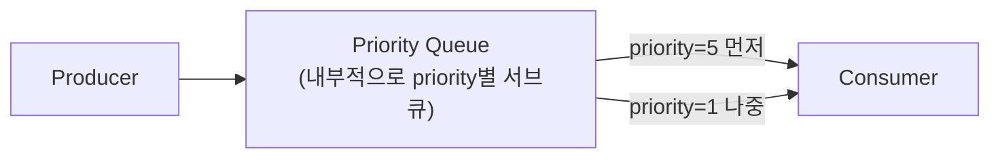

# 우선순위 큐와 메시지 정렬

## 핵심 정의
우선순위 큐(priority queue)는 메시지에 부여된 우선순위(priority) 값에 따라 먼저 도착한 순서가 아니라 우선순위가 높은 메시지를 먼저 소비자에게 전달하는 큐다. 일반적인 메시지 큐는 FIFO(선입선출)를 기본 전제로 하지만, 결제 실패 알림처럼 긴급한 작업과 야간 배치 리포트처럼 지연되어도 무방한 작업이 같은 큐에 섞여 있을 때는 우선순위 기반 전달이 필요하다.

메시지 정렬(message ordering)과는 다른 개념이다. 정렬은 "발행한 순서대로 처리"를 보장하는 것이고, 우선순위 큐는 오히려 발행 순서를 의도적으로 무시하고 중요도 순으로 처리 순서를 재배치하는 것이다. 두 요구사항은 근본적으로 상충하므로 같은 큐에서 동시에 강하게 보장하기 어렵다.

## 동작 원리 / 구조

**RabbitMQ**: 큐 선언 시 `x-max-priority` 인자로 최대 우선순위 값을 지정하면 우선순위 큐가 된다. 공식 문서는 classic 큐 기준으로 우선순위 단계를 1~255 범위에서 지정할 수 있지만, 내부적으로 우선순위마다 별도의 서브큐를 유지하는 구조라 단계가 많아질수록 CPU/메모리 오버헤드가 커지므로 2~4단계, 많아도 한 자릿수 단계를 쓰도록 권장한다. Quorum 큐는 `x-max-priority` 인자를 쓰지 않으며 지원 범위가 버전마다 다르다. RabbitMQ 4.0~4.2에서 Quorum 큐에 도입된 초기 구현은 메시지 우선순위 필드 값이 5 미만이면 normal, 5 이상이면 high로 취급하는 2단계 상대 우선순위만 지원했고, RabbitMQ 4.3부터 0~31의 32단계 엄격한(strict) 우선순위를 항상 지원한다. 범위 밖 값은 상한으로 제한되고 미지정 기본값은 4다(classic은 0). 즉 4.0~4.2에서 세밀한 우선순위 단계를 기대하고 설계하면 실제로는 high/normal 2단계로만 동작한다.

```java
Map<String, Object> args = new HashMap<>();
args.put("x-queue-type", "classic"); // vhost의 기본 큐 타입에 의존하지 않음
args.put("x-max-priority", 5);
channel.queueDeclare("task-queue", true, false, false, args);

// 발행 시 우선순위 지정
channel.basicPublish("", "task-queue",
    new AMQP.BasicProperties.Builder().priority(5).deliveryMode(2).build(),
    body);
```



브로커는 큐에 대기 중인 메시지의 우선순위로 전달을 선택한다. 위 서브큐 그림은 classic 큐의 개념도다. 4.3 quorum의 반환된 메시지는 원래 우선순위와 무관하게 별도 returns queue에 반환 순서로 들어가는 예외가 있다. 다만 이미 소비자에게 prefetch되어 전달된 메시지는 순서가 뒤바뀌지 않으므로, 소비자가 이미 낮은 우선순위 메시지를 여러 개 가져간 상태라면 나중에 도착한 높은 우선순위 메시지가 그 뒤로 밀릴 수 있다.

RabbitMQ 4.3의 classic 큐와 quorum 큐는 낮은 우선순위의 기아(starvation) 처리도 다르다. Classic은 높은 우선순위부터 서브큐를 순회하며, 순회 도중 새로 들어온 높은 우선순위 메시지는 다음 순회에서 다뤄 낮은 우선순위에도 기회를 준다. Quorum은 엄격한 우선순위를 적용하므로 높은 우선순위가 계속 쌓이면 낮은 우선순위가 무기한 밀릴 수 있다. 업무별 최소 처리량이 필요하면 큐를 분리하고 소비자 용량을 배분한다.

**Kafka**: 브로커 차원의 우선순위 큐 기능이 없다. 파티션은 오직 순서를 보장하는 로그 구조일 뿐 우선순위 개념을 갖지 않는다. 실무에서는 다음과 같은 우회 방식을 쓴다.
1. 우선순위별로 별도 토픽을 분리(`orders-high`, `orders-normal`, `orders-low`)하고, 별도 컨슈머/작업 스케줄러로 high에 자원을 우선 배분한다. 단일 KafkaConsumer.subscribe()의 토픽 나열 순서는 poll 우선순위가 아니며 pause/resume과 처리 큐를 명시적으로 제어해야 한다.
2. 컨슈머 측에서 짧은 시간 동안 메시지를 버퍼에 모은 뒤 우선순위 필드로 정렬해 처리(작은 배치 안에서만 우선순위 적용 가능, 전역 보장은 아님).

**AWS SQS**: Standard/FIFO 큐 모두 네이티브 우선순위 기능이 없다. 큐를 우선순위별로 분리하고(`high-priority-queue`, `low-priority-queue`) 애플리케이션이 high 큐를 먼저 폴링하는 방식이 표준적인 우회안이다.

## 실무 관점
- 언제 쓰는가: 결제/보안 알림처럼 SLA가 짧은 작업과 대량 배치처럼 지연 허용치가 큰 작업이 물리적으로 같은 큐/토픽을 공유해야 하는 상황. 대부분은 큐/토픽 자체를 분리하는 것이 더 간단하고 예측 가능한 대안이다.
- 트레이드오프: RabbitMQ 4.3 quorum의 strict 우선순위는 대기 메시지의 전달 선택에 적용되며 이미 소비 중인 작업을 선점하거나 완료 시각을 보장하지 않는다. 큐 분리도 자동으로 전역 strict 순서를 만들지 않지만 우선순위별 용량 예약과 기아 방지 정책에 유리하다.
- 흔한 실수: RabbitMQ 우선순위 큐에서 우선순위 단계를 세밀하게(예: 0~100) 잡아 오히려 큐 성능이 떨어지는 경우. classic의 단계는 필요한 최소 개수(공식 권장 2~4)로 제한한다. 4.3 quorum은 항상 32단계를 제공하며 `x-max-priority`를 무시한다.
- 흔한 실수: 큐 분리 방식에서 낮은 우선순위 큐를 아예 폴링하지 않도록 방치해, 낮은 우선순위 작업이 무한정 밀리는 기아(starvation) 상태에 빠지는 경우. 높은 우선순위 큐가 비어 있을 때만 낮은 큐를 처리하는 구조라도, 낮은 큐 처리에 최소한의 비율(예: 가중치 기반 라운드로빈)을 보장해야 한다.
- 흔한 실수: 우선순위 큐를 순서 보장 수단으로 오해하고 사용하는 경우. 우선순위 큐는 오히려 발행 순서를 깨뜨리는 메커니즘이므로, 순서가 중요한 도메인에는 [[멱등성과 메시지 순서 보장]]에서 다루는 파티션 키 기반 설계를 써야 한다.
- 튜닝 포인트: RabbitMQ classic은 `x-max-priority` 단계 수, 4.3 quorum은 strict 우선순위·반환 큐 예외, prefetch 설정과의 상호작용, 큐 분리 방식은 큐별 컨슈머 배분 비율과 낮은 우선순위 큐의 기아 방지 정책.

## 심화 Q&A

### Q. RabbitMQ 우선순위 큐가 "완벽한" 우선순위 보장을 하지 못하는 이유는 무엇인가?
소비자에게 이미 prefetch되어 전달된 메시지는 브로커가 되돌릴 수 없다. 예를 들어 prefetch count가 10인 소비자가 낮은 우선순위 메시지 10개를 이미 받아간 직후 높은 우선순위 메시지가 도착하면, 소비자의 prefetch 여유가 생길 때까지 전달을 기다리고, 클라이언트가 FIFO로 처리하면 이미 받은 작업 뒤에서 실행될 수 있다. 선택 시점에 아직 큐에 없는 미래 메시지는 우선할 수 없다. 이는 strict 전달 선택과 모순되지 않는다. 4.3 quorum은 대기 중 높은 우선순위를 우선하되 반환 메시지 예외가 있고, 높은 우선순위가 계속 들어오면 낮은 우선순위가 기아에 빠질 수 있다.

### Q. Kafka에서 토픽을 우선순위별로 분리하는 방식의 가장 큰 약점은 무엇인가?
컨슈머가 여러 토픽을 폴링하는 순서와 비중을 애플리케이션 코드가 직접 관리해야 하므로, 브로커가 자동으로 보장해주는 게 아니라는 점이다. high 토픽만 무한정 우선 처리하도록 짜면 low 토픽이 기아 상태에 빠지고, 반대로 균등하게 폴링하면 우선순위 분리의 의미가 옅어진다. 또한 토픽을 분리하면 파티션·컨슈머 그룹·모니터링 대상이 늘어나 운영 복잡도가 커진다. 우선순위별 자원·지연 목표가 분명할 때 운영 비용과 분리 이득을 비교한다.

### Q. 우선순위 큐와 SLA(Service Level Agreement) 기반 처리는 같은 개념인가?
아니다. 우선순위 큐는 "상대적으로 무엇을 먼저 처리할지"를 정하는 정적인 순위 메커니즘이고, SLA 기반 처리는 "이 메시지는 언제까지 처리되어야 하는가"라는 마감 시한(deadline)을 기준으로 스케줄링하는 것이다. 예를 들어 낮은 우선순위 메시지라도 큐에 오래 머물러 SLA 위반이 임박하면 우선순위를 동적으로 올려주는 에이징(aging) 전략이 필요할 수 있는데, 이는 단순 우선순위 큐만으로는 해결되지 않고 별도의 스케줄링 로직(예: 대기 시간에 비례해 가중치를 높이는 방식)을 얹어야 한다.

### Q. 우선순위 큐를 도입하면 재시도/DLQ 흐름과 상호작용에서 어떤 문제가 생길 수 있는가?
재시도되는 메시지가 원래 우선순위 정보를 유지하지 못하면(예: DLQ에서 재구동 시 우선순위 헤더가 소실), 원래 긴급했던 메시지가 재시도 큐에서는 낮은 우선순위로 취급되어 오히려 늦게 처리될 수 있다. 또한 높은 우선순위 메시지가 처리 실패를 반복하면 재시도마다 큐 앞자리를 계속 차지해 낮은 우선순위 메시지들의 대기 시간을 늘리는 부작용도 있다. 우선순위 메타데이터는 재시도/DLQ 파이프라인 전 구간에서 명시적으로 전달되도록 설계해야 하며, [[Dead Letter Queue]]의 재시도 한도 설계와 함께 검토해야 한다.

### Q. 큐를 우선순위별로 완전히 분리하는 방식과 브로커 내장 우선순위 기능 중 어떤 기준으로 선택해야 하는가?
분리된 큐 방식은 모니터링(각 큐의 적재량을 독립적으로 확인 가능), 스케일링(우선순위별로 컨슈머 자원을 다르게 배분 가능), 장애 격리(큐별 자원을 격리하면 장애 전파를 줄임; 공유 브로커·디스크·DB 병목은 남음) 측면에서 유리해 대규모 운영 환경에 적합하다. 브로커 내장 우선순위 기능은 큐/토픽 하나로 운영이 단순해지지만 모니터링과 장애 격리 세분화가 어렵고, 위에서 설명한 전달 순서와 실행·완료 순서의 차이를 고려해야 한다. 우선순위 단계가 적고(2~3단계) 운영 조직이 크지 않다면 내장 기능으로 충분하고, 우선순위별로 다른 SLA·알림·자원 정책이 필요하면 큐 분리가 낫다.

### Q. 우선순위가 다른 메시지들이 같은 파티션 키(예: 같은 사용자 ID)를 가져야 하는 경우, Kafka에서 순서 보장과 우선순위 요구를 동시에 만족시킬 수 있는가?
근본적으로 어렵다. 파티션 키로 순서를 보장하려면 같은 키의 메시지는 반드시 같은 파티션(따라서 같은 토픽)에 있어야 하는데, 우선순위별 토픽 분리는 이 전제를 깨뜨린다. 이런 요구가 동시에 있다면 토픽을 분리하는 대신 한 토픽 안에서 우선순위 필드를 메시지에 싣고, 컨슈머가 짧은 시간 창(window) 단위로 버퍼링한 뒤 그 창 내에서만 우선순위 재정렬을 적용하는 절충안을 쓴다. 그러나 같은 키 안에서 재정렬하면 키 순서도 포기하는 것이므로 순서 요구를 동시에 만족하는 해법은 아니다. 키별로 다음 처리 가능한 이벤트 하나만 후보로 두고 서로 다른 키의 후보 사이에 우선순위를 적용하거나 업무 선후 관계를 별도로 모델링한다.

## 관련 개념
- [[Competing Consumers 패턴]]
- [[Dead Letter Queue]]
- [[멱등성과 메시지 순서 보장]]
- [[메시지 확인 ACK]]

## 참고 자료

부분 재확인: 2026-09-22. RabbitMQ 4.3 Priority Support 문서에서 classic 서브큐 순회와 quorum strict 우선순위의 기아 처리 차이를 확인했다. Kafka 순서 보장 등 나머지 서술의 전체 재검증은 아니므로 기존 `verified`를 유지했다.

확인일: 2026-09-08. 아래 적용 범위에서 본문·Q&A·예제를 재검증했다. 예제는 문서와 대조했으며 별도 실행 검증은 하지 않았다.

- [RabbitMQ Priority Support](https://www.rabbitmq.com/docs/priority) — RabbitMQ 4.3, classic 설정·quorum 0~31·반환 큐·기아·prefetch.
- [RabbitMQ 4.0 Quorum Features](https://www.rabbitmq.com/blog/2024/08/28/quorum-queues-in-4.0) — 4.0~4.2 normal/high 상대 우선순위, 4.3 변경 안내.
- [KafkaConsumer API](https://kafka.apache.org/43/javadoc/org/apache/kafka/clients/consumer/KafkaConsumer.html) — Kafka 4.3.1, subscribe·poll·pause와 파티션 순서.
- [SQS Standard Queues](https://docs.aws.amazon.com/AWSSimpleQueueService/latest/SQSDeveloperGuide/standard-queues.html) — 확인일 서비스 문서, 큐 모델·순서 한계.
- [SQS SendMessage](https://docs.aws.amazon.com/AWSSimpleQueueService/latest/APIReference/API_SendMessage.html) — 확인일 API, 메시지 속성·순서/중복 관련 입력; 네이티브 priority 필드 없음.
- [AWS Prioritized Messages from SQS](https://aws.amazon.com/blogs/messaging-and-targeting/prevent-email-throttling-concurrency-limit/) — AWS 구현 안내, 네이티브 priority 부재와 큐별 polling.
