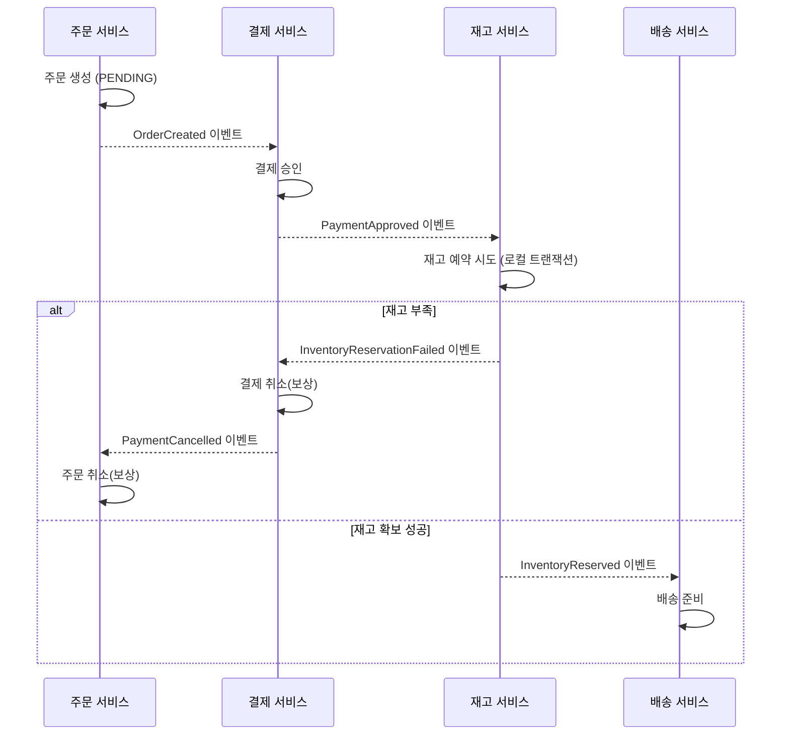
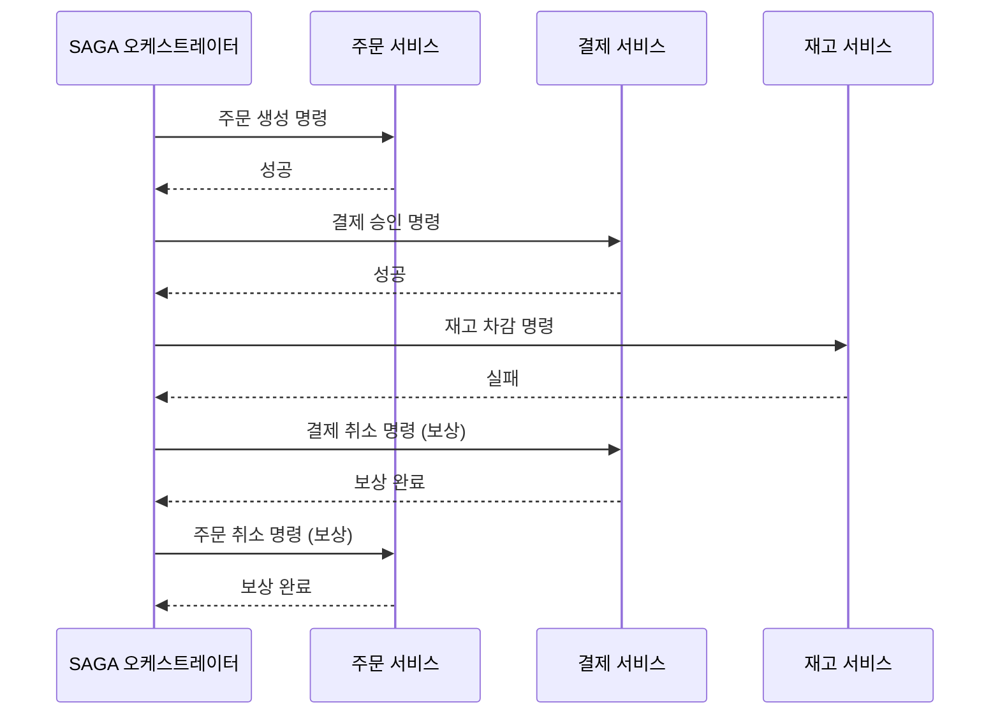

# SAGA 패턴

## 핵심 정의

SAGA 패턴은 마이크로서비스처럼 여러 서비스/데이터베이스에 걸친 작업을 하나의 분산 트랜잭션(distributed transaction, 2PC 등)으로 묶지 않고, 각 서비스의 로컬 트랜잭션(local transaction)을 의존 순서에 따라 실행하고 그 결과를 이벤트나 메시지로 다음 단계에 전달하는 방식으로 데이터 일관성을 맞추는 패턴이다. 중간에 어느 단계가 실패하면, 재시도를 통한 전진 복구 또는 앞선 작업의 효과를 업무적으로 상쇄하는 보상 트랜잭션(compensating transaction)을 실행한다. 보상은 보통 의존 관계의 역순으로 설계하지만 업무 우선순위에 따라 순서를 바꾸거나 병렬화할 수 있으며, 과거 상태를 그대로 복원하는 것은 아니다.

핵심은 서비스 전체를 묶는 원자성(atomicity)과 격리성(isolation)을 로컬 ACID 트랜잭션처럼 제공하지 않는다는 점이다. 원자성과 강한 일관성(strong consistency)은 동의어가 아니다. 각 단계의 중간 상태를 허용하고 복구가 계속 진행된다는 전제 아래 업무적으로 허용되는 최종 상태로 수렴시킨다(eventual consistency). 조율 방식에 따라 코레오그래피(choreography) 방식과 오케스트레이션(orchestration) 방식으로 나뉜다.

## 동작 원리 / 구조

**코레오그래피 방식**: 중앙 조정자 없이 각 서비스가 이벤트를 구독하고, 자기 작업을 끝내면 다음 이벤트를 발행한다.

**오케스트레이션 방식**: 중앙 오케스트레이터(orchestrator)가 각 단계를 명령(command)으로 호출하고, 실패 시 보상 명령을 순서대로 지시한다.

| 구분 | 코레오그래피 | 오케스트레이션 |
|---|---|---|
| 조정 주체 | 중앙 조정자 없음; 이벤트 계약·상태 전이로 분산 조율 | 중앙 오케스트레이터가 전체 흐름 제어 |
| 장점 | 직접 호출 결합을 줄이고 이벤트로 참여 가능; 이벤트 의미·흐름 결합은 남음 | 흐름이 한곳에 명시적으로 보여 추적/디버깅 쉬움 |
| 단점 | 전체 흐름 파악 어려움, 서비스 늘어날수록 이벤트 순환 위험 | 오케스트레이터가 SPOF(단일 장애점)이자 병목이 될 수 있음 |
| 적합한 규모 | 단계가 적고 참여 서비스가 안정적일 때 | 단계가 많고 복잡한 워크플로, 상태 추적이 중요할 때 |

보상 트랜잭션 설계 시 주의할 성질:
- **의미적 잠금(semantic lock)**: PENDING 같은 상태로 충돌하는 명령을 거부·지연한다. 플래그 자체가 DB 잠금은 아니므로 모든 쓰기 경로가 상태와 버전을 원자적으로 검사해야 하며, 종료·보상 시 해제하고 정체 상태도 복구한다.
- **멱등성(idempotency)**: 같은 명령/이벤트가 중복 전달돼도 결과가 같아야 한다(메시지 큐는 최소 한 번 전달을 보장하는 경우가 많으므로 필수).
- **역행 불가능한 작업 처리**: 이메일 발송처럼 되돌릴 수 없는 작업은 보상 대신 별도의 정정 알림(예: "취소 메일 재발송")으로 처리한다.

## 실무 관점

- **언제/왜 쓰는가**: 서비스별 DB의 장기 업무 흐름을 2PC 없이 연결하고 중간 상태와 보상 의미를 정의할 수 있을 때 사용한다. 2PC는 참여자 지원과 장애 복구·잠금 유지 비용을 고려해야 하지만, SAGA가 항상 더 낫거나 모든 대규모 시스템의 기본 해법은 아니다. 동시성으로 깨질 수 없는 불변식이 있다면 서비스·트랜잭션 경계부터 재검토한다.
- **트레이드오프**: 전체 작업의 원자적 가시성과 격리를 제공하지 않으므로 "주문은 생성됐는데 결제는 아직 안 된" 것 같은 중간 상태가 사용자에게 노출될 수 있다. 보상 트랜잭션 로직이 정방향 로직만큼(때로는 그 이상) 복잡해지고, 테스트해야 할 실패 시나리오 조합이 많아진다.
- **흔한 실수/장애 사례**:
  - 보상 트랜잭션 자체가 실패하는 경우(예: 결제 취소 API 호출이 타임아웃)에 대한 재시도/알림 체계 부재로 시스템이 영구히 불일치 상태에 빠짐.
  - 이벤트 순서가 뒤바뀌어 도착(네트워크 지연 등)했을 때 상태 머신이 잘못된 전이를 허용하는 경우. 상태 전이 검증(현재 상태에서 허용되지 않는 이벤트는 무시/에러 처리)이 필요하다.
  - 멱등키(idempotency key) 없이 결제/재고 차감 API를 설계해 재시도 시 중복 처리 발생.
  - 오케스트레이션 방식에서 오케스트레이터의 상태 저장소가 유실되어 진행 중이던 SAGA를 복구하지 못하는 경우 — 오케스트레이터 자체의 상태도 영속화하고 재시작 시 복구 가능해야 한다.
- **설정/튜닝 포인트**: 각 단계 타임아웃(예: 결제 승인 API 3초, 재고 차감 API 2초 등 외부 의존성별로 다르게 설정)과 재시도 정책(exponential backoff, 예: 1초 → 2초 → 4초 간격으로 최대 3회), 보상 실패 시 DLQ로 격리 후 수동/자동 재처리, SAGA 진행 상태를 조회할 수 있는 모니터링 대시보드(각 단계별 소요 시간, 실패율, 보상 발생률을 Prometheus/Grafana 등으로 수집).

## 심화 Q&A

### Q. 보상을 멱등하게 만들면 뒤늦은 보상이 새 업무를 취소하는 것도 막을 수 있는가?
A. 멱등성만으로는 부족하다. 재고 예약 R1의 취소가 지연되는 동안 같은 주문의 새 시도로 R2가 만들어졌는데, 보상 명령이 주문 ID만 보고 “현재 예약 취소”를 수행하면 R2를 취소할 수 있다. 같은 잘못된 취소를 한 번만 실행하는 것도 오류다.

보상에는 원래 작업의 SAGA/시도 ID와 예약·결제 승인 ID 등 **보상 대상의 식별자**를 남긴다. 참여 서비스는 해당 대상과 현재 상태·버전을 원자적으로 검사하고, 이미 해제했는지·다른 시도가 소유하는지·배송 확정처럼 보상 불가능한 단계인지 구분한다. 보상 전 전체 스냅샷을 덮어써 원복하면 다른 업무가 커밋한 변경도 지울 수 있다.

이는 제품 공통의 자동 기능이 아니라 동시 변경을 고려해야 한다는 보상 패턴 원칙을 적용한 설계 예시다. 같은 시도의 네트워크 재시도에는 같은 멱등키를 유지하고, 새로운 업무 시도와는 구분한다. 자동 보상이 불가능한 상태는 성공으로 처리하지 말고 조회·대사·운영 개입이 가능한 상태로 영속화한다.

### Q. SAGA는 ACID의 원자성(Atomicity)을 완전히 대체할 수 있는가?
아니다. SAGA는 "전부 성공 또는 전부 실패"라는 원자성을 보상 트랜잭션을 통한 논리적 되돌리기로 흉내낼 뿐, 물리적으로 원자적이지 않다. 보상이 실행되기 전까지는 일시적으로 불일치 상태가 실제로 존재하며, 보상 자체가 실패할 수도 있다는 점에서 진짜 원자성과는 다르다. 그래서 사용자에게 노출되는 상태(예: 주문 상태 값)를 설계할 때 이 중간 상태를 명시적으로 모델링해야 한다.

### Q. 코레오그래피 방식은 참여 관계가 복잡해질수록 어떤 문제가 생기는가?
전체 흐름이 어느 한 곳에도 명시적으로 존재하지 않고 이벤트 구독 관계로만 암묵적으로 존재하기 때문에, 새로운 개발자가 전체 트랜잭션 흐름을 이해하려면 모든 서비스의 코드를 추적해야 한다. 또한 서비스 간 순환 의존(A의 이벤트가 B를 트리거하고 B의 보상 이벤트가 다시 A를 트리거하는 등)이 생기기 쉬워 디버깅이 어려워진다. 서비스 수에 고정된 전환 기준은 없다. 분기·보상·상태 추적의 복잡성과 운영 요구를 기준으로 오케스트레이션을 고려한다.

### Q. 오케스트레이터가 SPOF라는 단점을 어떻게 완화하나?
진행 상태·타이머·발송할 명령을 내구성 있게 저장하고 여러 실행 인스턴스가 인계하도록 구성한다. 같은 SAGA의 상태 전이는 row lock이나 낙관적 버전 검사로 직렬화하고, 임대 기반 인계에는 만료된 소유자의 쓰기를 막는 fencing도 고려한다. 상태 저장 후 명령 발송 사이의 실패는 outbox 또는 워크플로 엔진의 내구성 프로토콜로 처리한다. 영속 저장소와 명령 처리도 중복·장애를 견뎌야 하므로 인스턴스 수만 늘려 해결하지 않는다.

### Q. 보상 트랜잭션 실행 중 또 실패하면 어떻게 하는가?
보상도 실패할 수 있다는 것을 전제로 설계해야 한다. 일반적으로 (1) 보상 자체에도 재시도 정책(멱등성 전제)을 적용하고, (2) 일정 횟수 초과 시 사람이 개입해야 하는 상태로 표시해 운영 알림을 보내며, (3) 가능하면 보상 실패로 인한 영향 범위를 최소화하도록 SAGA 단계 순서를 설계한다(보상 가능한 예약을 먼저 수행하고, 되돌리기 어려운 확정은 필요한 검증 뒤로 미룬다). 한 단계가 타임아웃되어도 외부 작업은 이미 성공했을 수 있으므로, 같은 멱등키로 상태를 조회·재시도하고 뒤늦은 성공과 보상이 경합하지 않게 상태 머신으로 처리한다.

### Q. SAGA와 TCC(Try-Confirm/Cancel) 패턴은 어떻게 다른가?
TCC는 Try에서 업무 자원을 예약하고, 전체 결정에 따라 Confirm 또는 Cancel을 실행한다. DB 트랜잭션을 흐름 내내 열어 두는 대신 예약 레코드·가용량 차감 등의 비즈니스 수준 제어를 사용한다. SAGA는 커밋된 작업의 효과를 사후 보상하는 방식이며 예약을 포함해 설계할 수도 있다. TCC 예약은 충돌을 줄일 수 있지만 자동으로 모든 연산에 직렬 가능 격리를 제공하지 않는다. Try/Confirm/Cancel의 멱등성, 빈 보상과 늦게 도착한 Try 등 실패 순서까지 구현해야 한다.

### Q. SAGA 단계 사이에 [[트랜잭셔널 아웃박스]] 패턴이 왜 자주 함께 쓰이는가?
SAGA 단계에서 DB 커밋 뒤 별도로 publish하면 커밋 성공·발행 실패 사이의 공백이 생긴다. 아웃박스는 비즈니스 변경과 발행할 이벤트 기록을 같은 로컬 트랜잭션으로 커밋한다. 실제 브로커 발행은 이후 릴레이가 재시도하며, 내구성·보존·릴레이 복구가 유지되어야 최종 전달된다. 중복 발행 가능성이 있으므로 다음 단계의 소비자는 멱등해야 한다.

## 관련 개념

- [[트랜잭셔널 아웃박스]]
- [[이벤트 소싱]]

## 참고 자료

- [Chris Richardson: Saga pattern](https://microservices.io/patterns/data/saga.html) — 로컬 트랜잭션·조율 방식·격리 부재 및 메시지 발행 원자성. 확인: 2026-09-08.
- [Azure Architecture: Compensating Transaction](https://learn.microsoft.com/en-us/azure/architecture/patterns/compensating-transaction) — 보상은 원상 복구가 아니며 역순 필수 아님; 동시 변경·재시도·복구 상태. 확인: 2026-09-08.
- [AWS Prescriptive Guidance: Saga patterns](https://docs.aws.amazon.com/prescriptive-guidance/latest/cloud-design-patterns/saga-patterns.html) — 전진 복구와 보상 복구 선택; 제품 기본값 없는 패턴 설명. 확인: 2026-09-08.
- [Apache Seata 2.5: TCC mode](https://seata.apache.org/docs/v2.5/user/mode/tcc/) — Try 자원 예약과 Confirm/Cancel; 비즈니스 수준 자원 제어. 확인: 2026-09-08.
- [Chris Richardson: Transactional Outbox](https://microservices.io/patterns/data/transactional-outbox.html) — DB 변경·이벤트 기록 원자성, 릴레이 재발행 및 순서 요구. 확인: 2026-09-08.

부분 재검증: 2026-10-04. 보상이 동시 변경을 보존해야 한다는 원칙, 보상 정보·진행 상태의 내구성 및 멱등성을 공식 패턴 문서와 대조했다. R1/R2 사례와 시도별 식별자는 이 원칙에서 도출한 설계 예시이며 특정 SAGA 엔진의 기능을 검증한 것이 아니다. 실제 분산 호출·장애 복구는 실행하지 않았고 기존 `verified`는 유지한다.

- [Azure Architecture: Compensating Transaction](https://learn.microsoft.com/en-us/azure/architecture/patterns/compensating-transaction) — 2026-10-04 확인, 제품 버전 없는 패턴 지침: 동시 작업을 보존하는 보상, 원작업·보상의 연결 및 복구 정보 유지.
