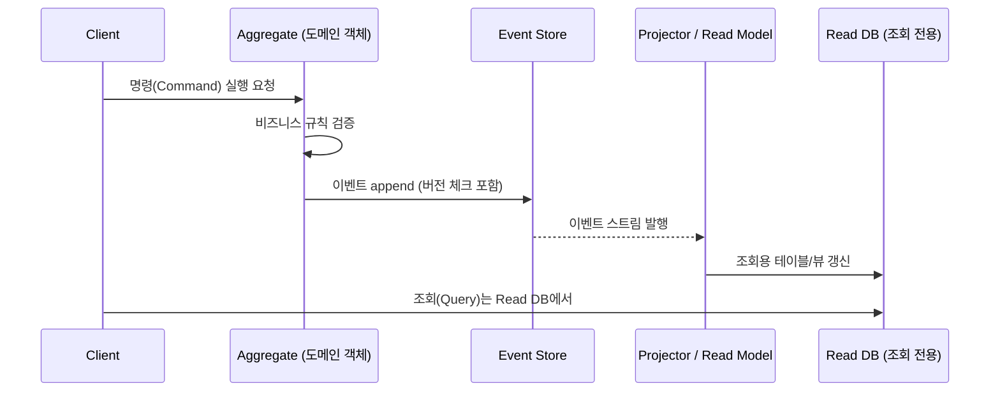

# 이벤트 소싱

## 핵심 정의

이벤트 소싱(Event Sourcing)은 애플리케이션의 상태를 현재 값이 아니라 "상태를 변화시킨 이벤트들의 연속"으로 저장하는 데이터 저장 패턴이다. 예를 들어 계좌 잔액을 `balance = 1000`처럼 하나의 컬럼으로 저장하는 대신, `계좌개설`, `입금(500)`, `입금(700)`, `출금(200)` 같은 이벤트를 순서대로 이벤트 스토어(Event Store)에 append하고, 현재 잔액은 이 이벤트들을 처음부터 재생(replay)하여 계산한다.

핵심은 이벤트가 불변(immutable)이고 append-only라는 점이다. 상태를 직접 수정(update)하지 않고 "무슨 일이 일어났는가"만 기록하기 때문에, 특정 시점의 상태를 재구성하거나 보존한 이벤트와 메타데이터 범위에서 이력을 감사(audit)할 수 있다. 누가·왜 수행했는지는 별도 메타데이터를 기록해야 하고, 이벤트 스토어의 무결성·권한 관리도 필요하다. 흔히 CQRS(Command Query Responsibility Segregation)와 함께 쓰이지만 개념적으로는 별개이며, 이벤트 소싱 없이 CQRS만 쓰는 것도, 반대도 가능하다.

## 동작 원리 / 구조

기본 흐름은 다음과 같다.



- **집계(Aggregate) 복원**: 현재 상태가 필요할 때는 해당 aggregate id의 이벤트를 처음부터(또는 마지막 스냅샷 이후부터) 순서대로 읽어 `apply(event)`를 반복 실행해 상태를 재구성한다.
- **스냅샷(Snapshot)**: 이벤트가 수만 건 쌓이면 매번 전체 재생이 비효율적이므로, 주기적으로 현재 상태를 스냅샷으로 저장해두고 "스냅샷 + 그 이후 이벤트"만 재생하도록 최적화한다.
- **낙관적 동시성 제어**: 같은 aggregate에 동시에 이벤트를 append하는 것을 막기 위해 이벤트에 버전(version) 번호를 부여하고, append 시점에 기대 버전과 실제 버전이 다르면 충돌로 처리한다.
- **Projection**: 이벤트 스트림을 구독해서 조회에 최적화된 read model(RDBMS 테이블, Elasticsearch 인덱스 등)을 갱신한다. Kafka는 이벤트 전파 채널로 유용하지만 aggregate별 스트림 읽기와 기대 버전 기반 원자적 append를 기본 제공하는 이벤트 스토어와는 다르다. 원장으로 사용하려면 이 기능과 장기 보존·복구를 별도로 설계해야 한다.

간단한 도메인 이벤트 구조 예시(Java 21+, public 타입은 각각 같은 이름의 파일에 배치하고 java.time.Instant·java.util.List를 import한다). 금액은 단일 통화의 최소 단위 long이다. 명령 검증과 저장소의 이벤트 ID·스트림 버전 검사는 생략했다. replay는 이미 검증되어 같은 계좌에 순서대로 저장된 중복 없는 이벤트만 받으며, 외부 API 호출 같은 부수 효과를 실행하지 않는다.

```java
public sealed interface AccountEvent permits AccountOpened, Deposited, Withdrawn {
    String accountId();
}

public record AccountOpened(String accountId, Instant occurredAt) implements AccountEvent {}
public record Deposited(String accountId, long amount, Instant occurredAt) implements AccountEvent {}
public record Withdrawn(String accountId, long amount, Instant occurredAt) implements AccountEvent {}

public class Account {
    private String id;
    private long balance;
    private long version;

    public static Account replay(List<AccountEvent> events) {
        Account acc = new Account();
        events.forEach(acc::apply);
        return acc;
    }

    private void apply(AccountEvent event) {
        if (!(event instanceof AccountOpened) &&
            (id == null || !id.equals(event.accountId()))) {
            throw new IllegalStateException("wrong account stream");
        }
        switch (event) {
            case AccountOpened e -> {
                if (this.id != null || e.accountId() == null)
                    throw new IllegalStateException("invalid opening event");
                this.id = e.accountId();
            }
            case Deposited e -> this.balance = Math.addExact(balance, e.amount());
            case Withdrawn e -> this.balance = Math.subtractExact(balance, e.amount());
        }
        this.version = Math.incrementExact(version); // 이 예제에서는 적용한 이벤트 수
    }
}
```

## 실무 관점

- **언제 쓰는가**: 금융 거래, 재고/주문 처리처럼 "누가 언제 무엇을 왜 바꿨는지"에 대한 완전한 이력과 감사 추적(audit trail)이 요구되는 도메인, 혹은 특정 시점 상태 재구성(time travel), 이벤트 재생을 통한 버그 재현이 필요한 도메인에 적합하다.
- **트레이드오프**: 과거 이벤트 해석·동시성 제어·재생·스키마 진화의 비용이 크다. 다양한 조회에는 materialized view와 CQRS를 조합할 수 있지만 필수는 아니다. 짧은 스트림의 직접 복원이나 스냅샷·캐시로 충분한 경우도 있다. 단순 CRUD 요구에는 이 복잡성이 불필요할 수 있다.
- **흔한 실수**:
  - 이벤트 스키마를 처음부터 완벽하게 설계하려다 실패. 이벤트는 계속 늘어나므로 하위 호환(backward compatibility: 새 리더가 과거 데이터를 읽음)과 상위 호환(forward compatibility: 옛 리더가 새 데이터를 읽음)을 구분한 스키마 진화 전략(필드 추가도 기본값·직렬화 형식에 따라 호환성을 확인하고, 의미 변경은 새 버전/타입으로)이 필요하다.
  - 이벤트를 "저장된 데이터의 변경분(diff)"이 아니라 "비즈니스적으로 의미 있는 사실"로 모델링하지 않아서, 나중에 요구사항이 바뀌면 과거 이벤트 해석이 꼬이는 경우.
  - 스냅샷 없이 이벤트가 무한정 쌓여 재생 시간이 선형으로 증가, 특정 aggregate 조회가 느려지는 장애.
  - Projection 실패/중복 처리에 대한 재처리(replay) 전략을 마련하지 않아 read model이 이벤트 스토어와 불일치.
- **스냅샷과 버전**: 재생 시간·이벤트 수를 측정해 스냅샷 주기를 정한다. Axon Framework 4.10의 `EventCountSnapshotTriggerDefinition(snapshotter, threshold)`는 직접 지정한 임계값을 사용한다. 5.1은 `SnapshotPolicy`와 `EventSourcedEntityModule`로 API가 바뀌었다. 스냅샷에는 적용된 스트림 버전과 스키마를 저장하고 그 이후 이벤트만 재생한다.
- **Projection 멱등성과 순서**: 이벤트 ID 중복 기록과 read model 변경을 같은 트랜잭션에 저장한다. aggregate별 연속 버전을 사용하면 `last_applied_version = newVersion - 1` 조건으로 갱신하고 간격이 벌어지면 재조회·대기한다. 단순히 `< newVersion`만 검사하면 v3를 먼저 적용한 뒤 v2를 중복으로 오인해 영구 누락할 수 있다. Kafka 파티션 offset은 aggregate별 연속 버전이 아니므로 혼용하지 않는다.
- **Kafka 보존**: Kafka 4.2에서 `cleanup.policy=delete`만 설정하면 시간·용량 제한에 따라 원본이 삭제된다. 전체 재생 이력이 필요하면 예를 들어 `retention.ms=-1`, `retention.bytes=-1`로 제한을 없애거나, 필요한 이력을 별도 내구성 저장소에 보존한다. 자원 용량·백업·삭제 작업도 통제해야 한다. aggregate ID를 key로 원본 토픽을 compact하면 같은 key의 과거 이벤트가 제거된다. snapshot 토픽의 compaction은 최신 상태 보존에 적합하다. 고유 이벤트 ID를 key로 쓰는 설계는 제거 의미가 다르므로 compaction 여부만으로 결론 내리지 않는다.

## 심화 Q&A

### Q. 이벤트를 모두 보관했는데 재생 결과가 달라지는 이유는?
이벤트 처리 중 현재 환율·상품 설정·현재 시각 등 외부의 가변 값을 다시 읽으면 같은 이벤트라도 다른 결과가 나올 수 있다. 당시의 환산 결과나 적용 환율·규칙 버전처럼 복원에 필요한 사실을 이벤트 또는 함께 보존하는 기록에 남기고, 재생에서는 그 사실을 사용한다. 외부 서비스의 과거 시점 조회에 의존한다면 해당 이력의 보존·정정 정책까지 재생 계약에 포함해야 한다.

상태 재구축과 외부 효과도 분리한다. projection 재생 중 메일·결제를 다시 호출하지 않도록 재생 경로에서 외부 전송을 차단하고, 과거에 누락한 전송을 복구하는 작업은 별도 대사·멱등 처리로 수행한다. 코드 수정으로 기존 projection을 고치는 경우와 새로운 업무 규칙을 과거 사건에도 소급 적용하는 경우를 구분해야 한다. 과거 규칙이 필요한 데이터에 오늘의 규칙을 무조건 적용하면 감사 결과까지 달라진다. 재생 검증에는 동일 이벤트 이력·규칙 버전·외부 입력 기록으로 결과가 일치하는지 확인하는 사례를 포함한다.

### Q. 이벤트 스키마를 나중에 바꿔야 할 때(예: 필드 의미 변경) 이미 저장된 과거 이벤트는 어떻게 처리하나?
과거 사실은 통상 불변으로 보존하고 정정 이벤트로 변경 의미를 추가한다. 개인정보 제거·손상 복구처럼 예외적인 변경이 필요하면 별도 정책과 감사 기록, 재생 영향 검증이 필요하다. 대신 (1) upcasting: 이벤트를 읽어올 때 옛 버전을 새 버전 구조로 변환하는 어댑터를 두거나, (2) 새로운 이벤트 타입을 추가하고 애플리케이션 코드가 신/구 버전을 모두 처리하도록 한다. 대규모 마이그레이션이 꼭 필요하면 별도 배치로 이벤트를 재작성한 새 스트림을 만들고 전환하는 방식을 쓰지만, 이는 예외적인 상황이다.

### Q. CQRS 없이 이벤트 소싱만 쓸 수 있는가?
가능하다. 이벤트 소싱은 상태의 저장 방식이고 CQRS는 명령·조회 모델의 분리다. 동일 모델에서 짧은 이벤트 스트림을 복원하거나 스냅샷·캐시를 이용해 조회할 수도 있으며, 스냅샷을 쓴다고 곧 CQRS는 아니다. 조회 패턴이 복잡하거나 높은 처리량이 필요하면 별도 projection을 두되 갱신 지연과 재구축 비용을 관리한다.

### Q. 이벤트 스토어에 동시성 충돌이 나면 어떻게 처리하나?
동일 aggregate에 대해 기대 버전(expected version)과 실제 최신 버전이 다르면 append가 거부된다. 이 경우 클라이언트/애플리케이션은 최신 이벤트까지 다시 읽어 상태를 재구성한 뒤 명령을 재검증하고 재시도하는 낙관적 재시도 루프를 구현해야 한다. 충돌 빈도가 높은 aggregate는 설계상 너무 큰 단위로 묶였거나 특정 키에 명령이 집중될 가능성이 있다(aggregate 경계 재검토 필요).

### Q. 이벤트 소싱과 단순 변경 데이터 캡처(CDC, Change Data Capture)는 어떻게 다른가?
CDC는 기존 CRUD 방식의 DB 테이블 변경 로그(binlog 등)를 사후적으로 이벤트화하는 것으로, 애플리케이션은 여전히 현재 상태 중심으로 동작한다. 이벤트 소싱은 애초에 이벤트가 1차 저장소(source of truth)이고 상태는 파생물이라는 점이 근본적으로 다르다. 다만 트랜잭셔널 아웃박스+CDC 조합은 이벤트 소싱을 도입하지 않고도 신뢰성 있는 이벤트 발행을 구현하는 대안으로 자주 쓰인다.

### Q. 개인정보 삭제(GDPR "잊혀질 권리") 요구를 이벤트 소싱에서 어떻게 만족시키나?
개인정보를 별도 저장소에 두고 이벤트에는 최소한의 참조만 남기면 삭제 범위를 관리하기 쉽다. 이벤트 안의 개인정보를 주체별 키로 암호화한 경우 키를 폐기하는 crypto-shredding을 고려할 수 있지만 키 사본·백업·projection·로그에도 삭제 정책이 적용되어야 한다. 단순히 마스킹용 이벤트를 추가해 조회에서 숨기는 것은 원본 개인정보를 제거하지 않는다. 재식별 가능한 암호화·가명 정보는 여전히 개인정보이므로, 기술 조치 하나만으로 GDPR 삭제 요건 충족을 단정하지 말고 보존 의무·예외와 실제 복구 가능성을 함께 검토한다.

### Q. Projection이 특정 이벤트에서 처리 실패하면 뒤 이벤트들은 어떻게 처리되나?
같은 aggregate의 후속 이벤트가 선행 이벤트에 의존하면 실패 위치에서 처리를 중단하고 재시도하거나 해당 aggregate를 격리한다. DLQ로 건너뛴 뒤 후속 버전의 체크포인트를 올리면 나중에 실패 이벤트를 적용할 수 없거나 순서가 틀어져 불일치가 영구화될 수 있다. 계속 처리할 수 있는지는 연산의 교환 가능성과 조회 요구로 판단하고, 순서 복원·별도 체크포인트·원본 스트림에서 projection 재구축 전략을 마련한다.

## 관련 개념
- [[Kafka 로그 보존과 컴팩션]]

- [[SAGA 패턴]]
- [[트랜잭셔널 아웃박스]]

## 참고 자료

- [Azure Architecture: Event Sourcing](https://learn.microsoft.com/en-us/azure/architecture/patterns/event-sourcing) — 이벤트 스토어·CQRS·재생·동시성·개인정보·Kafka 역할 구분. 확인: 2026-09-08.
- [Axon Framework 4.10: Event Snapshots](https://docs.axoniq.io/axon-framework-reference/4.10/tuning/event-snapshots/) — EventCountSnapshotTriggerDefinition(snapshotter, threshold) 적용 범위. 확인: 2026-09-08.
- [Axon Framework 5.1: Snapshotting Migration](https://docs.axoniq.io/axon-framework-reference/5.1/migration/paths/snapshotting/) — SnapshotPolicy·EventSourcedEntityModule·SnapshotStore로 변경. 확인: 2026-09-08.
- [Apache Kafka 4.2: Topic Configs](https://kafka.apache.org/42/configuration/topic-configs/) — cleanup.policy와 retention.ms/bytes, compaction과 재생 이력. 확인: 2026-09-08.
- [European Commission: Application of the GDPR](https://commission.europa.eu/law/law-topic/data-protection/information-business-and-organisations/application-gdpr_en) — 재식별 가능한 암호화·가명 정보도 개인정보라는 설명; 삭제 설계의 범위. 확인: 2026-09-08.
- [Java SE 21: Pattern Matching for switch](https://docs.oracle.com/en/java/javase/21/language/pattern-matching-switch.html) — sealed 계층의 완전한 switch와 타입 패턴 예제. 확인: 2026-09-08.

부분 재검증: 2026-10-04. 이벤트 재생의 외부 조회·외부 갱신·시점별 규칙 문제를 원저자 자료 및 공식 패턴 문서와 대조했다. 제품 기본값 없는 패턴 설명이며 실제 Axon 재생·외부 호출 실험은 수행하지 않았다. 기존 Axon·Java·Kafka 버전 서술의 `verified`는 유지한다.

- [Martin Fowler: Event Sourcing](https://martinfowler.com/eaaDev/EventSourcing.html#ExternalQueries) — 원저자 설계 자료, External Queries·External Updates·Code Changes: 과거 외부 입력 보존과 재생 시 전송 구분, 시점별 규칙.
- [Azure Architecture: Event Sourcing](https://learn.microsoft.com/en-us/azure/architecture/patterns/event-sourcing) — 이벤트 이력 기반 상태 재구축과 projection·외부 연동의 구분.
