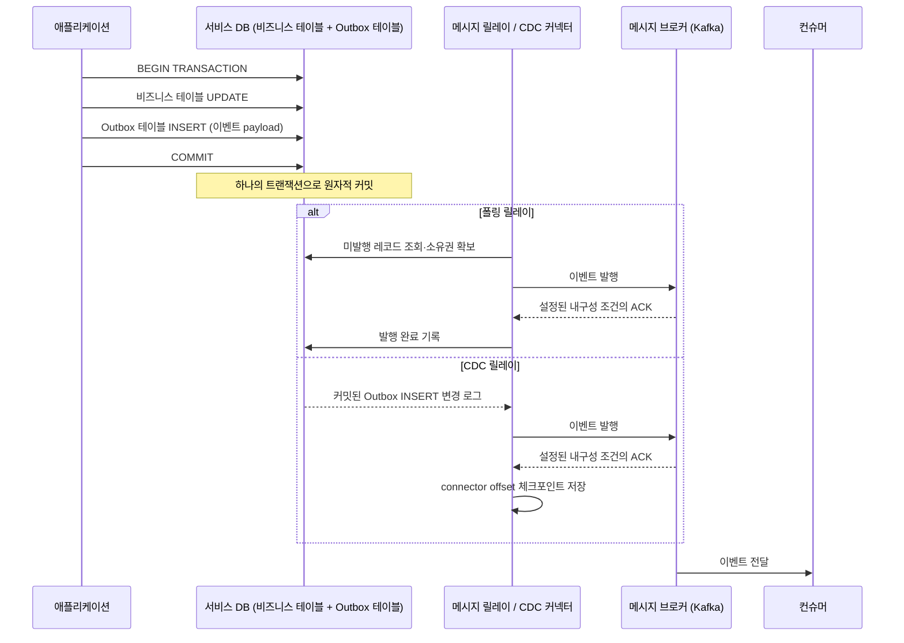

# 트랜잭셔널 아웃박스

## 핵심 정의

트랜잭셔널 아웃박스(Transactional Outbox) 패턴은 "DB 상태 변경"과 "그 변경을 알릴 이벤트의 발행 의도 기록"을 하나의 로컬 트랜잭션으로 원자적으로 커밋하는 패턴이다. 실제 브로커 발행까지 같은 트랜잭션이 되는 것은 아니다. 서비스가 비즈니스 데이터를 변경할 때, 동시에 같은 트랜잭션 안에서 아웃박스 테이블(outbox table)에 발행할 이벤트를 레코드로 함께 저장한다. 이후 별도의 프로세스(메시지 릴레이 또는 CDC 커넥터)가 이 아웃박스 테이블을 읽어 실제 메시지 브로커(Kafka 등)로 발행한다. 폴링 릴레이는 발행 상태를 DB에 기록할 수 있고, CDC는 로그 위치 체크포인트를 관리하므로 outbox 행마다 published를 갱신하는 방식과 다르다. 행 정리는 별도의 보존 정책으로 수행한다.

이 패턴이 해결하려는 문제는 "이중 쓰기 문제(dual write problem)"다. 애플리케이션 코드에서 DB commit과 브로커 publish를 각각 별도의 작업으로 실행하면, DB는 커밋됐지만 publish가 실패(네트워크 장애, 프로세스 크래시 등)하는 상황이나 그 반대 상황이 발생할 수 있다. 아웃박스 패턴은 발행할 이벤트 기록을 로컬 DB 트랜잭션 안으로 끌어들여, 최소한 "DB에 남는가 아닌가"라는 하나의 원자적 결정으로 문제를 단순화한다.

## 동작 원리 / 구조



구현 방식은 크게 두 가지다.

1. **폴링 발행자(Polling Publisher)**: 별도 스레드/스케줄러가 주기적으로 outbox 테이블에서 미발행 레코드를 조회(`WHERE published = false ORDER BY id`)해 브로커로 보내고 상태를 갱신한다. 구현이 단순하지만 폴링 주기만큼 지연이 생기고, DB에 폴링 부하가 추가된다.
2. **CDC 기반(로그 기반) 발행**: Debezium 같은 CDC 도구가 DB의 트랜잭션 로그(MySQL binlog, PostgreSQL WAL 등)를 직접 읽어 outbox 테이블에 INSERT된 행을 실시간으로 감지해 Kafka로 발행한다. 테이블 반복 조회를 피할 수 있지만 지연·DB 부하는 커넥터, 스냅샷, WAL/binlog 유지와 부하에 따라 달라지며, CDC 인프라(Debezium + Kafka Connect 등) 운용 비용이 추가된다.

아웃박스 테이블 스키마 예시(MySQL 8.4, 폴링 릴레이용):

```sql
CREATE TABLE outbox (
    id            BIGINT PRIMARY KEY AUTO_INCREMENT,
    aggregate_type VARCHAR(255) NOT NULL,   -- 예: "Order"
    aggregate_id  VARCHAR(255) NOT NULL,    -- 예: 주문 ID
    event_type    VARCHAR(255) NOT NULL,    -- 예: "OrderCreated"
    payload       JSON NOT NULL,
    created_at    TIMESTAMP NOT NULL DEFAULT CURRENT_TIMESTAMP,
    published     BOOLEAN NOT NULL DEFAULT FALSE,
    INDEX outbox_pending (published, id)
) ENGINE=InnoDB;
```

Spring Framework 7.0.9 기준의 단순화된 서비스 메서드다. 프록시를 통해 호출되는 Spring 빈이고 두 repository가 같은 로컬 transaction manager·DB 자원에 참여해야 한다. self-invocation, 다른 DataSource, REQUIRES_NEW 또는 비동기 저장으로 경계를 분리하지 않는다. 예외를 삼키지 말고 checked exception까지 전체 롤백해야 한다면 rollback 규칙도 지정한다. DTO·저장소·직렬화 함수의 구현은 생략했다.

```java
@Transactional
public void createOrder(CreateOrderCommand cmd) {
    Order order = orderRepository.save(Order.from(cmd));

    OutboxEvent event = OutboxEvent.builder()
        .aggregateType("Order")
        .aggregateId(String.valueOf(order.getId()))
        .eventType("OrderCreated")
        .payload(toJson(new OrderCreatedPayload(order)))
        .build();
    outboxRepository.save(event); // 같은 로컬 트랜잭션과 DB 자원
}
```

### CDC에 적용할 때의 스키마 차이

위 스키마는 폴링용이다. Debezium 3.3 Outbox Event Router 기본 컬럼은 `id`, `aggregatetype`, `aggregateid`, `type`, `payload`이므로, 위 snake_case 컬럼을 쓴다면 `route.by.field=aggregate_type`, `table.field.event.key=aggregate_id` 등 매핑을 맞춰야 한다. 이벤트 타입과 스키마 버전도 payload 또는 별도 헤더로 전달한다. SMT는 INSERT 중심이며 UPDATE는 유효한 새 이벤트로 취급하지 않는다. CDC offset 저장은 published 업데이트를 대신하며, outbox 삭제·아카이빙은 connector가 필요한 INSERT를 내구성 있게 전달했는지와 재스냅샷 복구 범위를 확인한 뒤 수행한다.

### 요청 멱등키와 이벤트 ID의 구분

아웃박스가 있어도 같은 주문 생성 요청을 두 번 받아 서로 다른 주문·outbox 행으로 커밋하면 둘 다 정상 발행된다. 요청 중복은 명령의 멱등키·업무 유니크 제약으로 막고, 발행 재시도는 한 번 생성한 이벤트 ID를 그대로 유지한다. 릴레이가 재시도할 때마다 ID를 바꾸면 소비자는 같은 이벤트임을 판별할 수 없다.

Debezium 3.3 Outbox Event Router는 기본 `id`를 이벤트 헤더에, `aggregateid`를 Kafka 메시지 키에 사용한다. Kafka key는 순서·파티션 배치 단위이며 중복 제거 ID와 목적이 다르다. 위 폴링 스키마의 숫자 ID를 여러 서비스의 공유 중복 테이블에서 사용한다면 발행 원천까지 범위에 포함하거나 전역 충돌을 피하는 ID 체계를 정한다.

Outbox SMT는 원본 토픽에 대한 `TopicNameMatches` predicate로 적용 범위를 제한한다. `route.topic.regex`는 출력 토픽 이름을 변환하는 설정이며 원본 테이블 이벤트를 걸러 주는 조건이 아니다. Debezium 3.3 소스는 payload 등 outbox 필드를 읽은 뒤 토픽 변환을 수행하므로, 다른 테이블의 CDC 이벤트에 SMT를 적용하면 정규식으로 제외되기 전에 필드 조회에서 실패할 수 있다. Heartbeat·스키마 변경처럼 CDC envelope가 아닌 이벤트는 변환 없이 통과하는 경로도 있으므로 모든 비-outbox 이벤트가 동일하게 실패한다고 일반화하지 않는다.

## 실무 관점

- **언제/왜 쓰는가**: DB 상태 변경을 다른 서비스에 알리고, 일시적 장애 후에도 미발행 기록에서 재시도를 이어가야 할 때. [[SAGA 패턴]]의 각 단계를 신뢰성 있게 연결하는 데도 널리 쓰인다.
- **트레이드오프**:
  - 폴링은 조회 주기와 인덱스를 관리하고, CDC는 로그·offset·커넥터를 관리한다. CDC의 지연이 항상 더 작다는 보장은 없으며 실제 파이프라인으로 측정한다.
  - 내구성 있는 기록·로그 보존, 릴레이 재시도·복구와 브로커 가용성이 유지되어야 최소 한 번(at-least-once) 전달로 이어진다. DB 커밋만으로 전달 시한이나 무조건적인 성공을 보장하지 않으며 정확히 한 번(exactly-once) 전달도 아니다. 따라서 컨슈머 측은 반드시 멱등하게 이벤트를 처리해야 한다(예: 이벤트 ID 기준 중복 처리 방지 테이블).
  - outbox 테이블이 계속 커지므로 발행 완료된 레코드를 주기적으로 삭제/아카이빙하는 배치가 필요하다.
- **흔한 실수/장애 사례**:
  - 비즈니스 테이블 갱신과 outbox insert를 서로 다른 트랜잭션으로 분리해버려 패턴의 핵심 이점을 잃는 경우(가장 흔한 실수).
  - 폴링 발행자를 여러 인스턴스로 수평 확장했는데 같은 레코드를 동시에 집어가 중복 발행이 발생 — 트랜잭션 안의 `FOR UPDATE SKIP LOCKED` 또는 원자적 claim/lease로 작업 소유권을 정한다. 이는 동시 선택을 완화하지만 발행 성공 후 완료 기록 전 크래시에 의한 중복은 남는다.
  - CDC 커넥터(Debezium)가 다운되거나 오프셋이 유실되어 일정 기간 이벤트가 발행되지 않았는데 알림 체계가 없어 뒤늦게 발견.
  - outbox payload에 이벤트 스키마 버저닝 없이 애플리케이션 내부 엔티티를 그대로 직렬화해, 엔티티 구조가 바뀔 때마다 컨슈머가 깨지는 경우.
- **설정/튜닝 포인트**: 폴링 주기·배치 크기는 목표 지연과 DB 부하로 정한다(예: 500ms~1초, 100~500건은 설계 예시). 재시도 횟수를 넘겼다고 원본을 삭제하지 말고 실패 상태·DLQ에 내구성 있게 보존해 재처리한다. 마지막 미발행 시간, 백로그, connector lag, offset·schema history 저장소와 로그 보존을 감시한다. Debezium 3.3 MySQL의 `snapshot.mode=initial`은 기존 행도 읽고, `no_data`는 스키마만 읽는다(`schema_only`는 deprecated). 초기 outbox 행을 발행해야 한다면 no_data가 적합한지 확인한다.

## 심화 Q&A

### Q. 폴링 발행자를 여러 인스턴스로 띄우면 왜 문제가 되고, 어떻게 해결하나?
여러 인스턴스가 같은 미발행 행을 선택하면 중복 발행될 수 있다. MySQL 8.4 InnoDB·PostgreSQL 18의 `FOR UPDATE SKIP LOCKED`를 명시적 트랜잭션에서 사용하거나, 짧은 트랜잭션으로 원자적 claim과 만료 시간을 기록한다. SELECT 후 즉시 커밋하면 잠금은 풀리므로 후속 발행 동안 소유권이 유지되지 않는다. 브로커 호출 내내 DB 잠금을 잡으면 긴 트랜잭션 비용이 생기고, lease 방식은 만료·인계·지연된 소유자의 처리를 설계해야 한다. 어느 방식도 발행 성공과 DB 완료 기록 사이의 중복 가능성을 없애지 못한다.

### Q. CDC 기반 아웃박스에서 Debezium이 일정 시간 다운됐다가 복구되면 어떤 일이 생기는가?
Debezium 3.3의 기본 `snapshot.mode=initial`에서 초기 스냅샷이 완료된 뒤라면, 저장된 offset과 필요한 DB 변경 로그·스키마 이력이 남아 있을 때 해당 위치에서 이어 읽는다. 장애 경계의 일부 레코드는 재발행될 수 있다. 초기 스냅샷의 완료가 offset에 기록되기 전에 중단됐다면 재시작 시 새 스냅샷을 수행하므로 이미 읽은 행도 재발행될 수 있다.

MySQL binlog가 이미 제거되었거나 PostgreSQL replication slot이 무효화되면 같은 로그 위치에서 그대로 이어 읽을 수 없다. Debezium 3.3 MySQL은 `snapshot.mode=when_needed`로 설정하면 필요한 binlog가 없는 경우 새 스냅샷을 시작할 수 있다. 하지만 새 스냅샷은 그 시점에 남아 있는 행을 읽을 뿐 삭제된 outbox 이벤트의 이력을 복원하지 않는다. 로그 보존·디스크 사용량·offset 유효성을 감시하고, 재스냅샷 또는 보관한 아웃박스 원본에서 복구할 범위를 정한다. 원본 행도 이미 정리했다면 재구성할 수 없는 이벤트가 생길 수 있으므로 데이터·로그·체크포인트의 보존 정책을 함께 정한다.

### Q. 아웃박스 패턴은 정확히 한 번(exactly-once) 전달을 보장하는가?
아니다. 원자적 보장은 비즈니스 변경과 outbox 기록의 커밋 경계다. 릴레이가 발행한 뒤 완료 상태/offset 기록 전에 죽으면 같은 이벤트를 다시 발행한다. 따라서 중복 처리 기록과 소비자 DB 변경을 같은 트랜잭션으로 커밋해야 한 소비자의 DB 효과를 한 번으로 제한할 수 있다. 이메일·결제 같은 외부 효과는 별도 멱등키나 수신자 프로토콜이 필요하며, 단순 이벤트 ID 조회만으로 end-to-end exactly-once를 주장하지 않는다.

### Q. 트랜잭셔널 아웃박스와 2단계 커밋(2PC, XA 트랜잭션)의 차이는 무엇인가?
2PC는 참여 자원들의 준비·최종 결정으로 전역 원자적 커밋을 조율한다. XA는 이를 위한 표준 인터페이스이며 모든 2PC를 XA라고 부르는 것은 아니다. 참여자 지원, 장애 시 미결정 트랜잭션 복구와 잠금 유지 비용을 고려해야 한다. 아웃박스는 DB 내부 커밋만 원자적으로 수행하고 브로커 발행을 비동기로 분리하므로 자원 간 결합을 줄이지만 전달 지연·중복·릴레이 운영을 부담한다. 요구하는 원자성 범위와 운영 조건으로 선택한다.

### Q. outbox 테이블에 쌓인 이벤트를 삭제하지 않고 계속 보관하면 어떤 문제가 생기나?
테이블이 무한정 커지면서 폴링 조회 성능이 떨어지고(인덱스가 커짐), 백업/복구 시간도 늘어난다. 실무에서는 발행 완료 후 일정 기간(예: 며칠)이 지난 레코드를 별도 배치로 삭제하거나 별도 아카이브 테이블/스토리지로 이동시키는 정리 작업을 스케줄링한다. 감사 목적으로 오래 보관해야 한다면 아웃박스 테이블 자체보다는 별도의 이벤트 로그 저장소로 분리하는 것이 낫다.

### Q. 아웃박스 이벤트의 순서 보장이 필요한 경우 어떻게 설계하나?
같은 aggregate의 변경은 락이나 기대 버전 검사로 직렬화하고, 이벤트에 aggregate별 버전을 기록한다. 자동 증가 id는 할당 순서일 뿐 커밋 순서가 아니다. T1이 id=10을 받은 채 미커밋이고 T2의 id=11만 먼저 커밋되면 `ORDER BY id`도 11을 먼저 읽을 수 있다. SKIP LOCKED와 여러 릴레이 역시 선행 이벤트를 건너뛸 수 있으므로 aggregate별 발행 소유권·순서 검사 또는 순서를 보존하는 CDC 구성을 사용한다. Kafka의 같은 key/partition은 브로커 도착 순서만 유지하므로 이미 뒤바뀐 발행 순서를 고쳐주지 않는다. CDC도 하나의 로그 순서를 소비자 처리 완료 순서나 여러 DB 사이의 전역 순서로 확대 해석하지 않는다.

이 차이는 순서뿐 아니라 누락에도 영향을 준다. 폴링을 최적화한다며 `published=false` 조회를 마지막으로 본 ID보다 큰 행만 읽는 방식으로 바꾸면, 이미 커서를 넘긴 작은 ID가 늦게 커밋될 때 영구적으로 건너뛸 수 있다. ID 상한을 고정해도 같은 문제가 남는다. 미발행 상태·실패/claim 만료 복구를 유지하고, 숫자 ID를 CDC의 로그 체크포인트처럼 취급하지 않는다. 조회 커서와 스냅샷의 차이는 [[페이징 최적화#변경되지 않는 ID도 일관된 스냅샷을 뜻하지 않는다]]를 참고한다.

## 관련 개념

- [[SAGA 패턴]]
- [[이벤트 소싱]]

## 참고 자료

- [Chris Richardson: Transactional Outbox](https://microservices.io/patterns/data/transactional-outbox.html) — DB 기록 원자성과 릴레이의 중복 발행·순서 보장 요구. 확인: 2026-09-08.
- [Debezium 3.3: Outbox Event Router](https://debezium.io/documentation/reference/3.3/transformations/outbox-event-router.html) — 기본 outbox 컬럼, event key·ID 매핑, INSERT 중심 발행과 UPDATE 제약. 확인: 2026-09-08.
- [Debezium 3.3 MySQL connector](https://debezium.io/documentation/reference/3.3/connectors/mysql.html) — snapshot.mode=initial/no_data, schema_only 폐기 예정 및 binlog·offset 복구. 확인: 2026-09-08.
- [MySQL 8.4: Locking Reads](https://dev.mysql.com/doc/refman/8.4/en/innodb-locking-reads.html) — InnoDB FOR UPDATE SKIP LOCKED와 큐 조회·트랜잭션 경계. 확인: 2026-09-08.
- [MySQL 8.4: AUTO_INCREMENT Handling](https://dev.mysql.com/doc/refman/8.4/en/innodb-auto-increment-handling.html) — ID 할당 잠금과 트랜잭션 종료 구분; ID 순서가 커밋 순서 보장이 아님. 확인: 2026-09-08.
- [PostgreSQL 18: SELECT](https://www.postgresql.org/docs/18/sql-select.html) — FOR UPDATE SKIP LOCKED 및 잠긴 행 제외. 확인: 2026-09-08.
- [Spring Framework 7.0.9: Using @Transactional](https://docs.spring.io/spring-framework/reference/data-access/transaction/declarative/annotations.html) — 프록시 호출 경계, transaction manager 선택 및 rollback 규칙. 확인: 2026-09-08.
- [Debezium 3.3 PostgreSQL connector](https://debezium.io/documentation/reference/3.3/connectors/postgresql.html) — replication slot·WAL 보존·offset 재개 및 장애 복구 조건. 확인: 2026-09-08.

부분 재검증: 2026-09-23. Debezium 3.3 Outbox Event Router의 ID 헤더·aggregate key·선택적 SMT 적용과 AWS 아웃박스 지침의 중복 소비 경계를 확인했다. 요청 멱등키와 이벤트 ID 구분은 그 경계에서 도출한 설계 지침이다. DB·Spring 예제 전체는 재검증하지 않았다.

- [AWS Transactional Outbox Pattern](https://docs.aws.amazon.com/prescriptive-guidance/latest/cloud-design-patterns/transactional-outbox.html) — DB 기록과 발행의 경계, 중복 이벤트·멱등 소비. 위 Debezium 3.3 문서도 해당 범위에서 재확인.

교차 검토 반영: 2026-09-23. Debezium 3.3 소스의 필드 추출 → 토픽 변환 순서를 확인하고 predicate와 route.topic.regex의 역할을 분리했다.

- [Debezium 3.3 Selective Transformations](https://debezium.io/documentation/reference/3.3/transformations/applying-transformations-selectively.html) — TopicNameMatches로 SMT 적용 범위 제한.
- [EventRouterDelegate.java](https://raw.githubusercontent.com/debezium/debezium/3.3/debezium-core/src/main/java/io/debezium/transforms/outbox/EventRouterDelegate.java) — 유효 envelope 검사·payload 접근·마지막 RegexRouter 적용 순서.

부분 재검증: 2026-10-04. PostgreSQL 18의 시퀀스 할당과 READ COMMITTED 가시성을 확인했다. PostgreSQL 18.6·pgJDBC 42.7.13의 격리 실행에서 ID 2를 읽은 뒤 ID 1이 커밋되면 ID 커서는 1을 놓치지만 `published=false` 조회는 찾는 것을 재현했다. 상태 조회를 ID 진행 위치로 대체하지 말라는 지침의 검증이며, 브로커 발행·claim 복구·MySQL·Spring·Debezium 실행 검증은 아니다. 전체 `verified`는 유지한다.

- [PostgreSQL 18 Transaction Isolation](https://www.postgresql.org/docs/18/transaction-iso.html) — 시퀀스 변경과 트랜잭션 커밋 순서 구분, READ COMMITTED 스냅샷.

부분 재검증: 2026-10-04. Debezium 3.3의 기본 initial 스냅샷과 로그 스트리밍의 재시작을 구분하고, MySQL when_needed의 로그 소실 후 새 스냅샷 조건을 공식 문서·3.3.2.Final 고정 소스로 확인했다. 삭제한 outbox 이력이 새 스냅샷으로 복원되지 않는다는 설명은 현재 행을 읽는 계약에서 도출한 보존 판단이다. 브로커·Debezium 재시작이나 binlog 삭제를 실행하지 않았으며 전체 `verified`는 유지한다.

- [Debezium 3.3 MySQL snapshots](https://debezium.io/documentation/reference/3.3/connectors/mysql.html#mysql-snapshots) — 초기 스냅샷 중단·완료 기록, binlog 소실과 when_needed. PostgreSQL 초기 스냅샷은 위 3.3 PostgreSQL 문서의 Snapshots 절도 재확인.
- [InitialSnapshotter — v3.3.2.Final](https://github.com/debezium/debezium/blob/v3.3.2.Final/debezium-core/src/main/java/io/debezium/snapshot/mode/InitialSnapshotter.java) / [WhenNeededSnapshotter — v3.3.2.Final](https://github.com/debezium/debezium/blob/v3.3.2.Final/debezium-core/src/main/java/io/debezium/snapshot/mode/WhenNeededSnapshotter.java) — 진행 중 초기 스냅샷의 재수행과 데이터 오류 시 스냅샷 허용의 차이.
