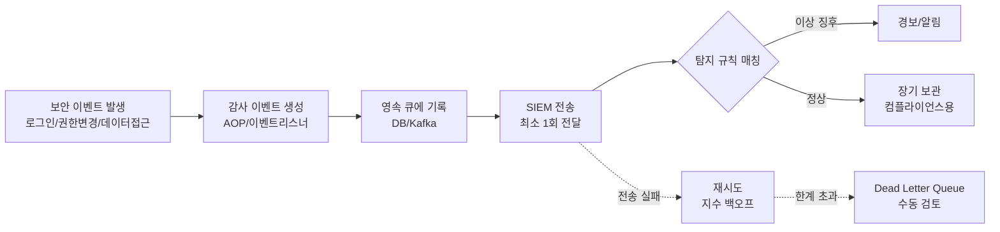

# 감사 로그와 보안 모니터링

## 핵심 정의
감사 로그(Audit Log)는 "누가, 언제, 무엇을, 어떤 결과로 수행했는가"를 기록하는 보안 특화 로그로, 장애 원인 분석용 애플리케이션 로그와는 목적이 다르다. 애플리케이션 로그가 시스템 동작을 디버깅하기 위한 것이라면, 감사 로그는 사후 책임 추적(accountability), 부정 행위 탐지, 규제 준수(compliance) 증빙을 위해 남기며, 변조 여부를 탐지할 수 있는 성질(tamper-evidence)과 접근 통제이 요구된다는 점이 핵심 차이다.

보안 모니터링(Security Monitoring)은 이런 감사 이벤트와 시스템 로그를 실시간으로 수집·상관분석(correlation)해 이상 징후를 탐지하고 경보를 발생시키는 활동이며, 이를 집중화하는 플랫폼이 SIEM(Security Information and Event Management)이다. OWASP Top 10:2025의 A09 Security Logging and Alerting Failures는 "로그는 남지만 이상 징후에 대한 경보·대응 체계가 없는" 상태를 위험 범주로 명시하고 있으며, 감사 로그를 남기는 것과 그것을 실제로 모니터링해 대응하는 것은 별개의 역량이라는 점을 강조한다.

## 동작 원리 / 구조

### 감사 이벤트 생명주기

- **무엇을 감사 이벤트로 남길 것인가**: 인증 성공/실패, 권한 변경, 민감 데이터 접근/수정/삭제, 관리자 기능 사용, 설정 변경이 핵심 대상이다. 모든 요청을 다 남기면 비용은 커지고 정작 중요한 이벤트가 노이즈에 묻히므로, 보안적으로 의미 있는 행위 위주로 선별한다.
- **Spring Boot 구현 방식**: `@EnableJpaAuditing`으로 엔티티의 생성자/수정자·시각을 자동 기록하는 방식은 현재 엔티티의 마지막 생성/수정 메타데이터 기록에는 유용하지만 전체 변경 이력을 보존하지 않으며, "누가 조회했는가" 같은 읽기 이벤트나 인가 실패는 잡지 못한다. AOP(`@Around` 어드바이스)로 컨트롤러/서비스 계층에 공통 감사 로직을 심으면 API 액션 단위로 포괄적으로 캡처할 수 있다. Spring Security의 `AuthenticationEventPublisher`는 인증 성공/실패 이벤트를 스프링 이벤트로 발행해 별도 리스너에서 감사 로그로 남기기 좋다.
- **무결성 보장**: 감사 로그는 애플리케이션 서버가 직접 삭제·수정할 수 없는 곳(별도 저장소, WORM(Write Once Read Many) 스토리지, 해시 체이닝)에 보관해야 침해 사고 시 공격자가 흔적을 지우는 것을 막을 수 있다. 애플리케이션과 동일한 DB에 감사 로그를 함께 두면, 그 DB가 침해됐을 때 감사 로그 자체도 조작될 위험이 있다.
- **SIEM 연동 패턴**: 감사 이벤트를 SIEM으로 직접 동기 전송하면 SIEM 장애가 애플리케이션 응답 지연으로 전파된다. 실무에서는 영속 큐(PostgreSQL, Redis Streams, Kafka 등)에 먼저 커밋한 뒤 비동기로 SIEM에 전달하는 최소 1회 전달(at-least-once delivery) 패턴을 쓴다. 전달 실패는 지수 백오프로 재시도하고, 재시도 한도를 넘으면 Dead Letter Queue로 옮겨 수동 검토한다(→ [[Dead Letter Queue]], [[컨슈머 랙과 백프레셔]]).
- **표준 스키마**: SIEM 대시보드와 탐지 규칙이 특정 필드명을 기대하므로, ECS(Elastic Common Schema)처럼 `event.action`, `user.id`, `event.outcome` 같은 공통 필드 체계로 이벤트를 매핑해두면 SIEM 종류가 바뀌거나 여러 SIEM에 동시에 보낼 때 재작업 비용이 줄어든다.

### 감사 로그 vs 애플리케이션 로그

| 구분 | 감사 로그 | 애플리케이션 로그 |
|---|---|---|
| 목적 | 책임 추적, 규제 준수, 부정 탐지 | 디버깅, 장애 원인 분석 |
| 대상 | 인증/인가/데이터 접근 등 보안 관련 행위 | 모든 실행 흐름, 에러, 성능 지표 |
| 보관 기간 | 적용 법규·계약·데이터 종류별 보존/삭제 정책으로 결정 | 통상 수주~수개월 |
| 변조 방지 | 필수 (WORM, 해시 체이닝 등) | 통상 요구되지 않음 |
| 접근 권한 | 별도 최소 인원만 (감사자 역할) | 개발/운영팀 통상 접근 |

해시 체인만 같은 저장소에 보관하면 공격자가 로그와 체인을 함께 재작성하거나 끝부분을 지울 수 있다. 별도 권한 경계와 외부에 보관한 서명/체크포인트 등을 조합한다. 업무 변경과 감사 이벤트를 원자적으로 기록하려면 transactional outbox 등을 사용하고, 인증 실패처럼 rollback과 별도로 남겨야 하는 이벤트를 구분한다. 감사 저장이 불가능할 때 고위험 작업을 중단할지 여부는 해당 업무 요건으로 정한다.

## 실무 관점

### 로그 자체의 신뢰 경계

공격자가 입력한 사용자명·URL·User-Agent 등을 문자열로 이어 붙이면 개행(CR/LF)이나 구분자를 이용해 다른 감사 이벤트처럼 보이게 할 수 있다. 구조화 로깅과 출력 형식에 맞는 인코딩을 사용하고, 외부 입력의 길이·필드 타입을 제한한다. 인증된 주체, 대상, 결과 같은 서버 판정 필드가 클라이언트가 보낸 같은 이름의 필드로 덮어써지지 않게 한다.

사건 발생 시각과 수집 시각을 구분한다. 클라이언트 시각은 조작·오차가 있을 수 있고 비동기 전달 순서는 실제 업무 순서와 다를 수 있으므로, 서버 시각·이벤트 ID·업무 버전 등과 함께 해석한다. `trace ID`는 조사 상관관계용이며 인증·인가 증거 자체는 아니다.

로그 장애 시험에는 저장소 권한 거부·디스크 부족·전송 지연·중복을 포함한다. 고위험 업무의 감사 기록을 실패 시 차단할지는 업무 계약으로 정하되, 로그인 실패나 비정상 입력 자체를 기록하지 못하도록 공격자가 로깅 파이프라인을 고갈시키는 경우도 점검한다.

- **애플리케이션 로그로 감사를 대신하려는 시도**는 흔한 실수다. 일반 로그는 개발자가 자유롭게 수정·삭제할 수 있는 위치에 있고 보존 정책도 감사 요건에 맞지 않는 경우가 많아, 사고 조사 시 "그 시점 로그가 남아있지 않다"는 문제로 이어진다.
- **경보 피로(alert fatigue)**: 탐지 규칙을 지나치게 민감하게 설정하면(예: 로그인 실패 1회에도 경보) 담당자가 알림을 무시하는 습관이 들어, 정작 실제 침해 시도를 놓치는 역설이 발생한다. 임계치와 상관분석 규칙(예: "동일 계정 5분 내 로그인 실패 10회 이상 + 새로운 IP")을 실제 위협 패턴 기반으로 튜닝해야 한다.
- **개인정보와 감사 로그의 충돌**: 감사 로그에 비밀번호, 카드번호, 주민등록번호 같은 민감 정보를 원문으로 남기면 그 자체가 새로운 유출 지점이 된다. 마스킹(masking)하거나 참조 ID만 남기고 원본은 별도 암호화 저장소를 참조하도록 설계해야 한다.
- **멀티 테넌트/멀티 SIEM 환경**: 고객마다 원하는 SIEM 대상이 다르거나(Splunk, Elastic 등), 원하는 이벤트 범위가 다른 경우(전체 이벤트 vs 고위험 이벤트만)가 실무에서 흔하다. 이벤트 발행과 전달 대상을 분리해 설정 가능하게 만들어야 조직마다 파이프라인을 다시 짜지 않아도 된다.
- **컴플라이언스 요건**: NIST SP 800-92는 중앙집중식 집계와 보존 정책 수립을 안내하고, PCI-DSS·ISMS-P 등 규제는 로그 보관 기간과 접근 통제를 구체적으로 요구한다. 감사 로그 설계는 보안팀만의 요구사항이 아니라 컴플라이언스 요건을 먼저 확인하고 역산해서 설계해야 한다.
- **관련 설정/튜닝 포인트**: 큐 적재 지연(SIEM 전송 backlog) 모니터링, Dead Letter Queue 적재량에 대한 별도 경보, SIEM 측 429(rate limit) 응답 시 `Retry-After` 헤더 준수, 이벤트 ID 기반 중복 제거(dedup) 설계.

### CloudTrail 조회 결과 없음이 활동 없음의 증거는 아니다

AWS CloudTrail Event history는 리전별 최근 90일의 관리 이벤트(management events)를 제공하며 데이터 이벤트(data events)는 보여주지 않는다. S3 GetObject 같은 객체 접근을 조사할 때 Event history가 비어 있다는 이유로 접근이 없었다고 결론 내리면 안 된다. Trail이나 event data store도 기본적으로 데이터 이벤트를 기록하지 않으므로, 조사 대상 리소스·API가 당시 selector에 포함되어 있었는지부터 확인한다.

감사 수집 검증은 “CloudTrail이 켜짐”에서 끝내지 않는다. 허용된 시험 리소스에 대표적인 읽기·쓰기 작업을 수행하고, 필요한 계정·리전·이벤트 종류가 실제 수집 목적지에서 조회되는지 확인하는 절차를 둔다. 수집 범위와 보존 정책은 별개이므로 짧은 Event history를 장기 감사 보존으로 간주하지 않는다.

## 심화 Q&A

### Q. 감사 로그를 애플리케이션과 같은 데이터베이스에 저장하면 안 되는 이유는 무엇인가?
A. 애플리케이션 DB가 침해되면 공격자가 감사 로그 테이블도 함께 조작하거나 삭제할 수 있어, 사고 조사 시 가장 중요한 증거가 사라진다. 감사 로그는 애플리케이션 서버의 쓰기 권한이 삭제/수정을 허용하지 않는 별도 저장소(append-only, WORM)에 두거나, 최소한 별도 계정/권한 체계로 분리해 애플리케이션이 침해되어도 감사 로그 무결성이 유지되도록 설계해야 한다.

### Q. SIEM으로 이벤트를 동기 전송하지 않고 영속 큐를 거치는 이유는 무엇인가?
A. SIEM이 장애나 속도 제한(rate limit)으로 응답하지 못하는 순간에도 애플리케이션의 정상 트랜잭션이 감사 로그 전송 실패 때문에 실패하거나 지연되면 안 된다. 큐에 먼저 커밋해 SIEM 가용성과 무관하게 감사 이벤트 자체는 확정시키고, SIEM 전달은 비동기 재시도(지수 백오프)로 분리해야 시스템 안정성과 감사 요건을 동시에 만족시킬 수 있다.

### Q. 로그인 실패 1회마다 즉시 경보를 울리는 정책이 왜 오히려 보안을 약화시킬 수 있는가?
A. 정상적인 사용자도 비밀번호를 잘못 입력하는 일이 흔해서, 임계치가 너무 낮으면 대량의 정상 노이즈가 경보로 발생한다. 담당자는 반복되는 무해한 경보에 둔감해져 실제 크리덴셜 스터핑(credential stuffing) 같은 공격 신호도 지나치게 된다. 단일 이벤트가 아니라 시간 윈도우 내 빈도, IP/디바이스 변화 같은 맥락을 결합한 상관분석 규칙을 써야 신호 대 잡음비를 개선할 수 있다.

### Q. 감사 로그와 관측 가능성(observability)의 로그/트레이스는 어떻게 역할이 다른가?
A. [[관측 가능성 3요소]]의 로그·트레이스는 시스템 동작을 디버깅하고 성능 문제를 추적하기 위한 것으로, 개발/운영팀이 자유롭게 조회·삭제 정책을 조정할 수 있다. 감사 로그는 "누가 무엇을 했는가"라는 책임 추적이 목적이고, 무결성·장기 보존·접근 통제가 법적/규제적으로 요구된다는 점에서 성격이 다르다. 다만 trace ID 같은 공통 식별자로 두 체계를 연결해두면, 침해 사고 조사 시 감사 이벤트에서 시작해 관련 트레이스/로그로 확장 조사하는 것이 가능해진다.

### Q. SIEM이 이벤트를 중복 수신해도 괜찮다고 보는 이유는 무엇인가?
A. 최소 1회 전달(at-least-once) 방식은 네트워크 재시도나 타임아웃 상황에서 동일 이벤트가 두 번 전송될 가능성을 감수하는 대신, 재시도 가능한 전달을 우선한다. 실제 유실 방지는 큐의 영속성·복제·보존기간과 장애 복구 조건에 달려 있다. 감사 이벤트는 누락되면 사고 조사에 치명적이지만 중복은 이벤트 ID 기반 중복 제거(dedup)로 SIEM 단에서 처리할 수 있으므로, 유실 방지가 중복 방지보다 훨씬 중요한 설계 원칙이다.

### Q. 민감 정보를 감사 로그에서 마스킹하면 사고 조사 시 필요한 정보가 부족해지지 않는가?
A. 원문 대신 참조 ID(예: 카드 마지막 4자리 + 토큰 ID)를 남기고, 원본 값은 별도의 암호화된 저장소에 최소 권한으로 접근 가능하게 분리하면 두 요구를 동시에 만족할 수 있다. 감사 로그는 필요한 담당자에게만 최소 권한으로 제공하더라도 여기에 원문 민감 정보를 남기는 것 자체가 새로운 유출 경로가 되며, 필요할 때만 별도 승인 절차를 거쳐 원본을 조회하는 구조가 안전하다.

## 관련 개념
- [[OWASP Top 10]]
- [[관측 가능성 3요소]]
- [[ELK와 Prometheus Grafana]]
- [[Dead Letter Queue]]

## 참고 자료

- [OWASP Logging](https://cheatsheetseries.owasp.org/cheatsheets/Logging_Cheat_Sheet.html) — 로그 필드·민감정보 배제·변조 탐지·장애 시험. 확인: 2026-09-08.
- [NIST SP 800-92 (2006)](https://csrc.nist.gov/pubs/sp/800/92/final) — 로그 관리 지침; 법적 보관기간의 보편 규정이 아님. 확인: 2026-09-08.
- [OWASP Top 10:2025](https://owasp.org/Top10/2025/) — A09 logging and alerting. 확인: 2026-09-08.

부분 재검증: 2026-09-23. [OWASP Logging Cheat Sheet](https://cheatsheetseries.owasp.org/cheatsheets/Logging_Cheat_Sheet.html)의 다른 신뢰 영역 입력 검증·CR/LF 무해화·시각 오차·로그 장애 시험을 확인했다. 서버 판정 필드·업무 버전은 그 원칙을 적용한 설계 예이며 법규별 보관기간은 이번 확인 범위가 아니므로 `verified`는 유지했다.

부분 재검증: 2026-10-04. [CloudTrail Event history](https://docs.aws.amazon.com/awscloudtrail/latest/userguide/view-cloudtrail-events.html)의 최근 90일·리전·관리 이벤트 범위와 [Logging data events](https://docs.aws.amazon.com/awscloudtrail/latest/userguide/logging-data-events-with-cloudtrail.html)의 기본 미수집·S3 객체 API·selector를 확인했다. 적용 범위는 AWS 관리형 서비스의 조회일 계약이며 법적 보존기간을 뜻하지 않는다. 실제 AWS 계정·로그 조회·시험 작업은 수행하지 않았고 `verified`는 유지했다.
