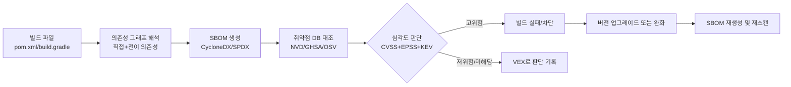

# 의존성 취약점 관리

## 핵심 정의
의존성 취약점 관리(Dependency Vulnerability Management)는 애플리케이션이 사용하는 오픈소스 라이브러리·프레임워크에서 알려진 보안 취약점(CVE, Common Vulnerabilities and Exposures)을 식별하고, 위험도에 따라 우선순위를 매겨 패치하는 일련의 프로세스다. 이를 자동화하는 도구 범주를 SCA(Software Composition Analysis)라 부른다. 직접 작성한 코드가 아니라 `pom.xml`/`build.gradle`로 끌어오는 전이 의존성(transitive dependency)까지 포함하는 것이 핵심이며, 실제 위험은 의존성 수와 실행 경로에 따라 달라 직접·전이 의존성을 함께 조사한다.

이 영역은 OWASP Top 10:2025 기준 A03 Software Supply Chain Failures와 직결된다. 자동 진단만으로 공급망 침해를 충분히 포착하기 어렵고, 널리 쓰이는 라이브러리 하나의 취약점이 그 라이브러리를 의존하는 모든 다운스트림 시스템에 연쇄적으로 영향을 미치기 때문에 잠재 피해 규모가 크게 평가된다.

## 동작 원리 / 구조

### 관리 파이프라인

- **SBOM(Software Bill of Materials)**: 애플리케이션에 포함된 모든 컴포넌트와 버전을 나열한 목록. CycloneDX는 취약점 관리·VEX 연계에 강점이 있어 보안 워크플로에서 주로 쓰이고, SPDX는 라이선스 컴플라이언스 쪽에서 표준으로 자리잡고 있다. Java 생태계에서는 CycloneDX Maven/Gradle 플러그인이나 cdxgen으로 생성한다.
- **취약점 매칭**: SBOM의 컴포넌트(groupId:artifactId:version)를 NVD, GitHub Security Advisory(GHSA), OSV(Open Source Vulnerabilities) 같은 데이터베이스와 대조한다. 매칭은 패키지 식별자·생태계·버전 범위·벤더 권고에 의존하므로, 배포판이나 벤더가 백포트(backport) 패치를 하면서 버전 문자열을 그대로 유지하면 실제로는 패치됐는데도 취약으로 오탐(false positive)되는 경우가 흔하다.
- **우선순위 산정**: CVSS(Common Vulnerability Scoring System) 점수만으로 우선순위를 정하면 왜곡되기 쉽다. 실제 악용 가능성을 나타내는 EPSS(Exploit Prediction Scoring System) 점수와 CISA KEV(Known Exploited Vulnerabilities) 카탈로그 등재 여부를 함께 봐야, 이론적 심각도는 높지만 실제 악용 사례가 없는 CVE보다 실제로 악용 중인 CVE를 먼저 처리할 수 있다.
- **VEX(Vulnerability Exploitability eXchange)**: SBOM이 "이 컴포넌트가 존재한다"만 말한다면, VEX는 "이 CVE가 우리 제품에서 실제로 영향을 미치는가"에 대한 판단(`affected`/`not_affected`/`fixed` 등)을 구조화해서 남긴다. 취약 코드가 제품에 존재하지 않거나 공격자가 제어할 수 있는 실행 경로가 없다는 근거를 확보하면 not_affected를 기록할 수 있다. 단일 정적 분석의 미도달 결과만으로 반사·플러그인·설정 변경을 포함한 비영향을 확정하지 않고 제품 버전·근거·재검토 조건을 남긴다.

### 대표 도구

| 도구 | 특징 |
|---|---|
| OWASP Dependency-Check | Maven/Gradle 빌드에 플러그인으로 붙여 NVD 기반 스캔, 무료·자체 호스팅 |
| OWASP Dependency-Track | SBOM(CycloneDX)을 지속적으로 수집·분석하는 플랫폼, 조직 단위 포트폴리오 관리에 적합 |
| Snyk | SaaS 기반, 수정 버전 자동 PR 생성 등 개발자 워크플로 통합에 강점 |
| GitHub Dependabot | 저장소에 내장, PR 기반 자동 업데이트 |
| Grype/Trivy | SBOM 재스캔에 최적화, 컨테이너 이미지와 함께 다루는 경우 많음 (→ [[컨테이너 이미지 보안 스캔]]) |

EPSS는 향후 30일 동안 실제 공격에서 악용 활동이 관측될 확률의 모델 추정이며, 우리 시스템의 피해 확률은 아니다. 낮은 EPSS나 KEV 미등재가 안전을 보장하지 않는다. Dependency-Check Maven 문서의 failBuildOnCVSS 기본값 11은 취약점 점수만으로 빌드를 실패시키지 않는다는 뜻이며, 스캔 자체 오류는 failOnError 정책이 별도로 처리한다.

## 실무 관점
- **CI 게이트 설정**: `mvn dependency-check:check`나 Gradle 플러그인은 기본적으로 심각도 임계치를 명시하지 않으면 경고만 출력하고 빌드를 통과시키는 경우가 많다. `failBuildOnCVSS` 같은 옵션으로 임계치(예: CVSS 7 이상)를 명시적으로 걸어야 실제로 파이프라인을 막는다. 반대로 임계치를 너무 낮게 잡으면 패치 불가능한 오래된 CVE 때문에 배포가 상시 막혀 팀이 예외 처리를 남발하는 역효과가 생긴다.
- **Ignore 목록의 함정**: 아직 패치가 없거나 실제 영향이 없다고 판단해 무시(suppress)한 CVE는 사유와 재검토 기한을 반드시 남겨야 한다. 기한 없이 무시 목록에 쌓아두면 나중에 패치가 나와도 재검토되지 않고 방치된다.
- **전이 의존성 우선순위**: `mvn dependency:tree`나 `./gradlew dependencies`로 어떤 상위 의존성이 취약한 하위 라이브러리를 끌어오는지 먼저 확인해야 한다. 직접 버전을 강제로 올리는 대신(`dependency management`로 pin) 상위 라이브러리 자체를 업그레이드하는 것이 근본 해결에 가깝다.
- **버전 고정 vs 자동 업데이트**: Dependabot/Renovate 같은 자동 PR 도구는 패치 반영 속도를 높이지만, 메이저 버전 업데이트를 무분별하게 자동 병합하면 하위 호환성 문제로 장애를 유발할 수 있다. patch/minor라도 회귀·보안 위험이 있으므로 필수 검증과 영향 범위를 충족한 업데이트만 자동 병합한다.
- **흔한 실수/장애 패턴**: 스캔 도구 도입 자체를 "완료"로 여기고 알림을 계속 무시하는 경보 피로(alert fatigue), 빌드 시점 스캔만 하고 이미 배포된 아티팩트를 재스캔하지 않아 배포 이후 공개된 CVE를 놓치는 경우, private 저장소에서 받아오는 사내 라이브러리는 스캔 대상에서 누락되는 경우가 대표적이다.
- **런타임 방어와의 역할 분리**: SCA는 "알려진 취약점이 있는 컴포넌트를 쓰고 있는가"만 판단한다. 실제로 그 취약점이 악용 가능한 코드 경로에 있는지는 별도로 판단(VEX)해야 하고, 제로데이나 자체 코드의 로직 결함은 SAST(Static Application Security Testing)나 코드 리뷰로 별도 커버해야 한다.

### 버전 고정·바이너리 무결성·취약점 진단의 분리

버전을 고정해도 저장소에서 같은 좌표의 아티팩트가 바뀌면 다른 바이너리를 받을 수 있다. 체크섬·서명 검증은 승인한 아티팩트인지 확인하고, SCA는 알려진 취약점을 대조한다. 체크섬이 일치하는 라이브러리에도 CVE나 악성 코드가 있을 수 있으므로 어느 한쪽이 다른 검사를 대체하지 않는다.

Gradle 9.7.1의 dependency verification은 `gradle/verification-metadata.xml`에 검증 정보를 기록한다. 처음 메타데이터를 생성할 때 현재 다운로드한 파일을 신뢰 기준으로 삼으므로, 이미 침해된 저장소의 파일도 승인된 체크섬으로 기록될 수 있다. 생성 결과를 그대로 승인하지 말고 신뢰할 수 있는 별도 배포 근거와 대조해 검토한다. 이 파일의 변경도 의존성 버전 변경과 같은 보안 검토 대상이다.

서명을 신뢰할 때도 공개키의 표시 이름만 보고 배포자를 확정하지 않는다. 신뢰하는 키의 적용 범위는 필요한 그룹·아티팩트로 좁혀, 다른 패키지나 탈취된 키가 허용 범위를 넓히지 않게 한다. 검증 실패를 해소하려고 광범위한 `trusted-artifacts` 예외를 추가하면 해당 아티팩트의 검증을 건너뛴다는 점을 확인한다.

## 심화 Q&A

### Q. 동일한 라이브러리 버전인데 스캐너마다 취약점 판정이 다른 이유는?
A. 스캐너가 참조하는 취약점 데이터 소스(NVD, GHSA, OSV, 벤더 자체 피드)와 버전 매칭 로직이 다르기 때문이다. 특히 배포판이나 벤더가 백포트 패치를 하면서 원본 버전 문자열을 유지하는 경우, 버전 문자열만 비교하는 스캐너는 실제로는 패치됐는데도 취약으로 오탐한다. 고위험 애플리케이션은 두 개 이상의 스캐너를 교차 검증하는 것이 실무에서 흔한 전략이다.

### Q. CVSS 점수가 높은 CVE인데 왜 우선순위를 낮춰도 되는 경우가 있는가?
A. CVSS Base 점수는 취약점 자체의 기술적 심각도다. CVSS v4의 Threat·Environmental metrics는 악용 성숙도와 배포 환경을 반영할 수 있으므로 Base만으로 위험을 판단하지 않는다. 취약한 함수가 애플리케이션의 실제 코드 경로에서 호출되지 않는다면(VEX `not_affected`), EPSS 점수가 낮고 KEV에 등재되지 않았다면, CVSS가 높아도 즉시 패치보다는 다음 정기 업데이트로 미룰 수 있는 근거가 된다. 다만 이 판단은 반드시 문서화(VEX)해서 근거를 남겨야 한다.

### Q. SBOM을 한 번 생성해두면 다시 생성할 필요가 없는가?
A. 아니다. SBOM은 특정 시점의 컴포넌트 목록일 뿐이고, 취약점 데이터베이스는 계속 갱신된다. 어제 안전했던 컴포넌트 목록이 오늘 새 CVE 공개로 취약 판정을 받을 수 있으므로, 빌드 시점뿐 아니라 배포 후에도 저장된 SBOM을 최신 DB로 주기적으로 재대조해야 한다. 이미지 전체를 매번 재분석하는 것보다 SBOM만 재대조하는 것이 비용 면에서 효율적이다.

### Q. 전이 의존성의 버전을 직접 강제로 올리는 것(dependency management로 pin)과 상위 의존성을 업그레이드하는 것 중 어느 쪽이 나은가?
A. 강제 버전 오버라이드는 빠른 임시 조치이지만, 상위 라이브러리가 특정 하위 버전의 API에 의존하고 있다면 런타임에 `NoSuchMethodError` 같은 호환성 문제가 발생할 수 있다. 근본적으로는 상위 라이브러리 자체를 취약점이 해결된 버전으로 업그레이드하는 것이 안전하며, 오버라이드는 상위 라이브러리 업그레이드가 당장 불가능할 때의 임시 완화책으로만 써야 한다.

### Q. Dependabot 같은 자동 PR 도구를 도입했는데도 취약점이 오래 방치되는 이유는 무엇인가?
A. 자동 PR 생성과 실제 병합은 별개다. 메이저 버전 업데이트는 하위 호환성 검증이 필요해 리뷰가 밀리기 쉽고, 리뷰어가 없거나 우선순위가 낮게 책정되면 PR이 쌓이기만 한다. 검증을 통과한 제한된 업데이트에는 자동 병합 정책을, 메이저 업데이트는 담당자 지정과 SLA(예: 고위험 CVE는 N일 이내 처리)를 명시적으로 운영해야 실질적으로 해소된다.

### Q. 컨테이너 이미지 스캔과 의존성 취약점 관리는 어떻게 다른가?
A. 컨테이너 이미지 스캔([[컨테이너 이미지 보안 스캔]])은 OS 패키지와 애플리케이션 의존성을 모두 포함해 최종 실행 아티팩트 관점에서 취약점을 본다. 의존성 취약점 관리는 빌드 도구(Maven/Gradle) 수준에서 애플리케이션 계층의 라이브러리만 대상으로 하며, 이미지로 패키징되기 이전 단계에서 더 빠르게 피드백을 줄 수 있다는 차이가 있다. 실무에서는 두 단계를 모두 파이프라인에 넣어 이중으로 방어한다.

## 관련 개념
- [[컨테이너 이미지 보안 스캔]]
- [[OWASP Top 10]]
- [[CI-CD 파이프라인 구성]]
- [[클라우드 IAM 최소 권한 원칙]]

## 참고 자료

- [FIRST EPSS](https://www.first.org/epss/) — 향후 30일 관측 악용 확률. 확인: 2026-09-08.
- [CVSS v4.0](https://www.first.org/cvss/v4.0/specification-document) — Base·Threat·Environmental metrics. 확인: 2026-09-08.
- [Dependency-Check Maven check goal](https://dependency-check.github.io/DependencyCheck/dependency-check-maven/check-mojo.html) — failBuildOnCVSS 기본11·failOnError 별도. 확인: 2026-09-08.
- [OWASP Top 10:2025 A03](https://owasp.org/Top10/2025/A03_2025-Software_Supply_Chain_Failures/) — 설문 선정·공급망 범위. 확인: 2026-09-08.

부분 재확인: 2026-09-23. [Gradle Dependency Verification](https://docs.gradle.org/current/userguide/dependency_verification.html) — 대조 문서 9.7.1의 동일 좌표 아티팩트 변조 위협, 메타데이터 생성 시 신뢰 부트스트랩 한계, 키의 신뢰 범위, `trusted-artifacts` 우회 의미를 확인했다. 기존 스캐너·취약점 지표의 버전·기본값은 이번 범위에 포함하지 않아 `verified`는 유지한다.
