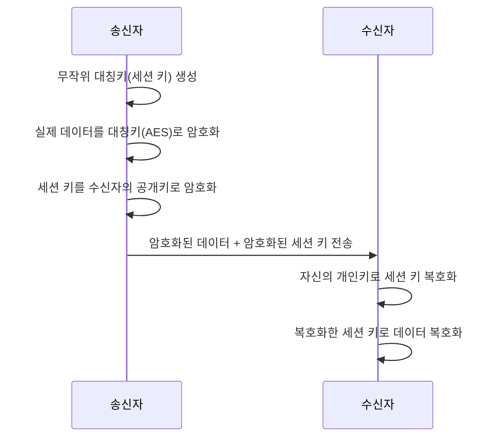

# 대칭키와 비대칭키 암호화

## 핵심 정의
대칭키 암호화(symmetric-key encryption)는 암호화와 복호화에 동일한 키를 사용하는 방식이다. 속도가 빠르고 구현이 단순하지만, 통신 당사자 모두가 사전에 같은 키를 안전하게 공유해야 한다는 키 배송 문제(key distribution problem)를 안고 있다. AES(Advanced Encryption Standard)가 사실상 표준이다.

비대칭키 암호화(asymmetric-key encryption, public-key cryptography)는 공개키(public key)와 개인키(private key) 한 쌍을 사용한다. 공개키로 암호화한 데이터는 짝을 이루는 개인키로만 복호화할 수 있고, 반대로 개인키로 서명(signature)한 데이터는 공개키로 검증할 수 있다. 공개키의 소유자를 인증할 수 있다면 사전에 같은 비밀키를 전달할 필요를 줄이지만, 일반적으로 대량 데이터 처리에는 대칭키 방식보다 비용이 크지만 연산 종류·키 크기·하드웨어에 따라 차이가 난다. RSA, ECC(Elliptic Curve Cryptography) 계열이 대표적이다.

## 동작 원리 / 구조

### 대칭키: 블록 암호 모드
AES 같은 블록 암호(block cipher)는 고정 크기 블록 단위로 암호화하는데, 여러 블록을 어떻게 이어 붙이느냐(운용 모드, mode of operation)에 따라 안전성이 크게 달라진다.

| 모드 | 특징 | 실무 평가 |
|---|---|---|
| ECB | 블록별 독립 암호화 | 같은 평문 블록이 같은 암호문으로 나와 패턴이 노출됨. 사용 금지 |
| CBC | 이전 블록 암호문을 다음 블록에 XOR | IV(초기화 벡터) 필요, 패딩 오라클(padding oracle) 공격에 취약할 수 있음 |
| GCM | CTR 모드 + 인증 태그(authentication tag) | 기밀성과 무결성을 동시에 제공(AEAD, Authenticated Encryption with Associated Data). 현재 실무 기본값 |


AES-256-GCM처럼 AEAD 모드를 쓰면 별도의 HMAC을 덧붙이지 않아도 위변조 여부를 함께 검증할 수 있어, 현재 TLS 1.3을 포함한 대부분의 실무 시스템에서 기본 선택지로 쓰인다.

### 비대칭키: 키 쌍과 하이브리드 암호화
RSA는 큰 수의 소인수분해가 어렵다는 것에, ECC는 타원곡선 위의 이산로그 문제(discrete logarithm problem)가 어렵다는 것에 안전성 근거를 둔다. 같은 보안 강도를 내는 데 필요한 키 길이가 ECC가 훨씬 짧다(예: 128비트 보안 강도 기준 RSA는 3072비트가 필요한 반면 ECC는 256비트로 충분).

```java
// RSA 키 쌍 생성 예시
KeyPairGenerator generator = KeyPairGenerator.getInstance("RSA");
generator.initialize(3072); // 128비트 보안 강도 목표
KeyPair keyPair = generator.generateKeyPair();
```

실무에서는 비대칭키로 큰 데이터를 직접 암호화하지 않는다. 연산 비용이 크고 암호화 가능한 데이터 크기도 키 길이에 제한받기 때문이다. 대신 하이브리드 암호화(hybrid encryption) 방식을 쓴다.



[[TLS Handshake 과정]]이 바로 이 하이브리드 구조의 대표 사례로, 핸드셰이크 단계에서 비대칭키 기반 키 교환(현재는 대부분 (Elliptic Curve) Diffie-Hellman Ephemeral 방식)으로 세션 키를 안전하게 합의하고, 이후 실제 트래픽은 대칭키(AES-GCM 등)로 암복호화한다.

위 순서도는 공개키로 데이터 키를 감싸는 envelope encryption 예시다. RSA 사용 시 OAEP 등 검증된 패딩이 필요하며, TLS 1.3은 이 RSA 키 운송 절차를 쓰지 않고 (EC)DHE/PSK로 비밀을 도출한다. ECC는 단일 암호화 알고리즘이 아니라 ECDH·ECDSA 등 키 합의와 서명 알고리즘의 기반이다. GCM 복호화 결과는 인증 태그 확인이 성공한 뒤 사용한다.

## 실무 관점
- **데이터 저장/전송 시 선택 기준**: 대량 데이터의 저장 암호화(at-rest)나 세션 데이터 암호화는 용도에 맞는 검증된 대칭키 구성으로 처리하고, 그 대칭키 자체를 안전하게 배포·교환하는 데만 비대칭키를 쓰는 것이 현재 사실상 표준 패턴이다.
- **키 길이 기준**: NIST SP 800-57 Part 1 Rev.5의 고전적 보안강도 비교에서 RSA 3072비트와 ECC 256–383비트는 128비트 강도에 대응한다. AES-128/256 선택은 데이터 보호 수명·성능·적용 정책을 고려하며 AES-256이 모든 시스템의 의무 기본값은 아니다. 이 비교는 양자 컴퓨터에 대한 RSA/ECC 안전성을 뜻하지 않는다.
- **흔한 실수**: ECB 모드를 기본값이라는 이유로 그대로 쓰는 것, CBC 모드에서 IV를 재사용하거나 고정값으로 쓰는 것(같은 키로 암호화한 여러 메시지의 패턴이 노출됨), 비대칭키로 대용량 파일을 직접 암호화하려다 성능 문제나 크기 제한에 부딪히는 것이 대표적이다.
- **Java 구현 시 주의점**: `Cipher.getInstance("AES")`처럼 모드를 명시하지 않으면 JDK provider 기본값이 ECB로 잡히는 경우가 있어, 반드시 `"AES/GCM/NoPadding"`처럼 모드를 명시해야 한다.
- **키 관리**: 대칭키든 개인키든 소스코드/설정 파일에 하드코딩하지 않고 KMS(Key Management Service)나 [[시크릿 관리]] 도구로 분리 보관하고, 주기적인 키 로테이션(key rotation) 정책을 둔다.

## 심화 Q&A

### Q. GCM 인증 태그가 맞으면 암호문을 다른 사용자 레코드로 옮겨도 안전한가?
A. 같은 키를 쓰는 다른 위치로 암호문·nonce·태그 전체가 함께 옮겨지면 태그가 유효할 수 있다. AEAD가 검증하는 것은 제공된 입력의 무결성이며 저장 위치나 소유자를 자동으로 알지는 못한다. 추가 인증 데이터(Additional Authenticated Data, AAD)에 신뢰할 수 있는 테넌트 ID·레코드 ID·스키마 버전을 넣어 암호문을 사용 맥락에 결합할 수 있다. AAD는 암호화되지 않으므로 비밀값을 담지 않고, 복호화 시 기대하는 맥락에서 다시 구성한다.

Java SE 25 `Cipher`의 GCM 사용에서는 `updateAAD`를 `update`·`doFinal`보다 먼저 호출해야 한다. 인증 실패를 빈 평문이나 기본값으로 바꾸지 말고 실패로 처리한다. AAD는 사용자 인가나 같은 레코드의 과거 암호문 재생 방지를 대신하지 않으므로, 버전·업무 상태 검증은 별도로 필요하다.


### Q. 대칭키 방식이 이미 빠르고 안전한데 왜 굳이 비대칭키를 함께 쓰는가?
A. 대칭키의 근본 문제는 "그 키를 상대방에게 어떻게 안전하게 전달하는가"이다. 사전에 안전한 채널이 없는 두 당사자(예: 브라우저와 처음 접속하는 웹 서버)가 공개된 네트워크로 키를 주고받아야 하는데, 이 문제를 비대칭키(또는 Diffie-Hellman 키 교환)가 풀어준다. 이후 실제 데이터 암복호화는 훨씬 빠른 대칭키로 처리하는 하이브리드 구조가 두 방식의 장점만 취하는 현실적인 절충안이다.

### Q. CBC 모드와 GCM 모드 중 GCM이 최근 실무 기본값으로 자리잡은 이유는?
A. CBC는 기밀성만 제공하므로 데이터 위변조 여부를 확인하려면 별도로 HMAC 등을 덧붙여야 하고, 이 조합을 잘못 구현하면(예: MAC 검증 순서 오류) 패딩 오라클 같은 공격에 노출된다. GCM은 AEAD 모드로 암호화와 동시에 인증 태그를 생성해 기밀성과 무결성을 한 번에 보장하고, 구현 실수의 여지도 줄여준다.

### Q. RSA와 ECC 중 하나를 신규 시스템에 도입한다면 무엇을 우선 고려하는가?
A. 같은 보안 강도를 내는 데 필요한 키 길이가 ECC가 훨씬 짧아 서명/키교환 연산이 빠르고 인증서 크기도 작아, 모바일이나 TLS처럼 지연시간에 민감한 환경에서는 ECC(특히 ECDHE, ECDSA)가 유리하다. 다만 레거시 시스템/라이브러리 호환성이나 특정 산업 표준(FIPS 인증 범위 등)이 RSA를 요구하는 경우도 있어, 대상 환경의 호환성 요구사항을 먼저 확인해야 한다.

### Q. IV(초기화 벡터)나 Nonce를 재사용하면 왜 위험한가?
A. CTR/GCM 계열 모드는 내부적으로 키와 Nonce를 조합해 키스트림(keystream)을 생성하고 평문과 XOR한다. 같은 (키, Nonce) 조합이 재사용되면 동일한 키스트림이 재사용되어, 두 암호문을 XOR하면 키 없이도 두 평문 사이의 관계를 유추할 수 있게 된다. GCM에서는 Nonce 재사용이 인증 태그 위조로까지 이어질 수 있어 특히 치명적이다. 동일 키에서 nonce가 중복되지 않도록 다중 인스턴스·재시작을 포함해 관리해야 한다. 무작위 nonce도 충돌 확률과 키당 사용 한도가 있으므로 검증된 라이브러리의 길이·호출 제한을 따른다.

### Q. 양자 컴퓨팅이 현재 쓰이는 비대칭키 암호에 어떤 영향을 주는가?
A. RSA와 ECC의 안전성 근거인 소인수분해·이산로그 문제는 충분히 큰 양자 컴퓨터(Shor 알고리즘 실행 가능 수준)가 등장하면 다항 시간에 풀릴 수 있다고 알려져 있다. 이 때문에 표준화 기관들이 격자 기반(lattice-based) 등 양자 내성 암호(post-quantum cryptography)의 ML-KEM(FIPS 203) 등을 2024년에 표준화했으며, 장기 보관이 필요한 민감 데이터의 경우 하이브리드(기존 알고리즘 + 양자 내성 알고리즘 병행) 적용을 검토하는 추세다. 대칭키(AES)는 키 길이를 늘리는 것만으로 상대적으로 대응이 쉬워 영향이 덜하다.

### Q. 대칭키 하나로 암호화와 인증을 동시에 처리하는 GCM과, 별도의 해시 기반 인증을 조합하는 방식(Encrypt-then-MAC)의 차이는 무엇인가?
A. GCM은 암호화 알고리즘 내부에서 인증 태그까지 함께 생성하므로 구현이 단순하고 조합 실수 여지가 적다. Encrypt-then-MAC은 대칭키 암호화([[해시 함수와 솔팅]]에서 다루는 해시와는 별개로 HMAC 같은 메시지 인증 코드를 사용)와 인증을 별도 단계로 나누는 방식으로, 알고리즘을 자유롭게 조합할 수 있는 유연성은 있지만 두 단계를 올바른 순서(암호화 먼저, MAC은 암호문에 대해 계산)로 구현하지 않으면 취약점이 생기기 쉽다. 신규 시스템이라면 검증된 AEAD 모드(GCM, ChaCha20-Poly1305)를 우선 고려하는 것이 안전하다.

## 관련 개념
- [[TLS Handshake 과정]]
- [[해시 함수와 솔팅]]
- [[시크릿 관리]]
- [[JWT 인증]]

## 참고 자료

- [NIST SP 800-38D](https://csrc.nist.gov/pubs/sp/800/38/d/final) — GCM·IV 유일성·인증 태그. 확인: 2026-09-08.
- [NIST SP 800-57 Part 1 Rev.5](https://nvlpubs.nist.gov/nistpubs/SpecialPublications/NIST.SP.800-57pt1r5.pdf) — §5.6 classical 보안강도와 적용 수명. 확인: 2026-09-08.
- [NIST FIPS 203 (2024)](https://csrc.nist.gov/pubs/fips/203/final) — ML-KEM 표준 확정. 확인: 2026-09-08.
- [RFC 8446: TLS 1.3](https://www.rfc-editor.org/rfc/rfc8446.html) — (EC)DHE·PSK·AEAD. 확인: 2026-09-08.

부분 재검증: 2026-09-23. [Java SE 25 Cipher](https://docs.oracle.com/en/java/javase/25/docs/api/java.base/javax/crypto/Cipher.html)의 AEAD·AAD 처리 순서·GCM IV 유일성 계약을 확인하고, 저장 맥락 결합은 이 계약에 따른 설계 예로 구분했다. NIST 키 길이·양자 내성 표준 등은 이번 범위 밖이므로 `verified`는 유지했다.
