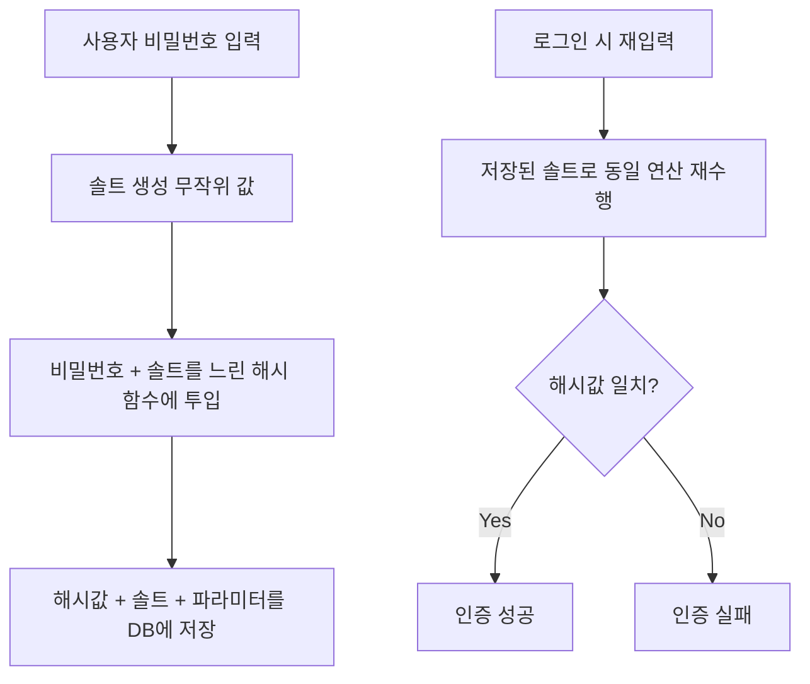

# 해시 함수와 솔팅

## 핵심 정의
이 노트의 암호학적 해시 함수(cryptographic hash function)는 임의 길이의 입력을 고정 길이의 값(해시값, digest)으로 변환하는 단방향 함수다. 같은 입력은 항상 같은 출력을 내지만, 출력에서 입력을 역산하는 것은 계산적으로 불가능해야 하고(역상 저항성, preimage resistance), 서로 다른 두 입력이 같은 출력을 내는 경우(충돌, collision)를 찾기도 어려워야 한다.

솔팅(salting)은 해시를 계산하기 전에 입력값에 무작위 값(솔트, salt)을 덧붙이는 기법이다. 같은 평문이라도 솔트가 다르면 완전히 다른 해시값이 나오게 만들어, 미리 계산해 둔 해시값 테이블(레인보우 테이블, rainbow table)로 원문을 역추적하는 공격을 무력화한다. 솔트는 비밀값이 아니며 해시값과 함께 그대로 저장해도 된다.

## 동작 원리 / 구조

### 범용 해시와 비밀번호 해시는 목적이 다르다
SHA-256 같은 범용 암호학적 해시 함수는 무결성 검증(파일 체크섬, 커밋 해시 등)을 위해 "빠르게" 계산되도록 설계되어 있다. 반면 비밀번호 저장에는 오히려 "일부러 느린" 해시 함수가 필요하다. 빠른 해시는 공격자가 초당 수십억 번의 대입 공격(brute-force)을 시도할 수 있게 해주기 때문이다.



비밀번호용 느린 해시/키 유도 함수(password-based KDF, Key Derivation Function)는 의도적으로 CPU 연산량이나 메모리 사용량을 늘려 초당 시도 가능한 횟수를 제한한다. 현재 OWASP가 권장하는 우선순위는 Argon2id, scrypt, bcrypt, PBKDF2(FIPS 준수가 필요한 경우) 순이다.

| 알고리즘 | 특징 | OWASP 권장 파라미터(기준값) |
|---|---|---|
| Argon2id | 메모리 하드(memory-hard), GPU/ASIC 병렬 공격의 메모리 비용을 높임 | 메모리 19MiB 이상, 반복 2회, 병렬도 1 (자원 여유 시 메모리를 늘리는 대안 구성도 허용) |
| scrypt | 메모리 하드, Argon2 이전 표준 | N=2^17, r=8, p=1 |
| bcrypt | CPU 코스트만 조절, 레거시 호환성 좋음 | cost factor 최소 10; 실제 지연·부하 측정으로 결정, 입력 72바이트 제한 주의 |
| PBKDF2 | 반복 횟수만 조절, FIPS 인증 환경에서 사용 | SHA-256 기준 반복 60만 회 이상 |

```java
// Spring Security의 PasswordEncoder 예시 (bcrypt)
PasswordEncoder encoder = new BCryptPasswordEncoder(12); // cost factor 12
String hashed = encoder.encode(rawPassword);
boolean matches = encoder.matches(rawPassword, hashed);
```

Spring Security의 `BCryptPasswordEncoder`, `Argon2PasswordEncoder`는 내부적으로 솔트를 자동 생성해 해시값 문자열 안에 함께 인코딩해 저장하므로(`$2a$12$<salt><hash>` 형식 등), 개발자가 솔트를 별도 컬럼으로 관리할 필요는 보통 없다.

표의 값은 2026-09-08 조회한 OWASP 최소 권고 구성으로 보편적 최적값이 아니다. PBKDF2-HMAC-SHA256을 선택했다는 사실만으로 시스템이 FIPS 검증을 충족하지는 않으며 사용하는 암호 모듈의 검증 범위도 확인한다. 솔트는 계정별 오프라인 추측을 막지 못하고 사전 계산의 재사용을 어렵게 한다. Pepper 교체는 기존 비밀번호를 모르면 재해시가 어려워 강제 재설정 계획이 필요하다.

## 실무 관점
- **알고리즘 선택 원칙**: 신규 시스템은 Argon2id를 기본으로 검토하고, 불가능하면 scrypt를 검토하고 bcrypt는 레거시 호환 용도로 검토한다. SHA-256/MD5 같은 범용 해시를 비밀번호에 그대로 쓰는 것은 솔트를 붙이더라도 대입 공격에 매우 취약해 지양해야 한다.
- **솔트와 페퍼(pepper)의 차이**: 솔트는 사용자/레코드마다 다르고 해시값과 함께 저장되는 공개 값이다. 페퍼는 애플리케이션 전체에서 공유하는 비밀값으로, 해시값과 별도로(예: 환경변수, KMS) 보관해 DB가 통째로 유출되어도 추가 방어선이 되도록 하는 보완 기법이다.
- **흔한 실수/사고 패턴**: 비밀번호를 평문 저장, 솔트 없이 단일 해시만 저장(같은 비밀번호를 쓰는 사용자들이 같은 해시값을 갖게 되어 패턴 노출), 전체 사용자에 동일한 고정 솔트 사용(레인보우 테이블 공격을 사실상 다시 허용), bcrypt의 72바이트 입력 제한을 모르고 긴 비밀번호를 그대로 넣어 뒷부분이 무시되는 것 등이 반복적으로 나타난다.
- **성능 트레이드오프**: 느린 해시는 의도된 설계지만, 로그인 트래픽이 매우 많은 시스템에서는 서버 CPU/메모리 부하로 직결된다. cost factor를 무작정 높이기보다 목표 검증 시간(예: 서버 코어당 100ms 내외)을 기준으로 파라미터를 정하고, 필요하면 별도 인증 서비스로 부하를 격리한다.
- **해시 vs 암호화 혼동 주의**: 비밀번호는 복호화가 필요 없으므로 반드시 해시로 저장해야 하며, 대칭키로 "암호화"해서 저장하는 것은 키가 유출되면 원문이 그대로 노출되는 잘못된 설계다. [[대칭키와 비대칭키 암호화]]는 복호화가 필요한 데이터(카드번호 등)에, 해시는 검증만 하면 되는 비밀번호에 쓴다는 목적 구분이 핵심이다.

## 심화 Q&A

### Q. 기존 비밀번호를 알 수 없는데 해시 알고리즘과 비용을 어떻게 올리는가?
A. 저장 형식에 알고리즘 식별자·파라미터를 보존하고 기존 방식으로 로그인 검증에 성공했을 때 입력받은 원문으로 새 해시를 만든다. 기존 해시 문자열을 새 알고리즘에 넣는 것은 원래 비밀번호를 재해시하는 것과 다르다. 오랫동안 로그인하지 않는 계정은 자동 이행되지 않으므로 별도 만료·재설정 정책을 둔다.

Spring Security 7.1.1 문서의 `DelegatingPasswordEncoder`는 `{id}encodedPassword`로 검증기를 선택한다. 식별자가 없는 기존 bcrypt 문자열을 이행할 때는 실제 알고리즘을 확인해 접두사를 붙이거나 명시적 검증기 매핑을 사용한다. 매핑 오류를 해결하려고 평문 `noop` 검증으로 폴백하면 안 된다. 재해시 저장은 동시 비밀번호 변경을 덮어쓰지 않도록 기존 해시나 버전을 조건으로 갱신한다.

비용 증가는 실제 로그인 동시성과 최대 입력 길이를 포함해 측정한다. 메모리 비용이 큰 KDF는 동시에 수행할 검증 수를 제한하지 않으면 인증 공격으로 CPU·메모리가 고갈될 수 있으므로 [[Rate Limiting 알고리즘]]과 동시성 제한을 함께 적용한다.


### Q. 왜 비밀번호 저장에는 SHA-256처럼 빠르고 안전하다고 알려진 해시를 쓰면 안 되는가?
A. SHA-256은 충돌 저항성이 뛰어나 무결성 검증에는 적합하지만, 초당 수십억 회 계산이 가능할 만큼 빠르다는 점이 비밀번호 저장에는 오히려 약점이 된다. 공격자가 DB 유출본을 확보하면 GPU/ASIC으로 짧은 시간에 방대한 사전 대입 공격을 수행할 수 있다. Argon2id/bcrypt 같은 KDF는 의도적으로 느리게(또는 메모리를 많이 쓰게) 만들어 이 공격의 비용을 크게 높인다.

### Q. 메모리 하드(memory-hard) 알고리즘이 GPU 기반 공격에 강한 이유는 무엇인가?
A. GPU/ASIC은 저렴한 연산 유닛을 대량 병렬화하는 데는 강하지만 유닛당 메모리는 제한적이다. Argon2id나 scrypt처럼 계산 과정에서 많은 메모리를 필요로 하도록 설계하면, 병렬로 수천 개의 해시를 동시에 계산하려 할 때 필요한 총 메모리량이 함께 커져 병렬화의 경제성이 크게 떨어진다. bcrypt는 CPU 코스트만 조절하기 때문에 메모리 하드 알고리즘보다 상대적으로 GPU 공격에 덜 강하다.

### Q. 솔트가 공개되어도 안전한 이유는 무엇이고, 그렇다면 솔트는 왜 필요한가?
A. 솔트의 목적은 "비밀을 숨기는 것"이 아니라 "공격자가 미리 계산해 둔 결과를 재사용하지 못하게 하는 것"이다. 솔트가 레코드마다 다르면 공격자는 사용자 한 명을 공격할 때마다 그 솔트에 맞춰 처음부터 다시 계산해야 하므로, 레인보우 테이블처럼 여러 계정에 재사용 가능한 사전 계산 결과를 만들 수 없다. 솔트 자체가 유출되어도 이 목적은 그대로 달성되므로 공개되어도 문제가 없다.

### Q. 페퍼(pepper)를 추가로 쓰면 어떤 공격 시나리오에서 이득이 있는가?
A. DB가 통째로 유출되었지만 애플리케이션 서버(또는 KMS)는 침해되지 않은 시나리오에서 효과가 크다. 솔트는 DB와 함께 유출되므로 공격자가 즉시 대입 공격을 시작할 수 있지만, 페퍼는 DB 밖(환경변수, KMS, HSM)에 있어 공격자가 DB만 확보한 상태로는 페퍼 값을 알 수 없어 해시를 재현할 수 없다. 다만 애플리케이션 서버까지 함께 침해되면 페퍼의 이점은 사라진다.

### Q. bcrypt의 72바이트 입력 제한을 모르고 넘어가면 어떤 문제가 생기는가?
A. bcrypt에는 72바이트 입력 한계가 있으며 구현에 따라 초과 입력을 거부하거나 잘라 처리한다. 문자 수와 UTF-8 바이트 수를 구분하고 실제 라이브러리 버전을 시험한다. 단순 SHA-2 prehash는 password shucking·바이너리 NUL 처리 등의 위험이 있어 임의로 도입하지 않는다. 긴 입력을 지원하려면 Argon2id로 이행하고, 레거시 prehash가 꼭 필요하면 OWASP가 설명하는 인코딩·pepper 기반 구성과 키 관리를 함께 적용한다.

### Q. 비밀번호 정책을 강화하는 것과 해시 알고리즘을 강화하는 것 중 실무에서 어느 쪽을 우선해야 하는가?
A. 사용자에게 복잡한 비밀번호 규칙을 강제하는 것은 실제로는 사용자가 규칙을 우회하는 패턴(끝에 숫자 붙이기 등)으로 이어져 효과가 제한적이라는 것이 최근의 대체적인 시각이다. 반면 느린 해시는 유출된 DB의 오프라인 대입 비용을 높이고, 유출 비밀번호 차단과 MFA는 계정 탈취를 줄인다. MFA가 비밀번호 해시의 오프라인 크래킹 자체를 막는 것은 아니다. 정책과 알고리즘은 상호 배타적이지 않지만, 한정된 리소스로 우선순위를 정한다면 저장 방식(느린 해시 + 솔트)과 유출 대응 체계를 먼저 견고히 하는 쪽이 비용 대비 효과가 크다.

## 관련 개념
- [[대칭키와 비대칭키 암호화]]
- [[JWT 인증]]
- [[시크릿 관리]]

## 참고 자료

- [OWASP Password Storage](https://cheatsheetseries.owasp.org/cheatsheets/Password_Storage_Cheat_Sheet.html) — Argon2id·scrypt·bcrypt·PBKDF2 최소 파라미터·prehash 위험. 확인: 2026-09-08.
- [Spring Security Password Storage](https://docs.spring.io/spring-security/reference/features/authentication/password-storage.html) — PasswordEncoder·알고리즘 이행. 확인: 2026-09-08.

부분 재검증: 2026-09-23. [OWASP Password Storage](https://cheatsheetseries.owasp.org/cheatsheets/Password_Storage_Cheat_Sheet.html)의 로그인 시 비용 상향·미접속 계정·과도한 비용의 서비스 거부 위험, [Spring Security Password Storage](https://docs.spring.io/spring-security/reference/features/authentication/password-storage.html)의 7.1.1 DelegatingPasswordEncoder 저장 형식·미매핑 ID 동작을 확인했다. 동시 갱신 보호는 이행 설계 지침이며, 이번에는 모든 알고리즘 파라미터·구현을 실행 재검증하지 않아 `verified`를 유지했다.
