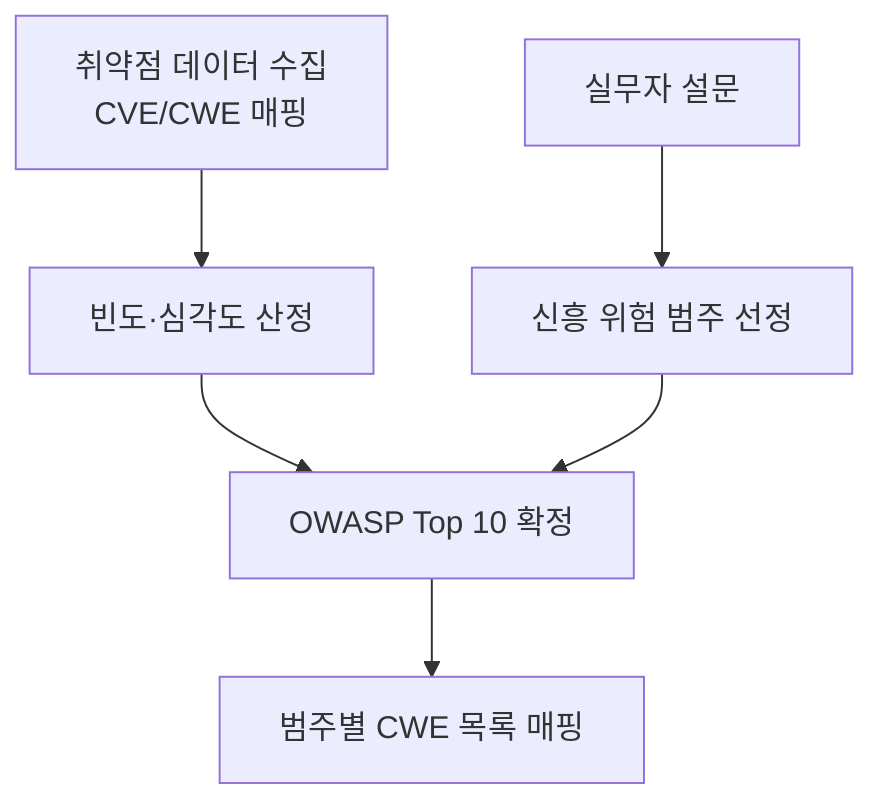

# OWASP Top 10

## 핵심 정의
OWASP(Open Worldwide Application Security Project) Top 10은 웹 애플리케이션에서 가장 위험도가 높은 취약점 범주를 정리한 문서로, 기여 기관의 애플리케이션 진단에서 확인한 CWE(Common Weakness Enumeration)별 유병률, CVE(Common Vulnerabilities and Exposures)의 악용 가능성·영향 점수, 실무자 설문을 종합해 갱신된다. 단순한 CVE 건수 순위가 아니다. 이 노트는 **OWASP Top 10:2025** 판을 기준으로 한다. 개별 취약점이 아니라 "위험 범주(risk category)"를 나열한 것이므로, 실제 진단·코드 리뷰 시에는 각 범주에 속한 세부 CWE를 확인해야 한다.

## 동작 원리 / 구조

### OWASP Top 10:2025 전체 목록

| 순위 | 범주 | 2021 대비 변화 |
|---|---|---|
| A01 | Broken Access Control | 1위 유지, SSRF(Server-Side Request Forgery)가 이 범주로 흡수 통합 |
| A02 | Security Misconfiguration | 5위 → 2위로 상승 |
| A03 | Software Supply Chain Failures | 신설 (2021 "Vulnerable and Outdated Components" 확장) |
| A04 | Cryptographic Failures | 2위 → 4위로 이동 |
| A05 | Injection | 3위 → 5위로 하락 |
| A06 | Insecure Design | 순위 소폭 하락, 범주 자체는 유지 |
| A07 | Authentication Failures | 순위 유지, 명칭 변경("Identification and Authentication Failures" → 단순화) |
| A08 | Software or Data Integrity Failures | 순위 유지 |
| A09 | Security Logging and Alerting Failures | 9위 유지, 명칭 변경(Monitoring → Alerting, 탐지 후 경보/대응 강조) |
| A10 | Mishandling of Exceptional Conditions | 신설 (예외 처리 미흡, 로직 오류, fail-open 등) |

2021년 대비 핵심 변화는 신설 카테고리 2개(A03, A10), 통합 1건(SSRF → A01), 순위 변동 다수, 명칭 변경 3건이다. 10개 범주 중 8개는 실측 데이터(자동/수동 진단 결과) 기반이며, 나머지 2개는 커뮤니티 설문으로 선정된다.

### 범주별 핵심 포인트 (백엔드 관점)
- **A01 Broken Access Control**: 인가 로직 누락/우회, IDOR(Insecure Direct Object Reference), 강제 브라우징. SSRF도 여기 포함되므로 외부 URL을 서버가 대신 요청하는 기능(웹훅, 이미지 프록시 등)의 URL 검증이 중요.
- **A02 Security Misconfiguration**: 기본 계정/설정 방치, 불필요한 기능 노출, 에러 스택 트레이스 노출, 클라우드 리소스 퍼블릭 설정.
- **A03 Software Supply Chain Failures**: 의존성 라이브러리뿐 아니라 빌드 파이프라인, 배포 인프라까지 포함. 커뮤니티 설문에서 가장 높은 순위로 선정되었다. 관련 위험을 자동 진단과 CVE만으로 충분히 포착하기 어렵다는 한계도 있다.
- **A04 Cryptographic Failures**: 평문 저장/전송, 약한 알고리즘, 잘못된 키 관리. → [[대칭키와 비대칭키 암호화]], [[해시 함수와 솔팅]]
- **A05 Injection**: SQL/NoSQL/OS command/LDAP injection 등. → [[SQL Injection과 방어]]
- **A06 Insecure Design**: 구현 결함이 아니라 설계 단계에서부터 위협 모델링이 빠진 경우(예: 비밀번호 재설정 로직에 속도 제한이 애초에 설계되지 않음).
- **A07 Authentication Failures**: 자격 증명 스터핑, 세션 고정, 약한 비밀번호 정책. → [[세션 기반 인증과 토큰 기반 인증 비교]]
- **A08 Software or Data Integrity Failures**: 서명 검증 없는 업데이트, CI/CD 파이프라인 변조, 안전하지 않은 역직렬화.
- **A09 Security Logging and Alerting Failures**: 로그는 남지만 이상 징후에 대한 알림/대응 체계가 없는 경우.
- **A10 Mishandling of Exceptional Conditions**: 예외 발생 시 기본값으로 인가를 허용(fail-open)하거나, catch 블록에서 보안 검증을 건너뛰는 패턴.

Top 10은 인지 제고와 위험 대화의 출발점이며 모든 보안 요구사항이나 법규 준수의 충분조건이 아니다. 실제 검증은 위협 모델과 OWASP ASVS 등의 상세 요구사항으로 확장한다. 이 판의 8개 범주는 진단 데이터, 2개는 커뮤니티 설문을 활용한다.

## 실무 관점
- OWASP Top 10은 규제 준수(PCI-DSS, ISMS-P 등)의 최소 체크리스트로도 쓰이지만, 실제 취약점 진단 시에는 이 10개 범주로 뭉뚱그려 보고하지 않고 CWE 단위로 세분화해서 관리해야 재발 방지가 된다.
- 정적 분석 도구(SAST)나 SCA(Software Composition Analysis) 도구를 CI 파이프라인에 넣을 때 이 목록을 기준으로 룰셋을 구성하는 경우가 많다. 특히 A03(공급망)은 `mvn dependency-check:check`(OWASP Dependency-Check Maven 플러그인), Snyk, Dependabot류 도구와 직결된다.
- 흔한 실수: "OWASP Top 10만 막으면 안전하다"는 오해. Top 10은 발생 빈도·영향도가 큰 범주의 요약일 뿐이며, 비즈니스 로직 결함(가격 조작, 쿠폰 중복 사용 등)은 이 목록에 명시적으로 잡히지 않는 경우가 많다.
- 2021 → 2025 Injection 순위 이동만으로 실제 공격 위험 감소나 ORM 보급의 인과 효과를 결론 내리지 않는다.
- 팀 내 코드 리뷰 체크리스트나 신규 API 설계 리뷰 시 A01/A02/A05는 사실상 필수 점검 항목으로 삼는 것이 실무적으로 효율적이다.

## 심화 Q&A

### Q. 2021년 대비 2025년판에서 Injection 순위가 3위에서 5위로 내려간 이유를 데이터 관점에서 어떻게 해석해야 하는가?
A. 기여된 애플리케이션 진단 데이터의 범위, CWE 매핑, 발생률, CVSS 기반 점수와 범주 재편을 함께 봐야 한다. 순위는 상대적이며 2021과 2025 표본도 같지 않다. PreparedStatement/ORM 확산만으로 순위 이동을 설명하는 것은 문서가 입증하지 않은 인과 추론이다. 입력과 쿼리 구조 분리의 필요성은 순위와 무관하다.

### Q. SSRF가 별도 범주에서 Broken Access Control로 흡수된 것이 실무 대응에 어떤 영향을 주는가?
A. 별도 카테고리로 분리되어 있을 때는 "외부 요청을 프록시하는 기능"만 점검 대상으로 좁게 인식하기 쉬웠다. A01로 통합되면서 SSRF를 인가 우회의 한 형태(내부망 리소스에 대한 비인가 접근 경로)로 보게 되고, 인가 정책 검토 시 서버가 사용자 입력으로 만드는 아웃바운드 요청(웹훅 URL, 이미지 다운로드, PDF 렌더링 등)을 포함시켜야 한다는 신호로 해석할 수 있다.

### Q. A10 Mishandling of Exceptional Conditions은 왜 별도 범주로 신설되었는가? 기존 범주로 커버되지 않는 이유는?
A. A10은 오류 처리·논리 오류·fail-open 등 비정상 조건의 대응을 묶어, 포괄적인 코드 품질 문제보다 구체적인 점검 지침을 주기 위한 범주다. Broken Access Control이나 Injection을 정상 흐름에만 한정한다는 의미는 아니다. 예를 들어 인가 서버 호출이 타임아웃 났을 때 기본값으로 접근을 허용(fail-open)하는 코드는 인가 실패와 예외 처리 설계가 겹치는 사례이며 별도로 분리해 가시성을 높인 것이다.

### Q. Software Supply Chain Failures(A03)의 순위를 단순 발생 건수만으로 설명할 수 없는 이유는?
A. A03은 커뮤니티 설문에서 응답자의 50%가 1위로 꼽은 범주다. 공식 페이지는 기여 데이터에서 검사·보고된 경우 평균 발생률이 5.19%로 가장 높다고 설명하므로 발생 빈도가 가장 낮다는 전제는 틀리다. 공급망 공격의 범위가 넓고 관측·CVE 매핑이 제한적인 점까지 함께 고려해야 한다.

### Q. OWASP Top 10과 CWE Top 25는 어떤 관계이고, 실무에서 어느 쪽을 더 세밀한 기준으로 써야 하는가?
A. OWASP Top 10은 "범주(카테고리)" 단위 요약이고, 하나의 범주 안에 수십 개의 CWE(구체적 결함 유형)가 매핑되어 있다(정확한 매핑 목록은 해당 판의 범주 페이지 참조). 코드 리뷰나 SAST 룰 설정처럼 구체적 패턴 매칭이 필요한 작업에는 CWE 단위가 더 실용적이고, 조직 차원의 보안 성숙도 보고나 우선순위 커뮤니케이션에는 OWASP Top 10 범주 단위가 더 적합하다.

### Q. Security Misconfiguration이 5위에서 2위로 급상승한 배경은 클라우드 환경과 어떤 관련이 있는가?
A. 클라우드의 접근 정책, 서비스 기본값, 컨테이너·웹 서버 구성은 A02에 포함될 수 있다. IaC는 같은 오류를 반복 배포할 위험과 자동 검증으로 차단할 기회를 모두 제공한다. 다만 순위 변화만으로 클라우드 확산이 직접 원인이라고 확정하지 않으며 공식 진단 데이터의 범위와 결과를 구분해 읽는다.

## 관련 개념
- [[SSRF와 아웃바운드 요청 검증]]
- [[SQL Injection과 방어]]
- [[XSS와 CSRF 방어]]
- [[대칭키와 비대칭키 암호화]]
- [[RBAC와 ABAC 권한 모델]]

## 참고 자료

- [OWASP Top 10:2025](https://owasp.org/Top10/2025/) — 10개 범주 목록. 확인: 2026-09-08.
- [OWASP 2025 Introduction](https://owasp.org/Top10/2025/0x00_2025-Introduction/) — 진단 데이터·CWE·CVSS·설문 방법론. 확인: 2026-09-08.
- [OWASP 2025 A03](https://owasp.org/Top10/2025/A03_2025-Software_Supply_Chain_Failures/) — 설문1위·평균 발생률 5.19%. 확인: 2026-09-08.
- [OWASP 2025 A05](https://owasp.org/Top10/2025/A05_2025-Injection/) — Injection 상대 순위와 진단 결과. 확인: 2026-09-08.
- [OWASP 2025 A02](https://owasp.org/Top10/2025/A02_2025-Security_Misconfiguration/) — Security Misconfiguration 범위. 확인: 2026-09-08.

부분 재검증: 2026-09-22. [OWASP Top 10:2025 Introduction](https://top10.owasp.org/2025/0x00_2025-Introduction/)의 기여 애플리케이션 데이터·CWE 유병률·CVE 점수·설문 방법론을 대조했다. 그 외 서술은 이번 확인 범위 밖이므로 `verified`는 유지했다.

부분 재검증: 2026-10-04. [OWASP Top 10:2025 A10](https://top10.owasp.org/2025/A10_2025-Mishandling_of_Exceptional_Conditions/)의 신설 배경·fail-open·인가 및 SQL Injection과 연결되는 예외 처리 시나리오를 확인했다. A01/A05를 정상 흐름에만 한정하던 Q&A 표현을 바로잡았으며, 범주별 전체 수치·순위는 재검증하지 않아 `verified`를 유지했다. 실제 취약점 진단이나 공격 시험은 수행하지 않았다.
