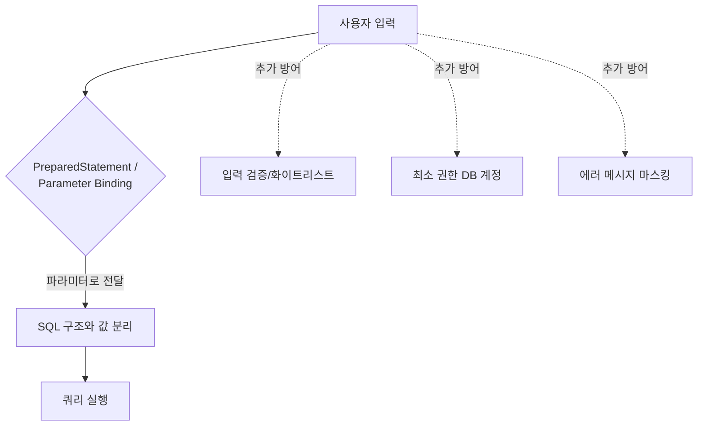

# SQL Injection과 방어

## 핵심 정의
SQL Injection은 사용자 입력값이 SQL 쿼리 문자열에 그대로 삽입되어, 공격자가 의도한 SQL 구문을 실행시키는 취약점이다. 애플리케이션이 신뢰할 수 없는 입력을 쿼리 구조와 분리하지 않고 문자열로 결합할 때 발생하며, OWASP Top 10:2025 기준 A05 Injection 범주에 속한다. 데이터 유출, 인증 우회, 데이터 변조/삭제, 극단적으로는 DB 서버를 경유한 원격 명령 실행까지 이어질 수 있는 고위험 취약점이다.

## 동작 원리 / 구조

### 공격 원리
쿼리 문자열과 데이터가 분리되지 않으면, 입력값에 포함된 SQL 메타 문자(따옴표, 세미콜론, 주석 기호 `--`, `/* */` 등)가 쿼리 구조 자체를 바꿔버린다.

```java
// 취약한 코드: 문자열 결합
String query = "SELECT * FROM users WHERE username = '" + username + "' AND password = '" + password + "'";
```

입력값으로 `username = admin' -- ` 를 넣으면 실제 실행되는 쿼리는:
```sql
SELECT * FROM users WHERE username = 'admin' -- ' AND password = ''
```
`--` 뒤가 주석 처리되어 비밀번호 검증 조건이 통째로 무시되고 admin 계정으로 인증을 우회한다.

### 대표 유형
| 유형 | 설명 |
|---|---|
| In-band (Union/Error-based) | 응답 화면이나 에러 메시지에 결과가 직접 노출 |
| Blind (Boolean-based) | 참/거짓에 따른 화면 차이만으로 데이터 추론 |
| Blind (Time-based) | `SLEEP()`, `WAITFOR DELAY` 등으로 응답 지연 차이를 이용해 추론 |
| Out-of-band | DNS/HTTP 요청을 별도로 트리거해 데이터를 외부로 유출 |

### 방어 계층 구조



### 안전한 코드 (JDBC PreparedStatement)
```java
String sql = "SELECT id, password_hash FROM users WHERE username = ?";
try (PreparedStatement ps = connection.prepareStatement(sql)) {
    ps.setString(1, username);
    try (ResultSet rs = ps.executeQuery()) {
        // 조회된 password_hash와 입력 비밀번호를 PasswordEncoder.matches로 검증
        // 사용자 없음/불일치는 동일한 인증 실패 응답으로 처리
    }
}
```
`PreparedStatement`의 보안 핵심은 SQL 구조와 파라미터 값을 분리하는 것이다. 서버 준비 구문 사용과 준비 시점·실행계획 캐시는 JDBC 드라이버·DB 설정에 달려 있으며 반드시 별도 왕복으로 먼저 컴파일하는 것은 아니다. 따라서 입력값에 SQL 메타 문자가 포함되어도 구조 자체를 바꿀 수 없다.

### Spring Data JPA / MyBatis에서의 방어
```java
// JPQL - 파라미터 바인딩 (안전)
@Query("SELECT u FROM User u WHERE u.username = :username")
User findByUsername(@Param("username") String username);
```
```xml
<!-- MyBatis: #{} 는 PreparedStatement 바인딩, ${} 는 문자열 치환(위험) -->
<select id="findByUsername" resultType="User">
  SELECT * FROM users WHERE username = #{username}   <!-- 안전 -->
</select>
<select id="orderBy" resultType="User">
  SELECT * FROM users ORDER BY ${sortColumn}          <!-- 위험: 화이트리스트 검증 필수 -->
</select>
```
MyBatis의 `#{}`는 자동으로 PreparedStatement 파라미터로 변환되지만, `${}`는 문자열을 그대로 치환하므로 정렬 컬럼명·테이블명처럼 파라미터 바인딩이 불가능한 동적 식별자에만 제한적으로 쓰고, 반드시 화이트리스트 검증을 거쳐야 한다.

앞의 로그인 SQL은 취약점 설명을 위한 반례다. 실제 비밀번호 인증은 이름으로 저장된 비밀번호 해시를 조회한 뒤 전용 PasswordEncoder로 검증한다. SQL 주석 문법은 DB마다 달라 MySQL의 --에는 뒤 공백이 필요하다. IN 목록의 값은 개수에 맞는 placeholder나 컬렉션 바인딩을 사용하고, 식별자 allowlist와 구분한다.

## 실무 관점
- **네이티브 쿼리/동적 쿼리를 쓸 때가 가장 위험하다.** JPA를 표준적으로 쓰면 대부분 자동으로 안전하지만, `@Query(nativeQuery = true)`나 `EntityManager.createNativeQuery()`에 문자열을 직접 결합하는 순간 위험이 재발한다. QueryDSL·Criteria API도 값 바인딩을 올바르게 사용하면 안전하지만 raw SQL/템플릿에 입력을 결합하면 위험하다.
- **ORM을 쓴다고 무조건 안전한 것은 아니다.** 동적 정렬/필터 컬럼명, `ORDER BY` 컬럼명, 테이블명처럼 값이 아닌 식별자를 동적으로 구성해야 하는 경우 파라미터 바인딩이 불가능하므로 별도의 화이트리스트 검증이 필요하다.
- **최소 권한 원칙**: 애플리케이션 계정은 필요한 테이블·뷰의 필요한 작업만 허용하고 DDL·마이그레이션 계정과 분리한다. 메타데이터 접근은 DB·드라이버·ORM의 실제 필요 범위를 확인한다. 관리자 권한을 주지 않는 것은 Injection이 뚫려도 피해 범위를 제한하는 심층 방어(defense in depth)다.
- **에러 메시지 노출 주의**: 스택 트레이스나 DB 에러 메시지를 그대로 클라이언트에 반환하면 Error-based Injection에 필요한 정보(테이블 구조, DB 종류)를 그대로 제공하게 된다.
- **저장 프로시저도 안전을 보장하지 않는다.** 프로시저 내부에서 동적 SQL을 문자열 결합으로 구성하면 동일하게 취약하다.
- 흔한 실수: 입력값 길이 제한이나 특수문자 필터링(blacklist)만으로 방어했다고 착각하는 것. 인코딩 우회(예: URL 인코딩, 유니코드 정규화)나 필터링 누락 케이스가 항상 존재하므로 blacklist는 보조 수단일 뿐 근본 대책이 아니다. 근본 대책은 파라미터 바인딩이다.
- 실무 점검 도구: SAST(SonarQube, Checkmarx), DAST(OWASP ZAP, Burp Suite)로 CI/CD에 자동 스캔을 넣는 것이 정적 리뷰만으로 놓치기 쉬운 동적 쿼리 조합을 잡아낸다.

## 심화 Q&A

### Q. 바인딩을 올바르게 하면 다른 테넌트의 데이터 조회도 막을 수 있는가?
A. 아니다. `WHERE id = ?`에 다른 사용자의 정상 형식 ID를 넣는 것은 쿼리 구조를 바꾸지 않으므로 SQL Injection이 아니다. 인가된 테넌트·소유 범위를 서버의 신뢰할 수 있는 인증 정보에서 정해 쿼리에 포함하고, 조회·수정·삭제 경로 모두에 같은 정책을 적용해야 한다. 파라미터 바인딩, 객체 접근 권한 검증, DB 최소 권한은 서로 다른 방어선이다.

DB에 이미 저장된 문자열도 이후 동적 SQL에 이어 붙이면 안전하지 않다. 사용자 입력이 저장 과정을 거쳤다는 이유로 신뢰하지 말고, 검색·배치·관리자 기능에서 다시 읽어 쓸 때도 값 바인딩을 유지한다. 동적 정렬은 요청 문자열을 그대로 붙이기보다 서버가 정한 열·방향 조합으로 매핑한다.


### Q. PreparedStatement를 쓰는데도 여전히 SQL Injection이 발생할 수 있는 경우는?
A. 테이블명, 컬럼명, 정렬 방향(`ASC`/`DESC`) 등 값이 아닌 식별자를 동적으로 넣어야 할 때다. PreparedStatement의 `?`는 리터럴 값 자리에만 쓸 수 있고 식별자 자리에는 쓸 수 없기 때문에, 이런 부분을 문자열 결합으로 처리하면서 사용자 입력을 그대로 넣으면 여전히 취약하다. 반드시 허용된 값 목록(enum 매핑 등)으로 화이트리스트 검증을 거쳐야 한다.

### Q. Stored Procedure(저장 프로시저)를 쓰면 SQL Injection에서 자유로운가?
A. 아니다. 프로시저 내부에서 `EXEC(@sql)`처럼 동적 SQL 문자열을 조립하면 동일하게 취약하다. 프로시저 자체가 안전한 것이 아니라, 프로시저 내부에서도 파라미터를 바인딩 방식으로 처리해야 안전하다.

### Q. Blind SQL Injection(특히 Time-based)은 데이터가 화면에 전혀 노출되지 않는데 어떻게 탐지·방어하는가?
A. 탐지 관점에서는 비정상적으로 느린 요청 패턴(예: 매 요청마다 응답 시간이 5초씩 증가)이 WAF(Web Application Firewall)나 APM 도구에서 이상 징후로 잡힌다. 방어는 근본적으로 In-band와 동일하게 파라미터 바인딩이며, 추가로 DB 커넥션에 쿼리 타임아웃을 짧게 설정해 Time-based 기법 자체의 효용을 낮추는 것도 완화책이 된다.

### Q. JPA의 `@Query(nativeQuery = true)`와 QueryDSL의 동적 쿼리 빌더는 안전성 측면에서 어떻게 다른가?
A. 네이티브 쿼리는 문자열을 직접 작성하므로 개발자가 파라미터 바인딩(`:param`)을 명시적으로 지켜야만 안전하고, 문자열 결합으로 조건을 추가하면 즉시 취약해진다. QueryDSL은 `BooleanBuilder`나 `where()`에 조건식을 Java 타입 안전 코드로 구성하고 내부적으로 JDBC 파라미터 바인딩을 강제하므로, 개발자가 실수로 문자열 결합을 하지 않는 한 구조적으로 더 안전하다.

### Q. NoSQL(MongoDB 등)에서도 SQL Injection과 유사한 문제가 발생하는가?
A. 그렇다. NoSQL Injection이라 부르며, MongoDB의 경우 JSON 형태의 쿼리 연산자(`$where`, `$ne`, `$gt` 등)를 사용자 입력이 그대로 덮어쓸 수 있을 때 발생한다. 예를 들어 로그인 폼에서 `password` 필드에 `{"$ne": null}`을 주입하면 비밀번호 비교 조건을 무력화할 수 있다. 방어 원리는 동일하게 "입력값을 쿼리 구조와 분리"하는 것이며, Spring Data MongoDB의 Criteria API 사용, 입력 타입 강제 검증(문자열 필드에 객체/배열이 들어오지 못하게 막기)이 핵심이다.

### Q. WAF(Web Application Firewall)를 도입하면 애플리케이션 레벨의 파라미터 바인딩 작업을 생략해도 되는가?
A. 아니다. WAF는 알려진 패턴 등을 바탕으로 HTTP 요청을 검사하는 애플리케이션 계층의 심층 방어 수단이며, 인코딩 우회나 신종 페이로드에는 우회당할 수 있다. 애플리케이션 코드 수준의 파라미터 바인딩이 1차 방어선이고, WAF는 이를 대체하는 것이 아니라 보완하는 계층으로 취급해야 한다.

## 관련 개념
- [[OWASP Top 10]]
- [[XSS와 CSRF 방어]]
- [[RBAC와 ABAC 권한 모델]]

## 참고 자료

- [OWASP SQL Injection Prevention](https://cheatsheetseries.owasp.org/cheatsheets/SQL_Injection_Prevention_Cheat_Sheet.html) — 파라미터 바인딩·allowlist·stored procedure·least privilege. 확인: 2026-09-08.
- [Java SE 25 PreparedStatement](https://docs.oracle.com/en/java/javase/25/docs/api/java.sql/java/sql/PreparedStatement.html) — JDBC 파라미터 API. 확인: 2026-09-08.
- [MyBatis 3 Mapper XML](https://mybatis.org/mybatis-3/sqlmap-xml.html) — #{}/ ${} 처리. 확인: 2026-09-08.

부분 재검증: 2026-09-23. [OWASP SQL Injection Prevention](https://cheatsheetseries.owasp.org/cheatsheets/SQL_Injection_Prevention_Cheat_Sheet.html)의 바인딩·동적 식별자 allowlist·최소 권한과 정상 파라미터를 이용한 무단 접근 구분을 확인했다. 저장 후 재사용은 같은 분리 원칙을 적용한 사례다. JDBC·MyBatis 개별 버전 전체는 이번 범위 밖이므로 `verified`는 유지했다.
