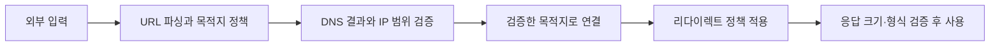

# SSRF와 아웃바운드 요청 검증

## 핵심 정의

서버 측 요청 위조(Server-Side Request Forgery, SSRF)는 외부 입력이 서버의 요청 목적지에 영향을 주어, 허용하지 않은 호스트·포트·프로토콜로 서버가 접근하게 되는 취약점이다. URL 미리보기, 원격 이미지 가져오기, 웹훅(Webhook), 문서 변환 등이 주요 검토 대상이다. 공격자는 서버의 네트워크 위치와 권한을 이용하므로 인바운드 방화벽만으로 막을 수 없다.

응답 본문을 사용자에게 반환하지 않는 블라인드 SSRF(blind SSRF)도 내부 요청·상태 변경·자원 소모를 유발할 수 있다. HTTP만의 문제도 아니며, 사용하는 라이브러리가 지원하는 다른 URI scheme이나 문서의 외부 리소스 로딩도 확인한다.

## 동작 원리 / 구조

### 목적지를 문자열에서 실제 연결까지 검증한다

사업자가 정한 몇 개 서비스만 호출한다면 사용자가 URL 전체를 보내는 대신 서버가 관리하는 목적지 ID를 받는 편이 단순하다. 임의의 인터넷 URL을 허용해야 한다면 더 넓은 공격 표면을 받아들이므로 별도 fetch worker·egress 제어와 함께 설계한다.

| 경계 | 확인할 내용 | 흔한 누락 |
|---|---|---|
| 파싱 | 유지보수되는 파서로 scheme·host·port를 분리하고 허용 정책 적용 | 문자열 prefix만 확인, 검증기와 HTTP client의 파싱 차이 |
| 이름 해석 | A·AAAA 결과 모두 검사하고 실제 연결 주소에도 정책 적용 | IPv4만 차단, DNS 검사 후 client가 다시 해석 |
| 리다이렉트 | 기본적으로 따라가지 않으며 필요하면 매 hop을 신규 목적지처럼 검사 | 첫 URL만 허용 목록과 비교 |
| 네트워크 | 전용 실행 환경에서 필요한 outbound 경로만 허용 | 앱 검증 오류가 내부 관리망 전체 접근으로 이어짐 |
| 응답 | 허용 형식과 크기·처리 예산을 제한하고 원본 응답을 그대로 노출하지 않음 | 내부 응답 노출, 큰 다운로드·문서 변환으로 자원 고갈 |

인터넷 전용 fetch 기능이라면 사설 주소뿐 아니라 loopback·link-local·IPv6·클라우드 메타데이터·조직 내부 대역을 포함한 목적지 정책이 필요하다. 단순 RFC 1918 차단만으로 충분하지 않다. 정당한 내부 호출은 별도 경로와 명시적인 허용 목록을 사용한다.

### DNS 검사와 연결 사이의 차이

도메인이 한 번 공인 IP로 해석되었다고 이후 연결도 그 주소로 간다는 보장은 없다. 검사 후 client의 재해석, 재시도, redirect가 다른 주소를 선택할 수 있다. 검증된 주소 집합으로 연결을 제한하는 resolver/client 통합 또는 목적지 정책을 강제하는 egress proxy가 필요하다. HTTPS에서는 원래 호스트의 SNI와 인증서 hostname 검증도 유지해야 하므로 URL을 IP로 치환하고 인증서 검증을 끄는 식으로 해결하지 않는다.

이는 특정 Java 메서드 하나로 해결되는 보장이 아니다. 실제 HTTP client·DNS·프록시 설정을 기준으로 연결 시 사용되는 주소까지 확인해야 한다.

### HTTP client의 redirect 정책은 목적지 허용 정책과 다르다

Java SE 25 `HttpClient`의 기본 redirect 정책은 `NEVER`다. `NORMAL`은 HTTPS에서 HTTP로 내려가는 redirect만 막으므로, 이름만 보고 허용 도메인·사설 IP까지 검사한다고 해석하면 안 된다. 자동 redirect를 끈 상태에서도 애플리케이션이 `Location`을 따라가면 새 요청에 같은 목적지 검증을 적용해야 한다. 원래 URI를 기준으로 상대 경로를 해석한 뒤 scheme·host·port·최종 연결 주소를 다시 확인한다.

프록시를 사용하는 client라면 애플리케이션이 연결한 peer는 프록시일 수 있다. Java SE 25 `HttpClient.Builder`는 별도 설정이 없으면 기본 `ProxySelector`를 사용하므로, client 설정과 실제 egress 경로를 함께 확인한다. 프록시 IP가 허용되었다는 사실로 프록시가 연결할 최종 목적지까지 허용된 것으로 보지 않는다.

### EC2 메타데이터 방어

EC2의 IMDSv2는 먼저 PUT으로 세션 토큰을 발급받아 메타데이터 요청 헤더에 넣는 방식을 사용한다. `HttpTokens=required`는 IMDSv1을 허용하지 않는 설정이다. IMDSv2는 일부 SSRF에 대한 추가 방어이며 임의의 메서드·헤더·응답 처리를 제어할 수 있는 SSRF까지 제거하는 것은 아니다.

메타데이터가 불필요한 실행 환경은 접근을 없애고, 필요한 워크로드는 최소 권한 IAM 역할과 네트워크 격리를 함께 적용한다. `HttpPutResponseHopLimit`은 토큰 PUT **응답**의 hop 제한이다. 컨테이너에서 1이면 응답을 받지 못할 수 있으므로 무조건 작은 값으로 바꾸기보다 네트워크 경로·자격증명 전달 방식을 먼저 확인한다.

## 실무 관점

- **입력 경로 목록화**: API 본문의 URL만 보지 말고 저장된 웹훅 주소, redirect 대상, 이미지·XML·PDF 내부 외부 참조까지 실제 네트워크 요청을 만드는 지점을 추적한다.
- **자격증명 분리**: 외부 URL fetch에 내부 서비스용 Authorization·쿠키·클라이언트 인증서를 재사용하지 않는다. 목적지가 바뀌는 redirect에서도 인증 정보가 넘어가지 않는지 client 동작을 확인한다.
- **운영 예산**: 다운로드·변환 워커에 동시성·전체 deadline·수신 바이트·압축 해제 후 크기 상한을 둔다. 구체 한도는 기능별 정상 데이터 분포를 기준으로 정하며 보안 검증을 timeout 하나로 대체하지 않는다.
- **관측**: 허용/거부된 목적지, 선택한 IP, redirect 횟수, 차단 사유를 민감한 query/token을 제거해 기록한다. 검증은 통제된 테스트 서버에서 수행하고 실제 내부 관리 API에 탐색 요청을 보내지 않는다.

## 심화 Q&A

### Q. CORS를 엄격하게 설정하면 SSRF도 막을 수 있는가?
A. CORS는 브라우저의 교차 출처 접근 정책이고 SSRF의 요청 주체는 서버다. 서버 HTTP client에는 브라우저의 CORS 검사가 적용되지 않으므로 목적지 검증과 outbound 통제가 별도로 필요하다.

### Q. 허용된 도메인인데도 내부 주소로 연결될 수 있는가?
A. DNS 응답 변경, 잘못된 내부 해석, 재해석 경합, 허용 도메인의 redirect 등으로 가능하다. 신뢰하는 도메인의 소유권뿐 아니라 연결 시점의 주소·redirect 정책을 확인한다. 도메인의 일부 문자열이 일치하는지만 검사하는 방식은 호스트 경계를 검증하지 못한다.

### Q. 웹훅 등록 때 검증했으면 발송할 때는 생략해도 되는가?
A. 등록 후 DNS·목적지 소유권·라우팅이 바뀔 수 있으므로 실제 발송과 재시도 때도 적용되는 통제가 필요하다. 목적지 관리 권한, 변경 감사, 발송 worker의 네트워크 권한을 함께 설계한다. 정상 고객의 내부망 웹훅 요구가 있다면 인터넷 fetch 정책에 예외 문자열을 추가하기보다 별도 연결·허용 정책으로 분리한다.

### Q. IMDSv2를 강제했는데 왜 IAM 최소 권한이 여전히 필요한가?
A. IMDSv2가 요청의 애플리케이션 업무 의도를 검증하지는 않는다. SSRF 외에도 코드 실행·자격증명 유출 경로가 있고, 메타데이터 접근에 성공했을 때 피해 범위는 역할 권한에 좌우된다. IMDS 설정과 [[클라우드 IAM 최소 권한 원칙]]은 서로 다른 방어 계층이다.

## 관련 개념

- [[OWASP Top 10]]
- [[DNS 조회 과정]]
- [[NAT와 방화벽 기초]]
- [[VPC 구조]]
- [[클라우드 IAM 최소 권한 원칙]]
- [[시크릿 관리]]
- [[XSS와 CSRF 방어]]

## 참고 자료

확인 날짜: 2026-09-22. OWASP의 방어 지침, CWE-918 정의, AWS EC2 IMDS 계약을 대조했다. 특정 HTTP client 구현의 완전한 검증 코드나 런타임 테스트 결과를 제시하는 노트는 아니다.

- [CWE-918](https://cwe.mitre.org/data/definitions/918.html) — CWE 4.20의 정의·신뢰 경계·영향.
- [OWASP API7:2023](https://owasp.org/API-Security/editions/2023/en/0xa7-server-side-request-forgery/) — fetch 격리·scheme/port 허용 목록·redirect·응답 노출 방어.
- [OWASP SSRF Prevention](https://cheatsheetseries.owasp.org/cheatsheets/Server_Side_Request_Forgery_Prevention_Cheat_Sheet.html) — 주소·도메인 검증, A/AAAA, DNS 변경과 네트워크 통제.
- [OWASP URL Parser 연구 자료](https://cheatsheetseries.owasp.org/assets/Server_Side_Request_Forgery_Prevention_Cheat_Sheet_Orange_Tsai_Talk.pdf) — 검증 후 재해석과 URL 파서 불일치의 원리.
- [AWS IMDS 사용](https://docs.aws.amazon.com/AWSEC2/latest/UserGuide/configuring-instance-metadata-service.html) — IMDSv2 세션 토큰과 요청 흐름.
- [AWS IMDS 옵션](https://docs.aws.amazon.com/AWSEC2/latest/UserGuide/configuring-instance-metadata-options.html) — HttpTokens와 PUT 응답 hop limit, 컨테이너 고려 사항.

부분 재검증: 2026-10-04. [Java SE 25 HttpClient.Redirect](https://docs.oracle.com/en/java/javase/25/docs/api/java.net.http/java/net/http/HttpClient.Redirect.html)와 [HttpClient.Builder](https://docs.oracle.com/en/java/javase/25/docs/api/java.net.http/java/net/http/HttpClient.Builder.html) — `NEVER` 기본값·`NORMAL`의 HTTPS→HTTP 예외·기본 ProxySelector를 확인했다. [OWASP API7:2023](https://owasp.org/API-Security/editions/2023/en/0xa7-server-side-request-forgery/)의 redirect 비활성화·목적지 검증과 연결한 적용 지침이다. 실제 프록시·DNS 경합·IPv6·메타데이터 접근 시험 및 기존 전체 주장은 재검증하지 않아 `verified`를 유지했다.

실행 확인: 2026-10-04, JDK 25.0.4에서 통제된 loopback HTTP 서버 두 개로 검증했다. 기본 정책은 302를 반환하고 목적지 호출 0회, `NORMAL`은 다른 포트로 redirect되어 목적지 호출 1회였다. 이 결과는 HTTP 자동 redirect의 포트 경계만 확인하며 HTTPS 하향 전환·프록시·DNS 재해석·IPv6·외부망 SSRF 방어를 검증한 것은 아니다.
