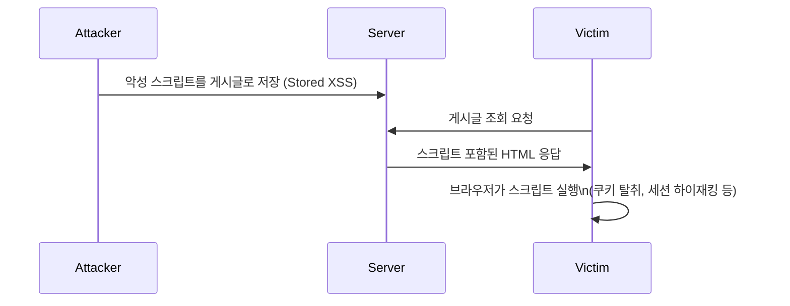
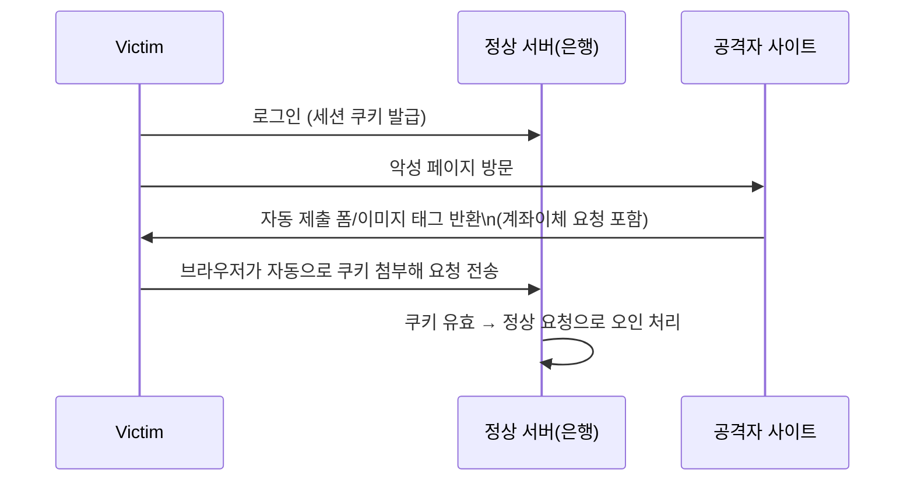

# XSS와 CSRF 방어

## 핵심 정의
XSS(Cross-Site Scripting)는 공격자가 삽입한 악성 스크립트가 다른 사용자의 브라우저에서 실행되는 취약점이고, CSRF(Cross-Site Request Forgery)는 사용자가 이미 인증된 상태를 악용해 사용자의 의지와 무관한 요청을 공격자가 강제로 발생시키는 취약점이다. 두 취약점 모두 "브라우저와 서버 간 신뢰 관계"를 악용하지만, XSS는 클라이언트 측에서 스크립트가 실행되는 문제이고 CSRF는 서버가 요청의 출처를 제대로 검증하지 못하는 문제라는 점에서 근본 원인과 방어 방법이 다르다.

## 동작 원리 / 구조

### XSS 유형과 흐름
| 유형 | 설명 |
|---|---|
| Stored XSS | 악성 스크립트가 DB 등에 저장되어, 조회하는 모든 사용자에게 실행됨(게시판 댓글 등) |
| Reflected XSS | URL 파라미터 등 요청값이 응답에 그대로 반영되어 즉시 실행됨(검색 결과 페이지 등) |
| DOM-based XSS | 데이터의 원천과 무관하게 클라이언트 JS가 `innerHTML` 등으로 DOM을 조작할 때 발생 |



### CSRF 흐름

CSRF는 브라우저가 domain·path·Secure·SameSite 정책에 따라 쿠키 등 자격 증명을 자동으로 첨부하는 특성을 악용한다. 서버 입장에서는 세션이 유효한 정상 사용자의 요청과 구분할 수 없다.

### XSS 방어
1. **출력 인코딩(Output Encoding)**: 사용자 입력을 HTML에 렌더링할 때 `<`, `>`, `&`, `"` 등을 엔티티로 치환. Thymeleaf `th:text`, JSP의 fn:escapeXml(comment)나 c:out 등은 HTML/XML 문맥에 맞는 이스케이프를 제공한다. JSP EL 자체가 자동으로 이스케이프하는 것은 아니다.
```html
<!-- Thymeleaf: th:text는 자동 이스케이프, th:utext는 이스케이프 안 함(위험) -->
<p th:text="${comment}"></p>   <!-- 안전 -->
<p th:utext="${comment}"></p>  <!-- 위험: HTML 그대로 렌더링 -->
```
2. **CSP(Content Security Policy)**: 스크립트 실행 출처를 화이트리스트로 제한해 인라인 스크립트 실행 자체를 차단.
```
Content-Security-Policy: default-src 'self'; script-src 'self' https://trusted-cdn.com
```
3. **입력 검증 + 신뢰할 수 있는 HTML Sanitizer 라이브러리**(OWASP Java HTML Sanitizer 등) 사용. 리치 텍스트 에디터처럼 일부 HTML 태그를 허용해야 하는 경우 필수.
4. **HttpOnly / Secure 쿠키 속성**: HttpOnly는 JavaScript의 쿠키 읽기를 막고 Secure는 HTTPS 전송을 제한한다. 두 속성의 역할이 다르며 XSS 실행 자체는 막지 않는다.

### CSRF 방어
1. **CSRF Token(Synchronizer Token Pattern)**: 서버가 세션마다 예측 불가능한 토큰을 발급하고, 상태 변경 요청(POST/PUT/DELETE)마다 해당 토큰을 함께 검증. 공격자는 피해자 세션의 토큰 값을 알 수 없으므로 위조 요청에 포함시킬 수 없다.
2. **SameSite 쿠키 속성**: Strict는 cross-site 전송을 크게 제한하고 Lax는 top-level safe navigation 등에 쿠키를 보낼 수 있다. same-site와 same-origin은 다르므로 하위 도메인 공격을 포함한 위협 모델에서 보조 방어로 사용한다.
```
Set-Cookie: JSESSIONID=abc123; HttpOnly; Secure; SameSite=Strict
```
3. **Custom Header 검증**: `X-Requested-With` 같은 커스텀 헤더는 단순 HTML 폼(`<form>`)으로는 위조 요청에 추가할 수 없으므로 CSRF 방어 보조 수단이 된다.

### Spring Security 기본 동작
Spring Security 기본 CSRF matcher는 GET·HEAD·TRACE·OPTIONS 이외의 메서드를 보호한다. JWT나 stateless라는 이름만으로 보호를 끄지 않는다. 브라우저가 자동 첨부하는 쿠키·HTTP Basic 등 다른 인증 경로가 없고, 신뢰하는 코드가 Authorization 헤더를 명시적으로 만드는 API인지 확인한 뒤 해당 경로에 한정해 설정한다.

HTML 본문용 escape는 JavaScript·CSS·URL·HTML 속성 문맥을 모두 보호하지 않는다. 문맥에 맞는 인코딩과 안전한 DOM API를 쓰고 허용 HTML에는 sanitizer를 적용한다. CSP는 보조 계층이며 nonce/hash 기반 정책을 우선 검토한다. Custom header 방식은 상태 변경 요청에 해당 헤더를 강제하고 허용 origin만 credential CORS를 사용할 때 효과가 있다.

## 실무 관점
- **클라이언트 측 CSRF(Client-side CSRF)**: 정상 JavaScript가 URL fragment·외부 메시지 등 공격자가 통제하는 입력으로 요청 경로·메서드를 만들면, 정상 CSRF 토큰과 인증 정보까지 붙여 원하지 않은 요청을 보낼 수 있다. 토큰·SameSite만으로 해결되지 않으므로 요청 조합에 쓰는 외부 입력을 제한하고 허용된 동작을 명시한다.
- **REST API + JWT 조합에서 CSRF를 꺼도 되는 이유와 전제 조건**: 해당 API가 신뢰하는 코드가 만든 `Authorization: Bearer` 헤더만 인증 수단으로 허용하고, 쿠키·HTTP Basic 등 자동 첨부 자격증명을 받아들이지 않는지 확인한다. 이 전제에서는 전형적인 브라우저 CSRF의 자동 인증 조건이 없다. JWT가 쿠키에 들어가거나 로그인·refresh·관리자 경로가 세션을 함께 사용하면 그 경로는 별도로 보호해야 한다. 토큰 이름만 보고 애플리케이션 전체에서 CSRF를 끄지 않는다.
- **프론트엔드 프레임워크(React, Vue)는 기본적으로 JSX/템플릿 바인딩 시 자동 이스케이프를 제공**하지만, `dangerouslySetInnerHTML`(React), `v-html`(Vue) 사용 시 이스케이프가 해제되므로 반드시 Sanitizer를 거쳐야 한다.
- CSRF 토큰의 세션 내 재사용은 synchronizer token의 정상 설계다. 인증 성공·로그아웃 등 보안 컨텍스트 변경 때 기존 토큰을 폐기/갱신하고 SPA가 새 토큰을 다시 얻도록 구성해야 한다.
- 흔한 실수: `SameSite=Lax`만 믿고 CSRF 토큰 검증을 완전히 제거하는 것. `Lax`는 최상위 GET 내비게이션(링크 클릭)에는 쿠키를 첨부하므로, GET 요청으로 상태를 변경하는 API(안전성 위반 설계)가 있다면 여전히 취약할 수 있다.
- CDN이나 CSP 리포트 엔드포인트(`report-uri`, `report-to`)를 활용해 실제 운영 환경에서 위반된 CSP 정책을 수집하면 XSS 시도를 조기에 탐지할 수 있다.
- 관련 사고 패턴: 관리자 페이지처럼 민감한 기능일수록 CSRF 방어를 소홀히 하는 경우가 많다(내부용이라 안전할 것이라는 오판). 내부 사용자도 피싱 링크를 클릭하면 동일하게 노출된다.

## 심화 Q&A

### Q. HttpOnly 쿠키는 XSS로부터 세션을 완전히 보호해주는가?
A. 아니다. HttpOnly는 JavaScript의 `document.cookie` 접근만 차단할 뿐, XSS로 스크립트가 실행되는 것 자체를 막지는 못한다. 공격자는 쿠키를 직접 훔치는 대신, 피해자의 브라우저 컨텍스트 안에서 스크립트를 실행시켜 임의의 API 요청을 대신 보내게 하거나(요청 자체를 쿠키 포함해서 발생시킴), 화면에 표시된 민감 정보를 탈취하는 방식으로 여전히 피해를 줄 수 있다. HttpOnly는 심층 방어의 한 층일 뿐 근본 대책(출력 인코딩, CSP)을 대체하지 않는다.

### Q. SameSite=Strict 쿠키만으로 CSRF 토큰 검증을 완전히 대체할 수 있는가?
A. 이론적으로는 크로스 사이트 요청에 쿠키가 전혀 첨부되지 않으므로 대부분의 CSRF 시나리오를 차단하지만, 구형 브라우저의 SameSite 미지원, 서브도메인 간 요청(같은 사이트로 취급되어 쿠키가 첨부되는 경우), 또는 쿠키가 아닌 다른 인증 수단(자동 로그인 URL 등)을 쓰는 레거시 시스템에서는 우회 가능성이 있다. 방어 심층화 관점에서 CSRF 토큰과 SameSite를 함께 쓰는 것이 권장된다.

### Q. Reflected XSS와 Stored XSS 중 어느 쪽이 더 위험하다고 평가되며, 그 근거는 무엇인가?
A. Stored XSS는 한 번 저장한 입력이 여러 사용자에게 반복 노출될 수 있어 피해 범위와 지속성이 커지기 쉽다. 그렇다고 Reflected XSS가 반드시 직접 링크 클릭을 요구하거나 피해가 더 작다는 뜻은 아니다. 조작된 폼 제출이나 공격자 사이트 방문에서 취약한 응답을 열게 하는 경로도 있다. 두 유형 모두 실행된 페이지의 권한으로 동작하므로, 저장 여부만으로 심각도를 정하지 않고 도달 가능한 사용자·관리자 권한·노출 데이터·실행 조건을 함께 평가한다.

### Q. CSP(Content Security Policy)를 `script-src 'unsafe-inline'`으로 설정하면 어떤 문제가 생기는가?
A. `unsafe-inline`을 허용하면 인라인 `<script>` 태그 실행이 허용되어, CSP가 막고자 하는 핵심 공격 벡터(주입된 인라인 스크립트 실행)를 그대로 열어두는 셈이 된다. Nonce(`script-src 'nonce-{random}'`)나 해시 기반 허용 방식을 사용해 서버가 발급한 신뢰할 수 있는 인라인 스크립트만 실행되도록 제한하는 것이 CSP 도입 취지에 맞다.

### Q. 모바일 앱이나 서버 간 통신(server-to-server)에서는 CSRF를 신경 쓰지 않아도 되는 이유는?
A. CSRF는 "브라우저가 쿠키를 자동으로 첨부하는 특성"을 전제로 성립하는 공격이다. 네이티브 모바일 앱이나 서버 간 API 호출은 브라우저의 쿠키 자동 첨부 메커니즘을 거치지 않고 명시적으로 인증 토큰을 구성해 전송하므로, 일반적인 브라우저 CSRF의 자동 자격 증명 전송 조건은 성립하지 않는다. 앱의 딥링크·WebView·외부 입력은 별도 평가한다. 다만 앱 내에 WebView를 임베드해 쿠키 기반 세션을 공유하는 하이브리드 구조라면 다시 CSRF 위협이 발생할 수 있다.

### Q. CORS(Cross-Origin Resource Sharing) 설정을 올바르게 하면 CSRF 방어도 자동으로 되는가?
A. 자동으로 보장되지는 않는다. 사전 요청(Preflight)이 필요한 cross-origin 요청은 사전 요청의 CORS 검사에 실패하면 본 요청이 전송되지 않지만, 단순 폼 요청 등은 사전 검사 없이 서버에 도달할 수 있다. 사전 검사가 성공한 뒤 본 응답의 CORS 검사만 실패할 수도 있으므로, 브라우저의 CORS 오류만으로 요청이 미전송됐다고 판단하지 않는다. API가 사용자 정의 헤더를 반드시 요구하고 신뢰하는 origin만 허용하면 preflight를 CSRF 방어에 활용할 수 있다. 이 경우에도 허용 origin의 탈취, 단순 요청을 받는 다른 경로, 클라이언트 측 CSRF는 별도로 검토한다.

## 관련 개념
- [[OWASP Top 10]]
- [[SQL Injection과 방어]]
- [[세션 기반 인증과 토큰 기반 인증 비교]]

## 참고 자료

- [OWASP Cross Site Scripting Prevention](https://cheatsheetseries.owasp.org/cheatsheets/Cross_Site_Scripting_Prevention_Cheat_Sheet.html) — 출력 문맥·sanitizer·안전한 sink. 확인: 2026-09-08.
- [OWASP Cross-Site Request Forgery Prevention](https://cheatsheetseries.owasp.org/cheatsheets/Cross-Site_Request_Forgery_Prevention_Cheat_Sheet.html) — SameSite·custom header·token·CORS. 확인: 2026-09-08.
- [Spring Security CSRF](https://docs.spring.io/spring-security/reference/servlet/exploits/csrf.html) — 7.x safe methods·token lifecycle·DSL. 확인: 2026-09-08.

부분 재검증: 2026-09-22. [Spring Security CSRF](https://docs.spring.io/spring-security/reference/servlet/exploits/csrf.html)와 [OWASP CSRF Prevention](https://cheatsheetseries.owasp.org/cheatsheets/Cross-Site_Request_Forgery_Prevention_Cheat_Sheet.html)의 자동 자격증명·로그인/로그아웃·custom header 방어 조건을 대조했다. 그 외 서술은 이번 확인 범위 밖이므로 `verified`는 유지했다.

부분 재검증: 2026-09-23. [OWASP CSRF Prevention](https://cheatsheetseries.owasp.org/cheatsheets/Cross-Site_Request_Forgery_Prevention_Cheat_Sheet.html)의 simple request·custom header/preflight·client-side CSRF 범위를 확인했다. CORS가 항상 응답 읽기에만 관여한다는 Q&A를 수정하고, 인증된 클라이언트 코드가 공격자 입력으로 요청을 조합하는 경계를 보완했다. 브라우저별 실행 시험은 하지 않았고 기존 전체 검증일은 유지했다.

- [Fetch Standard: HTTP fetch](https://fetch.spec.whatwg.org/#http-fetch) — 2026-09-23 확인. preflight 실패 시 조기 반환과 본 응답 CORS 검사를 구분한다.

부분 재검증: 2026-10-04. [OWASP XSS: Reflected/Stored와 Attack Consequences](https://community.owasp.org/attacks/xss/)의 전달 경로·실행 영향 구분을 대조해 Reflected에 직접 링크 클릭이 필수라는 설명을 정정하고 저장 여부 중심의 위험도 비교를 보완했다. 웹 보안 원리 범위이며 특정 브라우저·Spring API 버전의 전체 검증이 아니다. 실제 공격 페이지·브라우저 실행은 하지 않았고 기존 `verified`는 유지한다.
