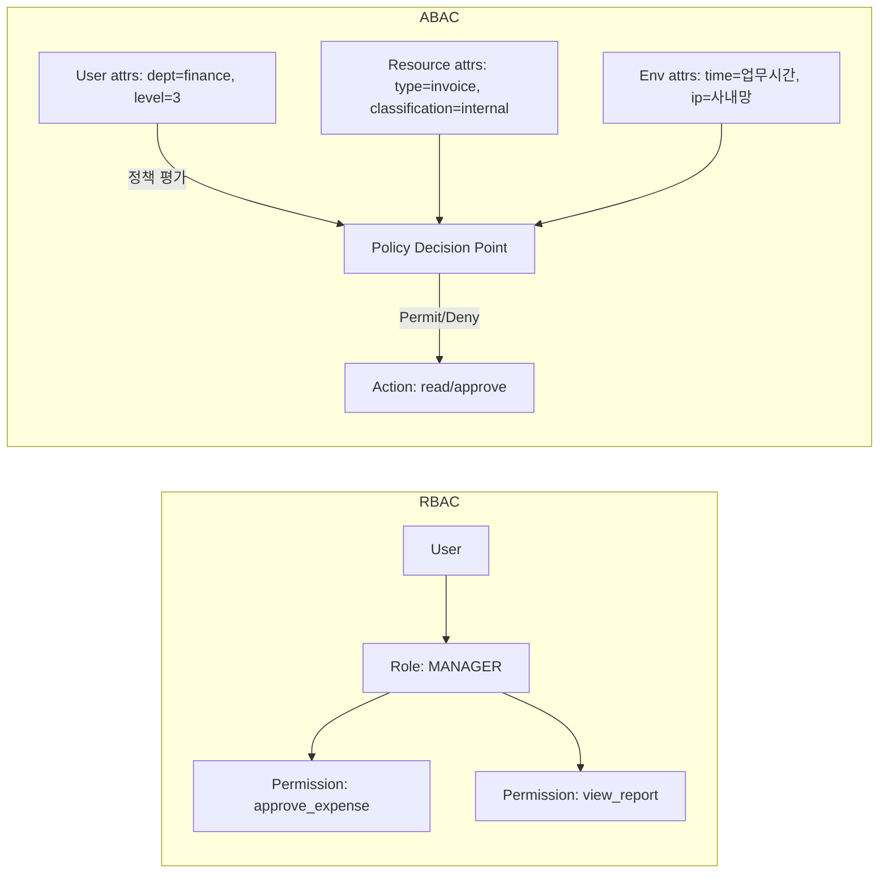

# RBAC와 ABAC 권한 모델

## 핵심 정의
RBAC(Role-Based Access Control, 역할 기반 접근 제어)는 사용자에게 역할(role)을 부여하고, 역할에 권한(permission)을 매핑해 "누가 무엇을 할 수 있는가"를 역할 단위로 관리하는 인가(authorization) 모델이다. 사용자-역할-권한이 다대다로 연결되는 비교적 단순한 구조라 구현과 감사(audit)가 쉽다.

ABAC(Attribute-Based Access Control, 속성 기반 접근 제어)는 사용자, 리소스, 환경(시간, IP, 디바이스 등)의 속성(attribute)을 조합한 정책(policy)으로 접근을 판단하는 모델이다. "부서가 재무팀이고, 문서 등급이 사내용 이하이고, 접속 시간이 업무 시간 이내면 허용" 같은 동적이고 세밀한 조건을 표현할 수 있다. 인증(authentication)과의 구분은 [[세션 기반 인증과 토큰 기반 인증 비교]]를 참고.

## 동작 원리 / 구조



RBAC는 보통 `User`, `Role`, `Permission`, 그리고 이들을 잇는 매핑 테이블(`user_role`, `role_permission`)로 모델링한다. Spring Security에서는 `GrantedAuthority`(역할/권한 문자열)를 `Authentication` 객체에 담고, `@PreAuthorize("hasRole('ADMIN')")` 또는 `.requestMatchers(...).hasRole("ADMIN")` 형태로 선언적으로 검사한다.

```java
@PreAuthorize("hasRole('MANAGER')")
public void approveExpense(Long expenseId) { ... }
```

ABAC는 규칙을 정책 엔진(Policy Decision Point, PDP)에 위임하는 구조가 일반적이다. 요청이 들어오면 PDP가 주체(subject)·자원(resource)·행위(action)·환경(environment) 속성을 모아 정책과 대조해 Permit/Deny를 반환한다. Spring Security에서는 `@PreAuthorize`의 SpEL 표현식에 커스텀 빈 메서드를 호출하는 방식으로 제한적 ABAC를 구현하거나, OPA(Open Policy Agent)/AWS Cedar 같은 외부 정책 엔진과 연동해 정책을 코드와 분리하기도 한다.

```java
@PreAuthorize("@expensePolicy.canApprove(authentication, #expenseId)")
public void approveExpense(Long expenseId) { ... }
```

```java
// ABAC 스타일 정책 평가 예시
public boolean canApprove(Authentication auth, Long expenseId) {
    UserAttributes user = attributeService.getUser(auth.getName());
    Expense expense = expenseRepository.findById(expenseId).orElseThrow();
    boolean sameDept = user.getDept() != null
            && user.getDept().equals(expense.getDept());
    boolean withinLimit = expense.getAmount() <= user.getApprovalLimit();
    LocalTime now = LocalTime.now(clock); // 정책 시간대의 Clock을 주입
    boolean businessHours = !now.isBefore(LocalTime.of(9, 0))
            && now.isBefore(LocalTime.of(18, 0));
    return sameDept && withinLimit && businessHours;
}
```

RBAC를 확장한 중간 형태로 RBAC에 계층(role hierarchy)을 두거나(ADMIN이 MANAGER 권한을 포함), 리소스 소유권 조건을 얹은 형태(예: "자신이 작성한 글만 수정 가능")를 실무에서는 흔히 "RBAC + ownership check"로 부르며, 이는 순수 RBAC와 ABAC의 중간 지점이다.

예제는 @EnableMethodSecurity와 expensePolicy 빈 등록, 인증된 주체를 전제로 한다. `#expenseId`처럼 이름으로 인자를 참조하려면 `-parameters` 컴파일이나 `@P("expenseId")` 등 이름을 제공하는 설정이 필요하며, 상세 조건은 [[Method Security와 CSRF 방어]]를 참고한다. 금액 비교는 동일 통화의 정수 최소 단위 등 명확한 타입을 사용한다. 인가 실패·속성 조회 오류는 기본 거부하고, 검사 후 실행 사이에 소유권·금액이 바뀌는 TOCTOU를 막으려면 동일 트랜잭션·잠금 또는 조건부 갱신을 사용한다. 테넌트 조건은 리소스 조회 단계에도 적용한다.

## 실무 관점
- **선택 기준**: 조직 구조가 비교적 고정적이고 권한 종류가 수십 개 이내면 RBAC로 충분하며 감사와 설명이 쉽다. 권한 조건이 리소스 상태·시간·위치 등 동적 변수에 따라 달라지면(멀티테넌시, 세밀한 데이터 접근 제어) ABAC가 필요해진다. 실무에서는 대부분 RBAC를 기본 골격으로 하고, 예외적인 세밀한 규칙만 ABAC 성격의 정책으로 얹는 하이브리드가 흔하다.
- **역할 폭발(Role Explosion)**: RBAC만으로 세밀한 조건(부서별+지역별+금액별 등)을 표현하려다 역할 조합이 기하급수적으로 늘어나는 문제가 생긴다. 역할 조합이 많아져 검토와 변경 추적이 어려워지면, 이 시점이 ABAC 도입을 검토할 신호다.
- **권한 캐싱과 지연 반영**: 권한 정보를 매 요청마다 DB에서 조회하면 비용이 크므로 캐싱(세션, 토큰 클레임, Redis 등)하는 경우가 많은데, 이 경우 권한 변경(강등, 계정 정지)이 즉시 반영되지 않는 문제가 생긴다. 캐시 TTL을 짧게 유지하거나 변경 시 강제 무효화(invalidate) 훅을 두어야 한다.
- **최소 권한 원칙(Principle of Least Privilege)**: 기본 역할에 필요 이상의 권한을 몰아주는 실수가 잦다. 특히 초기 개발 편의를 위해 ADMIN 역할을 테스트/운영 계정에 남겨두는 것이 흔한 사고 패턴이다.
- **감사 로그**: 인가 실패/성공 이력을 남기지 않으면 사고 발생 시 원인 추적이 불가능하다. 특히 ABAC처럼 판단 근거가 복잡한 모델일수록 "왜 허용/거부되었는지" 정책 평가 로그를 남기는 것이 중요하다.

### 정책 판단 결과를 캐시할 때의 경계

사용자의 역할 목록과 특정 요청의 `Permit` 결과는 다른 데이터다. 전자는 같아도 테넌트·대상 리소스·행위·소유권·환경 속성이 달라지면 후자는 달라질 수 있다. 사용자 ID만으로 허용 결과를 캐시하면 한 문서의 조회 허용이 다른 테넌트 문서의 수정 권한으로 재사용될 수 있다.

- 판단 결과를 캐시한다면 정책이 실제 읽는 주체·리소스·행위·환경과 정책 버전이 캐시의 구분 및 무효화 조건에 반영되어야 한다. 시간 조건은 캐시 TTL이 업무 시간 종료 등 다음 정책 경계를 넘지 않게 한다.
- 계정 정지뿐 아니라 문서 소유권·등급·테넌트 변경도 기존 허용 결과를 무효화할 수 있다. 즉시 철회가 필요한 작업은 오래된 캐시의 허용 결과에 의존하지 않는다.
- 정책을 평가하는 PDP와 결과를 강제하는 정책 집행 지점(Policy Enforcement Point, PEP)을 구분한다. 단건 API에만 검사를 붙이고 검색·내보내기·일괄 처리 경로를 빠뜨리면 정책이 있어도 우회된다. 목록의 각 항목도 요청자가 볼 수 있는 범위로 제한한다.
- 정책·속성 조회 실패를 허용으로 처리하지 않는다. 거부와 조회 장애는 감사·운영 지표에서 구별하되, 필요한 인가 판단을 얻지 못한 작업은 실행하지 않는다.

이 캐시 설계는 OWASP의 모든 요청에 대한 서버 측 인가·기본 거부 원칙을 적용한 판단 기준이다. 외부 정책 엔진이 캐시 무효화를 자동으로 보장한다는 의미는 아니다.

## 심화 Q&A

### Q. RBAC로 시작한 시스템이 시간이 지나면서 ABAC적 요구가 생기는 전형적인 패턴은 무엇인가?
A. 초기에는 "관리자/일반 사용자"처럼 역할이 단순하지만, 조직이 커지면서 "본인 부서 데이터만", "특정 금액 이하만 승인", "업무 시간에만 접근" 같은 조건이 하나씩 추가된다. 이를 역할로 표현하려 하면 역할 수가 부서 × 금액 구간 × 시간대 조합만큼 늘어나는 역할 폭발이 발생한다. 이 시점에 조건부 규칙을 역할이 아니라 속성 기반 정책으로 분리하는 것이 유지보수성을 살린다.

### Q. 역할 계층(Role Hierarchy)을 도입할 때 주의할 점은?
A. ADMIN이 MANAGER의 모든 권한을 자동으로 포함하도록 계층을 두면 역할 수는 줄지만, 하위 역할에 권한을 추가할 때 그 역할을 포함하는 상위 역할에도 의도치 않게 전파되거나, 반대로 특정 하위 권한만 상위에서 제외하고 싶은 예외 상황을 표현하기 어려워진다. 계층이 깊어질수록 실제로 어떤 역할이 어떤 권한을 갖는지 추적하기 어려워지므로, 계층은 얕게 유지하고 세밀한 예외는 별도 정책으로 처리하는 것이 안전하다.

### Q. ABAC 정책 평가를 애플리케이션 코드에 흩어 두는 것과 외부 정책 엔진(OPA 등)으로 분리하는 것의 트레이드오프는?
A. 코드에 흩어 두면 초기 구현이 빠르고 별도 인프라가 필요 없지만, 정책이 늘어날수록 여러 서비스에 동일한 규칙이 중복되고 변경 시 배포가 필요해 감사·일관성 확보가 어려워진다. 외부 정책 엔진으로 분리하면 정책을 선언적으로 한 곳에서 관리하고 무중단으로 갱신할 수 있지만, 네트워크 호출 지연(PDP 조회)과 별도 운영 부담이 추가된다. 정책 수가 적고 변경이 드물면 코드 내 구현, 정책이 자주 바뀌고 여러 서비스가 공유해야 하면 외부 엔진이 유리하다.

### Q. RBAC 환경에서 권한 상승(privilege escalation) 취약점이 흔히 발생하는 지점은 어디인가?
A. 프런트엔드에서만 역할별 UI를 숨기고 서버 API 엔드포인트에는 역할 검사를 누락하는 경우, 클라이언트가 요청을 직접 조작해 권한 없는 API를 호출할 수 있다. 또한 역할을 클라이언트가 보낸 요청 파라미터(JWT 클레임 등)에서 그대로 신뢰하고 서버 측 재검증을 생략하면, 토큰을 조작해 역할을 위조하는 공격에 노출된다. 모든 인가 판단은 반드시 서버 측에서, 신뢰할 수 있는 소스(DB 조회 또는 서명 검증된 클레임)로 수행해야 한다.

### Q. 멀티테넌시(multi-tenancy) 환경에서 RBAC만으로는 부족한 이유는?
A. RBAC는 "이 역할이 이 종류의 리소스에 접근 가능한가"는 표현하지만 "어느 테넌트(조직/고객사) 소속 리소스인가"까지는 자연스럽게 표현하지 못한다. 테넌트 ID를 속성으로 취급해 "요청자의 테넌트와 리소스의 테넌트가 일치해야 한다"는 조건을 ABAC 스타일로 추가해야, 같은 MANAGER 역할이라도 다른 테넌트의 데이터에는 접근하지 못하게 막을 수 있다.

### Q. 권한 변경을 즉시 반영해야 하는 요구사항과 성능(캐싱) 요구사항이 충돌할 때 어떻게 절충하는가?
A. 매 요청마다 DB에서 권한을 조회하면 정확하지만 지연시간과 DB 부하가 커지고, 캐시나 토큰 클레임에 권한을 굳혀두면 빠르지만 변경 반영이 늦다. 일반적인 절충안은 민감한 작업(결제 승인, 계정 정지 해제 등)만 실시간 DB 조회로 재검증하고, 나머지 일반 요청은 짧은 TTL 캐시나 짧은 만료의 토큰 클레임을 신뢰하는 이원화 전략이다.

## 관련 개념
- [[세션 기반 인증과 토큰 기반 인증 비교]]
- [[Security Filter Chain]]
- [[SSO와 SAML과 OIDC]]
- [[JWT 인증]]

## 참고 자료

- [OWASP Authorization](https://cheatsheetseries.owasp.org/cheatsheets/Authorization_Cheat_Sheet.html) — deny-by-default·모든 요청 검사·속성/객체 접근제어. 확인: 2026-09-08.
- [Spring Security Method Security](https://docs.spring.io/spring-security/reference/servlet/authorization/method-security.html) — 7.x @EnableMethodSecurity·hasRole·SpEL. 확인: 2026-09-08.

부분 재확인: 2026-09-23. [OWASP Authorization Cheat Sheet](https://cheatsheetseries.owasp.org/cheatsheets/Authorization_Cheat_Sheet.html)의 모든 요청·객체에 대한 검사, 기본 거부, 안전한 실패 범위를 확인해 정책 판단 캐시와 집행 경로를 보강했다. 캐시 키·정책 버전·시간 경계는 이 원칙을 적용한 설계 제안이며, Spring Security API와 나머지 기존 설명을 모두 재검증한 것은 아니므로 `verified`는 유지한다.

부분 재검증: 2026-10-04. [Spring Security 7.1.1 Method Security: Using Method Parameters](https://docs.spring.io/spring-security/reference/servlet/authorization/method-security.html#using_method_parameters)의 `@P`·컴파일 파라미터 이름 사용 전제를 확인했다. 예제의 속성 조회·정책·TOCTOU를 실행한 검증은 아니며 이름 해석 실행 결과는 연결된 대표 노트에 둔다. 나머지 모델 설명의 `verified`는 유지한다.
