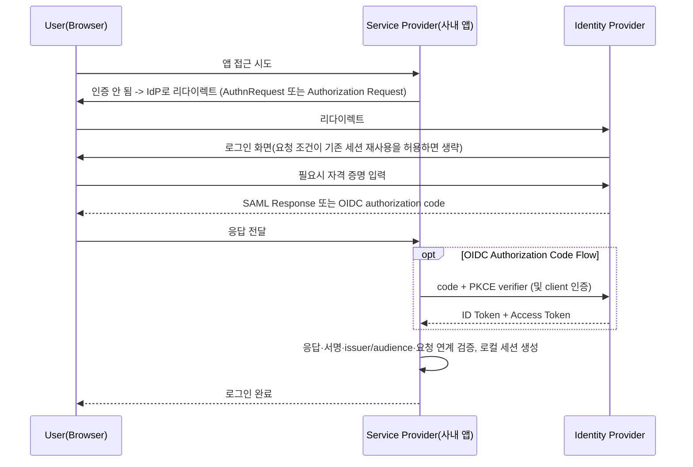

# SSO와 SAML과 OIDC

## 핵심 정의
SSO(Single Sign-On, 싱글 사인온)는 사용자가 하나의 자격 증명으로 한 번만 로그인하면 신뢰 관계로 연결된 여러 애플리케이션(서비스 제공자, Service Provider/SP)에 별도 로그인 없이 접근할 수 있게 하는 인증 모델이다. 이를 실제로 구현하는 표준 프로토콜이 SAML과 OIDC이며, 둘 다 하나의 신원 제공자(Identity Provider, IdP)가 여러 서비스 제공자에게 인증 결과를 전달하는 연합 인증(federated authentication) 구조를 취한다.

SAML(Security Assertion Markup Language) 2.0은 2005년 확정된 XML 기반 표준으로, IdP가 서명된 XML 문서(Assertion)를 브라우저를 통해 SP에 전달하는 방식이다. OIDC(OpenID Connect)는 OAuth 2.0 위에 얹은 JSON 기반 인증 표준으로, IdP가 서명된 JWT 형태의 `id_token`을 발급한다. OAuth2/OIDC의 위임 인가 관점 세부 동작은 [[OAuth2와 소셜 로그인]]을 참고하고, 이 노트는 기업 환경의 SSO 연합 인증 관점에 집중한다.

## 동작 원리 / 구조



| 구분 | SAML 2.0 | OIDC |
|---|---|---|
| 포맷 | XML (서명된 Assertion, base64 인코딩) | JSON (JWT 형태 id_token) |
| 기반 프로토콜 | 독자 표준 | OAuth 2.0 확장 |
| 전송 방식 | 브라우저 리다이렉트/POST 바인딩 | HTTP redirect + REST(token endpoint) |
| 토큰/메타데이터 크기 | 상대적으로 큼(수 KB XML) | claim·서명 크기에 따라 달라짐 |
| 키/메타데이터 갱신 | IdP 메타데이터 XML에 인증서를 등록, 신뢰하는 메타데이터 갱신과 키 overlap 필요; 자동화 가능 | JWKS 엔드포인트에서 공개키를 동적으로 조회, 자동 회전에 유리 |
| 모바일/SPA 지원 | 브라우저 SSO 중심; 모바일은 외부 브라우저·broker 통합 필요 | Authorization Code + PKCE로 자연스럽게 지원 |
| 대표 사용처 | 레거시 엔터프라이즈 IdP, 규제 산업, B2B 연합 | 신규 서비스, 모바일 앱, API, SPA |

프로토콜 선택은 연동할 IdP, 고객의 지원 요구, 기존 인증 체계에 따른다. 실무에서 SP를 만들 때는 특정 프로토콜에 종속되지 않도록 Spring Security의 `saml2Login()`과 `oauth2Login()`처럼 프로토콜을 추상화한 설정 계층을 쓰는 것이 일반적이다.

```yaml
# Spring Security SAML2 SP 설정 예시
spring:
  security:
    saml2:
      relyingparty:
        registration:
          okta:
            assertingparty:
              entity-id: https://idp.example.com/saml/metadata
              singlesignon:
                url: https://idp.example.com/saml/sso
                sign-request: true
              verification:
                credentials:
                  - certificate-location: classpath:idp-cert.crt
            signing:
              credentials:
                - private-key-location: classpath:sp-private-key.pem
                  certificate-location: classpath:sp-certificate.crt
```

서명 검증만으로 로그인 응답을 수락하지 않는다. OIDC는 issuer·audience·exp와 요청의 state/nonce 및 PKCE를 사용 흐름에 맞게 검증한다. SAML은 신뢰하는 IdP 서명, Destination/Recipient, Audience, 시간 조건, InResponseTo와 assertion 재사용 차단을 확인한다. YAML은 키/인증서 파일을 실제 제공해야 하는 SP 설정 발췌다.

## 실무 관점
- **SCIM과 세트로 도입**: 로그인만 연합하고 사용자 생성/삭제/역할 변경을 수동으로 관리하면 퇴사자 계정이 SP마다 남아있는 사고로 이어진다. 엔터프라이즈 SSO는 실무적으로 SAML/OIDC(인증) + SCIM(사용자 생명주기 동기화) + MFA/감사 로그(컴플라이언스)를 함께 갖추는 것이 표준 요구사항이다.
- **인증서 롤오버 장애**: SAML은 IdP 서명 인증서가 만료되기 전에 새 인증서를 메타데이터에 겹쳐서(overlap window) 배포하고, 모든 SP가 새 인증서를 갱신해야 한다. 이 절차를 누락하면 특정 시점에 다수 SP의 SSO가 동시에 끊기는 장애가 발생한다. OIDC는 JWKS 엔드포인트를 통해 키 ID(kid) 기반으로 클라이언트가 자동으로 새 키를 가져오므로 이런 수동 롤오버 부담이 적다.
- **XML 서명 취약점**: SAML 구현체에서 XML Signature Wrapping, XML 엔티티 확장(XXE) 같은 취약점이 반복적으로 보고되어 왔다. 직접 파서를 구현하기보다 검증된 라이브러리(Spring Security SAML2, OpenSAML 등)를 최신 버전으로 유지하는 것이 중요하다.
- **리다이렉트 URI/ACS URL 불일치**: OIDC의 redirect_uri, SAML의 Assertion Consumer Service(ACS) URL이 IdP에 등록된 값과 정확히 일치하지 않으면 로그인이 실패한다. 로컬(http)과 운영(https) 환경 값을 혼용하는 실수가 흔하다.
- **선택 기준**: 신규 서비스이고 모바일/API 지원이 필요하면 OIDC를 기본으로 하고, 고객사가 사내 IdP(ADFS, 레거시 Okta/PingFederate 구성 등)로 SAML만 지원한다면 SP 쪽에서 SAML도 함께 구현해야 하는 경우가 많다. 두 프로토콜 모두 지원하되 내부 세션/토큰 모델은 통일하는 것이 유지보수에 유리하다.

### OIDC 계정 연결의 식별자

OIDC Core 1.0 errata set 2에서 사용자를 안정적으로 구별하는 기준은 검증된 `iss`와 `sub`의 조합이다. `sub`는 발급자 내부에서 유일하며 다른 사용자에게 재할당되지 않지만, 다른 IdP의 같은 문자열까지 같은 사용자를 뜻하지 않는다. 이메일과 `preferred_username`은 유일성·불변성이 보장되지 않는다.

따라서 이메일이 같다는 이유로 신규 연합 계정을 기존 관리자 계정에 자동 연결하지 않는다. `email_verified=true`도 해당 IdP가 검증 시점의 이메일 제어권을 확인했다는 뜻이지, 다른 IdP 계정과 동일인이라는 보장은 아니다. 로컬 계정과 연합 신원의 매핑을 따로 보관하고, 계정 연결에는 기존 계정 소유 확인이나 신뢰한 조직의 별도 연결 절차를 둔다.

UserInfo를 추가로 조회했다면 응답의 `sub`가 이미 검증한 ID Token의 `sub`와 정확히 같은지 확인해야 한다. 불일치한 프로필을 로그인 사용자에게 붙여서는 안 된다. Pairwise subject identifier를 쓰는 IdP에서는 같은 사람도 클라이언트의 sector에 따라 다른 `sub`를 받을 수 있으므로, 서비스 간 계정 병합을 `sub` 문자열 비교만으로 구현하지 않는다.

### 최근에 발급한 토큰과 최근의 사용자 인증은 다르다

민감한 작업에서 최근 재인증을 요구한다면 ID Token의 발급 시각인 `iat`만 보지 않는다. OIDC Core 1.0 errata set 2의 `auth_time`은 사용자가 실제 인증한 시각이다. Refresh Token으로 새 ID Token을 받으면 `iat`는 새 발급 시각이지만, 포함된 `auth_time`은 원래 인증 시각이어야 한다. 토큰 갱신 성공을 사용자가 방금 재인증했다는 증거로 취급하지 않는다.

허용 인증 경과 시간을 `max_age`로 요청하면 반환 ID Token에 `auth_time`이 포함되어야 한다. 클라이언트는 기존 ID Token 검증에 더해 이 값을 자신의 재인증 정책과 대조한다. 로그인 화면을 거쳤다는 UI 흐름이나 로컬 세션 생성 시각만으로 최근 인증 조건을 충족했다고 판단하지 않는다. 재인증의 신선도와 MFA 등 인증 강도는 별도 조건이므로, 후자가 필요하면 IdP와 합의한 인증 컨텍스트도 검증한다.

## 심화 Q&A

### Q. SAML과 OIDC 중 하나가 기술적으로 완전히 대체하지 못하고 공존하는 이유는?
A. 기술적 우위와 별개로 이미 구축된 설치 기반(installed base)이 크기 때문이다. 대기업과 공공기관, 고등교육 연합 인증망 다수가 SAML 기반으로 이미 운영 중이고 이를 교체하는 비용이 크다. 반면 모바일/API/SPA 같은 신규 아키텍처는 SAML이 구조적으로 대응하기 어려워 OIDC Authorization Code + PKCE가 표준화된 선택지다. 결과적으로 B2B SaaS는 두 프로토콜을 모두 지원해야 시장을 놓치지 않는 상황이 된다.

### Q. SAML 기반 SSO에서 인증서 만료 시 흔히 발생하는 장애 패턴과 예방법은?
A. IdP가 서명 키를 바꿨는데 SP가 새 키를 신뢰하지 않으면 로그인이 실패한다. SAML 메타데이터의 인증서를 공개 웹 PKI 인증서처럼 만료일만으로 검증하는지는 구현 정책에 달려 있어 만료 즉시 전부 실패한다고 일반화하지 않는다. 메타데이터 신뢰·유효기간·자동 갱신과 구/신 키 overlap을 함께 관리한다.

### Q. OIDC의 JWKS 기반 키 회전이 SAML의 인증서 롤오버보다 운영 부담이 적은 이유는?
A. OIDC discovery의 신뢰하는 issuer에서 jwks_uri를 얻고 키를 캐싱해 검증한다. 매 요청마다 원격 JWKS를 가져오는 것이 아니며 unknown kid 재조회에도 제한이 필요하다. 구/신 키 겹침, 캐시 만료, endpoint 장애를 고려해야 한다. SAML도 서명된 메타데이터의 안전한 자동 갱신을 지원하므로 수동 대 자동이라는 이분법은 부정확하다.

### Q. SSO를 도입하면서 SCIM 없이 로그인 연합만 구현하면 어떤 문제가 남는가?
A. 로그인은 IdP를 통해 위임되지만 각 SP 내부의 사용자 계정 자체는 별도로 관리되므로, IdP에서 계정을 비활성화(퇴사 처리)해도 SP에 남아있는 로컬 세션이나 발급된 장기 토큰이 즉시 무효화되지 않을 수 있다. SCIM 등의 provisioning으로 계정 상태를 동기화하고 SP가 세션·토큰을 별도로 폐기해야 한다. SCIM 전송만으로 즉시 전역 로그아웃이 보장되지는 않는다.

### Q. SAML Assertion 검증에서 SP가 반드시 확인해야 할 항목은 무엇이며, 누락 시 어떤 공격에 노출되는가?
A. 서명(Signature) 유효성, Assertion의 유효 기간(NotBefore/NotOnOrAfter), 수신 대상(Audience), 응답 대상 SP의 엔티티 ID 일치 여부를 반드시 검증해야 한다. 이 중 하나라도 누락하면, 예를 들어 Audience 검증을 생략하면 다른 SP를 위해 발급된 정상 서명 Assertion을 재사용하는 공격(Assertion 재전송)에 노출될 수 있다.

### Q. OIDC의 `id_token`을 리소스 접근에 그대로 사용하면 안 되는 이유는 무엇이며 SAML과 비교해 어떤 개념적 차이를 보여주는가?
A. `id_token`은 "이 사용자가 인증되었다"는 신원 증명이지 리소스 접근 권한을 위임하는 토큰이 아니다. 리소스 접근에는 별도의 `access_token`을 사용해야 한다. 이는 OIDC가 인증(신원 증명)과 인가(자원 접근 위임)를 명확히 분리한 설계이며, SAML은 Assertion 하나가 신원 정보와 속성(attribute)을 동시에 담아 SP가 이를 인가 판단에도 재사용하는 경우가 많다는 점에서 설계 철학의 차이를 보여준다.

### Q. 모바일 애플리케이션에 SAML을 그대로 적용하기 어려운 이유는?
A. SAML Web Browser SSO는 브라우저 중심 프로파일이라 모바일 앱에는 broker나 서버 측 세션 교환 같은 통합이 필요하다. 임베디드 WebView가 필수인 것은 아니다. OIDC/OAuth 네이티브 앱에서는 RFC 8252에 따라 외부 브라우저와 Authorization Code + PKCE를 사용해 앱이 사용자 자격 증명을 직접 다루지 않도록 한다.

## 관련 개념
- [[OAuth2와 소셜 로그인]]
- [[JWT 인증]]
- [[RBAC와 ABAC 권한 모델]]
- [[TLS Handshake 과정]]

## 참고 자료

- [OIDC Core 1.0 errata set 2](https://openid.net/specs/openid-connect-core-1_0.html) — code flow·ID token 검증. 확인: 2026-09-08.
- [RFC 9700: OAuth Security BCP](https://www.rfc-editor.org/rfc/rfc9700.html) — code·PKCE·redirect URI·CSRF. 확인: 2026-09-08.
- [RFC 8252: OAuth for Native Apps](https://www.rfc-editor.org/rfc/rfc8252.html) — 외부 사용자 에이전트. 확인: 2026-09-08.
- [OWASP SAML Security](https://cheatsheetseries.owasp.org/cheatsheets/SAML_Security_Cheat_Sheet.html) — 서명·Audience·Recipient·InResponseTo·재생 검증. 확인: 2026-09-08.
- [Spring Security SAML2 Login](https://docs.spring.io/spring-security/reference/servlet/saml2/login/overview.html) — SP 자격증명과 메타데이터. 확인: 2026-09-08.

부분 재확인: 2026-09-23. [OIDC Core 1.0 errata set 2](https://openid.net/specs/openid-connect-core-1_0.html) — §5.1·§5.7의 이메일과 iss/sub 식별자, §5.3.2의 UserInfo sub 일치, §8.1의 pairwise sector를 확인했다. 계정 연결 절차는 이 신원 계약을 적용한 설계 기준이다. 기존 SAML·Spring 설정 전체는 재검증하지 않아 `verified`는 유지한다.

부분 재검증: 2026-10-04. [OIDC Core 1.0 errata set 2](https://openid.net/specs/openid-connect-core-1_0.html)의 §2 auth_time·acr, §3.1.2.1 max_age, §3.1.3.7 auth_time 확인, §12.2 refresh 후 iat/auth_time 의미를 대조했다. 적용 범위는 OIDC 재인증 계약이며 실제 IdP·MFA·Spring 로그인 흐름은 실행하지 않았다. 기존 SAML·키 회전 설명 전체를 재검증한 것은 아니므로 `verified`는 유지했다.
