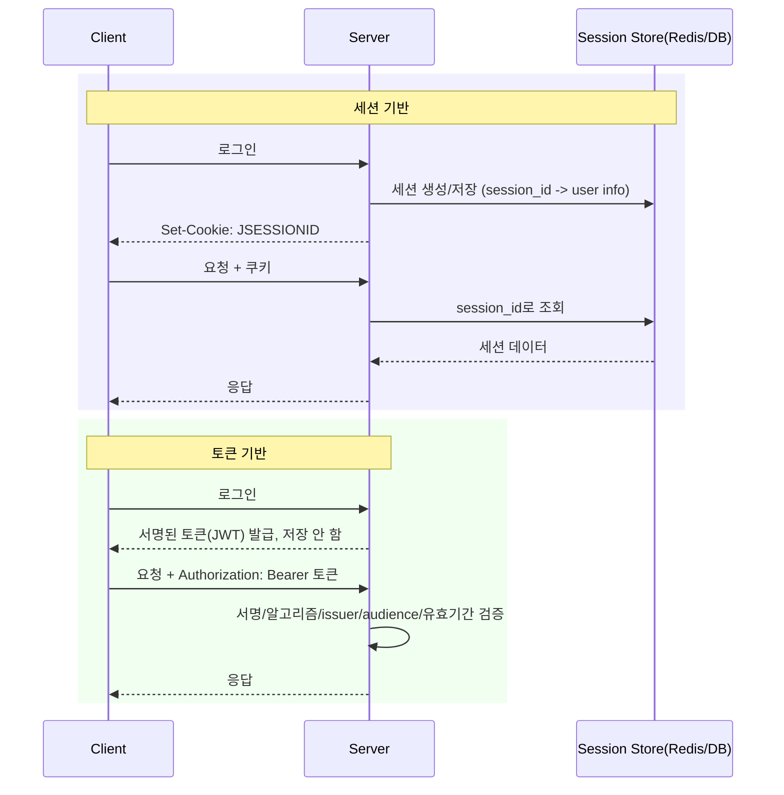

# 세션 기반 인증과 토큰 기반 인증 비교

## 핵심 정의
세션 기반 인증(session-based authentication)은 로그인 성공 시 서버가 세션 상태를 자체 저장소(메모리, DB, Redis 등)에 보관하고, 클라이언트에는 그 세션을 가리키는 식별자(session ID)만 쿠키로 내려주는 방식이다. 서버가 매 요청마다 세션 저장소를 조회해 인증 상태를 판단하므로 stateful하다.

토큰에는 서버 조회가 필요한 opaque token과 자기 포함형 토큰이 있다. 이 노트가 비교하는 JWT 기반 인증은 인증 정보(클레임)를 서버가 서명한 토큰(대표적으로 JWT) 자체에 담아 클라이언트에 내려주고, 서버는 요청마다 저장소 조회 없이 서명과 issuer·audience·유효기간·알고리즘 정책 등을 검증하는 방식이다. 이 노트는 두 방식의 구조적 차이와 선택 기준에 집중하며, JWT 자체의 세부 동작은 [[JWT 인증]]을 참고한다.

## 동작 원리 / 구조

핵심 차이는 "인증 상태를 어디에 두는가"이다.

| 구분 | 세션 기반 | 토큰 기반(JWT) |
|---|---|---|
| 상태 위치 | 서버(저장소) | 클라이언트(토큰 자체) |
| 서버 확장 | 세션 클러스터링/공유 필요(Sticky Session 또는 외부 저장소) | 저장소 없이 수평 확장 용이 |
| 후속 요청 차단 | 세션 삭제 후 조회 경로에서 차단; 캐시·복제 지연·진행 중 요청은 별도 | 자기 완결적이라 즉시 무효화가 구조적으로 어려움 |
| 요청당 비용 | 저장소 조회(네트워크 I/O) | 암호학적·클레임 검증; 키 갱신/폐기 조회 추가 가능 |
| 페이로드 크기 | 쿠키에는 ID만, 가벼움 | 클레임이 커질수록 토큰 자체가 커짐 |
| CSRF 노출 | 쿠키 자동 전송이라 CSRF 대상이 됨 | 헤더 전송 시 CSRF 노출 적음(쿠키 저장 시는 동일하게 노출) |
| 멀티 디바이스/앱 연동 | 쿠키 사용 시 domain 정책 적용; 네이티브 앱에도 구현 가능 | 헤더 기반이라 모바일/SPA/서버 간 호출에 자연스러움 |

Spring Session을 쓰면 세션 데이터를 Redis 등 외부 저장소로 위임해, 세션 기반 인증도 다중 인스턴스 환경에서 무상태 서버처럼 확장할 수 있다. 즉 "세션이냐 토큰이냐"는 이분법이라기보다 "인증 상태 조회 비용을 어디서(저장소 I/O vs CPU 서명 검증) 지불하느냐"의 트레이드오프에 가깝다.

Refresh Token을 폐기해도 이미 발급된 JWT Access Token은 보통 exp까지 유효하다. 즉시 차단에는 introspection·denylist·계정/권한 버전 조회 등 상태 확인이 필요하다. 세션 삭제 역시 캐시·복제·진행 중 요청의 경계에서는 즉시 전역 취소가 아닐 수 있다. 세션 ID도 bearer token의 한 형태이며 저장 형식과 전송 방식은 별도 설계 축이다.

## 실무 관점
- **모놀리스/서버 렌더링 위주** 서비스는 세션 기반이 여전히 단순하고 안전하다. 강제 로그아웃, 동시 로그인 제한, 관리자 강제 차단 같은 요구사항을 별도 인프라 없이 저장소 삭제만으로 구현할 수 있다.
- **마이크로서비스/모바일 API/서드파티 연동**은 토큰 기반이 유리하다. 여러 서비스가 각자 세션 저장소를 조회하지 않고 공개키만으로 검증할 수 있어 서비스 간 결합도가 낮아진다.
- **Sticky Session의 함정**: 세션 기반을 로드밸런서 Sticky Session만으로 확장하면 특정 인스턴스 장애 시 그 인스턴스에 붙어있던 사용자 전원이 로그아웃되는 장애로 이어진다. Redis 등 외부 세션 저장소를 두는 것이 표준이다.
- **하이브리드 패턴**: Access Token은 JWT로 짧게, 세션/Refresh Token 상태는 서버(Redis)에 저장해 새 access token 발급을 통제하는 방식이 실무에서 널리 쓰인다. 완전한 무상태의 이점을 일부 포기하는 대신 운영 통제력을 확보하는 절충안이다.
- **흔한 실수**: 토큰 기반으로 전환하면서 만료된 세션 개념을 그대로 토큰에 적용해 "로그아웃 버튼을 눌러도 토큰이 계속 유효한" 상태를 방치하는 것, 세션 기반에서 세션 고정(session fixation) 공격을 막기 위해 로그인 성공 시 세션 ID를 재발급하지 않는 것.

### 유휴 만료·절대 만료·쿠키 수명을 구분한다

유휴 시간 제한(idle timeout)은 마지막 요청 이후의 비활성 시간을 제한한다. 탈취한 세션으로 공격자가 주기적으로 요청하거나 백그라운드 요청이 계속 발생하면 유휴 만료만으로 세션 수명을 제한할 수 없다. 절대 시간 제한(absolute timeout)은 활동 여부와 관계없이 최초 세션 생성부터의 최대 수명을 제한한다. 세션 ID 회전은 식별자 노출 기간을 줄이는 별도 장치이므로, 회전할 때마다 원래의 절대 만료 기준을 무조건 초기화하지 않는다.

쿠키의 `Max-Age`·`Expires`나 프런트엔드의 로그아웃 타이머만으로 서버의 만료 검사를 대신하지 않는다. 브라우저에서 쿠키가 사라져도 복사된 식별자를 직접 보내는 요청은 가능하므로 서버가 만료된 세션을 거부해야 한다. 만료 기준과 갱신 조건은 저장소 TTL뿐 아니라 실제 인증 경로에서 확인하고, 수치는 업무 위험과 사용 흐름에 맞춰 정한다.

## 심화 Q&A

### Q. 세션 기반 인증에서 세션 고정(session fixation) 공격은 무엇이고 어떻게 막는가?
A. 공격자가 미리 발급받은 세션 ID를 피해자에게 강제로 사용하게 만든 뒤, 피해자가 그 세션 ID로 로그인하면 공격자가 동일한 세션 ID로 피해자 세션에 접근하는 공격이다. 로그인 성공 시점에 세션 ID를 회전(Spring Security의 changeSessionId 전략은 세션 속성을 유지하고 ID를 바꿈)하는 것으로 방어한다.

### Q. 다중 인스턴스 환경에서 세션 기반 인증을 쓰면서도 무상태 확장의 이점을 얻으려면 어떻게 하는가?
A. 세션 데이터를 애플리케이션 서버 메모리가 아니라 Redis 같은 외부 저장소에 두고(Spring Session), 애플리케이션 서버 자체는 상태를 갖지 않게 만든다. 이러면 어느 인스턴스로 요청이 가도 동일한 세션 데이터를 조회할 수 있어 Sticky Session 없이도 확장 가능하지만, 세션 저장소 자체가 병목이나 단일 장애점(SPOF)이 되지 않도록 이중화해야 한다.

### Q. 토큰 기반 인증이 CSRF에 상대적으로 안전하다고 알려진 이유와, 그 전제가 깨지는 경우는?
A. 토큰을 `Authorization` 헤더로 수동 전송하면 브라우저가 자동으로 첨부하지 않으므로 CSRF의 핵심 전제(브라우저가 자격 증명을 자동 첨부)가 성립하지 않는다. 하지만 XSS 방어나 새로고침 지속성을 위해 토큰을 쿠키에 저장하면 브라우저가 다시 자동 전송하게 되어 CSRF 노출이 세션 기반과 동일해진다. 이 경우 `SameSite` 속성과 CSRF 토큰을 함께 적용해야 한다.

### Q. 요청량이 매우 많은 시스템에서 세션 조회(저장소 I/O)와 JWT 서명 검증(CPU 연산) 중 어느 쪽이 더 큰 병목이 되는가?
A. 절대적인 답은 없고 시스템 특성에 따른다. 세션 조회는 네트워크 왕복(Redis RTT)이 매 요청마다 추가되어 지연시간에 민감하고, 저장소 자체의 처리량 한계에 부딪힐 수 있다. JWT 서명 검증은 저장소 I/O가 없는 대신 비대칭키(RS256) 검증 연산이 대칭키보다 무거워 CPU 사용률에 영향을 줄 수 있다. 처리량이 매우 크고 지연시간에 민감하면 토큰 기반이, 세션 저장소가 충분히 빠르고 강제 만료 요구가 강하면 세션 기반이 유리한 경향이 있다.

### Q. 권한(역할) 변경이 발생했을 때 두 방식은 각각 어떻게 반영되는가?
A. 세션을 읽는 인가 경로에 최신 권한이 반영되어야 후속 요청을 차단할 수 있다. 사용자 테이블의 역할만 바꾸고 세션의 인증 정보나 권한 캐시를 유지하면 예전 권한이 남을 수 있다. JWT 클레임도 발급 후 고정되므로 짧은 만료는 오래된 권한이 남는 시간을 줄일 뿐 즉시 반영을 보장하지 않는다. 즉시 차단이 필요하면 매 요청의 최신 권한·계정 버전·폐기 상태 확인을 설계하고, 캐시·복제 지연과 이미 진행 중인 요청의 처리 경계를 함께 정한다. 새 토큰 발급만으로 기존 Access Token이 무효화되는 것도 아니다.

### Q. 서버 간(Service-to-Service) 호출에는 왜 세션보다 토큰 기반이 자연스러운가?
A. 세션 ID는 헤더로도 전송할 수 있지만 일반적인 웹 세션은 쿠키를 사용하며, 매 호출마다 세션 저장소를 공유해야 하는 의존성이 생긴다. 토큰(특히 서명 기반 JWT나 mTLS와 결합한 서비스 토큰)은 발급자와 검증자가 저장소를 공유하지 않고도 공개키만으로 신뢰를 검증할 수 있어 서비스 메시/마이크로서비스 간 인증에 더 적합하다.

## 관련 개념
- [[JWT 인증]]
- [[Security Filter Chain]]
- [[RBAC와 ABAC 권한 모델]]
- [[Redis Cluster]]

## 참고 자료

- [OWASP Session Management](https://cheatsheetseries.owasp.org/cheatsheets/Session_Management_Cheat_Sheet.html) — 세션 ID 회전·쿠키·무효화. 확인: 2026-09-08.
- [RFC 8725: JWT Best Current Practices](https://www.rfc-editor.org/rfc/rfc8725.html) — 알고리즘·issuer/audience 검증. 확인: 2026-09-08.
- [RFC 9700: OAuth Security BCP](https://www.rfc-editor.org/rfc/rfc9700.html) — token lifecycle·refresh token. 확인: 2026-09-08.

부분 재검증: 2026-09-22. [Spring Security 7.0 Logout](https://docs.spring.io/spring-security/reference/7.0/servlet/authentication/logout.html)의 세션 무효화 범위를 대조하고 표를 본문의 캐시·진행 중 요청 예외와 일치시켰다. 그 외 서술은 이번 확인 범위 밖이므로 `verified`는 유지했다.

부분 재검증: 2026-09-23. 권한 변경 Q&A를 본문의 폐기·캐시 지연 설명과 일치시켰다. [RFC 7519](https://www.rfc-editor.org/rfc/rfc7519.html)의 exp 의미와 [OWASP Authorization](https://cheatsheetseries.owasp.org/cheatsheets/Authorization_Cheat_Sheet.html)의 매 요청 권한 검사 원칙을 확인했다. 세션 권한 캐시·복제·진행 중 요청의 구체적인 반영 시점은 애플리케이션 구성에 따라 별도 검증한다. 기존 전체 검증일은 유지했다.

부분 재검증: 2026-10-04. [OWASP Session Management — Session Expiration](https://cheatsheetseries.owasp.org/cheatsheets/Session_Management_Cheat_Sheet.html#session-expiration)의 서버 측 만료·idle/absolute/renewal timeout 구분을 확인했다. 적용 범위는 제품 버전의 기본값이 아닌 세션 관리 지침이며 회전 후 절대 수명 보존은 그 의미를 적용한 설계 조건이다. 브라우저·Spring Session·분산 저장소의 TTL/동시 요청 시험은 실행하지 않았고 `verified`는 유지했다.
