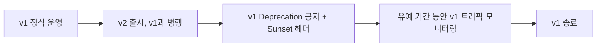

# API 버저닝 전략

## 핵심 정의

API 버저닝(API versioning)은 API의 요청/응답 스펙이 하위 호환되지 않게(breaking change) 변경될 때, 기존 클라이언트를 깨뜨리지 않으면서 새로운 스펙을 점진적으로 도입할 수 있게 하는 전략이다. 대규모 트래픽 환경에서는 API를 호출하는 클라이언트(모바일 앱, 다른 팀의 서비스, 외부 파트너)의 배포 주기를 서버가 통제할 수 없는 경우가 많으므로, 버저닝 전략을 어떻게 세우느냐가 운영 복잡도와 장애 위험에 직접적인 영향을 준다.

## 동작 원리 / 구조

### 버저닝 방식 비교

| 방식 | 예시 | 장점 | 단점 |
|---|---|---|---|
| URI 경로 | `/api/v1/orders`, `/api/v2/orders` | 가장 직관적, 캐싱/라우팅 쉬움 | 리소스 URI가 버전마다 늘어남, REST 원칙상 리소스는 버전이 없어야 한다는 반론 존재 |
| 쿼리 파라미터 | `/api/orders?version=2` | URI 구조 단순 유지 | 캐시 키 관리 까다로움, 문서화 시 눈에 덜 띔 |
| 커스텀 헤더 | `X-API-Version: 2` | URI 오염 없음 | 헤더 누락 시 기본 동작을 어떻게 할지 별도 정의 필요, 브라우저 주소창 테스트 불편 |
| 콘텐츠 협상(Accept 헤더) | `Accept: application/vnd.myapi.v2+json` | HTTP 표준(미디어 타입)에 부합, 표현의 버전을 콘텐츠 협상으로 선택 | 구현 복잡도 높음, 클라이언트 라이브러리 지원 필요 |

### Spring MVC에서의 구현 예시

URI 버저닝은 컨트롤러 매핑으로 단순하게 처리한다.

```java
@RestController
@RequestMapping("/api/v2/orders")
public class OrderV2Controller {
    @GetMapping("/{id}")
    public OrderV2Response getOrder(@PathVariable Long id) { ... }
}
```

미디어 타입 기반 협상은 `produces` 속성으로 구현할 수 있다.

```java
@GetMapping(value = "/orders/{id}", produces = "application/vnd.myapi.v1+json")
public OrderV1Response getOrderV1(@PathVariable Long id) { ... }

@GetMapping(value = "/orders/{id}", produces = "application/vnd.myapi.v2+json")
public OrderV2Response getOrderV2(@PathVariable Long id) { ... }
```

Spring Framework 7.0.9 공식 문서에서는 `WebMvcConfigurer.configureApiVersioning`과 `ApiVersionConfigurer`를 통해 헤더·쿼리·경로·미디어 타입 파라미터를 버전 해석기로 설정하고, `@GetMapping(version = "2")`로 매핑할 수 있다. 위 produces 방식과 이 내장 버전 기능은 구분한다.

헤더 기반 버전에 따라 표현이 달라지는 캐시 가능 응답은 `Vary: API-Version`(사용한 헤더명) 또는 `Vary: Accept`와 실제 CDN 캐시 키 설정을 맞춰야 한다. URI의 쿼리는 기본 HTTP 캐시 키에 포함되지만 CDN에서 쿼리를 제외하도록 설정하면 버전이 섞일 수 있다.

### 하위 호환을 유지하는 변경 vs 깨는 변경

버저닝이 필요 없는 하위 호환 변경(additive change)과 반드시 새 버전이 필요한 파괴적 변경(breaking change)을 구분하는 것이 실무의 핵심이다.

- **계약이 허용하면 하위 호환**: 새 필드 추가, 새 엔드포인트 추가, 선택적(optional) 파라미터 추가.
- **기존 클라이언트에 영향을 주는 파괴적 변경 후보**: 필드 삭제/이름 변경, 필드 타입 변경, 필수 파라미터 추가, 응답 구조 변경, 에러 코드 의미 변경, 기본 동작(정렬 순서, 페이지 크기 등) 변경.

클라이언트가 "모르는 필드는 무시한다(tolerant reader)" 원칙을 지킨다는 전제하에, 필드 추가만으로는 버전을 올리지 않는 것이 버전 폭증을 막는 핵심 원칙이다.

### 폐기(deprecation) 프로세스



HTTP 표준 `Deprecation` 헤더(RFC 9745)와 `Sunset` 헤더(RFC 8594)를 응답에 실어, 클라이언트가 프로그램적으로 폐기 시점을 감지하고 마이그레이션을 계획할 수 있게 하는 것이 권장 관례다.

```
Deprecation: @1788825600
Sunset: Thu, 31 Dec 2026 23:59:59 GMT
Link: <https://api.example.com/docs/migration-v2>; rel="deprecation"
```

## 실무 관점

- **언제/왜**: 외부에 공개된 API, 여러 클라이언트 팀이 각자 다른 배포 주기로 소비하는 내부 API 모두에서 필요하다. 단일 팀이 프론트/백엔드를 함께 배포하는 내부 API라면 엄격한 버저닝보다 동시 배포로 해결하는 것이 오히려 단순할 수 있다.
- **트레이드오프**: 버전을 세밀하게 나눌수록 안정성은 높아지지만 유지보수해야 할 코드 경로(v1, v2, v3 컨트롤러/서비스 로직)가 늘어나 기술 부채가 커진다. 실무에서는 동시에 유지하는 버전 수를 2개 이내로 제한하는 정책을 두는 경우가 많다.
- **흔한 실수**: URI에 버전을 넣고도 실제로는 마이너한 필드 추가에도 버전을 올려 v7, v8까지 불필요하게 늘리는 경우가 흔하다. 위에서 정리한 "하위 호환 vs 파괴적 변경" 기준을 팀 컨벤션으로 명문화해야 한다.
- **흔한 실수 2**: 구버전을 "언젠가 지운다"고만 하고 실제 트래픽 모니터링 없이 방치하면, 실제로는 특정 대형 파트너가 여전히 v1을 많이 호출하고 있는데 갑자기 종료해 장애로 이어지는 사례가 흔하다. Sunset 헤더와 함께 버전별 트래픽 대시보드를 반드시 운영해야 한다.
- **튜닝 포인트**: 게이트웨이 레벨에서 버전별 라우팅과 트래픽 비율을 관리하면(예: 동일한 v2 계약을 제공하는 신구 구현 사이의 카나리 배포) 애플리케이션 코드 변경 없이도 점진적 전환이 가능하다. v1 계약으로 요청한 클라이언트를 무작위로 호환되지 않는 v2에 보내는 것은 카나리 배포만으로 안전해지지 않는다.

### 필드 추가와 응답 값의 확장을 같은 호환성으로 보지 않는다

알 수 없는 JSON 필드를 무시하는 클라이언트도 기존 필드의 새로운 enum 값에는 실패할 수 있다. 예를 들어 주문 상태에 새 값이 생기면 엄격한 역직렬화나 모든 알려진 값만 다루는 분기에서 오류가 날 수 있다. 요청에서 허용할 enum 값을 늘리는 변경과 서버가 응답으로 새 값을 보내는 변경을 구분하고, 응답 값이 확장될 수 있다는 계약·미지 값 처리·실제 구버전 SDK를 함께 검증한다. 새 값이라는 이유만으로 무조건 새 API 버전이 필요한 것은 아니지만, 단순한 필드 추가와 같은 안전성을 가정하지 않는다.

선택적 파라미터를 추가하더라도 생략했을 때의 동작이 달라지면 기존 호출자가 깨질 수 있다. 특히 전체 목록 API에 페이지네이션을 뒤늦게 추가해 기본 응답을 일부로 제한하면, 구버전 클라이언트가 그 일부를 전체로 오인한다. 스키마 비교뿐 아니라 기존 요청을 새 서버에 그대로 보냈을 때 결과와 기본 동작이 유지되는지 확인한다.

## 심화 Q&A

### Q. URI 버저닝이 REST 원칙에 어긋난다는 주장의 근거는 무엇이고, 그럼에도 실무에서 널리 쓰이는 이유는?
REST에서 URI는 리소스(자원)를 식별해야 하는데, `/v1/orders`와 `/v2/orders`는 사실 같은 리소스(주문)를 가리키므로 URI가 서로 달라지는 것은 리소스 식별 원칙과 배치된다는 것이 이론적 반론이다. 그럼에도 실무에서 널리 쓰이는 이유는 캐싱(CDN, 프록시)이 URI 기준으로 동작하고, 라우팅 규칙이 단순하며, 문서화·디버깅·로그 분석에서 버전이 한눈에 보인다는 실용적 이점이 크기 때문이다. REST 명세가 URI의 버전 문자열이나 같은 대상을 식별하는 여러 URI를 금지하는 것은 아니다. 경로·헤더 선택 자체보다 표현·캐시·클라이언트 계약의 일관성을 평가한다.

### Q. 헤더 기반 버저닝을 선택했을 때 헤더가 누락된 요청은 어떻게 처리해야 하는가?
암묵적으로 최신 버전을 기본값으로 주면, 이후 최신 버전이 파괴적으로 바뀔 때 헤더를 명시하지 않은 기존 클라이언트가 예고 없이 깨질 위험이 있다. 따라서 헤더 누락 시에는 문서화한 특정 지원 버전으로 고정하거나 버전 지정이 필수라면 요청을 거부하고, 이를 API 문서에 명확히 기술해야 한다.

### Q. 데이터베이스 스키마 변경과 API 버저닝은 어떻게 분리해서 관리해야 하는가?
API 버전과 DB 스키마 버전이 1:1로 묶여 있으면, DB 마이그레이션 하나 때문에 API 버전을 올려야 하는 상황이 반복돼 유지보수 부담이 커진다. 실무에서는 DB 스키마 변경 시 확장-수축(expand-contract) 패턴을 써서(새 컬럼 추가 → 애플리케이션이 신구 컬럼 모두 지원 → 기존 컬럼 제거) API 응답 계층에서 흡수하고, API 버전은 클라이언트에게 실제로 보이는 계약(contract)이 바뀔 때만 올리는 것이 원칙이다.

### Q. 여러 버전을 동시에 서비스할 때 비즈니스 로직 중복을 어떻게 최소화하는가?
컨트롤러/DTO 계층만 버전별로 분리하고, 핵심 도메인 로직과 서비스 계층은 공유하는 구조를 쓴다. 버전 간 차이는 대부분 표현 계층(응답 필드 구조, 직렬화 형식)에 국한되는 경우가 많으므로, 어댑터(변환 매퍼)를 버전별로 얇게 두고 내부 서비스는 하나로 유지하면 중복을 크게 줄일 수 있다.

### Q. 클라이언트가 특정 필드 추가에도 깨지는 경우가 있는데, 그 원인은 무엇이고 어떻게 방지하는가?
클라이언트가 응답 JSON을 엄격 모드로 역직렬화(strict deserialization)하도록 구현되어 있으면, 알 수 없는 필드가 추가되었을 때 예외를 던지는 경우가 있다. 이는 "관대한 리더(tolerant reader)" 원칙을 클라이언트가 지키지 않은 사례로, 서버 쪽에서 API 계약 문서에 "알 수 없는 필드는 무시해야 한다"는 규칙을 명시하고, 가능하면 클라이언트 SDK를 서버 팀이 함께 배포해 이 원칙을 강제하는 것이 근본적 해결책이다.

### Q. 모바일 앱처럼 강제 업데이트가 어려운 클라이언트에 대해 버전을 종료할 때 어떤 전략을 쓰는가?
앱 스토어 심사/사용자의 자발적 업데이트 지연 때문에 구버전 클라이언트가 수개월~수년간 남아있을 수 있다. 이런 환경에서는 서버가 최소 지원 버전을 강제하는 "강제 업데이트(force update)" 팝업을 앱 자체에 내장해 두거나, 게이트웨이에서 구버전 API 호출에 대해 유예 기간 동안 기존 성공 본문 계약을 유지하는 deprecation 헤더·앱 내 안내을 주다가 최종적으로 해당 URI를 영구 폐기할 때 410 Gone 등을 계약에 맞춰 반환하는 단계적 접근을 쓴다.

## 관련 개념

- [[API Gateway]]
- [[MSA와 모놀리식 비교]]

## 참고 자료

확인 날짜: 2026-09-08. 아래 버전과 범위의 공식 문서·소스로 본문을 대조했다. 성능 비교와 운영 선택은 워크로드에 따라 달라지는 판단 기준이다.

- [RFC 9745](https://www.rfc-editor.org/rfc/rfc9745.html) — Deprecation의 Structured Field Date 문법 및 Link 관계.
- [RFC 8594](https://www.rfc-editor.org/rfc/rfc8594.html) — Sunset의 HTTP-date와 폐기 시점 의미.
- [RFC 9111](https://www.rfc-editor.org/rfc/rfc9111.html) — 기본 캐시 키와 Vary 선택.
- [Spring MVC API Version](https://docs.spring.io/spring-framework/reference/web/webmvc/mvc-config/api-version.html) — Framework 7.0.9 해석기·지원 버전·Deprecation handler.
- [Spring MVC Request Mapping](https://docs.spring.io/spring-framework/reference/web/webmvc/mvc-controller/ann-requestmapping.html) — Framework 7.0.9 produces와 version 매핑.

부분 재검증: 2026-09-22. [RFC 9745](https://www.rfc-editor.org/rfc/rfc9745.html)의 Deprecation Structured Field Date 문법, Sunset과 서로 다른 날짜 형식·의미를 재확인했다. 그 외 서술은 이번 확인 범위 밖이므로 `verified`는 유지했다.

부분 재검증: 2026-10-04. [Google AIP-180 Backwards compatibility](https://google.aip.dev/180)의 소스·전송·의미 호환성, 응답 enum 확장 주의, 새 선택 필드의 기존 기본 동작 유지 및 페이지네이션 예를 확인했다. 적용 범위는 AIP-180 API 설계 지침이며 HTTP 전체에 강제되는 별도 RFC 규칙이 아니다. 실제 구버전 SDK·모바일 클라이언트 계약 시험과 Spring 내장 버저닝 재검증은 하지 않았고 `verified`는 유지했다.
