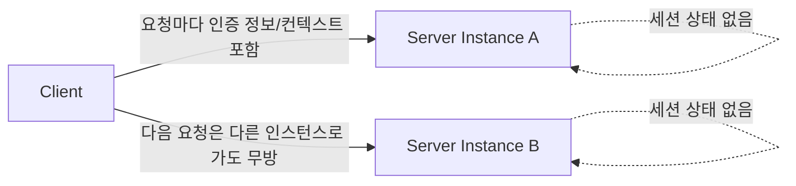

# RESTful API 설계 원칙

## 핵심 정의

REST(Representational State Transfer)는 분산 하이퍼미디어 시스템을 위한 아키텍처 스타일이다. HTTP API에서는 리소스(resource)를 URI로 식별하고 표준 메서드로 그 표현을 주고받는 형태로 적용한다. REST 자체가 HTTP에만 종속된 규격은 아니다. 로이 필딩(Roy Fielding)의 논문에서 정의된 원칙(클라이언트-서버 분리, 무상태성(statelessness), 캐시 가능성, 계층화 시스템, 인터페이스 일관성, 코드 온 디맨드)을 얼마나 지키느냐로 성숙도를 구분할 수 있는데, 실무에서 "RESTful API"라고 부르는 대부분은 이 원칙 중 일부만 채택한 실용적 절충안이다. 핵심은 API를 "동작(RPC)"이 아니라 "리소스와 그 표현(representation)"으로 모델링하는 사고방식에 있다.

## 동작 원리 / 구조

### Richardson 성숙도 모델(Richardson Maturity Model)

HTTP API의 설계 특성을 4단계로 나누는 보조 모델로, 실무 API가 어느 수준에 있는지 진단하는 데 쓰인다. Fielding의 REST 제약을 모두 판정하는 공식 인증 기준은 아니다.

| 레벨 | 특징 | 예시 |
|---|---|---|
| 0 | 단일 엔드포인트, HTTP는 전송 수단일 뿐 | `POST /api` + body에 `{action: "getOrder"}` (RPC 스타일) |
| 1 | 리소스 단위로 URI 분리 | `POST /orders/123`에 조회·취소 동작을 본문으로 전달 |
| 2 | HTTP 메서드와 상태 코드를 의미에 맞게 사용 | `GET /orders/{id}`, `DELETE /orders/{id}` + 200/404 |
| 3 | HATEOAS(Hypermedia as the Engine of Application State) 적용 | 응답에 다음 가능한 액션의 링크 포함 |

대부분의 실무 API는 레벨 2에서 멈춘다. 레벨 3(HATEOAS)은 클라이언트가 URI를 하드코딩하지 않고 서버가 제공하는 링크를 따라가게 하는 이상이지만, 클라이언트 구현 복잡도 대비 실익이 낮아 내부 API에서는 잘 채택되지 않는다.

### 리소스 모델링과 URI 설계

- 팀의 URI 명명 관례로 명사 중심 리소스 경로를 권장한다. HTTP/REST 명세가 URI 문자열의 동사를 금지하는 것은 아니다: `GET /orders/{id}` (O), `GET /getOrder?id=1` (X).
- 컬렉션은 복수형, 계층 관계는 경로로 표현한다: `GET /users/{userId}/orders`.
- 단순 CRUD로 표현하기 어려운 동작(예: "주문 취소", "비밀번호 재설정")은 하위 리소스나 컨트롤러성 명사로 모델링한다: `POST /orders/{id}/cancellations`, `POST /password-resets`.

### HTTP 메서드의 시맨틱스(semantics)

| 메서드 | 안전성(safe) | 멱등성(idempotent) | 용도 |
|---|---|---|---|
| GET | O | O | 조회, 클라이언트가 상태 변경을 요청하지 않음 |
| HEAD | O | O | GET과 동일하나 본문 없이 헤더만 |
| PUT | X | O | 리소스 전체 교체(없으면 생성) |
| PATCH | X | X(구현에 따라 O 가능) | 리소스 부분 수정 |
| DELETE | X | O | 리소스 삭제 |
| POST | X | X | 리소스 생성, 부수 효과가 있는 동작 |

PUT과 PATCH의 구분이 실무에서 자주 혼동된다. PUT은 전체 표현을 덮어쓰는 것이 원칙이라 생략 필드 처리와 서버 관리 필드의 계약을 정의해야 하며, PATCH는 변경 지시를 담은 문서를 적용한다. JSON Patch(RFC 6902)나 JSON Merge Patch(RFC 7396) 같은 표준 포맷을 PATCH 본문에 쓰기도 한다.

### 상태 코드 매핑

```
200 OK              - 조회/수정 성공, 본문 있음
201 Created         - 생성 성공. Location이 있으면 새 주 리소스 URI, 없으면 요청 대상 URI
202 Accepted        - 비동기 처리 접수(즉시 완료 아님)
204 No Content      - 성공했으나 반환할 본문 없음(DELETE 등)
400 Bad Request     - 요청 형식/검증 오류(클라이언트 책임)
401 Unauthorized    - 유효한 인증 자격 증명 없음. WWW-Authenticate challenge 필요
403 Forbidden       - 요청을 이해했지만 수행 거부(인증 성공이 필수 전제는 아님)
404 Not Found       - 리소스 없음
409 Conflict        - 상태 충돌(중복 생성, 낙관적 락 충돌 등)
422 Unprocessable Content - 문법은 맞으나 의미상 처리 불가(비즈니스 규칙 위반)
429 Too Many Requests - 요청 한도 초과
5xx                 - 서버 책임의 오류
```

### 무상태성(statelessness)과 서버 구조



서버가 클라이언트 세션 상태를 메모리에 들고 있지 않아야, 로드 밸런서 뒤에서 어떤 인스턴스가 요청을 받아도 동일하게 처리할 수 있다. 이는 무상태 애플리케이션 인스턴스의 수평 확장(horizontal scaling)을 쉽게 한다. 세션을 외부 저장소로 공유해도 인스턴스 교체는 가능하지만, 서버가 대화 상태를 보관한다면 엄격한 REST 무상태 제약과는 다르다. 상태 있는 시스템도 복제·분할 등으로 확장할 수 있다.

## 실무 관점

- **언제/왜**: 외부에 공개하는 API, 여러 클라이언트가 소비하는 내부 API는 팀 간 계약을 명확히 하기 위해 REST 원칙을 지키는 것이 장기적으로 유지보수 비용을 줄인다. 반대로 한 팀이 소유한 프론트/백엔드 간 API나 성능이 극도로 중요한 내부 통신은 GraphQL/gRPC가 더 적합할 수 있다.
- **트레이드오프**: 엄격한 리소스 중심 설계는 여러 리소스를 조합해야 하는 화면(예: 대시보드)에서 N+1 형태의 다중 호출을 유발하기 쉽다. 이를 완화하려면 집계용 엔드포인트(BFF, Backend for Frontend)를 별도로 두거나 부분 필드 선택(`?fields=`)을 지원한다.
- **흔한 실수**: URI에 동사를 남발하거나(`/getUserList`), 모든 실패를 200 OK에 에러 필드로만 담아 보내는 경우가 흔하다. 상태 코드를 의미대로 쓰지 않으면 클라이언트의 재시도/캐싱 로직(예: 멱등 메서드 재시도)이 오작동할 수 있다.
- **흔한 실수 2**: GET 요청에 부작용(조회 로그 외에 실제 데이터 변경)을 넣는 경우. GET은 캐시/프록시/브라우저 프리페치의 대상이 될 수 있으므로 안전성(safe) 원칙이 깨지면 예측 불가능한 부작용이 발생한다.
- **튜닝 포인트**: 리소스 표현에 ETag/If-None-Match 또는 Last-Modified/If-Modified-Since로 조건부 요청을 지원하면 불필요한 대역폭과 서버 부하를 줄일 수 있다.

### 조건부 쓰기로 갱신 유실 방지

클라이언트가 조회한 표현의 `ETag`를 `If-Match`로 보내면 서버는 그 표현이 여전히 일치할 때만 변경하도록 할 수 있다. RFC 9110의 `If-Match`는 강한 비교(strong comparison)를 사용하므로 `W/`로 시작하는 약한 ETag로 쓰기 충돌을 막을 수는 없다. 조건이 거짓이면 변경을 수행하지 않고 일반적으로 412를 반환한다. 이미 같은 변경이 성공했음을 확인할 수 있을 때의 2xx 예외는 명세상 별도 조건이다. 조건부 요청 자체를 요구하는 API는 조건이 빠진 요청에 428을 사용할 수 있다.

HTTP 헤더 비교만으로 저장소의 경쟁 조건이 없어지지는 않는다. 비교 후 저장 사이에 다른 쓰기가 끼어들지 않도록 DB 버전 조건부 갱신이나 트랜잭션 잠금에 연결한다. ETag는 선택된 표현의 검증자이므로 표현·인코딩·권한별 출력이 다르다면 DB 행 버전만으로 모든 표현의 강한 ETag를 만들 수 있는지도 검토한다. `If-Match` 실패는 412로 구별하고, 다른 업무 상태 충돌은 별도의 409 계약으로 정의한다.

### PATCH의 누락·null·배열 의미

`application/merge-patch+json`의 JSON Merge Patch(RFC 7396)에서 객체 멤버의 누락은 유지, `null`은 삭제다. `null`이라는 값을 저장하려는 업무 요구와 삭제 요구를 같은 표현으로 혼동하지 않는다. 배열은 일부 원소를 병합하는 대신 전체 값을 교체하며, 패치 자체가 객체가 아니면 대상 전체를 대체한다. 따라서 단순한 "보낸 필드만 업데이트"라는 설명만으로는 계약이 충분하지 않다. 클라이언트가 쓰는 패치 형식과 필드별 변경 권한을 명시하고, 동시 수정에는 조건부 쓰기를 함께 적용한다.

## 심화 Q&A

### Q. PUT과 PATCH의 멱등성 계약은 어떻게 다른가?
HTTP 스펙상 PUT은 멱등성이 요구되지만 PATCH는 필수는 아니다. 예를 들어 `{"balance": "+1000"}`처럼 절대값이 아니라 증분(delta)을 표현하는 PATCH는 여러 번 호출하면 결과가 달라지므로 멱등하지 않다. 반면 `{"status": "CANCELLED"}`처럼 필드를 특정 값으로 고정하는 PATCH는 멱등하다. 설계 시 어떤 방식을 쓸지 명확히 하고 문서화해야 클라이언트가 안전하게 재시도할 수 있다.

### Q. 생성 응답에서 201 Created와 Location 헤더를 언제 사용하는가?
생성된 주 리소스가 요청 대상 URI와 다르면 Location으로 그 URI를 알려주는 것이 유용하다. RFC 9110에서 모든 생성 응답의 Location이 무조건 필수인 것은 아니며, 201에서 Location이 없으면 요청 대상 URI가 주 리소스를 식별한다. 비동기 접수에는 202가 적절할 수 있다. `Location`은 RFC 9110이 정의한 표준 헤더이므로, HTTP 클라이언트 라이브러리나 OpenAPI 코드 생성 SDK가 응답 바디의 스키마를 알지 못해도 헤더값만으로 곧바로 후속 `GET` 요청을 구성할 수 있다(예: Spring의 `ResponseEntity.created(uri)`). 반대로 생성된 리소스의 ID를 본문에만 담고 `Location` 헤더를 생략하면, 이런 범용 툴체인이 본문 스키마를 서비스별로 따로 파싱해야 해서 상호운용성이 떨어진다.

### Q. HATEOAS를 실무에서 잘 채택하지 않는 이유와, 그럼에도 유용한 상황은?
클라이언트가 링크를 동적으로 파싱해 다음 액션을 결정하도록 구현하는 비용이 크고, 대부분의 프런트엔드는 어차피 API 문서를 보고 URI를 하드코딩하는 것이 더 빠르다. 반면 워크플로 상태에 따라 가능한 액션이 자주 바뀌는 도메인(예: 주문 상태 머신에 따라 "취소 가능/불가능"이 달라지는 경우)에서는 응답에 `_links`로 현재 가능한 액션만 노출하면 클라이언트가 상태 분기 로직을 직접 구현하지 않아도 되는 이점이 있다.
관련: [[Spring Data REST]]

### Q. 리소스가 여러 개 연관된 화면을 위해 API를 어떻게 설계해야 리소스 중심 원칙과 성능을 동시에 만족시킬 수 있는가?
순수 리소스 단위로 쪼개면 화면 하나를 그리기 위해 여러 번 호출해야 하는 문제가 생긴다. 실무에서는 하위 리소스를 쿼리 파라미터로 함께 확장해서 내려주는 필드 확장(embedding, 예: `GET /orders/{id}?expand=items,customer`) 패턴을 쓰거나, 클라이언트 전용 집계 API(BFF)를 별도 계층으로 둬서 도메인 리소스 API의 순수성과 화면 성능을 분리해 해결한다.

### Q. 멱등성이 보장되어야 하는 PUT/DELETE에서 실제로 멱등성이 깨지는 흔한 구현 실수는 무엇인가?
멱등성은 동일 요청을 여러 번 적용한 서버의 의도된 효과가 한 번 적용한 것과 같다는 뜻이다. DELETE의 첫 응답이 204이고 재시도 응답이 404여도 대상이 삭제된 상태로 유지되면 멱등적이다. 응답 코드·본문까지 매번 동일할 필요는 없다. 반면 DELETE 재시도마다 별도의 환불을 중복 실행하거나 PUT이 누적 증가를 수행하면 의도한 효과가 달라져 계약을 깨뜨릴 수 있다. 이 원칙은 [[멱등성 키 설계]]에서 다루는 POST 멱등성 처리와는 별개로, HTTP 메서드 자체의 멱등성 계약에 관한 문제다.

### Q. REST, GraphQL, gRPC 중 하나를 선택할 때 REST가 불리한 경우는 구체적으로 어떤 상황인가?
클라이언트마다 필요한 필드가 크게 다른 모바일/웹 혼합 환경에서는 REST의 고정된 응답 구조가 오버페칭(over-fetching)/언더페칭(under-fetching)을 유발하기 쉬워 GraphQL이 유리하다. 반면 내부 마이크로서비스 간 고빈도·저지연 통신에서는 JSON 기반 HTTP API와 비교해 gRPC의 바이너리 프로토콜(Protocol Buffers)과 HTTP/2 멀티플렉싱이 유리할 수 있다. REST가 JSON이나 HTTP/1.1만 요구하는 것은 아니며 실측과 스키마·클라이언트 요구로 판단한다. 자세한 비교는 [[REST와 GraphQL과 gRPC 비교]] 참고.

## 관련 개념

- [[REST와 GraphQL과 gRPC 비교]]
- [[API 버저닝 전략]]
- [[Spring Data REST]]
- [[API Gateway]]

## 참고 자료

확인 날짜: 2026-09-08. 아래 버전과 범위의 공식 문서·소스로 본문을 대조했다. 성능 비교와 운영 선택은 워크로드에 따라 달라지는 판단 기준이다.

- [RFC 9110](https://www.rfc-editor.org/rfc/rfc9110.html) — §9.2 안전성·멱등성, §9.3 메서드, §15 상태 코드와 Location/인증 challenge.
- [RFC 5789](https://www.rfc-editor.org/rfc/rfc5789.html) — PATCH의 비필수 멱등성과 조건부 적용.
- [Fielding Dissertation Chapter 5](https://roy.gbiv.com/pubs/dissertation/rest_arch_style.htm) — REST 제약과 uniform interface.
- [Richardson Maturity Model](https://martinfowler.com/articles/richardsonMaturityModel.html) — HTTP API 성숙도 모델의 설명 및 REST와의 관계.

부분 재확인: 2026-09-23. [RFC 9110 §13.1.1·§13.2](https://www.rfc-editor.org/rfc/rfc9110.html#section-13.1.1)의 If-Match 강한 비교·조건 평가, [RFC 6585 §3](https://www.rfc-editor.org/rfc/rfc6585.html#section-3)의 428, [RFC 7396 §2](https://www.rfc-editor.org/rfc/rfc7396.html#section-2)의 null·배열·전체 대체를 확인했다. 저장소 갱신의 원자성은 이를 적용한 구현 요건이다. 기존 REST 모델과 모든 상태 코드를 다시 검증한 것은 아니므로 `verified`는 유지한다.
