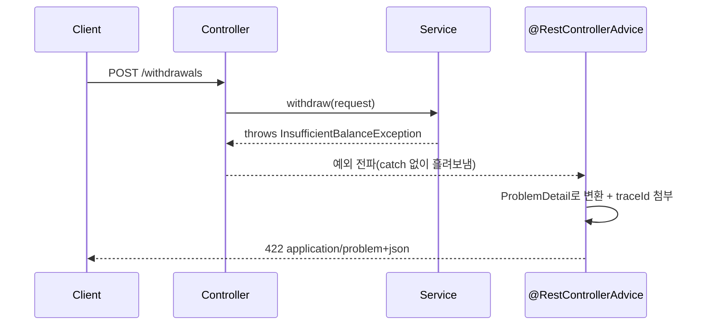

# 에러 응답 표준화

## 핵심 정의

에러 응답 표준화는 API가 실패했을 때 클라이언트가 프로그램적으로 원인을 판별하고 적절히 대응(재시도, 사용자 안내, 로깅)할 수 있도록, 에러 응답의 구조와 필드를 서비스 전반에서 일관되게 정의하는 것이다. HTTP 상태 코드만으로는 "왜" 실패했는지 세부 정보가 부족하기 때문에, 본문에 기계가 읽을 수 있는 에러 코드와 사람이 읽을 수 있는 메시지를 함께 담는 것이 핵심이다. IETF는 이를 위한 표준 포맷으로 RFC 9457 "Problem Details for HTTP APIs"를 제정했으며, 이는 기존 RFC 7807을 대체(obsolete)한다.

## 동작 원리 / 구조

### RFC 9457 Problem Details 포맷

```json
{
  "type": "https://api.example.com/errors/insufficient-balance",
  "title": "잔액 부족",
  "status": 422,
  "detail": "계좌 잔액이 요청 금액보다 부족합니다.",
  "instance": "/accounts/123/withdrawals/456",
  "balance": 5000,
  "requested": 10000
}
```

- `type`: 에러 종류를 식별하는 URI(반드시 접속 가능할 필요는 없고 식별자 역할). 미지정 시 `about:blank`.
- `title`: 에러 유형에 대한 짧고 사람이 읽을 수 있는 요약(문제 유형별로 안정적이어야 하며 현지화는 가능).
- `status`: HTTP 상태 코드와 동일한 값(중복 저장이지만 본문만 보고도 판단 가능하게 함).
- `detail`: 이번 요청에 특화된 구체적 설명.
- `instance`: 문제의 특정 발생 건을 식별하는 URI reference. 반드시 실제 조회되는 HTTP 리소스일 필요는 없음.
- 그 외 확장 필드(`balance`, `requested` 등)를 자유롭게 추가할 수 있다.

표준 멤버는 모두 항상 필수인 것은 아니다. status를 넣으면 원 서버의 실제 HTTP 상태와 일치시켜야 하며, 중간 프록시가 바꿀 수 있으므로 수신자는 실제 응답 상태도 고려한다. JSON 표현의 콘텐츠 타입은 `application/problem+json`을 사용해 일반 JSON 응답과 구분한다.

### Spring Boot에서의 구현

Spring Framework 6+는 `ProblemDetail` 클래스와 `ErrorResponse` 인터페이스로 RFC 9457(RFC 7807 계승) 포맷을 지원한다(본문은 Framework 7.0.9 문서 대조). 클래스 제공과 모든 예외의 자동 변환 활성화는 별개다. 내장 MVC 예외까지 일관되게 처리하려면 ResponseEntityExceptionHandler 기반 Advice 또는 사용하는 Boot 버전의 Problem Details 설정을 적용한다. 다음은 프로젝트의 InsufficientBalanceException DTO 계약을 가정한 핸들러 예시다.

```java
@RestControllerAdvice
public class GlobalExceptionHandler {

    @ExceptionHandler(InsufficientBalanceException.class)
    public ProblemDetail handleInsufficientBalance(InsufficientBalanceException ex) {
        ProblemDetail problem = ProblemDetail.forStatusAndDetail(
                HttpStatus.valueOf(422), "요청 금액보다 잔액이 부족합니다.");
        problem.setTitle("잔액 부족");
        problem.setType(URI.create("https://api.example.com/errors/insufficient-balance"));
        problem.setProperty("balance", ex.getBalance());
        problem.setProperty("requested", ex.getRequested());
        return problem;
    }

    @ExceptionHandler(MethodArgumentNotValidException.class)
    public ProblemDetail handleValidation(MethodArgumentNotValidException ex) {
        ProblemDetail problem = ProblemDetail.forStatus(HttpStatus.BAD_REQUEST);
        problem.setTitle("입력값 검증 실패");
        problem.setType(URI.create("https://api.example.com/errors/validation"));
        problem.setProperty("errors", ex.getBindingResult().getFieldErrors().stream()
                .map(f -> Map.of("field", f.getField(), "reason", Objects.requireNonNullElse(f.getDefaultMessage(), "유효하지 않은 값")))
                .toList());
        return problem;
    }
}
```

`@RestControllerAdvice` + `@ExceptionHandler` 조합으로 예외를 도메인 계층에서 던지고, 응답 포맷 변환은 전역 한 곳에서 처리해 각 컨트롤러가 예외 처리 코드를 중복해서 갖지 않게 한다.

### 에러 처리 흐름



### 검증(validation) 에러의 필드 단위 상세화

단일 필드 오류가 아니라 여러 필드가 동시에 검증 실패하는 경우가 많으므로, 필드별 에러 목록을 배열로 담는 것이 표준적인 확장 방식이다.

```json
{
  "type": "https://api.example.com/errors/validation",
  "title": "입력값 검증 실패",
  "status": 400,
  "errors": [
    { "field": "email", "reason": "형식이 올바르지 않습니다." },
    { "field": "age", "reason": "0 이상이어야 합니다." }
  ]
}
```

### 추적 가능성(traceability) 연계

장애 대응 시 로그와 클라이언트가 받은 에러를 연결할 수 있어야 하므로, 응답에 요청을 식별하는 추적 ID를 포함하는 것이 실무 관행이다.

```json
{
  "type": "https://api.example.com/errors/internal",
  "title": "일시적 오류",
  "status": 500,
  "traceId": "4bf92f3577b34da6a3ce929d0e0e4736"
}
```

이 `traceId`를 분산 트레이싱 시스템의 트레이스 ID와 동일한 값으로 채워두면, 사용자 문의 시 보관된 로그·트레이스를 연결할 수 있다. sampling 또는 보관 만료로 해당 trace가 없을 수 있으므로 무조건 전체 경로 조회를 보장하지 않는다.

## 실무 관점

- **언제/왜**: 여러 팀이 하나의 API 게이트웨이 뒤에서 서로 다른 서비스를 운영하는 조직일수록, 서비스마다 에러 포맷이 제각각이면 클라이언트(특히 공통 에러 처리 로직을 두는 프런트엔드/모바일)가 서비스별 분기 처리를 해야 해 유지보수 비용이 커진다. 표준 포맷을 조직 전체 컨벤션으로 강제하는 것이 장기적으로 이득이다.
- **트레이드오프**: 내부 예외 스택 트레이스나 SQL 오류 메시지를 그대로 `detail`에 노출하면 편의성은 높아지지만 내부 구현(테이블명, 컬럼명, 사용 중인 라이브러리 버전)이 클라이언트에게 유출되는 보안 문제가 된다. `detail`은 사용자에게 안전하게 보여줘도 되는 수준으로 가공하고, 원본 스택 트레이스는 서버 로그에만 남겨야 한다.
- **흔한 실수**: 성공/실패와 무관하게 항상 HTTP 200을 반환하고 본문의 `success: false` 필드로만 실패를 표현하는 설계가 종종 보이는데, 이렇게 하면 HTTP 캐시, 모니터링 도구(상태 코드 기반 알람), 리버스 프록시의 표준 동작을 활용할 수 없게 된다. 상태 코드는 반드시 의미에 맞게 반환하고, 본문은 부가 정보로만 취급해야 한다.
- **흔한 실수 2**: 에러 `type`/코드 체계를 API 버전마다 임의로 바꿔서, 클라이언트가 에러 코드 문자열에 의존한 분기 로직을 버전업마다 다시 짜야 하는 경우가 있다. 에러 코드 체계도 API 계약의 일부로 보고 [[API 버저닝 전략]]의 파괴적 변경 기준에 포함시켜 관리해야 한다.
- **튜닝 포인트**: 예외 클래스 계층을 도메인 예외(비즈니스 규칙 위반, 4xx로 매핑)와 시스템 예외(인프라 장애, 5xx로 매핑)로 분리해두면 `@ExceptionHandler` 매핑이 단순해지고, 어떤 예외를 클라이언트에게 그대로 노출해도 되는지 판단 기준이 명확해진다.

### 본문을 통일해도 HTTP 헤더의 계약은 유지한다

Problem Details로 본문을 변환하는 핸들러나 게이트웨이가 상태별 헤더를 버리지 않게 한다. 401에는 적용 가능한 challenge를 담은 `WWW-Authenticate`가 필요하고, 원 서버의 405에는 현재 허용하는 메서드 목록인 `Allow`가 필요하다. 본문의 type·detail로 이 헤더를 대신할 수는 없다. 기존 응답을 감싸 새 객체로 만드는 공통 오류 처리에서는 상태·Content-Type·필수 헤더가 함께 유지되는지 검사한다.

클라이언트도 사람이 읽는 title·detail 문구를 파싱해 재시도나 화면 분기를 결정하지 않는다. 현지화나 설명 개선으로 문구가 바뀔 수 있으므로 안정적인 type과 명시적인 확장 필드를 사용한다. 모르는 확장 필드는 무시해야 하며, 모든 네트워크 실패에 Problem Details 본문이 있다고 가정하지 않고 빈 본문·비JSON 오류를 처리할 기본 경로를 둔다.

## 심화 Q&A

### Q. 422 Unprocessable Content와 400 Bad Request를 어떻게 구분해서 써야 하는가?
400은 요청 자체의 문법/형식이 잘못된 경우(JSON 파싱 실패, 필수 파라미터 누락, 타입 불일치)에 쓰고, 422는 문법은 정상이지만 비즈니스 규칙을 위반해 처리할 수 없는 경우(잔액 부족, 이미 취소된 주문의 재취소 시도)에 쓴다. 이는 한 가지 API 정책이며 HTTP의 400은 더 넓은 클라이언트 오류를 포함한다. 상태 충돌은 409가 적합할 수 있고, 상태 코드만으로 개발 버그와 사용자 실수를 완전히 나눌 수는 없다. 구체적인 type으로 후속 행동을 정한다.

### Q. 인증/인가 실패 시 401과 403을 명확히 구분하지 않으면 어떤 보안 문제가 생기는가?
401은 유효한 자격 증명이 없을 때 WWW-Authenticate challenge와 함께 사용한다. 403은 요청 수행을 거부한다는 뜻이며 인증 성공을 항상 전제하지는 않는다. 403을 남발해 "이 리소스가 존재하지만 권한이 없다"는 것을 노출하면, 공격자가 리소스 존재 여부를 추론(enumeration)하는 데 악용할 수 있다. 반대로 권한이 없는 요청과 리소스가 아예 없는 요청을 구분 없이 모두 404로 처리하면 정당한 사용자에게 혼란을 준다. 민감한 리소스는 존재 여부 자체를 숨기기 위해 403 대신 404를 반환하는 것이 보안상 더 안전한 선택인 경우도 있어, 도메인의 민감도에 따라 정책을 다르게 가져가야 한다.

### Q. 여러 검증 오류가 동시에 발생했을 때 첫 번째 오류만 반환하는 것과 전체를 모아 반환하는 것의 트레이드오프는?
첫 번째 오류만 반환하면 서버 구현은 단순하지만, 클라이언트(특히 폼 입력 UI)는 사용자가 한 필드씩 고칠 때마다 재요청해서 다음 오류를 확인해야 해 왕복 횟수가 늘어난다. 전체 오류를 한 번에 모아 반환하면 클라이언트가 한 번에 모든 필드 오류를 표시할 수 있어 UX가 좋아지지만, 서버는 검증 로직을 조기 종료(fail-fast)하지 않고 끝까지 수집해야 하므로 구현이 약간 더 복잡해진다. 사용자 대면 폼 API는 대체로 후자를 선호한다.

### Q. 에러 응답에 `traceId`를 포함시키는 것과 스택 트레이스를 그대로 노출하는 것은 왜 근본적으로 다른가?
`traceId`는 그 자체로는 아무 내부 정보를 드러내지 않는 불투명한 식별자이고, 이를 이용해 실제 원인은 서버 로그/트레이싱 시스템에서 인가된 사람만 조회할 수 있다. 반면 스택 트레이스는 클래스명, 패키지 구조, 사용 라이브러리, 때로는 SQL 쿼리까지 그대로 노출해 공격자에게 내부 구조에 대한 정보를 제공(정보 노출 취약점)한다. 클라이언트에게는 traceId만, 상세 원인은 내부 관측 도구에만 남기는 것이 원칙이다.
관련: [[분산 트레이싱]]

### Q. 비동기로 처리되는 API(202 Accepted 응답 후 나중에 실패)의 에러는 어떻게 표준화해서 전달해야 하는가?
요청을 즉시 202로 접수하고 실제 처리는 백그라운드에서 이뤄지는 구조에서는, 최초 응답 시점에는 에러를 알 수 없다. 이런 경우 결과 조회용 리소스(`GET /jobs/{id}`)를 별도로 두고, 상태 리소스를 성공적으로 조회했다면 200 응답의 작업 상태를 FAILED로 하고 별도의 error 속성에 문제 정보를 담을 수 있다. 이때 job 조회 자체의 HTTP 오류와 작업 실행 실패를 구분하고, 중첩 오류의 status가 실제 200 응답 상태인 것처럼 해석되지 않게 계약을 정한다. 즉 에러 포맷 표준은 응답이 동기냐 비동기냐와 무관하게 "에러를 표현하는 리소스"에 항상 동일하게 적용되어야 한다.

### Q. 클라이언트가 에러 응답의 `type` URI를 프로그램적으로 분기 조건으로 써도 되는가, 아니면 `status` 코드만으로 분기해야 하는가?
RFC 9457은 `type`을 문제 유형을 식별하는 안정적인 값으로 설계했으므로, 세밀한 분기(예: "잔액 부족"과 "한도 초과"를 모두 422로 묶었지만 클라이언트가 다르게 처리해야 하는 경우)가 필요하다면 `status`보다 `type`에 의존하는 것이 맞다. 다만 이 경우 `type` 값의 집합을 API 계약 문서에 명시하고, 새로운 `type`이 추가되어도 클라이언트가 처리하지 못하는 미지의 `type`을 안전하게 무시(기본 에러 처리로 폴백)하도록 구현해야 한다.

## 관련 개념

- [[RESTful API 설계 원칙]]
- [[분산 트레이싱]]
- [[멱등성 키 설계]]
- [[Rate Limiting 알고리즘]]

## 참고 자료

확인 날짜: 2026-09-08. 아래 버전과 범위의 공식 문서·소스로 본문을 대조했다. 성능 비교와 운영 선택은 워크로드에 따라 달라지는 판단 기준이다.

- [RFC 9457](https://www.rfc-editor.org/rfc/rfc9457.html) — 표준 멤버·확장·about:blank·HTTP status·정보 노출.
- [RFC 9110](https://www.rfc-editor.org/rfc/rfc9110.html) — 400·401·403·409·422·202 의미.
- [Spring MVC Error Responses](https://docs.spring.io/spring-framework/reference/web/webmvc/mvc-ann-rest-exceptions.html) — Framework 7.0.9 ProblemDetail 렌더링과 handler 구성.
- [Map API](https://docs.oracle.com/en/java/javase/25/docs/api/java.base/java/util/Map.html) — Java SE 25 Map.of null 거부.

부분 재검증: 2026-09-22. [RFC 9457](https://www.rfc-editor.org/rfc/rfc9457.html)의 advisory status·실제 HTTP 응답 코드 일치 의무·about:blank 기본값·정보 노출 주의를 재확인했다. 그 외 서술은 이번 확인 범위 밖이므로 `verified`는 유지했다.

부분 재검증: 2026-10-04. [RFC 9110 §11.6.1·§15.5.6](https://www.rfc-editor.org/rfc/rfc9110.html)의 401 WWW-Authenticate·405 Allow 요구와 [RFC 9457 §3.1.3–3.2](https://www.rfc-editor.org/rfc/rfc9457.html)의 title/detail 성격·detail 파싱 회피·미지 확장 무시를 확인했다. 본문 누락 경로는 HTTP 응답/전송 실패의 차이를 적용한 클라이언트 설계 조건이다. 실제 프록시·Spring 핸들러·클라이언트 통합 시험은 하지 않았고 `verified`는 유지했다.
