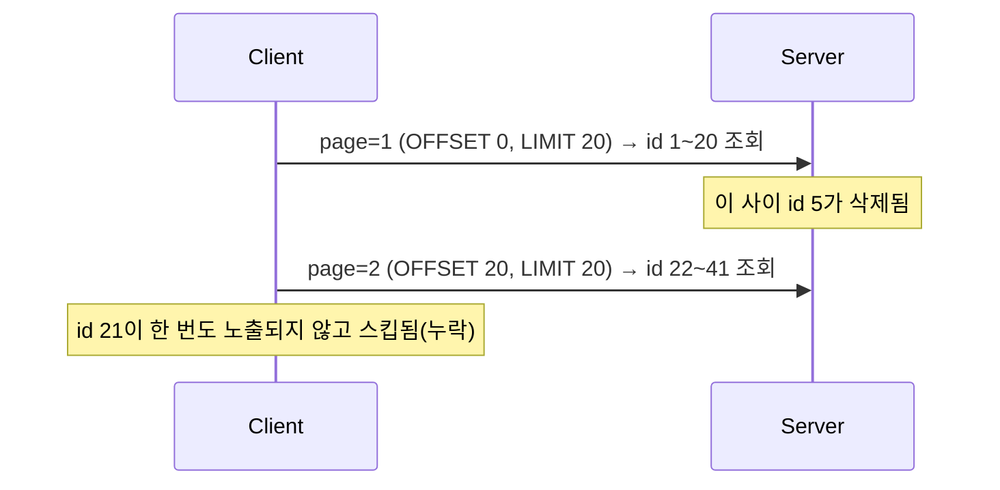

# 페이지네이션 전략

## 핵심 정의

페이지네이션(pagination)은 대량의 데이터 목록을 한 번에 전부 응답하지 않고 일정 단위로 잘라서 순차적으로 제공하는 기법이다. API 설계에서는 단순히 "몇 건씩 끊어 보낼까"의 문제를 넘어, 데이터가 계속 삽입/삭제되는 상황에서도 목록을 안정적으로 순회할 수 있는지, 그리고 대용량 테이블에서 뒤쪽 페이지로 갈수록 조회 성능이 얼마나 떨어지는지가 실제 설계의 핵심 쟁점이다. 크게 오프셋 기반(offset-based)과 커서 기반(cursor-based)으로 나뉜다. 이 노트는 커서 중 정렬 키를 경계로 쓰는 keyset pagination을 다룬다. 커서 토큰이 내부 offset이나 서버 저장 상태를 가리키는 구현도 있다.

이 노트는 API의 페이지·커서 계약과 클라이언트의 목록 탐색 방식에 초점을 둔다. SQL 접근 경로와 커버링 인덱스·지연 조인의 상세는 [[페이징 최적화]]에서 다룬다.

## 동작 원리 / 구조

### 오프셋 기반 페이지네이션

`LIMIT`/`OFFSET`으로 페이지 번호와 크기를 지정하는 방식이다.

```sql
SELECT * FROM orders ORDER BY created_at DESC, id DESC LIMIT 20 OFFSET 100;
```

```
GET /orders?page=5&size=20
```

PostgreSQL 18 등에서는 건너뛸 행도 계산해야 하므로, 페이지가 뒤로 갈수록(`OFFSET` 값이 커질수록) 스캔 비용이 선형적으로 증가한다. 인덱스를 타더라도 오프셋 앞부분 행을 다 읽어야 하는 구조적 한계가 있다.

### 커서(keyset) 기반 페이지네이션

정렬 기준 컬럼의 마지막 값(커서)을 다음 요청에 실어 보내, `WHERE` 조건으로 "그 지점 이후"만 조회하는 방식이다.

```sql
SELECT * FROM orders
WHERE (created_at, id) < (:last_created_at, :last_id)
ORDER BY created_at DESC, id DESC
LIMIT 20;
```

```
GET /orders?cursor=opaque-token&size=20
```

커서 값은 보통 정렬 키(들)를 Base64 등으로 인코딩해 클라이언트에게는 불투명(opaque)한 토큰으로 노출한다. 정렬 기준이 유니크하지 않으면(예: `created_at`이 동일한 행이 여러 개) 중복/누락을 막기 위해 유니크한 보조 키(예: `id`)를 함께 커서에 포함시켜 복합 조건으로 비교해야 한다.

```sql
WHERE (created_at, id) < (:last_created_at, :last_id)
ORDER BY created_at DESC, id DESC
LIMIT 20;
```

### 두 방식 비교

| 항목 | 오프셋 기반 | 커서 기반 |
|---|---|---|
| 특정 페이지로 직접 점프(예: 10페이지) | 가능 | 일반적으로 순차 이동. 미리 저장한 경계 커서로 점프 가능 |
| 총 페이지 수/전체 건수 표시 | 쉬움(`COUNT` 병행) | 어려움(별도 집계 필요) |
| 뒤 페이지로 갈수록 성능 | 저하(스캔량 증가) | 적절한 복합 인덱스·선택도에서 깊은 offset 비용 회피 |
| 조회 중 데이터 삽입/삭제 시 | 중복/누락 발생 가능 | 경계 앞 변경에 강함. 정렬 키 갱신·삽입 시점에 따라 누락 가능 |
| 구현 복잡도 | 낮음 | 상대적으로 높음(커서 인코딩, 복합 정렬 처리) |

### 오프셋 방식의 데이터 정합성 문제



목록을 조회하는 도중 데이터가 삽입/삭제되면 오프셋 방식은 항목이 밀리면서 중복 노출되거나 아예 스킵되는 문제가 생긴다. 무한 스크롤처럼 사용자가 계속 스크롤하며 조회하는 UI에서는 이 문제가 체감상 두드러진다.

### Spring Data의 Page vs Slice

```java
Page<Order> page = orderRepository.findAll(PageRequest.of(0, 20, Sort.by("createdAt", "id").descending()));
// total 제공 -> 필요하면 COUNT 추가 실행(일부 페이지는 결과 수로 추론 가능)

Slice<Order> slice = orderRepository.findByCustomerId(customerId, PageRequest.of(0, 20, Sort.by("createdAt", "id").descending()));
// slice.hasNext()만 제공 -> COUNT 쿼리 없이 LIMIT+1 건 조회로 다음 페이지 존재 여부만 판단
```

Spring Data의 Page는 전체 개수를 위해 보통 별도 COUNT가 필요하지만 결과 수로 전체 크기를 추론하면 생략할 수 있다. 따라서, 총 건수가 필요 없다면 `Slice`를 써서 불필요한 카운트 쿼리를 없애는 것이 성능상 유리하다.

## 실무 관점

- **언제/왜**: 관리자 페이지처럼 "몇 페이지 중 몇 번째"를 보여줘야 하거나 특정 페이지로 바로 이동해야 하는 UI는 오프셋 기반이 자연스럽다. 반면 피드/타임라인처럼 무한 스크롤로 최신 데이터를 순차적으로 내려주는 API는 커서 기반이 정합성과 성능 모두에서 유리하다.
- **트레이드오프**: 커서 기반도 별도 count와 고정된 페이지 크기로 총 페이지 수를 계산할 수 있지만 비용·스냅샷 일관성 문제가 남아 UX상 "전체 100건 중 20건" 같은 표시가 어렵다. 필요하면 총 건수만 별도의 근사치(캐시된 카운트, 추정치)로 제공하고 정확한 페이지 이동은 포기하는 절충을 한다.
- **흔한 실수**: 대용량 테이블에서 관리자 페이지 요구사항 때문에 오프셋 방식을 그대로 쓰다가, 운영 데이터가 수백만 건으로 늘어난 뒤 뒷페이지 조회가 수 초씩 걸리는 성능 문제가 뒤늦게 발견되는 경우가 흔하다. 초기 설계 단계에서 데이터 증가 추이를 고려해야 한다.
- **흔한 실수 2**: 커서 값에 정렬 키가 유니크하지 않은 컬럼(예: `created_at`)만 쓰고 보조 유니크 키를 넣지 않아, 동일 시각에 생성된 여러 행 중 일부가 중복되거나 누락되는 경우가 흔하다. 항상 정렬 기준에 유니크 컬럼(PK 등)을 tie-breaker로 포함해야 한다.
- **튜닝 포인트**: 오프셋 방식에서 뒤 페이지 성능이 문제라면, 커버링 인덱스(covering index)로 PK만 먼저 오프셋 조회한 뒤 실제 컬럼을 다시 조회하되 최종 ORDER BY를 명시하는 지연 조인(deferred join) 기법으로 스캔 비용을 줄일 수 있다. `COUNT` 쿼리 비용이 크면 정확한 값 대신 추정치(예: `EXPLAIN`의 row 추정, 별도 캐시된 카운터)로 대체하는 것도 방법이다.

## 심화 Q&A

### Q. 커서 기반 페이지네이션에서 정렬 기준이 여러 컬럼(예: 인기순 + 생성일순 tie-break)일 때 커서는 어떻게 구성해야 하는가?
커서에는 정렬 경계를 재구성하는 데 필요한 모든 키 값을 담아야 한다. 혼합 ASC/DESC 정렬에는 단순한 하나의 튜플 비교를 쓰지 말고 각 방향에 맞는 사전식 비교 조건을 구성하며, null 키의 정렬·비교 규칙도 정의해야 한다. 예를 들어 `ORDER BY score DESC, created_at DESC, id DESC`라면 커서에도 `(score, created_at, id)` 세 값을 모두 담고, `WHERE` 절도 튜플 비교(`(score, created_at, id) < (:s, :c, :i)`)로 구성해야 정렬 순서와 페이지 경계가 정확히 일치한다. 컬럼 하나라도 빠뜨리면 특정 구간에서 중복/누락이 발생한다.

### Q. 오프셋 기반에서 `COUNT(*)`가 느린 이유와 이를 회피하는 방법은?
`COUNT(*)`는 조건에 맞는 전체 행을 다 스캔해야 정확한 값을 낼 수 있어(인덱스만 읽어도 많은 엔트리를 확인해야 하는 경우가 있어) 대용량 테이블에서 비용이 크다. 정확한 총 건수가 꼭 필요하지 않다면 `Slice`처럼 `LIMIT+1` 조회로 다음 페이지 존재 여부만 판단하거나, 총 건수를 별도 배치로 집계해 캐시(Redis 등)에 저장해두고 근사치로 보여주는 방식을 쓴다.

### Q. 커서 값을 그냥 평문으로(`?lastId=1234`) 노출하지 않고 Base64 등으로 인코딩하는 이유는?
정렬 기준 컬럼과 그 구현 방식을 클라이언트에게 계약(contract)으로 노출하지 않기 위함이다. 평문으로 노출하면 클라이언트가 그 값을 직접 조작(예를 들어 임의로 큰 ID를 넣어 데이터를 건너뛰거나, 정렬 기준이 여러 개인 내부 구현을 추측)할 위험이 있고, 서버가 나중에 정렬 기준이나 페이지네이션 구현을 바꾸면 API 계약이 깨진다. 커서를 해석하지 말라는 API 계약은 내부 변경 여지를 주지만 Base64는 암호화나 위변조 방지가 아니다. 민감한 값은 암호화/서버 저장 토큰으로 보호하고, 변조 방지에는 MAC/서명 등을 쓴다. 커서에 버전·필터·정렬·만료 정책을 묶고 매 요청에서 권한을 다시 검사한다.

### Q. 무한 스크롤 UI에서 오프셋 기반을 쓰면 실제로 어떤 사용자 경험 문제가 나타나는가?
사용자가 스크롤하는 동안 새 데이터가 앞쪽에 삽입되면(최신순 정렬), 다음 페이지 조회 시 오프셋이 밀려 이미 본 항목이 다시 보이거나(중복), 반대로 삭제가 발생하면 한 항목이 아예 안 보이고 건너뛰어지는(누락) 현상이 나타난다. 커서 기반은 "마지막으로 본 항목 기준으로 그다음"을 조회하므로 이미 본 경계 앞의 삽입·삭제로 생기는 offset 이동 문제는 피한다. 하지만 정렬 키가 갱신되면 행이 경계 반대쪽으로 이동해 누락/중복될 수 있고, 새 행의 위치에 따라 이번 순회에서 보이지 않을 수 있다. 일관된 전체 스냅샷이 필요하면 snapshot/as-of 계약을 별도로 설계한다.

### Q. 페이지 크기(size)를 클라이언트가 임의로 크게 요청할 수 있게 두면 어떤 문제가 생기는가?
`size=100000` 같은 요청이 들어오면 DB 조회량과 응답 페이로드가 급증해 서버 메모리와 네트워크 대역폭에 부담을 주고, 악의적으로는 서비스 거부(DoS) 공격 벡터가 될 수 있다. API 서버에서 최대 페이지 크기를 강제로 상한(예: 100)하고, 초과 요청은 400으로 거부하거나 상한값으로 잘라 처리하는 검증 로직을 반드시 둬야 한다.

### Q. 정렬 기준 컬럼에 인덱스가 없는 상태에서 커서 기반 페이지네이션을 적용하면 어떤 일이 벌어지는가?
커서 기반의 성능 이점은 `WHERE` 조건이 인덱스 seek로 처리된다는 전제에서 나온다. 정렬 컬럼에 인덱스가 없으면 매 페이지 조회마다 전체 테이블을 스캔한 뒤 정렬해야 해서, 오히려 오프셋 방식보다 못한 성능이 나올 수 있다. 커서 기반을 도입할 때는 필터의 동등 조건·정렬 방향·유일 키를 고려한 복합 인덱스를 설계하고 실행 계획으로 seek와 정렬 제거 여부를 확인한다.

## 관련 개념

- [[페이징 최적화]]
- [[RESTful API 설계 원칙]]
- [[분산 ID 생성]]
- [[API 버저닝 전략]]

## 참고 자료

확인 날짜: 2026-09-08. 아래 버전과 범위의 공식 문서·소스로 본문을 대조했다. 성능 비교와 운영 선택은 워크로드에 따라 달라지는 판단 기준이다.

- [PostgreSQL 18 LIMIT/OFFSET](https://www.postgresql.org/docs/18/queries-limit.html) — 건너뛸 행 계산 비용과 결정적 정렬.
- [PostgreSQL 18 Row Comparisons](https://www.postgresql.org/docs/18/functions-comparisons.html) — 복합 정렬 키의 사전식 비교·null.
- [Spring Data Query Methods](https://docs.spring.io/spring-data/commons/reference/repositories/query-methods-details.html) — 열람 문서의 Page/Slice·count·keyset 제약.
- [Google AIP-158 Pagination](https://google.aip.dev/158) — opaque token 계약·권한·페이지 크기·token 내용 보호.

부분 재검증: 2026-09-22. [Spring Data Commons 4.1.1 Scrolling](https://docs.spring.io/spring-data/commons/reference/repositories/scrolling.html)의 안정적 정렬·모든 정렬 키와 PK 경계 조건을 대조하고, Page/Slice 예제에도 명시적인 유일 정렬 키를 적용했다. 그 외 서술은 이번 확인 범위 밖이므로 `verified`는 유지했다.
