# Rate Limiting 알고리즘

## 핵심 정의

레이트 리미팅(rate limiting)은 클라이언트나 API 호출 주체가 단위 시간당 보낼 수 있는 요청 수를 제한하여, 특정 사용자의 과도한 트래픽이 시스템 전체 자원을 고갈시키거나 다운스트림 의존성에 과부하를 주는 것을 막는 기법이다. 인증/인가와 달리 "누구인가"가 아니라 "얼마나 자주 허용할 것인가"를 다루며, API Gateway, 로드밸런서, 애플리케이션 코드, 데이터베이스 프록시 등 여러 계층에 적용할 수 있다.

## 동작 원리 / 구조

대표적인 다섯 가지 모델을 비교한다. 요청을 거부하는 policing과 지연시켜 내보내는 shaping을 구분해야 한다.

| 알고리즘 | 방식 | 장점 | 단점 |
|---|---|---|---|
| Fixed Window | 고정된 시간 구간(예: 초 단위)마다 카운터를 0으로 리셋 | 구현 단순, 메모리 적음 | 윈도우 경계에서 순간 2배 폭주 가능 |
| Sliding Window Log | 요청마다 타임스탬프를 로그로 저장하고 윈도우 밖 항목 제거 | 정의한 이동 구간의 요청 수를 정확히 계산 | 요청량에 비례해 메모리/연산 비용 증가 |
| Sliding Window Counter | 이전 윈도우 카운트를 가중 평균해 근사 | 정확도와 비용의 균형 | 완벽한 정확도는 아님(근사치) |
| Token Bucket | 버킷에 일정 속도로 토큰을 채우고, 요청마다 토큰 소비 | 순간 버스트(burst) 허용, 평균 속도 제어 | 버킷 크기/보충 속도 튜닝 필요 |
| Leaky Bucket | 요청을 큐에 넣고 일정한 속도로만 처리(누출) | 큐가 차 있을 때 출발 간격을 평탄화 | 유한 큐 안의 버스트는 흡수하지만 지연·큐 초과 거부 발생 |

Fixed Window의 경계 문제는 다음과 같이 발생한다.

```mermaid
gantt
    dateFormat X
    axisFormat %s
    section Window 1 (0~1s)
    100 req 몰림 :crit, 0, 1
    section Window 2 (1~2s)
    100 req 몰림 :crit, 1, 2
```



0.9초~1.1초 사이 0.2초 동안 실제로는 200개 요청이 몰려도 각 윈도우 기준으로는 한도(100개) 이내이므로 통과된다. Sliding Window Counter는 이전 윈도우 카운트에 `(1 - 현재 윈도우 경과 비율)`을 곱해 가중치를 반영함으로써 이 문제를 근사적으로 완화한다.

Token Bucket은 분산 환경에서 Redis + Lua 스크립트로 구현할 수 있다. 아래는 Redis 7 이상에서 요청당 토큰 1개를 소비하는 예시다. 용량·보충률은 서버가 검증한 정책 값이며 초 단위를 쓴다. Redis 서버 시각을 사용하고 만료 시간이 완전 보충 시간보다 짧아 조기에 버킷이 초기화되지 않게 한다.

```lua
-- KEYS[1]: bucket key, ARGV[1]: capacity, ARGV[2]: tokens per second
local capacity, rate = tonumber(ARGV[1]), tonumber(ARGV[2])
if not capacity or not rate or capacity < 1 or rate <= 0 then
  return redis.error_reply('invalid bucket policy')
end
local clock = redis.call('TIME')
local wall_now = tonumber(clock[1]) + tonumber(clock[2]) / 1000000
local bucket = redis.call('HMGET', KEYS[1], 'tokens', 'ts')
local last = tonumber(bucket[2]) or wall_now
local now = math.max(wall_now, last) -- 역행 시 동일 시간 구간 중복 보충 방지
local tokens = math.min(capacity,
  (tonumber(bucket[1]) or capacity) + (now - last) * rate)
local allowed = 0
if tokens >= 1 then
  tokens = tokens - 1
  allowed = 1
end
redis.call('HSET', KEYS[1], 'tokens', tokens, 'ts', now)
local ttl_ms = math.max(1, math.ceil((now - wall_now + capacity / rate) * 1000))
redis.call('PEXPIRE', KEYS[1], ttl_ms)
return allowed
```

Lua 스크립트로 감싸는 이유는 "읽기-계산-쓰기"가 하나의 원자적 연산으로 실행되어야 여러 인스턴스가 동시에 같은 키를 갱신해도 카운트가 어긋나지 않기 때문이다(스크립트 실행 중 다른 명령이 끼어들지 않는다). 다만 스크립트 오류의 롤백, 장애 후 데이터 보존, 큰 시계 도약까지 보장하는 것은 아니다. 짧은 실행 시간, failover 시 허용 오차, 정책 변경 시 버킷 상태 전환을 별도로 다룬다. Bucket4j 8.14.0은 내부적으로 Token Bucket 알고리즘을 구현하며 Redis(Redisson/Lettuce), Hazelcast, Ignite 등 여러 분산 백엔드를 지원해 다중 인스턴스 간 카운터를 공유할 수 있다. 반면 Resilience4j의 `RateLimiter`는 Token Bucket이 아니라 "일정 주기(`limitRefreshPeriod`)마다 허용 개수(`limitForPeriod`)만큼의 허가(permit)를 리셋"하는 방식에 가깝고, 상태를 JVM 로컬 메모리에만 두므로 별도의 분산 백엔드(Redis 등)를 지원하지 않는다. 따라서 여러 인스턴스에 걸친 분산 레이트 리미팅이 필요하면 Resilience4j 단독으로는 부족하고 Bucket4j+Redis 조합이나 API Gateway 계층의 공유 카운터를 써야 한다.

## 실무 관점

- **적용 계층 선택**: API Gateway(예: Kong, Spring Cloud Gateway) 레벨에서 걸면 서비스 코드 진입 전에 차단되어 자원 낭비를 줄일 수 있지만, 사용자별/API 키별 세밀한 정책은 애플리케이션 레벨이 더 유연하다. 실무에서는 Gateway에서 IP/글로벌 한도, 서비스 내부에서 사용자/테넌트별 한도를 이중으로 거는 경우가 많다.
- **트레이드오프**: Sliding Window Log는 키별 활성 요청 수에 비례하는 비용이 있어 한도와 키 수로 용량을 산정한다. AWS API Gateway는 Token Bucket을 사용하지만 공식 문서상 throttling·quota는 best effort여서 절대적인 과금 상한으로 쓰면 안 된다. 제품마다 구현과 보장 범위가 다르다.
- **흔한 실수**: 여러 애플리케이션 인스턴스가 각자 로컬 메모리 카운터로 제한을 두면, 인스턴스 수만큼 실제 한도가 배로 늘어나는 문제가 생긴다. 전역 한도가 필요하면 공유 상태, 중앙 서비스 또는 각 노드에 미리 나눈 토큰 예산 등으로 조정해야 한다. 노드별 자원 보호 목적이라면 로컬 제한도 유효하다.
- **흔한 실수 2**: 클라이언트별 한도 초과는 `429 Too Many Requests`로 알리고 재시도 계약을 문서화한다. RFC 6585에서 `Retry-After`는 선택 사항이지만 계산 가능하면 제공하는 편이 유용하다. 공격·심각한 과부하에서는 연결 차단이 필요할 수도 있다.
- **튜닝 포인트**: 버스트 허용량(버킷 크기)과 평균 처리량(보충 속도)을 분리해서 설계한다. 예를 들어 평상시 초당 10건이지만 순간적으로 30건까지는 허용하고 싶다면 버킷 용량 30, 보충 속도 10/s로 설정한다.

### 요청률 한도는 실행 중 작업 수와 처리 비용을 제한하지 않는다

같은 RPS를 허용해도 하위 API가 느려지면 완료되지 않은 요청이 쌓여 커넥션·메모리·스레드를 더 오래 점유한다. 요청의 입장 속도를 제한하는 것과 실행 중인 작업 수를 제한하는 것은 다르므로, [[Bulkhead 패턴]]의 동시 실행 상한과 실제 I/O 시간 제한을 함께 검토한다. 큐에서 기다리게 하는 정책은 대기 공간과 최대 대기 시간도 유한하게 정한다.

모든 요청을 토큰 1개로 계산하면 가벼운 조회와 대량 내보내기처럼 비용이 다른 요청을 같은 자원 사용으로 취급하게 된다. 경로·업무별 예산이나 가중 비용을 둘 수 있지만 정적인 요청 특징이 실제 비용을 계속 대표한다고 가정하지 않는다. 허용/거부 RPS뿐 아니라 활성 요청 수·하위 호출 수·큐·자원 사용량을 함께 관찰해 무엇을 보호하려는 한도인지 확인한다.

## 심화 Q&A

### Q. NGINX에 제한을 걸었는데 429가 나오지 않거나 특정 경로의 제한이 풀리는 이유는?
NGINX `limit_req`가 제한 초과 시 반환하는 상태의 기본값은 503이다. API 계약을 429로 정했다면 `limit_req_status 429;`를 명시한다. 지연 없이 버스트를 통과시키는 `nodelay`는 허용 버스트 한도를 없애는 설정이 아니다.

또한 하위 `location`에 `limit_req`를 하나라도 직접 정의하면 상위의 `limit_req` 목록은 자동으로 합쳐져 상속되지 않는다. 전역·사용자별 제한을 동시에 의도했다면 해당 위치에 필요한 제한을 모두 선언한다. 키가 빈 문자열인 요청은 집계되지 않으므로 인증 전 요청이나 누락된 헤더가 빈 키로 우회하지 않는지 확인한다. 사용자 입력 헤더를 검증 없이 제한 키로 신뢰해서도 안 된다.

1.17.1부터 제공되는 `limit_req_dry_run on;`은 거부·지연 없이 초과량을 집계하므로 도입 전 정상 트래픽 영향을 관찰하는 데 쓸 수 있다. 운영 적용 후에는 429 비율뿐 아니라 지연된 요청, 제한 키 수, 공유 메모리 부족도 확인한다.


### Q. Token Bucket과 Leaky Bucket의 근본적인 차이는 무엇이고 어떤 상황에 각각 적합한가?
Token Bucket은 토큰 잔량으로 "허용량"을 관리한다. 토큰 부족 시 즉시 거부하거나 토큰이 찰 때까지 기다리는 정책을 붙일 수 있다. Leaky Bucket의 큐잉 모델은 큐가 차 있을 때 일정한 간격으로 요청을 내보내며, 버스트는 큐 용량 범위에서 흡수한다. NGINX처럼 leaky bucket 기반이라도 `burst`·`nodelay` 설정에 따라 지연 동작이 달라진다. 사용자 응답성이 중요하고 순간 버스트를 어느 정도 허용해도 되는 API 요청 제한에는 Token Bucket이 적합하고, 다운스트림(예: 결제 게이트웨이, 외부 SMS 발송)으로 나가는 트래픽을 항상 일정한 속도로 유지해야 할 때는 Leaky Bucket(큐잉) 방식이 적합하다.

### Q. Sliding Window Counter의 근사 방식이 부정확해질 수 있는 경우는?
가중치 계산은 요청이 윈도우 내에 균등하게 분포한다고 가정한다. 실제로는 이전 윈도우 끝에 요청이 몰려 있는데 현재 윈도우 초반에도 몰리면, 가중 평균이 실제 순간 부하를 과소평가해 정확한 Sliding Window Log보다 더 많은 요청을 통과시킬 수 있다. 정확한 이동 구간 한도가 필요하면 Log 방식을 검토한다. 더 촘촘한 윈도우 분할도 근사이며, 결제·과금의 정확성은 한도 계산뿐 아니라 상태 영속성·중복 처리·트랜잭션 경계까지 요구한다.

### Q. 분산 환경에서 Redis 하나에 모든 레이트 리밋 카운터를 두면 어떤 문제가 생기는가?
Redis 자체가 병목이자 단일 장애점(SPOF)이 될 수 있다. 트래픽이 매우 많으면 Redis Cluster로 키를 샤딩하거나, 각 노드가 중앙에서 토큰을 묶음으로 예약해 로컬에서 소진하는 방식을 검토한다. 단순한 카운터 캐싱·사후 합산은 동시에 한도를 초과할 수 있으므로 오차 상한을 계산해야 한다. 저장소 장애 때 fail-open으로 허용할지 fail-closed로 거부할지는 보호 대상의 비용과 가용성 요구로 정한다.
관련: [[Redis Cluster]]

### Q. 사용자별 제한과 IP별 제한을 동시에 걸 때 발생할 수 있는 문제는?
NAT(공유 IP) 환경에서는 여러 사용자가 같은 IP로 접근해 IP 기준 제한이 정상 사용자까지 차단할 수 있고, 반대로 사용자 인증 전 단계(로그인 시도, 회원가입)는 인증된 사용자 식별자를 신뢰할 수 없어 IP·대상 계정·디바이스·전역 예산 등을 함께 고려해야 한다. 실무에서는 인증 전에는 IP/디바이스 지문 기준, 인증 후에는 사용자 ID 기준으로 계층을 나눠 적용한다.

### Q. 클라이언트에 한도 정보를 어떻게 노출해야 불필요한 재시도를 줄일 수 있는가?
`X-RateLimit-Limit`, `X-RateLimit-Remaining`, `X-RateLimit-Reset`은 널리 쓰이는 사설 관례이며 RFC 6585가 정한 표준 필드는 아니다. 필드의 단위·범위·리셋 시각 의미를 API 계약에 명시한다. `429`에는 필요하면 `Retry-After`를 초 단위 지연 또는 HTTP 날짜로 제공한다. 클라이언트가 이 정보를 보고 재시도 시점을 스스로 조절하게 하면 서버 측 부하를 줄이고 불필요한 요청 폭주를 예방할 수 있다.

### Q. 레이트 리미팅과 서킷 브레이커는 목적이 비슷해 보이는데 어떻게 다른가?
레이트 리미팅은 "요청 주체(클라이언트)"의 과도한 사용을 막는 것이고, 서킷 브레이커는 "의존성(다운스트림)"의 장애 전파를 막는 것이다. 레이트 리미팅은 유입 요청뿐 아니라 외부 API 호출 쿼터를 지키는 유출 트래픽에도 적용한다. 서킷 브레이커는 최근 의존성 실패·지연에 따라 호출 허용 여부를 바꾼다. 둘은 상호 보완적이며 함께 적용되는 경우가 많다.

## 관련 개념

- [[서킷 브레이커와 장애 격리]]
- [[분산 락]]
- [[캐시 스탬피드]]

## 참고 자료

확인 날짜: 2026-09-08. 아래 버전과 범위의 공식 문서·소스로 본문을 대조했다. 성능 비교와 운영 선택은 워크로드에 따라 달라지는 판단 기준이다.

- [Redis Lua scripting](https://redis.io/docs/latest/develop/programmability/eval-intro/) — Redis 7 이상 예시의 스크립트 원자성·실행 경계.
- [Redis TIME](https://redis.io/docs/latest/commands/time/) — 서버 시각의 초·마이크로초 반환.
- [Redis HSET](https://redis.io/docs/latest/commands/hset/) — 해시 상태 갱신.
- [Redis PEXPIRE](https://redis.io/docs/latest/commands/pexpire/) — 밀리초 TTL.
- [Bucket4j Reference](https://bucket4j.com/8.14.0/toc.html) — 8.14.0 Token Bucket·분산 저장소 지원·만료 정책.
- [Resilience4j RateLimiter](https://resilience4j.readme.io/docs/ratelimiter) — AtomicRateLimiter의 로컬 상태·주기별 permit 모델.
- [NGINX limit_req](https://nginx.org/en/docs/http/ngx_http_limit_req_module.html) — leaky bucket·burst·delay/nodelay.
- [AWS API Gateway throttling](https://docs.aws.amazon.com/apigateway/latest/developerguide/api-gateway-request-throttling.html) — Token Bucket과 best-effort 한도.
- [RFC 6585 §4](https://www.rfc-editor.org/rfc/rfc6585.html) — 429와 선택적인 Retry-After.
- [RFC 9110 §10.2.3](https://www.rfc-editor.org/rfc/rfc9110.html#section-10.2.3) — Retry-After 형식.

부분 재검증: 2026-09-23. [NGINX limit_req 공식 문서](https://nginx.org/en/docs/http/ngx_http_limit_req_module.html)의 기본 응답 503·설정 상속·빈 키 제외·nodelay·dry-run(1.17.1부터)을 확인했다. Redis Lua·Bucket4j·Resilience4j 전체는 이번 범위 밖이므로 `verified`는 유지했다.

부분 재검증: 2026-10-04. [Google SRE — Handling Overload](https://sre.google/sre-book/handling-overload/)의 요청별 비용 차이·QPS를 용량으로 취급하는 한계를 확인하고 [Resilience4j Bulkhead](https://resilience4j.readme.io/docs/bulkhead)의 동시 실행·대기 한도와 구분했다. 적용 범위는 요청률과 동시성의 운영 설계 비교이며 위 Redis Lua의 새 동작이나 보편적인 튜닝 수치를 주장하지 않는다. 실제 부하·분산 카운터·Redis 장애 시험은 실행하지 않았고 `verified`는 유지했다.
