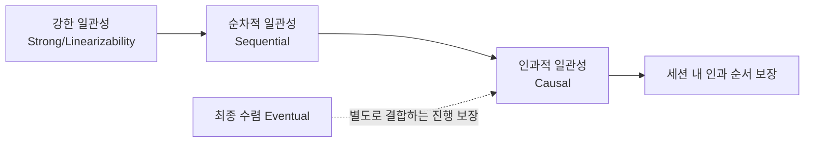

# 데이터 일관성 모델

## 핵심 정의

데이터 일관성 모델(data consistency model)은 분산 시스템에서 데이터를 복제/분산 저장할 때, 여러 노드에 걸친 읽기/쓰기 연산이 서로에게 어떤 순서와 가시성(visibility) 보장을 제공하는지를 정의하는 규약이다. [[CAP 이론]]이 "일관성과 가용성 중 하나를 포기해야 하는 상황이 있다"는 상위 원칙을 다룬다면, 이 노트는 그 사이에 존재하는 다양한 세부 일관성 수준(순서 보장·세션 보장·수렴 조건)을 실무에서 어떻게 선택하고 조합하는지에 초점을 맞춘다.

## 동작 원리 / 구조

### 일관성 보장 비교



실선은 같은 읽기/쓰기 모델에서 순서 보장을 완화하는 방향을 나타낸다. 세션 보장은 선택한 항목의 조합이고, 최종 수렴은 새 쓰기가 멈춘 뒤의 진행(liveness) 보장이므로 모든 모델을 하나의 강약 사슬로 정렬할 수는 없다. 인과 순서와 최종 수렴을 함께 제공하는 시스템도 있다. 강한 보장은 보통 조정 비용을 늘리지만 모델 이름만으로 지연·처리량을 비교할 수 없다.

| 모델 | 보장 내용 | 대표 사례 |
|---|---|---|
| 선형화 가능성(linearizability) | 각 연산이 호출과 응답 사이 한 순간에 일어난 것처럼 보이며 겹치지 않는 연산의 실시간 순서를 보존 | etcd 3.6 기본 KV 연산; `serializable` 읽기는 제외 |
| 순차적 일관성(sequential consistency) | 각 프로세스의 프로그램 순서를 보존하는 하나의 순차 실행과 동등하며, 프로세스 간 실시간 순서는 필수 아님 | ZooKeeper 3.9.3 읽기는 stale할 수 있고 순차 일관성 제공; 쓰기는 선형화 가능 |
| 인과적 일관성(causal consistency) | 인과 관계가 있는 연산(예: 댓글은 원글보다 늦게 보임)만 순서를 보장, 무관한 연산은 순서 미보장 | MongoDB의 인과적 세션과 적절한 read/write concern 조합; CRDT 자체는 인과 가시성을 보장하지 않음 |
| 세션 일관성(session guarantees) | 한 클라이언트(세션) 관점에서만 특정 보장을 제공 | Read-Your-Writes, Monotonic Reads |
| 최종 일관성(eventual consistency) | 새 쓰기가 없으면 언젠가는 모든 복제본이 같은 값에 수렴 | DynamoDB의 기본 eventual read, 비동기 복제·캐시; S3 객체 PUT/DELETE·GET/LIST는 strong read-after-write 제공 |

### 세션 일관성의 세부 보장

최종 일관성만으로는 사용자 경험이 나빠지는 경우가 많아(예: 글을 쓰자마자 새로고침했는데 내 글이 안 보임), 실무에서는 다음과 같은 절충안을 세션 단위로 제공한다.

- **Read-Your-Writes**: 자신의 성공한 쓰기보다 앞선 버전으로 다음 읽기가 되돌아가지 않는다(동시 쓰기로 더 뒤의 값이 보일 수 있음).
- **Monotonic Reads**: 한 번 최신 값을 읽었다면, 이후 읽기에서 그보다 오래된 값을 보지 않는다.
- **Monotonic Writes**: 한 세션의 뒤 쓰기를 적용할 때 앞 쓰기가 먼저 반영되도록 순서를 유지한다. 모든 복제본에 동시에 도착한다는 뜻은 아니다.
- **Writes-Follow-Reads**: 어떤 값을 읽고 나서 쓴 값은, 그 읽은 값 이후의 인과관계를 보존한다.

이런 보장은 보통 클라이언트가 자신의 "마지막으로 본 버전(타임스탬프/버전 벡터)"을 기억해두고, 그 이후의 복제 지점에서만 읽도록 라우팅하는 방식(sticky session, 버전 기반 읽기)으로 구현한다.

### 정족수(quorum) 기반 조정

Cassandra는 연산별 consistency level로 응답을 기다리는 복제본 수를 조절한다. Dynamo 논문의 정족수 모델은 이해에 유용하지만 관리형 DynamoDB가 사용자에게 동일한 N/W/R 조절 API를 제공하는 것은 아니다.

```
N = 복제본 수, W = 쓰기 시 응답을 기다리는 복제본 수, R = 읽기 시 조회하는 복제본 수
```

고정된 동일 복제본 집합에서 성공한 쓰기 집합과 이후 읽기 집합이 각각 W·R개라면 `W + R > N`일 때 적어도 하나가 **반드시** 겹친다. 이것은 확률적 근접성이 아니라 집합의 교집합 조건이다. 다만 선형화 가능성까지 얻으려면 동시 쓰기 순서, 버전 비교, 미완료 쓰기·장애 복구·read repair 규칙이 필요하다. `W + R <= N`이면 교집합은 보장되지 않으며 최종 수렴도 별도 복구·전파 규칙이 있어야 한다.

## 실무 관점

- **언제/왜**: 잔액·재고·결제는 중복 차감 금지나 재고 하한 같은 업무 불변식을 먼저 정의하고 원자적 조건 갱신·트랜잭션 격리·멱등성으로 보호한다. 단일 키의 선형화 가능한 읽기만으로 여러 객체의 트랜잭션이 보장되는 것은 아니다. 반면 조회수, 좋아요 수, 추천 피드처럼 약간의 지연된 값이 사용자 경험에 큰 영향을 주지 않는 데이터는 최종 일관성으로 충분하며, 이 경우 동기 조정 비용을 줄일 여지가 있다.
- **트레이드오프**: 하나의 서비스 안에서도 도메인별로 다른 일관성 모델을 섞어 쓰는 것이 일반적이다(예: 주문 생성은 불변식을 보호하는 격리 수준의 RDB 트랜잭션, 주문 이력 검색은 최종 일관성의 검색 엔진 복제본). 전체 시스템을 하나의 일관성 모델로 통일하려 하면 과도한 성능 희생이나 과도한 리스크 감수 중 하나로 치우치기 쉽다.
- **흔한 실수**: 읽기 전용 복제본(read replica)에서 바로 조회하는 구조를 두고, 쓰기 직후 같은 사용자가 즉시 조회했을 때 복제 지연(replication lag)으로 옛날 값을 보는 문제를 간과하는 경우가 흔하다. 마이페이지처럼 본인 데이터를 즉시 확인해야 하는 화면은 primary에서 읽거나 커밋 위치·버전 이상을 반영한 replica에서 읽어야 한다. 고정 시간만 primary에 고정하는 방식은 지연이 그 시간을 넘으면 보장이 깨지는 휴리스틱이다.
- **흔한 실수 2**: 최종 일관성을 전제로 설계했는데 애플리케이션 로직이 암묵적으로 강한 일관성을 가정(예: 값을 쓰자마자 바로 그 값을 읽어 조건 분기)하는 경우가 있다. 분산 캐시나 검색 인덱스 갱신처럼 비동기 전파가 있는 컴포넌트를 쓸 때는 이 가정이 코드 어딘가에 숨어 있지 않은지 점검해야 한다.
- **튜닝 포인트**: Cassandra는 API 호출 단위로 일관성 수준(`QUORUM`, `ONE`, `ALL` 등)을 세밀하게 지정할 수 있어 같은 테이블이라도 읽기 경로별로 다른 일관성 수준을 선택할 수 있다. DynamoDB는 테이블·LSI 읽기에서 `ConsistentRead`(기본 `false`)로 eventual/strong read를 선택한다. GSI·stream은 strong read를 지원하지 않으며, 여러 항목의 트랜잭션·스냅샷은 별도 계약이다. 내부 N=3/W=2/R=2를 공개 API 보장처럼 단정하지 않는다. 대조한 global tables 문서는 기본 MREC 외에 MRSC도 제공하므로 다중 리전 읽기를 모두 eventual로 설명하면 안 된다.

## 심화 Q&A

### Q. 선형화 가능성(linearizability)과 순차적 일관성(sequential consistency)의 차이는 정확히 무엇인가?
둘 다 각 프로세스의 순서를 보존하는 하나의 순차 실행으로 설명될 수 있어야 한다. 선형화 가능성은 **A의 응답이 끝난 뒤 B가 호출되었다면** A가 B보다 먼저라는 실시간 제약을 더한다. A와 B가 겹쳐 실행되었다면 응답 완료 순서만으로 순서가 고정되지는 않는다. 순차적 일관성은 프로세스 간 이 실시간 제약을 요구하지 않는다. 이는 외부 관측의 명세이며 모든 노드가 매번 합의 프로토콜을 실행하거나 물리 시계를 동기화해야 한다는 정의는 아니다.

### Q. 인과적 일관성(causal consistency)이 최종 일관성보다 실무에서 매력적인 이유는 무엇인가?
최종 일관성은 무관한 두 쓰기의 순서도, 인과관계가 있는 쓰기(예: 질문 글과 그에 대한 답글)의 순서도 전혀 보장하지 않아, 답글이 원글보다 먼저 보이는 등 사용자가 명백히 이상하다고 느끼는 상황이 생길 수 있다. 인과적 일관성은 "무관한 연산끼리는 순서를 신경 쓰지 않되, 인과관계가 있는 연산은 반드시 순서를 지킨다"는 절충안이라, 강한 일관성 수준의 조정 비용 없이도 사용자가 체감하는 이상 현상의 상당 부분을 제거할 수 있다.

### Q. Read-Your-Writes 보장을 구현할 때 로드밸런서의 라운드로빈 라우팅이 왜 문제가 되는가?
쓰기는 마스터에 반영됐지만 복제 지연으로 아직 특정 리플리카에 전파되지 않았는데, 다음 읽기 요청이 라운드로빈으로 그 리플리카에 우연히 라우팅되면 사용자는 방금 쓴 값이 사라진 것처럼 느낀다. 이를 방지하려면 성공한 쓰기를 반영한 primary를 읽거나, 클라이언트가 마지막으로 쓴 데이터의 버전을 기억해 그 버전 이상을 반영한 복제본에서만 읽도록 라우팅 로직에 조건을 추가해야 한다.

### Q. 정족수(quorum) 설정에서 `W + R > N`을 만족해도 완벽한 강한 일관성이 보장되지 않는 경우가 있는가?
그렇다. 고정된 복제 집합에서는 교집합 자체가 보장되지만, LWW 타임스탬프의 시계 오차·동시 쓰기·실패한 부분 쓰기 때문에 실시간의 최신 연산과 선택된 값이 다를 수 있다. Dynamo의 sloppy quorum처럼 다른 대체 노드에 기록하면 원래의 N을 이용한 교집합 전제도 깨진다. Cassandra의 일반 QUORUM 읽기/쓰기를 원자적인 compare-and-set으로 간주하면 안 되며 조건부 갱신에는 LWT/Paxos 등의 별도 경로가 필요하다. 정족수를 모을 수 없는 partition에서는 해당 연산의 가용성을 포기해야 한다.
관련: [[CAP 이론]]

### Q. 캐시(Redis)와 원본 DB 사이의 일관성 문제는 이 노트의 일관성 모델과 어떻게 연결되는가?
캐시-DB 동기화는 사실상 애플리케이션이 직접 관리하는 하나의 복제 관계이며, Cache-Aside 패턴에서 캐시 갱신 실패나 갱신 지연이 발생하면 최종 일관성과 유사한 상태(캐시가 잠시 오래된 값을 들고 있음)에 놓인다. 강한 보장이 필요한 경로는 적절한 보장을 제공하는 원본 DB를 읽거나 버전·원자성으로 보호된 캐시 프로토콜을 사용한다. 쓰기와 동시에 캐시를 삭제하는 것만으로는 경쟁 중인 읽기가 옛 값을 다시 채우는 문제를 막지 못한다.  어느 정도의 지연을 감내할 수 있는 경로는 TTL 기반 최종 일관성을 그대로 받아들이는 것이 실무적 절충이다.
관련: [[캐시와 DB 정합성]]

### Q. 다중 리전(multi-region) 배포에서 강한 일관성을 유지하려면 어떤 대가를 치르는가?
리전 간 물리적 거리로 인한 네트워크 왕복 지연(RTT)이 수십~수백 ms에 이르므로, 모든 쓰기가 여러 리전의 정족수 합의를 기다려야 하는 강한 일관성 구조에서는 쓰기 지연시간이 그만큼 늘어난다. Spanner의 TrueTime은 시각의 불확실성 범위를 이용해 트랜잭션 timestamp와 외적 일관성(external consistency)을 제공하지만 리전 간 복제 RTT를 제거하지 않는다. 대조한 문서는 기본/serializable 격리의 외적 일관성과 별도의 repeatable read 선택을 구분한다. 설계에서는 리전별 동기 일관성+리전 간 비동기 복제와 리전 간 동기 합의를 지연·장애 시 업무 요구에 따라 비교한다.

## 관련 개념

- [[CAP 이론]]
- [[리플리케이션]]
- [[캐시와 DB 정합성]]
- [[분산 락]]

## 참고 자료

확인 날짜: 2026-09-08. 아래 버전과 범위의 공식 문서·소스로 본문을 대조했다. 성능 비교와 운영 선택은 워크로드에 따라 달라지는 판단 기준이다.

- [Herlihy & Wing — Linearizability](https://cs.brown.edu/~mph/HerlihyW90/p463-herlihy.pdf) — 1990 논문: 호출/응답 사이 선형화·실시간 순서·순차 일관성 비교.
- [Werner Vogels — Eventually Consistent](https://www.allthingsdistributed.com/2008/12/eventually_consistent.html) — 2008 설명의 eventual/session 보장 개념; 당시 S3 제품 동작은 현행 근거로 사용하지 않음.
- [etcd API guarantees](https://etcd.io/docs/v3.6/learning/api_guarantees/) — 3.6 KV strict serializability와 stale serializable 읽기·Watch 구분.
- [ZooKeeper Internals](https://zookeeper.apache.org/doc/r3.9.3/zookeeperInternals.html) — 3.9.3 쓰기 linearizable·읽기 sequential/stale 보장.
- [MongoDB Causal Consistency](https://www.mongodb.com/docs/manual/core/causal-consistency-read-write-concerns/) — 세션의 네 보장과 read/write concern 조합.
- [Dynamo SOSP 2007](https://www.allthingsdistributed.com/files/amazon-dynamo-sosp2007.pdf) — N/R/W·sloppy quorum·버전 충돌·비동기 복구 모델.
- [Cassandra Dynamo Architecture](https://cassandra.apache.org/doc/latest/cassandra/architecture/dynamo.html) — 복제 집합·consistency level·LWW 충돌 처리.
- [Cassandra CQL DML](https://cassandra.apache.org/doc/latest/cassandra/developing/cql/dml.html) — 조건부 갱신의 Paxos/LWT와 일반 쓰기 구분.
- [DynamoDB Read Consistency](https://docs.aws.amazon.com/amazondynamodb/latest/developerguide/HowItWorks.ReadConsistency.html) — ConsistentRead 기본값·테이블/LSI/GSI/stream 지원 범위.
- [DynamoDB Global Tables](https://docs.aws.amazon.com/amazondynamodb/latest/developerguide/V2globaltables_HowItWorks.html) — 열람 문서의 MREC 기본·MRSC 모드.
- [Amazon S3 Consistency Model](https://docs.aws.amazon.com/AmazonS3/latest/userguide/Welcome.html#ConsistencyModel) — 객체 PUT/DELETE·GET/LIST strong read-after-write.
- [Spanner TrueTime and external consistency](https://docs.cloud.google.com/spanner/docs/true-time-external-consistency) — 열람 문서의 기본/serializable 트랜잭션 보장·repeatable read 선택.

부분 재검증: 2026-09-22. [DynamoDB 읽기](https://docs.aws.amazon.com/amazondynamodb/latest/developerguide/HowItWorks.ReadConsistency.html)의 table/LSI/GSI/stream 차이와 [Global Tables](https://docs.aws.amazon.com/amazondynamodb/latest/developerguide/V2globaltables_HowItWorks.html)의 MREC 기본·MRSC 모드, [etcd 3.6 API](https://etcd.io/docs/v3.6/learning/api_guarantees/)의 Watch 비선형성, [ZooKeeper 3.9.3](https://zookeeper.apache.org/doc/r3.9.3/zookeeperInternals.html)의 쓰기/읽기와 sync 보장 차이를 재확인했다. 그 외 서술은 이번 확인 범위 밖이므로 `verified`는 유지했다.
