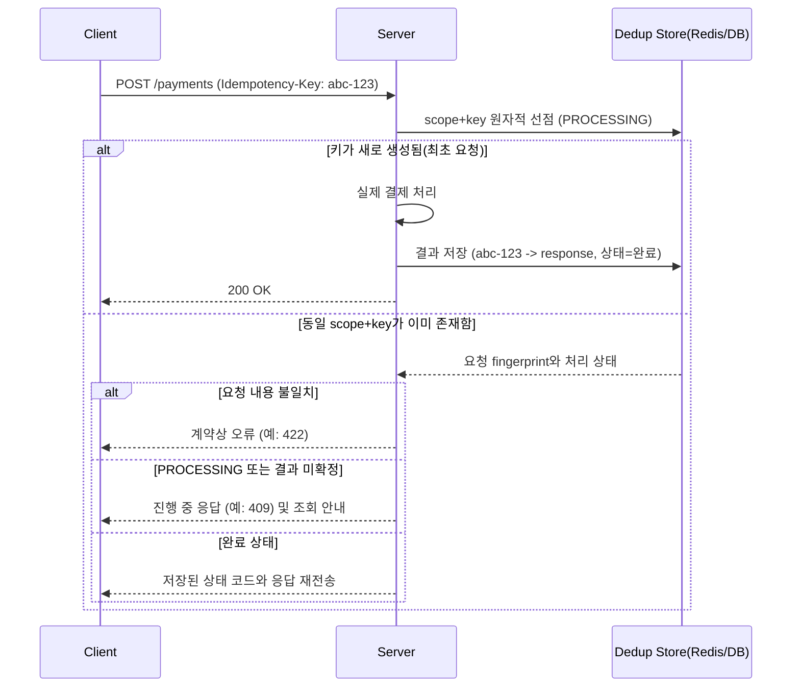

# 멱등성 키 설계

## 핵심 정의

멱등성(idempotency)은 동일한 연산을 여러 번 수행해도 결과가 한 번 수행한 것과 같은 성질을 말한다. 멱등성 키(idempotency key)는 클라이언트가 하나의 논리적 요청에 고유한 키를 부여해 서버에 전달함으로써, 네트워크 재시도나 타임아웃으로 같은 요청이 여러 번 도착하더라도 같은 논리적 작업의 부작용을 중복 적용하지 않도록 만드는 설계 기법이다. 키만 붙이거나 `SETNX`로 선점하는 것만으로 외부 결제까지 정확히 한 번 실행되는 것은 아니다. 중복 제거 기록과 업무 변경의 원자성·영속성, 다운스트림의 멱등성 계약, 키 보존 기간 안에서 보장 범위를 정해야 한다. HTTP의 GET/PUT/DELETE는 메서드 정의상 멱등하지만 POST는 메서드 자체로 멱등성을 보장하지 않기 때문에, 결제·주문처럼 부작용이 큰 POST API에서 특히 중요하다.

## 동작 원리 / 구조

### 기본 흐름



이 도식은 상태 흐름을 보여주며 선점·업무 처리·결과 저장 전체가 자동으로 하나의 트랜잭션이라는 뜻은 아니다. 먼저 "키 존재 확인 + 처리 시작 표시"가 원자적으로 이뤄져야 한다. Redis라면 `SET key value NX EX ttl` 한 번으로 원자적 선점이 가능하고, RDB라면 `(인증 주체/테넌트, 작업 종류, idempotency_key)`에 유니크 제약(unique constraint)을 건 테이블에 INSERT를 시도해 제약 위반이면 이미 처리 중/완료된 요청으로 간주한다.

```sql
-- PostgreSQL 18 예시: 길이·보존 기간은 이 API의 계약으로 결정한다.
CREATE TABLE idempotency_keys (
    principal_id VARCHAR(128) NOT NULL,
    operation VARCHAR(64) NOT NULL,
    idempotency_key VARCHAR(255) NOT NULL,
    request_hash VARCHAR(64) NOT NULL,
    status VARCHAR(16) NOT NULL, -- PROCESSING, COMPLETED, FAILED, UNKNOWN
    response_status SMALLINT,
    response_body TEXT,
    resource_id VARCHAR(128),
    created_at TIMESTAMPTZ NOT NULL,
    expires_at TIMESTAMPTZ NOT NULL,
    PRIMARY KEY (principal_id, operation, idempotency_key)
);
```

### 상태 처리 세부 사항

동시에 같은 키로 두 요청이 거의 동시에 도착하는 경쟁 상태(race condition)를 고려해야 한다.

1. 인증·인가 후 주체와 작업 종류로 키 범위를 정하고, 요청 fingerprint를 비교한다. 새 요청은 `PROCESSING`으로 선점한다.
2. 처리 중 동일 키로 두 번째 요청이 오면, 첫 요청이 아직 끝나지 않았으므로 `409 Conflict`나 짧은 대기 후 재조회로 응답한다.
3. 결과가 확정되면 상태와 HTTP 상태 코드·응답·리소스 ID를 함께 저장한다. 확정된 실패를 재현할지, 실행 전 검증 실패를 기록하지 않을지도 계약에 명시한다. 외부 호출의 타임아웃은 성공 여부가 모호하므로 단순 `FAILED` 후 재실행하지 않고 `UNKNOWN` 등으로 조회·대사한다.
4. 완료 결과의 보존 기간을 최대 재시도·지연 도착 기간보다 길게 정한다. 처리 중 선점의 만료와 완료 기록의 보존 기간은 목적이 다르다. 처리 중 키가 만료되어도 이전 작업이 멈췄다는 뜻은 아니므로, 소유권 확인·상태 조회 없이 새 실행을 허용하면 안 된다. RDB의 `expires_at`은 자동 TTL이 아니며 정리 작업이 필요하다.

같은 DB 안의 업무 변경과 키 기록은 하나의 트랜잭션으로 커밋해 중간 장애 창을 없앨 수 있다. 외부 결제·메시지 발행은 이 로컬 트랜잭션에 포함되지 않으므로 다운스트림에 안정적인 작업 키를 전달하고, outbox/inbox·결과 조회·재조정 경로를 설계한다. Redis 선점 뒤 결제 성공과 결과 저장 사이에 프로세스가 죽는 경우를 반드시 검증한다.

### 키 생성 주체와 검증

일반적인 POST 계약에서는 클라이언트가 키를 만들고 첫 요청부터 `Idempotency-Key`로 보낸다. 서버가 사전 발급한 주문·작업 ID를 클라이언트가 보관해 재사용하는 방식도 가능하다. 매 재시도마다 새로운 키를 만들거나, 첫 응답에서만 키를 알려 주어 응답 유실 때 복구할 수 없는 설계가 문제다. 클라이언트는 보통 UUID를 사용하며, 같은 논리적 작업(예: "이 장바구니를 결제")에 대해서는 재시도 시에도 동일한 키를 재사용해야 한다.

## 실무 관점

- **언제/왜**: 결제, 주문 생성, 포인트 적립/차감, 알림 발송처럼 중복 실행 시 실질적 피해(이중 과금, 중복 배송)가 발생하는 모든 쓰기 API에 적용한다. 특히 클라이언트-서버 간 네트워크가 불안정해 타임아웃 후 클라이언트가 자동 재시도를 수행하는 구조(모바일 앱, 서버 간 통신의 재시도 정책)에서 필수다.
- **트레이드오프**: 멱등성 키 저장소(Redis/DB)가 추가 인프라 의존성이 되고, TTL 관리와 저장 공간을 고려해야 한다. 또한 요청 본문(payload)이 다른데 같은 키가 재사용되는 경우를 어떻게 처리할지 정책이 필요하다(보통 본문 해시를 함께 저장해 불일치 시 `422 Unprocessable Content`로 거부).
- **흔한 실수**: 멱등성 키 확인과 실제 비즈니스 로직 처리 사이에 원자성이 없어서, 두 요청이 거의 동시에 "키가 없음"을 확인하고 둘 다 처리를 진행해버리는 TOCTOU(Time-Of-Check to Time-Of-Use) 문제가 흔하다. 키 선점은 반드시 DB 유니크 제약이나 Redis `SETNX` 같은 원자적 연산으로 해야 한다.
- **흔한 실수 2**: 멱등성 키로 재시도를 처리해도, 응답을 클라이언트에 전달하기 직전 네트워크가 끊기면 클라이언트 입장에서는 실패로 보이고 서버는 성공으로 기록된 상태(이중 상태)가 남는다. 이 경우 재시도가 저장된 완료 응답을 그대로 돌려주는 경로가 정상 동작하는지 반드시 검증해야 한다.
- **튜닝 포인트**: TTL은 결제 여부만으로 짧게 정하지 않고 재시도·중복 청구 위험·법적 보존 요구에 맞춰 정한다.  멱등성 저장소 자체의 가용성이 전체 API 가용성의 병목이 되지 않도록(Redis 장애 시 폴백 정책) 별도로 설계해야 한다. 중복 결제 위험이 있는 경로는 저장소 장애 때 검증을 건너뛰는 fail-open 폴백을 피한다.

## 심화 Q&A

### Q. 멱등성과 유니크 제약(unique constraint)만으로 문제를 해결하면 안 되는 이유는?
DB 유니크 제약은 데이터 중복은 막아주지만, 첫 번째 요청이 아직 처리 중일 때 두 번째 요청이 어떻게 응답받아야 하는지(대기? 즉시 실패? 완료된 응답 재전송?)에 대한 흐름 제어는 제공하지 않는다. 또한 여러 단계(결제 승인 → 재고 차감 → 주문 생성)로 구성된 트랜잭션에서는 하나의 유니크 제약만으로는 중간 단계 실패 시 부분 처리 상태를 표현할 수 없어, 상태 머신이나 업무 엔티티의 처리 상태로 복구 흐름을 표현한다. 단일 DB 작업이라면 유니크 업무 키와 트랜잭션만으로 충분할 수도 있어 별도 테이블이 필수는 아니다.

### Q. 같은 멱등성 키로 다른 요청 본문이 들어오면 어떻게 처리해야 하는가?
클라이언트 버그나 키 재사용 실수로 발생할 수 있는 상황이다. 안전하게 처리하려면 업무 의미에 맞게 정규화한 요청 fingerprint를 키·주체·작업과 함께 저장하고, 동일 키에 대해 해시가 다르면 원래 의도와 다른 요청으로 간주해 `422` 등의 에러로 명시적으로 거부해야 한다. 조용히 무시하거나 저장된 이전 응답을 반환하면 클라이언트가 실제로는 다른 작업이 실행된 것으로 착각할 위험이 있다.

### Q. 멱등성 키 처리 로직 자체가 분산 락(distributed lock)과 어떻게 다른가?
분산 락은 "동시에 하나의 실행만 허용"하는 상호 배제(mutual exclusion)에 초점이 있고, 락이 풀리면 다음 요청은 처음부터 다시 로직을 수행한다. 멱등성 키는 "같은 논리적 요청은 결과까지 동일하게 재사용"하는 데 초점이 있어, 이미 완료된 요청이면 로직을 재실행하지 않고 저장된 결과를 그대로 돌려준다. 실무에서는 짧은 처리 구간의 동시성 제어에는 분산 락을, 결과의 재사용에는 멱등성 키 저장소를 함께 쓰는 경우가 많다.
관련: [[분산 락]]

### Q. 멱등성 키가 만료(TTL 경과)된 후 같은 키로 재요청이 오면 어떤 위험이 있는가?
기록이 삭제된 후 같은 키를 신규 요청으로 받아들이는 계약에서는, 클라이언트의 재시도 정책상 최대 재시도 기간이 TTL보다 길면 중복 처리가 실제로 발생할 수 있다. TTL은 반드시 클라이언트/네트워크 계층의 최대 재시도 윈도우보다 여유 있게 길게 설정해야 하며, 결제처럼 리스크가 큰 도메인은 TTL을 넉넉히(수일 단위) 잡거나 만료 자체를 두지 않고 별도 아카이빙 정책으로 관리하기도 한다.

### Q. 메시지 큐 기반의 비동기 처리에서도 멱등성 키가 필요한 이유는?
acknowledgment·재전송을 사용하는 at-least-once 처리 경로에서는 컨슈머가 같은 메시지를 다시 받을 수 있다. 브로커별 기본값과 exactly-once 지원 범위가 달라 이를 일괄적인 기본 보장으로 가정하면 안 된다. 메시지에 고유 ID(멱등성 키 역할)를 부여하고 컨슈머 쪽에서 완료 기록과 업무 변경을 같은 트랜잭션으로 반영하면 재전송의 중복 부작용을 막을 수 있다. 외부 부작용은 별도의 멱등성 경계가 필요하다.
관련: [[멱등성과 메시지 순서 보장]]

### Q. 멱등성 저장소로 Redis를 쓸 때 영속성 손실이 발생하면 어떤 문제가 생기는가?
Redis가 AOF/RDB 설정에 따라 최근 데이터를 잃을 수 있는데, 그 사이 완료 처리된 멱등성 키 기록이 유실되면 재시도 요청이 "새 요청"으로 오인되어 중복 처리될 위험이 있다. 결제처럼 절대 중복이 있으면 안 되는 도메인에서는 멱등성 키 저장소를 RDB(관계형 DB)의 트랜잭션 안에 실제 비즈니스 데이터와 함께 커밋하는 방식을 선호하고, Redis를 결과 캐시로 병행하더라도 영속적인 업무 유니크 키와 결과 조회 경로가 최종 중복 방어선이 되게 설계할 수 있다. 저장소 이름 자체가 전체 처리의 원자성을 보장하지는 않는다.
관련: [[영속화 RDB와 AOF]]

### 계약 범위와 표준 상태

`Idempotency-Key` 헤더를 보냈다고 모든 서버가 처리하는 것은 아니다. 보존 기간·키 범위·진행 중 응답·본문 불일치·실패 재현 정책을 서버 문서에서 확인한다. 대조한 IETF 문서는 `draft-ietf-httpapi-idempotency-key-header-07`이며 2026-04-18 만료로 표시된 작업 초안이다. 여기의 409·422 권고를 확정 RFC의 보편적 의무로 취급하지 않는다. Stripe 문서의 최소 24시간 보존·500 응답 재사용도 Stripe 계약의 사례다.

## 관련 개념

- [[분산 락]]
- [[멱등성과 메시지 순서 보장]]
- [[캐시와 DB 정합성]]

## 참고 자료

확인 날짜: 2026-09-08. 아래 버전과 범위의 공식 문서·소스로 본문을 대조했다. 성능 비교와 운영 선택은 워크로드에 따라 달라지는 판단 기준이다.

- [RFC 9110 §9.2.2](https://www.rfc-editor.org/rfc/rfc9110.html#section-9.2.2) — 멱등 메서드의 의도한 효과.
- [AWS Builders Library — Idempotent APIs](https://aws.amazon.com/builders-library/making-retries-safe-with-idempotent-APIs/) — 토큰과 업무 변경의 원자성·지연 요청·의미상 동등한 응답.
- [Stripe Idempotent requests](https://docs.stripe.com/api/idempotent_requests) — 열람 API 계약의 상태/본문 보존·24시간·검증 실패·키 재사용.
- [IETF Idempotency-Key draft-07](https://www.ietf.org/archive/id/draft-ietf-httpapi-idempotency-key-header-07.html) — 2025-10-15 초안·2026-04-18 만료 표시, 409/422와 fingerprint 권고; 확정 RFC 아님.
- [Redis SET](https://redis.io/docs/latest/commands/set/) — NX와 EX의 원자적 선점.
- [Redis persistence](https://redis.io/docs/latest/operate/oss_and_stack/management/persistence/) — RDB/AOF 영속성 손실 범위.
- [Idempotent Consumer pattern](https://microservices.io/patterns/communication-style/idempotent-consumer.html) — 처리 메시지 ID와 업무 변경의 동일 DB 트랜잭션.

부분 재검증: 2026-09-22. [IETF Datatracker](https://datatracker.ietf.org/doc/draft-ietf-httpapi-idempotency-key-header/)에서 draft-07이 2026-04-18 만료·archived된 초안임을 재확인했다. [Stripe API](https://docs.stripe.com/api/idempotent_requests)의 최소 24시간 후 키 제거 가능, 검증 실패·동시 실행 충돌 시 결과 미보존도 대조했다. 그 외 서술은 이번 확인 범위 밖이므로 `verified`는 유지했다.
