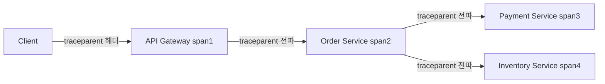
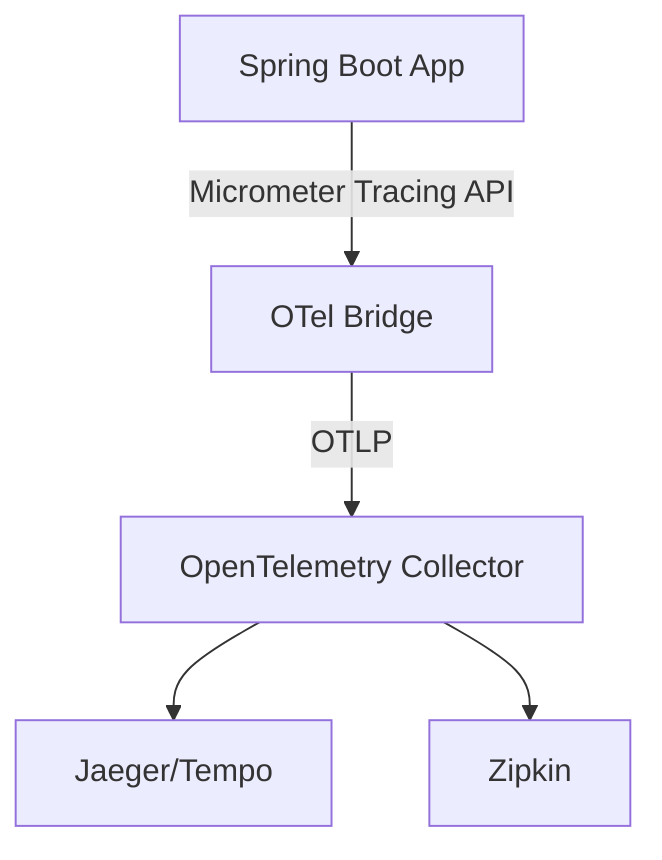

# 분산 트레이싱

## 핵심 정의

분산 트레이싱(distributed tracing)은 하나의 사용자 요청이 여러 마이크로서비스를 거쳐 처리될 때, 그 요청의 전체 경로를 추적해 각 구간에서 걸린 시간과 호출 관계를 파악할 수 있게 하는 관측성(observability) 기법이다. 로그와 메트릭만으로는 "이 요청이 어느 서비스에서 느려졌는가"를 알기 어렵지만, 트레이싱은 하나의 트레이스(trace) 아래 여러 스팬(span)을 부모-자식 관계와 스팬 링크(span link)로 연결해 요청 전체의 타임라인을 재구성한다.

이 노트는 트레이스·스팬의 구조와 시스템 설계 관점의 추적 범위를 다룬다. 전파 경로의 구현·운영 점검은 [[분산 트레이스 ID 전파]], Spring 계측 연동은 [[Micrometer와 분산 트레이싱 연동]]으로 이어서 읽는다.

## 동작 원리 / 구조

### 핵심 개념

- **Trace**: 하나의 요청이 시스템을 통과하는 전체 여정. 고유한 `trace ID`로 식별된다.
- **Span**: 트레이스 내의 하나의 작업 단위(예: HTTP 호출 1건, DB 쿼리 1건). 시작/종료 시각, 태그(속성), 로그 이벤트를 가진다.
- **Context Propagation**: 서비스 간 호출 시 trace ID와 현재 span ID를 헤더에 실어 전달해, 다음 서비스가 같은 트레이스에 속한 자식 스팬을 만들 수 있게 하는 메커니즘.



전파에 쓰이는 헤더 포맷은 W3C Trace Context 표준(`traceparent`, `tracestate`)이 사실상 업계 표준으로 자리잡았다. 예전에는 Zipkin의 B3 포맷(`X-B3-TraceId` 등)이 널리 쓰였는데, 두 포맷은 헤더 이름과 구조가 달라 한쪽 포맷만 이해하는 서비스가 섞여 있으면 트레이스가 끊기는(새 트레이스로 시작되는) 문제가 생길 수 있다.

```
traceparent: 00-4bf92f3577b34da6a3ce929d0e0e4736-00f067aa0ba902b7-01
             버전  trace-id(32hex)                    span-id(16hex)      flags
```

여기서 16자리 ID는 전파하는 쪽의 `parent-id`다. 수신 서비스는 보통 새 span ID를 만들어 자식 작업을 기록한다. trace ID와 parent ID의 모든 비트가 0인 값은 유효하지 않다.

### OpenTelemetry와 Spring 생태계

OpenTelemetry(OTel)는 트레이스·메트릭·로그 등의 명세와 계측(instrumentation) API/SDK·Collector를 제공하는 CNCF 프로젝트다. Spring 진영에서는 과거 Spring Cloud Sleuth가 표준이었으나, Sleuth 3.1이 마지막 minor 계열이며 Spring Boot 3 이상을 지원하지 않는다. 핵심 추적 API는 Micrometer Tracing으로, 개별 계측은 Spring Framework 등 각 프로젝트로 이동했다. Micrometer Tracing은 OpenTelemetry나 Brave(Zipkin) 중 원하는 브리지를 선택해 붙일 수 있는 추상화 계층이며, Spring Boot 3.0 마이그레이션 문서의 기본값은 128비트 trace ID와 W3C 포맷이다. 아래 YAML은 대조한 **Spring Boot 3.5.16** 범위로, Actuator·`micrometer-tracing-bridge-otel`·`opentelemetry-exporter-otlp` 의존성이 필요하다.

```yaml
management:
  tracing:
    sampling:
      probability: 0.1   # 샘플링 비율 10%
  otlp:
    tracing:
      endpoint: http://otel-collector:4318/v1/traces
```

대조한 **Spring Boot 4.1.1**에서는 OTLP 연동에 `spring-boot-starter-opentelemetry`를 쓰고 endpoint 속성 경로는 `management.opentelemetry.tracing.export.otlp.endpoint`다. 3.5용 YAML을 버전 확인 없이 복사하지 않는다.



수집된 트레이스는 대개 OpenTelemetry Collector를 거쳐 Jaeger, Grafana Tempo, Zipkin 같은 백엔드로 전송되고, Grafana 등에서 시각화한다.

### 샘플링(sampling)

트래픽이 크면 샘플링으로 저장·전송 비용을 줄인다. 소규모 시스템이나 전체 기록이 필요한 환경에서는 100% 수집이 적절할 수 있다.

- **Head-based sampling**: 요청이 시작되는 시점에 샘플링 여부를 결정. 구현이 간단하지만 나중에 에러가 난 요청만 골라 볼 수 없다.
- **Tail-based sampling**: 도착한 스팬을 일정 시간 모아 에러·지연 등으로 보존 여부를 결정. 버퍼·대기 시간이 필요하며 지연 도착, 용량 초과, upstream drop 때문에 중요한 트레이스를 놓칠 수도 있다.

## 실무 관점

- **언제/왜**: 마이크로서비스 수가 늘어나 하나의 요청이 여러 서비스·비동기 경계를 거치고 지연 원인 파악이 어려워지면, 로그만으로 병목 구간을 찾는 데 걸리는 시간이 급격히 늘어난다. 이 시점부터 분산 트레이싱 도입 효과가 커진다.
- **트레이드오프**: 트레이싱 계측 자체가 약간의 오버헤드(CPU, 네트워크 대역폭)를 유발한다. 샘플링 비율을 낮추면 오버헤드는 줄지만 드물게 발생하는 장애의 트레이스를 놓칠 수 있다. 에러·느린 트레이스를 우선 보존하는 tail 정책을 쓸 수 있다. 이미 head에서 버린 스팬은 tail이 복원하지 못하므로 모든 에러를 남기려면 앞단 전달률·용량·분산 Collector의 trace ID별 라우팅도 맞춰야 한다.
- **흔한 실수**: 비동기 메시징(Kafka, RabbitMQ)을 거치는 구간에서 trace context 전파를 놓쳐 트레이스가 메시지 발행 시점에서 끊기는 경우가 매우 흔하다. 지원되는 계측의 propagator가 메시지 헤더에 context를 주입·추출하는지 확인하고, 미지원 구간만 수동 계측한다. 무조건 수동 헤더를 더하면 이중 스팬이나 잘못된 부모 관계가 생길 수 있다.
- **흔한 실수 2**: Sleuth(B3)와 Micrometer Tracing(W3C)이 혼재된 레거시-신규 서비스 환경에서 헤더 포맷이 맞지 않아 트레이스가 서비스 경계마다 새로 시작되는 문제가 발생한다. 마이그레이션 기간에는 두 포맷을 동시에 이해하도록 propagation 설정을 명시적으로 맞춰야 한다.
- **튜닝 포인트**: 샘플링 비율(`management.tracing.sampling.probability`), Collector의 배치 전송 설정, 스팬에 담는 태그의 카디널리티(속성의 크기·개수·인덱싱 정책에 따라 비용 증가)를 관리해야 한다.

### 수동 계측의 오류 상태와 종료 경계

OTel Tracing API 1.61.0에서 `recordException`은 예외 이벤트를 추가하는 연산이며, 호출 자체가 스팬의 상태를 Error로 바꾼다는 계약은 아니다. 수동으로 소유한 작업이 실패했다면 적용되는 의미 규약(semantic conventions)에 따라 오류 상태를 별도로 설정한다. 예외가 내부에서 처리되어 작업이 성공한 경우까지 무조건 실패로 집계하지 않는다.

상태의 우선순위는 `Ok > Error > Unset`이다. `finally`에서 항상 Ok를 설정하면 앞서 기록한 Error를 덮어쓸 수 있으므로 피한다. 자동 계측에 수동 오류 처리까지 덧붙일 때는 같은 실패를 중복 이벤트로 기록하는지도 확인한다. 기본 Unset은 아직 오류라고 표시하지 않은 상태이며, 모든 성공 스팬에 명시적인 Ok가 필요한 것은 아니다.

스팬의 `end()`는 해당 스팬의 기록 구간을 닫으며, 자식 스팬을 종료하거나 실행 중인 작업을 취소하지 않는다. Context의 현재 스팬 범위(scope)를 해제하는 것과도 별개다. Java에서는 scope 정리와 span 종료를 각각 보장한다. 따라서 부모 스팬이 끝났다고 하위 비동기 작업까지 완료되었다고 해석하면 안 된다. 중첩·병렬 스팬 시간을 단순 합산한 값도 사용자 요청의 경과 시간이 아니다.

## 심화 Q&A

### Q. 분산 트레이싱과 중앙 집중식 로그 수집(ELK 등)은 어떤 차이가 있고 왜 둘 다 필요한가?
로그는 각 서비스가 독립적으로 남기는 시계열 텍스트 기록이라 "무슨 일이 있었는지"를 알 수 있지만, 여러 서비스에 흩어진 로그를 하나의 요청 흐름으로 재구성하려면 trace ID로 상호 연관(correlation)시켜야 한다. 트레이싱은 애초에 요청 단위의 인과관계와 시간 구조를 보존하도록 설계되어 있어 "어디서 느려졌는가"를 바로 보여주지만, 세부적인 에러 메시지나 스택 트레이스 같은 정보는 로그가 더 풍부하다. 실무에서는 로그에 trace ID를 함께 남겨(MDC 연동) 두 시스템을 상호 참조한다.

### Q. Head-based 샘플링만 쓰면 왜 중요한 에러 트레이스를 놓칠 수 있는가?
Head-based는 요청이 들어오는 순간, 즉 아직 에러가 날지 성공할지 모르는 시점에 수집 여부를 확률적으로 결정한다. 예를 들어 샘플링 비율이 1%라면 에러 여부와 독립적인 균일 샘플링이라면 에러 요청도 평균적으로 약 99%가 기록되지 않는다. 반면 Tail-based 샘플링은 요청이 끝난 뒤 상태 코드나 지연 시간을 보고 결정하므로 에러/느린 요청을 우선적으로 남길 수 있지만, 결정을 내리기 전까지 모든 스팬을 임시 버퍼(Collector 등)에 들고 있어야 한다는 인프라 비용이 따른다.

### Q. 비동기 메시지 큐를 거치는 구간에서 트레이스 컨텍스트를 어떻게 이어가야 하는가?
발행자가 메시지 생성 context를 propagator로 주입하고 컨슈머가 추출한다. 단일 메시지는 부모-자식 연결을 사용할 수 있지만, 배치·팬인에서는 스팬의 부모가 하나뿐이므로 link로 여러 메시지와 연결한다. 대조한 OTel semantic conventions 1.44.0의 messaging 규약은 기본 연결에 link를 권고하며 해당 영역은 개발 중이다.

Spring Kafka 4.1.1 문서는 `KafkaTemplate`과 `ContainerProperties`의 `observationEnabled` 활성화를 안내한다(기능은 3.0부터). 해당 문서에서 batch listener는 Observation을 지원하지 않고 타이머를 사용하므로, 모든 배치 소비가 자동 추적된다고 가정하지 않는다.
관련: [[Kafka 아키텍처]]

### Q. 샘플링 비율을 낮췄는데도 특정 요청의 트레이스를 반드시 봐야 한다면 어떻게 하는가?
신뢰할 수 있는 QA 요청 등에 대해 스팬을 시작하기 전에 sampler 정책을 구성한다. W3C의 sampled 비트는 발신자의 기록 의도를 알리는 권고 신호이며 강제 기록 명령이 아니다. 수신 sampler가 따르지 않을 수 있고 이미 버린 스팬을 헤더 수정으로 복원할 수 없다. 외부 사용자가 임의로 보낸 플래그를 무조건 신뢰하면 비용·부하 공격으로 이어질 수 있다.

### Q. 트레이스 스팬에 사용자 ID나 요청 파라미터를 태그로 넣으면 왜 문제가 될 수 있는가?
개인정보가 트레이싱 백엔드(외부 SaaS일 수 있음)에 그대로 노출되는 보안/규정 준수 문제가 생기고, 카디널리티가 매우 높은 값(사용자 ID처럼 거의 무한한 값의 집합)을 태그로 쓰면 일부 백엔드(특히 메트릭과 트레이스를 공유하는 저장소)에서 인덱스 폭증과 조회 성능 저하를 유발한다. 민감 정보는 원칙적으로 수집하지 않거나 필요한 범위에서 비식별화하고 로그에도 같은 정책을 적용한다. 트레이스 속성의 높은 카디널리티 자체가 메트릭 label과 동일한 금기는 아니다. 요청 ID 등은 원인 분석에 유용할 수 있으므로 보관·인덱싱 비용과 접근 통제로 판단한다. 메트릭으로 변환하는 속성은 특히 저카디널리티로 제한한다.

### Q. Spring Cloud Sleuth에서 Micrometer Tracing으로 넘어갈 때 실제로 무엇이 달라지는가?
Boot 3.0 전환 가이드에서는 W3C·128비트 ID를 기본으로 하고 joined span을 쓰지 않아 HTTP client/server가 별도 span ID를 갖는다. 태그 이름은 Micrometer Observation convention과 OTel semantic convention·계측 버전에 따라 달라지므로 일률적인 이름 치환표로 마이그레이션하면 안 된다.

Boot 3.0은 복수 전파 포맷을 지원하지 않으므로 당시 가이드는 Sleuth/Boot 2 쪽에 `spring.sleuth.propagation.type=w3c,b3`, `spring.sleuth.traceId128=true`, `spring.sleuth.supportsJoin=false`를 설정하도록 안내한다. 이후 Boot 버전의 consume/produce 옵션과 혼동하지 말고 각 서비스의 실제 버전에 맞춰 전파 계약을 검증한다.

## 관련 개념

- [[분산 트레이스 ID 전파]]
- [[Micrometer와 분산 트레이싱 연동]]
- [[API Gateway]]
- [[Kafka 아키텍처]]
- [[서킷 브레이커와 장애 격리]]

## 참고 자료

확인 날짜: 2026-09-08. 아래 버전과 범위의 공식 문서·소스로 본문을 대조했다. 성능 비교와 운영 선택은 워크로드에 따라 달라지는 판단 기준이다.

- [W3C Trace Context Level 1](https://www.w3.org/TR/2021/REC-trace-context-1-20211123/) — 2021 Recommendation의 traceparent·유효 ID·sampled 권고·신뢰 경계.
- [OpenTelemetry Tracing API](https://opentelemetry.io/docs/specs/otel/trace/api/) — trace/span/context/link 모델.
- [OpenTelemetry Sampling](https://opentelemetry.io/docs/concepts/sampling/) — head/tail 비용·조합·전체 수집 선택.
- [OpenTelemetry messaging spans](https://opentelemetry.io/docs/specs/semconv/messaging/messaging-spans/) — 1.44.0 개발 중 규약의 link 기본·단일 메시지 parent 선택.
- [Spring Boot 3.5 Tracing](https://docs.spring.io/spring-boot/3.5/reference/actuator/tracing.html) — 대조 문서 3.5.16의 의존성·OTLP 속성·기본10%.
- [Spring Boot Tracing](https://docs.spring.io/spring-boot/reference/actuator/tracing.html) — 대조 문서4.1.1의 OpenTelemetry starter·OTLP export 속성.
- [Spring Cloud Sleuth documentation](https://docs.spring.io/spring-cloud-sleuth/docs/current/reference/html/) — 3.1 마지막 minor·Boot3 미지원.
- [Micrometer Sleuth 3.1 migration guide](https://github.com/micrometer-metrics/tracing/wiki/Spring-Cloud-Sleuth-3.1-Migration-Guide) — Boot3.0의 W3C·128비트·joined span·다중 전파 제약.
- [Spring Kafka Monitoring](https://docs.spring.io/spring-kafka/reference/kafka/micrometer.html) — 4.1.1 Observation 활성화·batch listener 지원 범위.

부분 재확인: 2026-09-23. [OpenTelemetry Tracing API](https://opentelemetry.io/docs/specs/otel/trace/api/) — 명세 1.61.0의 RecordException·SetStatus·End 의미와 상태 우선순위, [OpenTelemetry Java API](https://opentelemetry.io/docs/languages/java/api/)의 예외 이벤트·오류 상태·scope와 종료 사용을 확인했다. 시간 합산과 종료 해석은 이 수명주기에서 도출한 운영 판단이다. 기존 Spring Boot·Kafka·샘플링 설정을 모두 재검증한 것은 아니므로 `verified`는 유지한다.
