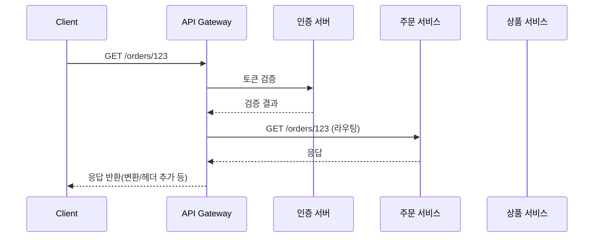

# API Gateway

## 핵심 정의
API Gateway는 클라이언트와 백엔드 서비스들 사이에 위치해 모든 요청을 단일 진입점(single entry point)으로 받아 적절한 내부 서비스로 라우팅하는 컴포넌트다. 라우팅뿐 아니라 인증/인가, 속도 제한(rate limiting), 요청/응답 변환, 로깅, 서킷 브레이커 연동 등 여러 서비스에 공통으로 필요한 횡단 관심사(cross-cutting concern)를 게이트웨이 레벨에서 처리해 개별 서비스의 부담을 줄이는 것이 목적이다.

MSA 환경에서 특히 중요한데, 클라이언트가 수십 개의 서비스 주소를 각각 알아야 하는 문제(클라이언트-서비스 직접 결합)를 해소하고, 서비스 내부 구조가 바뀌어도 클라이언트가 영향을 받지 않도록 추상화 계층을 제공한다.

## 동작 원리 / 구조



### 핵심 구성 요소
1. **라우팅(Routing)**: 요청 경로, 헤더, 메서드 등을 기준으로 어떤 백엔드 서비스로 전달할지 결정한다.
2. **필터 체인(Filter Chain)**: 요청이 실제 서비스로 전달되기 전(pre-filter)과 응답이 클라이언트로 돌아가기 전(post-filter) 단계에서 인증, 헤더 조작, 로깅 등을 수행한다.
3. **로드 밸런싱**: 서비스 디스커버리(Eureka, Consul, Kubernetes Service 등)와 연동해 인스턴스 중 하나로 요청을 분산한다.
4. **서킷 브레이커/재시도**: 백엔드 장애 시 빠르게 실패 처리하거나 폴백(fallback) 응답을 반환한다.
5. **BFF(Backend For Frontend)**: 클라이언트 유형(웹, 모바일)별로 별도 게이트웨이를 두어 응답 형태를 최적화하는 변형 패턴.

### Spring Cloud Gateway 5.0.3 Server WebFlux 설정 예시 (YAML)
```yaml
spring:
  cloud:
    gateway:
      server:
        webflux:
          routes:
            - id: order-service
              uri: lb://ORDER-SERVICE
              predicates:
                - Path=/orders/**
              filters:
                - name: CircuitBreaker
                  args:
                    name: orderCB
                    fallbackUri: forward:/fallback/orders
          trusted-proxies: 10\.0\.0\.\d+
```
위 예제는 /orders/123 경로를 그대로 백엔드에 전달한다. StripPrefix=1을 추가하면 /123으로 바뀌므로 백엔드 경로 계약에 맞춰 선택한다. `lb://`에는 Spring Cloud LoadBalancer와 인스턴스 목록이, CircuitBreaker에는 `spring-cloud-starter-circuitbreaker-reactor-resilience4j`와 fallback 핸들러가 필요하다.

Spring Cloud Gateway Server WebFlux는 WebFlux 기반 리액티브(reactive) 스택으로 동작하는 것이 기본이며, `spring-cloud-starter-gateway-server-webflux` 의존성을 사용한다(전통적인 Spring MVC 기반 환경을 위한 Gateway Server MVC 방식도 별도로 제공된다). 대조한 5.0.3 문서에서는 downstream으로 Forwarded/X-Forwarded 헤더를 생성하는 HttpHeadersFilter를 활성화하려면 `trusted-proxies` 설정을 명시적으로 지정해야 한다.

## 실무 관점
- **언제/왜 쓰는지**: 여러 서비스의 진입 정책을 일관되게 적용하거나 클라이언트가 여러 서비스를 조합해 호출해야 하는 시점부터 도입 효과가 커진다. 서비스가 1~2개뿐인 초기 단계에서는 오히려 불필요한 인프라 계층과 지연(latency)만 추가할 수 있다.
- **트레이드오프**: 게이트웨이는 모든 트래픽이 거치는 단일 장애점(Single Point of Failure)이 될 수 있으므로 반드시 이중화(다중 인스턴스 + 로드 밸런서)해야 한다. 또한 게이트웨이에 비즈니스 로직을 과도하게 넣으면(스마트 게이트웨이) 서비스 간 결합도가 다시 높아지고 배포 병목이 생기므로, 게이트웨이는 횡단 관심사만 담당하고 도메인 로직은 각 서비스에 두는 것이 원칙이다.
- **흔한 실수/장애 패턴**: 전체 deadline 없이 계층마다 긴 timeout과 재시도를 설정하면 호출자가 포기한 뒤에도 하위 작업이 남아 자원을 소모한다. 보통 하위 의존성의 timeout을 상위의 남은 예산보다 짧게 잡아 응답 전달·폴백 여유를 둔다. timeout 발생이 하위 작업 취소를 보장하지 않으므로 클라이언트의 취소 지원도 확인한다. 반대로 타임아웃을 지나치게 짧게 잡으면 정상 처리 중인 요청이 강제 실패한다. 필터 체인에서 동기 블로킹 호출(예: 리액티브 스택에서 블로킹 JDBC 호출)을 실수로 넣으면 이벤트 루프 스레드가 막혀 전체 게이트웨이 처리량이 급락한다.
- **설정/튜닝 포인트**: 커넥션 풀 크기와 타임아웃(connect-timeout, response-timeout)을 백엔드 서비스별 SLA에 맞춰 개별 라우트 단위로 설정한다. 속도 제한은 Redis 기반 토큰 버킷(예: `RequestRateLimiter` + Redis)으로 분산 환경에서도 일관되게 적용해야 한다. 인증은 게이트웨이에서 JWT 검증까지만 하고 세부 인가(권한 체크)는 서비스에 위임하는 방식이 널리 쓰인다.

### 게이트웨이 재시도와 필터·본문의 비용

Spring Cloud Gateway Server WebFlux 5.0.3의 `Retry` 필터는 활성화한 경우 기본적으로 GET의 5xx 응답과 설정된 예외(`IOException`, `TimeoutException`)에 최대 3회 재시도한다. 최초 시도까지 합하면 최대 4회이며, 기본값에서 backoff·jitter는 비활성이고 전체 재시도 timeout도 무제한이다. 이는 모든 라우트에 재시도가 자동 활성화된다는 뜻이 아니다. 필터를 추가할 때 대상 메서드·상태·예외와 요청의 남은 시간 예산을 함께 정한다.

이 필터는 뒤에 놓인 필터도 재실행한다. 후속 커스텀 필터가 과금·감사 이벤트·외부 상태 변경을 수행한다면 한 사용자 요청에서 여러 번 실행될 수 있으므로, 필터 순서와 멱등성을 검토한다. POST 등 쓰기를 재시도 대상으로 넓히는 경우 백엔드의 멱등성 계약이 먼저 필요하다.

요청 본문이 있는 메서드를 재시도하면 본문을 `DataBuffer`로 캐시하므로, 큰 업로드와 동시 요청이 게이트웨이 메모리를 점유할 수 있다. 본문 크기·동시 요청 수·재시도 횟수를 함께 제한한다. `forward:` 대상으로 재시도할 때는 대상 핸들러가 응답을 이미 커밋하면 다시 응답을 구성할 수 없으므로, 재시도할 오류가 응답 커밋 전에 전파되는지도 확인한다.

## 심화 Q&A

### Q. API Gateway와 서비스 메시(Service Mesh)의 역할 차이는 무엇인가?
A. API Gateway는 외부 클라이언트와 내부 서비스 경계(north-south 트래픽)를 담당하는 반면, 서비스 메시(예: Istio)는 서비스 간 내부 통신(east-west 트래픽)에서 mTLS, 서비스 디스커버리, 세밀한 트래픽 제어를 프록시 계층에서 처리한다. Istio에는 sidecar와 ambient 모드가 있으므로 항상 sidecar가 필수인 것은 아니다. 두 계층은 배타적이지 않고 함께 쓰이는 경우가 많으며, 게이트웨이는 진입점 정책, 메시는 내부 통신 정책을 담당하는 식으로 역할을 나눈다.

### Q. 게이트웨이가 단일 장애점이 되는 문제를 어떻게 완화하는가?
A. 게이트웨이 자체를 무상태(stateless)로 설계해 여러 인스턴스를 두고 앞단에 L4/L7 로드 밸런서를 배치한다. 세션이나 rate limit 카운터처럼 상태가 필요한 데이터는 Redis 같은 외부 저장소에 위임해 인스턴스 간 상태를 공유한다. 또한 게이트웨이 장애 시 클라이언트가 재시도할 수 있도록 헬스 체크와 빠른 페일오버(failover) 구성을 함께 갖춘다.

### Q. 게이트웨이에서 인증을 처리할 때 매 요청마다 인증 서버를 호출하면 어떤 문제가 생기고 어떻게 해결하는가?
A. 매 요청마다 인증 서버를 동기 호출하면 인증 서버가 병목이 되고 전체 지연 시간이 늘어난다. 일반적으로 JWT처럼 자체 검증 가능한(self-contained) 토큰을 사용해 게이트웨이가 서명·허용 알고리즘·발급자(issuer)·대상(audience)·만료와 사용 시작 시간 등 정책을 검증하고 인증 서버를 매번 호출하지 않도록 한다. 토큰 폐기(revocation)가 필요한 경우에는 짧은 만료 시간 + 리프레시 토큰 조합이나 블랙리스트를 캐시(Redis)에 두어 조회 비용을 최소화한다.

### Q. BFF(Backend For Frontend) 패턴은 언제 도입하고, 단일 공통 게이트웨이와 비교했을 때 트레이드오프는 무엇인가?
A. 웹과 모바일처럼 클라이언트별로 필요한 응답 형태(필드 개수, 페이지네이션 방식, 배터리/대역폭 제약)가 크게 다를 때 BFF를 도입한다. 클라이언트별 최적화가 쉬워지는 대신 게이트웨이 코드가 중복되고 유지보수 대상이 늘어난다. 클라이언트 종류가 하나뿐이거나 응답 형태 차이가 크지 않다면 공통 게이트웨이 하나로 충분하며, BFF는 오버엔지니어링이 될 수 있다.

### Q. 리액티브 스택(WebFlux) 기반 게이트웨이에서 블로킹 코드가 섞이면 왜 심각한 문제가 되는가?
A. WebFlux는 적은 수의 이벤트 루프 스레드로 대량의 커넥션을 논-블로킹으로 처리하는 구조라, 필터나 커스텀 로직에서 블로킹 I/O(JDBC 동기 호출, Thread.sleep 등)를 실행하면 해당 이벤트 루프에 배정된 다른 요청 처리를 지연시켜 전체 처리량이 급격히 떨어진다. 블로킹이 불가피한 작업은 별도의 전용 스레드 풀(`Schedulers.boundedElastic()` 등)로 오프로딩해야 한다.

### Q. 카나리 배포(canary deployment)나 A/B 테스트를 게이트웨이 레벨에서 지원하려면 어떤 요소가 필요한가?
A. 요청 헤더, 쿠키, 사용자 속성 등을 기준으로 트래픽을 비율대로 분배하는 가중치 라우팅(weighted routing) 기능과 버전별 목적지를 식별할 수 있는 라우팅 정보가 필요하다. 별도 서비스 이름/URI로도 나눌 수 있으므로 디스커버리 메타데이터만이 필수 방식은 아니다. 게이트웨이는 이 메타데이터를 읽어 트래픽 비율을 점진적으로 조정하고, 지표(에러율, 지연 시간)를 모니터링하며 자동/수동으로 롤백할 수 있는 체계가 함께 필요하다.

## 관련 개념
- [[MSA와 모놀리식 비교]]
- [[서킷 브레이커와 장애 격리]]
- [[L4와 L7 로드밸런싱]]

## 참고 자료

확인 날짜: 2026-09-08. 아래 버전과 범위의 공식 문서·소스로 본문을 대조했다. 성능 비교와 운영 선택은 워크로드에 따라 달라지는 판단 기준이다.

- [Gateway HttpHeadersFilters](https://docs.spring.io/spring-cloud-gateway/reference/spring-cloud-gateway-server-webflux/httpheadersfilters.html) — Spring Cloud Gateway 5.0.3 trusted-proxies 활성화 범위.
- [Gateway StripPrefix](https://docs.spring.io/spring-cloud-gateway/reference/spring-cloud-gateway-server-webflux/gatewayfilter-factories/stripprefix-factory.html) — 5.0.3 경로 prefix 제거 의미.
- [Gateway CircuitBreaker](https://docs.spring.io/spring-cloud-gateway/reference/spring-cloud-gateway-server-webflux/gatewayfilter-factories/circuitbreaker-filter-factory.html) — 5.0.3 의존성·forward fallback·lb 라우트.
- [Gateway HTTP Timeouts](https://docs.spring.io/spring-cloud-gateway/reference/spring-cloud-gateway-server-webflux/http-timeouts-configuration.html) — 5.0.3 global/route timeout.
- [Spring Security JWT](https://docs.spring.io/spring-security/reference/servlet/oauth2/resource-server/jwt.html) — 열람 문서의 서명과 claims 검증.
- [Istio Data Plane Modes](https://istio.io/latest/docs/overview/dataplane-modes/) — 열람 문서의 sidecar/ambient 구분.

부분 재확인: 2026-09-23. [Spring Cloud Gateway Retry GatewayFilter](https://docs.spring.io/spring-cloud-gateway/reference/spring-cloud-gateway-server-webflux/gatewayfilter-factories/retry-factory.html) — Server WebFlux 5.0.3에서 필터 활성화 시 기본 재시도 조건·횟수·timeout, 후속 필터 재실행, 요청 본문 캐시, `forward:` 응답 커밋 제약을 확인했다. 기존 필터·JWT·Istio 설명 전체를 재검증한 것은 아니므로 `verified`는 유지한다.
