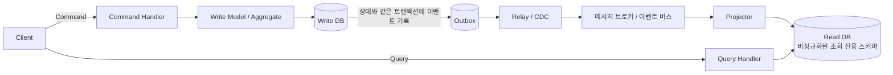

# CQRS 패턴

## 핵심 정의

CQRS(Command Query Responsibility Segregation)는 상태를 변경하는 명령(Command)과 상태를 조회하는 쿼리(Query)의 책임을 서로 다른 모델로 완전히 분리하는 아키텍처 패턴이다. 하나의 도메인 모델이 CRUD를 전부 처리하는 전통적 구조 대신, 쓰기(write) 경로는 비즈니스 규칙 검증과 일관성 보장에 최적화된 모델을, 읽기(read) 경로는 조회 성능에 최적화된 별도의 모델(read model, projection)을 갖는다.

CQRS는 [[이벤트 소싱]]과 자주 함께 언급되지만 독립적인 개념이다. 이벤트 소싱 없이도 "쓰기용 정규화된 테이블 + 읽기용 비정규화된 뷰/테이블"을 나누는 것만으로 CQRS를 구현할 수 있다. 다만 두 패턴을 함께 쓰면, 쓰기 모델이 이벤트를 발행하고 그 이벤트를 구독해 읽기 모델을 갱신하는 구조가 자연스럽게 맞아떨어지기 때문에 실무에서 짝을 이루는 경우가 많다.

## 동작 원리 / 구조

CQRS는 분리 정도에 따라 스펙트럼이 있다. 가장 단순한 형태는 같은 DB 안에서 쓰기용 리포지토리와 읽기용 조회 전용 쿼리(예: 읽기 전용 뷰, 별도 DTO 프로젝션)만 나누는 것이고, 물리적 분리가 큰 형태는 쓰기 DB와 읽기 DB를 물리적으로 분리하고 그 사이를 비동기 이벤트로 동기화하는 것이다.



### 단계별 구현 수준

1. **논리적 분리만**: 같은 DB, 같은 테이블이지만 쓰기 서비스 클래스와 읽기 서비스 클래스(또는 커맨드 DTO와 쿼리 DTO)를 명시적으로 분리한다. 복잡한 인프라 없이도 코드 레벨의 책임 분리 이점을 얻는다.
2. **모델 분리**: 같은 DB 안에 쓰기용 정규화 테이블과 읽기용 비정규화 뷰/구체화 뷰(materialized view)를 별도로 둔다.
3. **저장소 분리**: 쓰기는 RDBMS(트랜잭션, 정합성 중심), 읽기는 다른 종류의 저장소(Elasticsearch, Redis, 비정규화된 조회 전용 RDBMS 등)로 분리하고, 도메인 이벤트를 매개로 비동기 동기화한다. [[읽기와 쓰기 분리]]의 복제(replication) 기반 분리와는 달리, CQRS는 스키마 자체가 다를 수 있다는 점이 핵심 차이다.

### Spring 기반 예시(같은 DB에서 동기 프로젝션)

각 public 클래스는 별도 파일에 두며 도메인 DTO·리포지토리는 프로젝트 타입이다. 기본 동기 이벤트 multicaster와 동일한 트랜잭션 매니저/DB를 전제로 쓰기 모델과 읽기 모델을 한 트랜잭션에서 갱신한다.

```java
// Command 측
@Service
public class OrderCommandService {
    private final OrderRepository orderRepository; // 정규화된 쓰기 모델
    private final ApplicationEventPublisher events;
    public OrderCommandService(OrderRepository orderRepository, ApplicationEventPublisher events) {
        this.orderRepository = orderRepository;
        this.events = events;
    }

    @Transactional
    public void createOrder(CreateOrderCommand cmd) {
        Order order = Order.create(cmd);
        orderRepository.save(order);
        events.publishEvent(new OrderCreatedEvent(order.getId(), order.getItems()));
    }
}

// Query 측 - 별도의 비정규화된 조회 전용 모델
@Service
public class OrderQueryService {
    private final OrderSummaryReadRepository readRepository; // 조회 전용, JOIN 없는 평탄화된 뷰

    public OrderQueryService(OrderSummaryReadRepository readRepository) {
        this.readRepository = readRepository;
    }
    public OrderSummaryView getOrderSummary(String orderId) {
        return readRepository.findByOrderId(orderId);
    }
}

// Projection 갱신 - 이벤트 구독
@Component
public class OrderProjector {
    private final OrderSummaryReadRepository readRepository;

    public OrderProjector(OrderSummaryReadRepository readRepository) {
        this.readRepository = readRepository;
    }
    @EventListener
    @Transactional(propagation = Propagation.MANDATORY)
    public void on(OrderCreatedEvent event) {
        readRepository.save(OrderSummaryView.from(event));
    }
}
```

비동기 분리형에서 단순 @Async 이벤트 리스너는 커밋 전 실행·롤백 데이터 반영·프로세스 종료 시 유실 문제가 있다. @TransactionalEventListener(AFTER_COMMIT)는 실행 시점을 조절하지만 내구성 있는 전달까지 보장하지 않는다. 아웃박스/CDC와 재시도·중복 제거를 설계한 뒤 Kafka 등으로 전달하고, 커맨드와 쿼리가 서로 다른 마이크로서비스/모듈로 분리된다. Java 생태계에서 CQRS+이벤트 소싱을 프레임워크 차원에서 지원하는 대표적인 도구는 Axon Framework다(공식 Axon Framework 5.0 문서에서 CQRS·이벤트 소싱 지원을 확인했다).

## 실무 관점

### 프로젝터의 중복·순서·재구축 계약

[[트랜잭셔널 아웃박스]]는 쓰기 상태와 발행할 이벤트의 원자적 기록을 해결하지만, 읽기 모델이 정확히 한 번 갱신되는 것까지 보장하지 않는다. 아래는 중복 전달과 순서 변경을 견디기 위한 설계 기준이다.

- 이벤트 ID의 처리 기록과 읽기 모델 갱신을 같은 트랜잭션에 넣는다. 처리 기록만 먼저 확정하면 재전달을 무시하면서 실제 갱신이 빠질 수 있고, 갱신만 먼저 확정하면 중복 가산될 수 있다.
- 집계 루트(aggregate)별 버전을 사용하되 이벤트 의미를 구분한다. 완전한 최신 상태를 담은 이벤트는 더 오래된 버전을 무시하는 정책을 쓸 수 있지만, 수량 증감 같은 델타(delta) 이벤트에서 버전이 건너뛰면 재시도·누락 복구가 필요하다. 전역 순서는 대부분의 프로젝션에 불필요하다.
- 삭제 이벤트와 백필이 경합하면 삭제한 데이터가 되살아날 수 있다. 삭제 버전이나 삭제 표식(tombstone), 일관된 스냅샷과 이후 변경의 경계를 정의하고 새 모델을 검증한 뒤 전환한다.

이 계약을 구현하기 어려운 저장소에서는 조건부 쓰기·버전 비교 등 동등한 원자성 경계를 먼저 정한다. 소비 오프셋만 기록했다고 읽기 모델과 원자적으로 반영된 것은 아니다.


- **언제 쓰는가**: 읽기와 쓰기의 트래픽 패턴/스키마 요구가 크게 다른 도메인(읽기가 압도적으로 많고 다양한 검색/집계 뷰가 필요한 커머스 상품 목록, 대시보드), 여러 컨텍스트에서 서로 다른 형태로 같은 데이터를 조회해야 하는 경우(주문 상세는 정규화된 트랜잭션 DB, 주문 검색은 Elasticsearch)에 적합하다.
- **트레이드오프**:
  - 비동기 프로젝션에서는 읽기 모델이 쓰기 모델보다 뒤처질 수 있는 최종 일관성(eventual consistency)을 감수해야 한다. "주문 생성 직후 바로 목록에서 안 보인다"는 문의가 실무에서 흔하다.
  - 두 개의 모델(스키마, 코드, 배포 단위)을 유지보수해야 하므로 복잡도와 초기 구축 비용이 늘어난다. 단순 CRUD 화면에는 과설계가 되기 쉽다.
  - 별도 read model은 이벤트 재생 또는 쓰기 상태의 스냅샷/백필로 재구축할 수 있어야 한다. 이벤트 소싱을 하지 않는 CQRS가 모든 과거 이벤트를 반드시 보관해야 하는 것은 아니다.
- **흔한 실수/장애 사례**:
  - 최종 일관성을 고려하지 않은 UX 설계로, 명령 처리 직후 즉시 조회 화면으로 리다이렉트했는데 read model이 아직 갱신 전이라 사용자가 자신의 조작 결과를 못 보는 경우.
  - Projector가 특정 이벤트 처리에 실패했는데 감지 체계가 없어 read model이 write model과 조용히 어긋난(drift) 채 오래 방치되는 경우.
  - 모든 도메인에 CQRS를 기계적으로 적용해, 트래픽도 적고 읽기/쓰기 패턴 차이도 없는 단순 CRUD 서비스까지 read model을 별도로 두어 유지보수 비용만 늘린 경우.
- **설정/튜닝 포인트**: 이벤트 발행부터 read model 갱신까지의 지연(lag)을 모니터링 지표로 관리, read model 재구축 배치(전체 write model을 다시 읽어 read model을 재생성하는 절차), read model 스키마 변경 시 무중단 마이그레이션 전략(새 read model을 병행 구축 후 스위칭).

## 심화 Q&A

### Q. CQRS를 적용했는데 사용자가 "방금 등록한 데이터가 목록에 안 보인다"고 문의한다. 어떻게 대응하는가?
근본적으로는 완전 분리형 CQRS가 최종 일관성 모델이라는 것을 UX 설계 단계에서 인지시켜야 한다. 실무적 완화책으로는 (1) 명령 처리 응답에 방금 생성된 리소스의 데이터를 그대로 포함해 클라이언트가 read model 조회 없이도 즉시 표시하게 하는 방법, (2) 클라이언트가 자신이 만든 쓰기 결과에 한해 잠시 쓰기 모델(또는 캐시)을 직접 조회하도록 예외 경로를 두는 방법, (3) read model 갱신 지연을 낙관적 UI(optimistic UI)로 가리는 방법이 있다. 쓰기 응답에 커밋 버전/프로젝션 위치를 포함하고 읽기 모델이 그 위치를 반영할 때까지 제한 시간 동안 기다리는 방법도 있다. 같은 DB의 동기 모델도 CQRS이며, 비동기 최종 일관성이 CQRS의 필수 조건은 아니다.

### Q. CQRS와 단순한 읽기 replica(read replica) 분리는 어떻게 다른가?
읽기 replica는 [[읽기와 쓰기 분리]]에서 다루듯 같은 스키마를 물리적으로 복제해 읽기 트래픽을 분산하는 것으로, 데이터 모델 자체는 쓰기와 동일하다. CQRS는 스키마 자체가 다를 수 있다는 점이 핵심이다. 읽기 모델은 여러 테이블을 미리 조인/집계해 비정규화한 형태, 혹은 아예 다른 종류의 저장소(검색 엔진, 캐시)일 수 있다. 즉 replica는 "같은 모델의 복사본"이고 CQRS는 "다른 목적에 맞춘 별도 모델"이다.

### Q. 이벤트 소싱 없이도 CQRS를 구현할 수 있는가? 그 경우 read model은 어떻게 갱신하는가?
가능하다. 쓰기 모델이 상태를 갱신할 때 [[트랜잭셔널 아웃박스]] 패턴으로 변경 이벤트를 신뢰성 있게 발행하고, 이를 구독하는 프로젝터가 읽기 모델을 갱신하는 방식이 일반적이다. 혹은 CDC(Change Data Capture)로 쓰기 DB의 변경 로그를 직접 읽어 읽기 모델에 반영할 수도 있다. 이벤트 소싱처럼 이벤트가 "유일한 진실"일 필요는 없고, 현재 상태를 저장하는 쓰기 DB가 여전히 source of truth이며 이벤트는 단지 read model 동기화 신호 역할만 한다.

### Q. 읽기 모델을 여러 개(예: 목록용, 검색용, 통계용) 두면 어떤 문제가 생기는가?
읽기 모델 수만큼 프로젝터와 스키마, 재구축 절차를 유지보수해야 해 운영 복잡도가 선형으로 증가한다. 또한 각 프로젝터가 이벤트를 개별적으로 소비하므로 갱신 지연 정도가 모델마다 달라질 수 있어("목록에는 보이는데 검색에는 아직 안 나온다"), 사용자 입장에서 일관성 없는 경험으로 비칠 수 있다. 실무에서는 꼭 필요한 조회 패턴에만 전용 read model을 만들고, 나머지는 범용 read model 하나로 커버하는 절충을 취하는 경우가 많다.

### Q. read model이 write model과 어긋났다는 것을 어떻게 감지하고 복구하는가?
감지는 (1) 이벤트 발행 시점과 read model 갱신 완료 시점의 지연(lag)을 모니터링, (2) 주기적으로 write model과 read model의 핵심 필드를 배치로 대사(reconciliation)해 불일치 건수를 집계하는 방식을 쓴다. 복구는 이벤트가 재생 가능(replayable)하다면 새 read model을 별도로 구축하고 일관된 시작점부터 재생한 뒤 검증·전환한다. live 모델을 비우면 조회 중단과 새 이벤트 경쟁이 생긴다. 마지막 정상 위치부터 재생하려면 그 위치의 정확한 스냅샷도 필요하다. 이벤트가 재생 불가능한 구조라면 write model 전체를 스캔해 read model을 재생성하는 백필(backfill) 배치를 마련해야 한다.

### Q. 명령(Command)과 쿼리(Query)를 물리적으로 다른 마이크로서비스로 분리하는 것이 항상 옳은가?
아니다. 서비스를 분리하면 네트워크 홉이 늘고 배포/운영 단위가 늘어나 복잡도가 커진다. 읽기와 쓰기의 트래픽 규모나 확장 요구가 비슷한 수준이라면 굳이 서비스를 나눌 이유가 없고, 같은 서비스 안에서 커맨드 핸들러와 쿼리 핸들러 클래스만 분리하는 논리적 CQRS로 충분한 경우가 많다. 서비스 분리는 읽기 트래픽이 쓰기 트래픽보다 압도적으로 많아 독립적으로 스케일링해야 하거나, 읽기 모델의 저장 기술 자체가 달라야 할 때(예: 검색엔진 필요) 정당화된다.

## 관련 개념

- [[이벤트 소싱]]
- [[트랜잭셔널 아웃박스]]
- [[읽기와 쓰기 분리]]
- [[SAGA 패턴]]

## 참고 자료

확인 날짜: 2026-09-08. 아래 버전과 범위의 공식 문서·소스로 본문을 대조했다. 성능 비교와 운영 선택은 워크로드에 따라 달라지는 판단 기준이다.

- [Azure CQRS Pattern](https://learn.microsoft.com/en-us/azure/architecture/patterns/cqrs) — 공유 DB/분리 DB 모델·장단점·이벤트 소싱 독립성.
- [Spring ApplicationContext Events](https://docs.spring.io/spring-framework/reference/core/beans/context-introduction.html) — Framework 7.0.9 기본 동기 이벤트·비동기 리스너.
- [Spring Transaction-bound Events](https://docs.spring.io/spring-framework/reference/data-access/transaction/event.html) — Framework 7.0.9 commit 단계·비동기 전달과의 구분.
- [Axon Framework 5.0](https://docs.axoniq.io/axon-framework-reference/5.0/) — CQRS·이벤트 소싱 지원 범위.

부분 재검증: 2026-09-23. [Azure CQRS pattern](https://learn.microsoft.com/en-us/azure/architecture/patterns/cqrs)의 분리 저장소·outbox·멱등 소비자와 [AWS Transactional outbox](https://docs.aws.amazon.com/prescriptive-guidance/latest/cloud-design-patterns/transactional-outbox.html)의 중복·순서 주의사항을 확인했다. 버전·델타·삭제·백필 계약은 이를 적용한 설계 기준이다. Spring·Axon 예제 전체는 이번 범위 밖이므로 `verified`는 유지했다.
