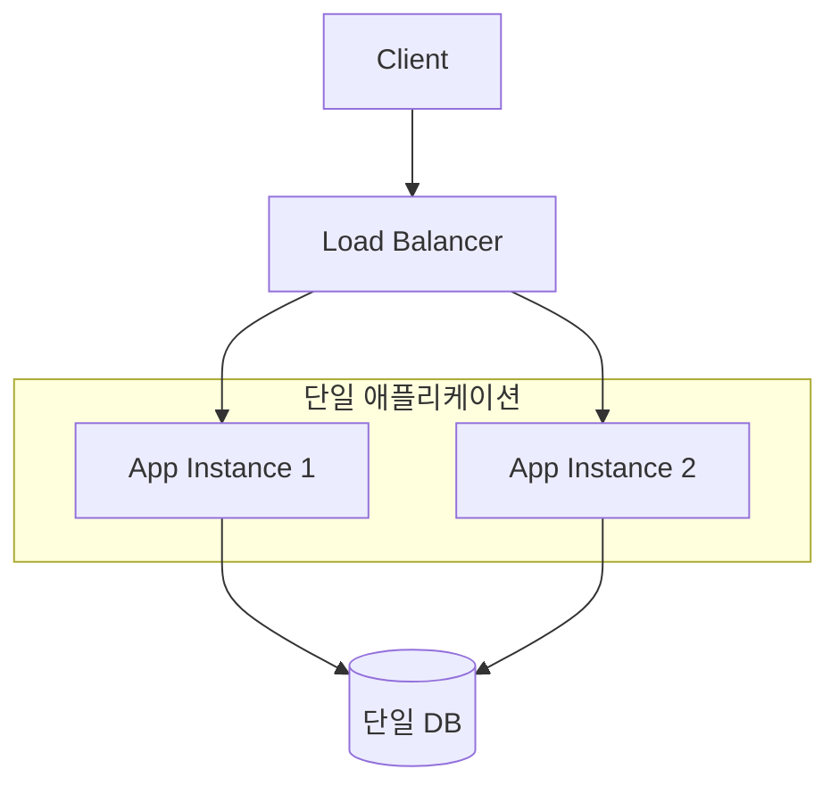
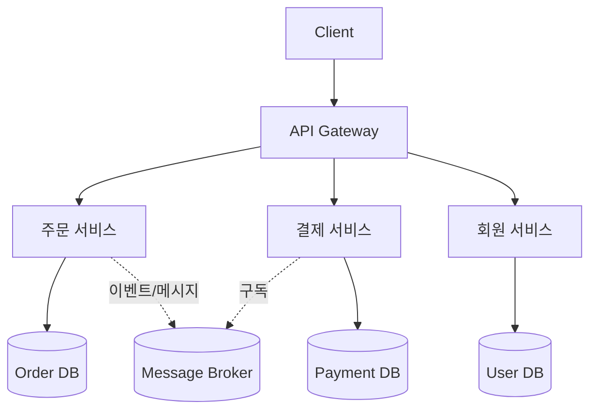

# MSA와 모놀리식 비교

## 핵심 정의
모놀리식 아키텍처(Monolithic Architecture)는 애플리케이션의 모든 기능(도메인 로직, 데이터 접근, UI 등)이 주로 하나의 배포 단위로 묶여 있는 구조다. 저장소 개수나 DB 개수는 정의 조건이 아니며 동일 배포물을 여러 프로세스·인스턴스로 실행할 수 있다. 마이크로서비스 아키텍처(MSA, Microservices Architecture)는 하나의 애플리케이션을 비즈니스 도메인 단위의 독립적인 서비스들로 분리하고, 각 서비스가 데이터 소유권과 독립 배포 경계를 가지며 네트워크(주로 HTTP/REST, gRPC, 메시지 큐)를 통해 통신하는 구조다.

두 방식은 "정답"이 있는 문제가 아니라 조직 규모, 팀 구조, 서비스 복잡도, 운영 역량에 따른 트레이드오프(trade-off) 선택이다. 모놀리식이 항상 나쁘거나 MSA가 항상 우월한 것이 아니라, 잘못된 시점에 잘못된 구조를 선택하는 것이 문제가 된다.

## 동작 원리 / 구조

### 모놀리식 구조

모든 모듈(주문, 결제, 회원 등)이 같은 프로세스 내에서 함수 호출로 통신한다. 배포도 하나의 단위로 이루어진다.

### MSA 구조

서비스 간 통신은 네트워크를 경유하며, 각 서비스는 자신의 데이터베이스를 소유한다(Database per Service 패턴). 물리적 DB 서버까지 반드시 서비스별로 분리하는 것은 아니며 같은 서버의 전용 스키마·테이블로 소유권과 접근을 제한할 수 있다. 서비스 간 데이터 정합성은 분산 트랜잭션 대신 이벤트 기반 최종 일관성(eventual consistency)이나 사가 패턴(Saga Pattern)으로 처리하는 것이 일반적이다.

### 비교표

| 항목 | 모놀리식 | MSA |
|---|---|---|
| 배포 단위 | 전체 애플리케이션 | 서비스별 독립 배포 |
| 코드 결합도 | 모듈 경계에 따라 낮출 수 있음 | 독립 계약을 지킬 때 낮아짐. 네트워크 분리만으로 보장되지 않음 |
| 데이터베이스 | 보통 공유 단일 DB | 서비스별 DB 소유 |
| 트랜잭션 | 로컬 ACID 트랜잭션 용이 | 분산 트랜잭션 회피, Saga/이벤트 기반 |
| 장애 전파 | 한 모듈 장애가 전체에 영향 가능 | 격리 가능(서킷 브레이커 등 필요) |
| 초기 개발 속도 | 빠름 | 초기 인프라 구축 비용 큼 |
| 조직 확장성 | 팀이 커지면 코드 충돌/빌드 병목 발생 | 팀별 독립 개발 가능(Conway's Law 정합) |
| 운영 복잡도 | 낮음 | 높음(분산 추적, 서비스 디스커버리, 오케스트레이션 필요) |
| 테스트 | 단순(단일 프로세스) | 통합 테스트 어려움(계약 테스트 필요) |

## 실무 관점
- **언제 모놀리식으로 시작하는가**: 팀 규모가 작고(예: 단일 팀) 도메인 경계가 아직 불명확한 초기 단계에서는 모놀리식으로 시작하는 것이 일반적으로 권장된다. 도메인 경계를 먼저 코드 레벨의 모듈 분리(패키지 구조, 모듈러 모놀리식)로 검증한 뒤 MSA로 전환하는 전략이 리스크가 낮다. "Monolith First" 전략으로 불린다.
- **언제 MSA로 전환하는가**: 특정 도메인의 트래픽 패턴이 크게 달라 독립적인 스케일링이 필요할 때, 여러 팀이 동시에 같은 코드베이스를 수정하며 배포 병목이 심할 때, 기술 스택을 도메인별로 다르게 가져가야 할 때(폴리글랏) 전환을 고려한다.
- **흔한 실수**: 조직 규모나 트래픽 근거 없이 "유행이라서" MSA를 도입해 분산 시스템의 복잡도(네트워크 지연, 부분 실패, 데이터 정합성)만 떠안는 경우가 많다. 특히 서비스를 지나치게 잘게 쪼개면(나노서비스) 서비스 간 호출이 폭증해 오히려 성능과 개발 생산성이 저하된다.
- **분산 모놀리식(Distributed Monolith) 안티패턴**: 서비스는 물리적으로 분리했지만 서비스 간 결합도가 여전히 높아(동기 호출 체인, 공유 DB) 하나를 배포하려면 다른 서비스도 함께 배포해야 하는 상태. MSA의 장점 없이 단점만 남는 최악의 케이스다.
- **튜닝/설계 포인트**: 서비스 경계는 DDD(Domain-Driven Design)의 바운디드 컨텍스트(Bounded Context) 기준으로 나누는 것이 일반적이다. 서비스 간 동기 호출에는 deadline/timeout을 정하고, 멱등성·재시도 예산·장애 특성에 맞춰 retry와 circuit breaker(예: Resilience4j)를 적용하며, 장애 전파를 막기 위한 벌크헤드(bulkhead) 패턴도 함께 고려한다.

## 심화 Q&A

### Q. 모놀리식에서 MSA로 전환할 때 데이터베이스는 어떤 순서로 분리해야 하는가?
A. 코드와 DB 중 무엇을 먼저 분리할지에 보편적인 정답은 없다. 우선 데이터 소유권·서비스 계약·트랜잭션 경계를 정의하고 변경 순서를 정한다. Strangler Fig 패턴에서는 새 서비스가 기존 DB를 사용하는 이행 단계를 둘 수 있지만, 공유 테이블의 쓰기 주체와 스키마 변경이 결합되어 있다면 코드 배포 분리만으로 독립성을 확보한 것은 아니다. 반대로 DB만 먼저 쪼개면 기존 로직이 여러 DB의 정합성을 다뤄야 할 수 있다. 도메인별 데이터 복제·검증 후 새 DB를 기준 저장소로 전환하고, 호환성과 되돌리기 조건을 만족한 뒤 레거시 접근을 제거하는 식으로 단계의 종료 기준을 정한다.

### Q. 분산 모놀리식과 정상적인 MSA를 구분하는 기준은 무엇인가?
A. 핵심 지표는 "서비스 하나를 독립적으로 배포할 수 있는가"이다. 특정 서비스를 수정했을 때 다른 서비스의 코드 변경이나 동시 배포가 필요하다면, 혹은 여러 서비스가 하나의 스키마를 직접 공유한다면 분산 모놀리식이다. 서비스 간 계약(API 스펙)이 명확히 버전 관리되고 하위 호환성을 지키는지도 판단 기준이 된다.

### Q. MSA 환경에서 여러 서비스에 걸친 트랜잭션은 어떻게 처리하는가?
A. 2PC(Two-Phase Commit)는 참여자의 준비 상태 유지와 조정자 장애 복구 비용이 있어 독립 서비스 경계에서는 Saga를 선택할 수 있다. Saga는 전역 ACID 트랜잭션과 동일한 보장이 아니며 중간 상태가 노출되고 보상이 실패할 수도 있다. 코레오그래피(choreography) 방식은 각 서비스가 이벤트를 발행/구독하며 다음 단계를 트리거하고, 오케스트레이션(orchestration) 방식은 중앙 조정자가 각 서비스의 로컬 트랜잭션 실행 순서를 관리한다. 실패 시에는 보상 트랜잭션(compensating transaction)으로 이전 효과를 업무적으로 상쇄한다. 외부에 이미 관찰된 일을 지우는 DB rollback과 같지는 않다.

### Q. 모놀리식의 확장(scale)과 MSA의 확장은 어떻게 다른가?
A. 모놀리식은 보통 전체 애플리케이션을 인스턴스 단위로 복제하는 전체 인스턴스의 수평 확장(scale-out)이나 수직 확장을 하므로, 트래픽이 적은 모듈까지 함께 복제되어 자원 낭비가 발생한다. MSA는 트래픽이 몰리는 서비스만 선택적으로 확장할 수 있어 자원 효율이 높다. 다만 이 이점을 얻으려면 오토스케일링과 서비스별 리소스 관측(모니터링)이 뒷받침되어야 하며, 그렇지 않으면 오히려 관리 포인트만 늘어난다.

### Q. 모듈러 모놀리식(Modular Monolith)은 MSA와 어떤 차이가 있고 왜 중간 대안으로 언급되는가?
A. 모듈러 모놀리식은 배포는 단일 단위로 유지하되, 코드 레벨에서 패키지/모듈 경계와 인터페이스를 엄격히 분리해 도메인 간 직접 의존을 차단하는 구조다. 네트워크 통신 없이도 낮은 결합도를 얻을 수 있어 트랜잭션 처리와 로컬 개발이 단순하면서, 추후 특정 모듈만 별도 서비스로 추출하기 쉬운 형태를 유지한다. 도메인 경계가 아직 검증되지 않은 초기 단계에서 MSA로 바로 가는 리스크를 줄이는 현실적인 중간 단계로 많이 채택된다.

### Q. 서비스 개수가 늘어나면 어떤 지점에서 운영 복잡도가 임계점을 넘는가?
A. 정해진 숫자는 없지만, 서비스 간 호출 그래프가 사람이 파악하기 어려워지는 시점, 장애 발생 시 원인 서비스를 특정하는 데 시간이 오래 걸리는 시점이 신호다. 이때부터는 분산 추적(distributed tracing, 예: OpenTelemetry), 중앙 집중 로깅, 호출 관계 관측을 마련하고 필요에 따라 서비스 메시(service mesh)를 도입할 수 있으며, 이런 인프라 투자 없이 서비스 수만 늘리면 장애 대응 시간이 급격히 늘어난다.

### Q. 트래픽 라우팅을 이전 서비스로 돌리면 데이터 이행도 되돌릴 수 있는가?
A. 새 DB에서 받은 쓰기가 이전 DB에 반영되지 않았다면 트래픽만 되돌려도 데이터가 과거 상태로 보이거나 유실될 수 있다. 이행 단계마다 권위 있는 쓰기 주체를 정하고, 변경 데이터 캡처(Change Data Capture, CDC)·재처리·대사로 두 저장소의 차이를 검증한다. 양쪽에서 같은 데이터를 자유롭게 수정하도록 열어 두면 충돌 해결까지 이행 설계에 포함해야 한다.

Azure Strangler Fig 지침은 기존 스키마와 동기화 경로가 유지되는 단계와, 이를 제거한 뒤를 구분한다. 후자에서는 복원·변환·변경분 재생이 필요할 수 있어 즉시 롤백으로 취급할 수 없다. 전환 전에 허용 가능한 데이터 지연, 마지막 일치 시점, 구·신 버전의 스키마 호환 범위, 되돌릴 수 없게 되는 정리 단계를 명시한다. 복제 파이프라인이 있다는 사실만으로 무손실 양방향 전환을 가정하지 않는다.

## 관련 개념
- [[API Gateway]]
- [[서킷 브레이커와 장애 격리]]
- [[SAGA 패턴]]

## 참고 자료

확인 날짜: 2026-09-08. 아래 버전과 범위의 공식 문서·소스로 본문을 대조했다. 성능 비교와 운영 선택은 워크로드에 따라 달라지는 판단 기준이다.

- [Microservices — Lewis/Fowler](https://martinfowler.com/articles/microservices.html) — 독립 배포·분산 데이터·장애 설계의 아키텍처 설명.
- [Monolith First](https://martinfowler.com/bliki/MonolithFirst.html) — 도메인 경계를 검증하며 단계적으로 분리하는 전략과 한계.
- [Database per Service Pattern](https://microservices.io/patterns/data/database-per-service.html) — 전용 테이블·스키마·DB 서버별 소유권 구현.
- [Saga Pattern](https://microservices.io/patterns/data/saga.html) — 로컬 트랜잭션·보상·격리 한계.
- [Azure Strangler Fig Pattern](https://learn.microsoft.com/en-us/azure/architecture/patterns/strangler-fig) — 점진 전환과 라우팅·데이터 이행.

부분 재확인: 2026-09-23. [Azure Strangler Fig Pattern — Database migration considerations](https://learn.microsoft.com/en-us/azure/architecture/patterns/strangler-fig#database-migration-considerations)의 레거시 DB 병행·ETL/CDC 검증·새 DB 기준 전환·정리 전후 롤백 차이를 확인했다. 쓰기 소유권과 대사 종료 조건은 이 절차를 적용한 설계 판단이다. 기존 MSA 비교와 Saga 설명 전체는 재검증하지 않아 `verified`는 유지한다.
