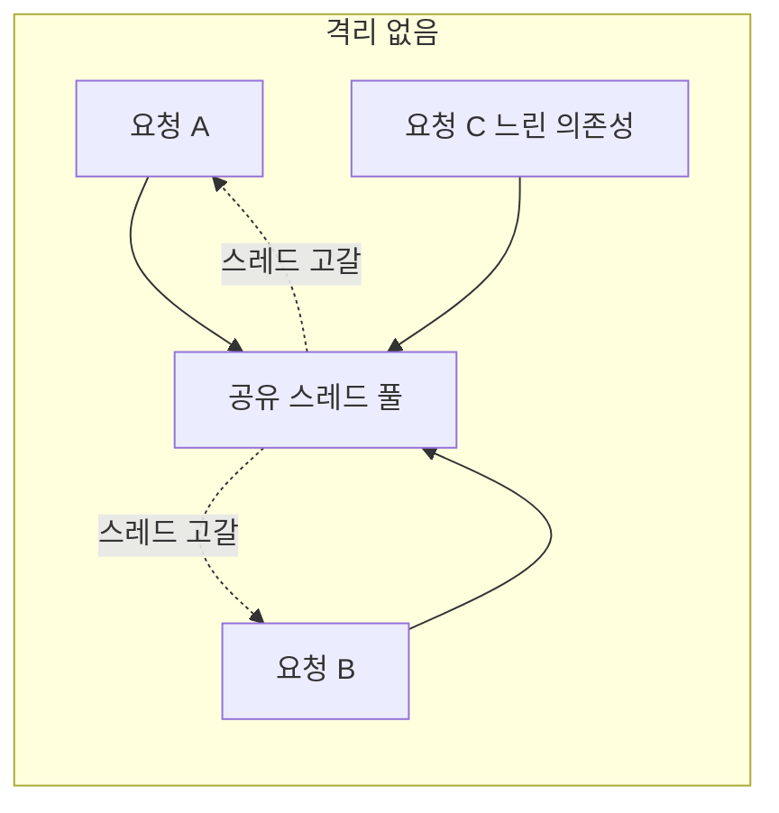
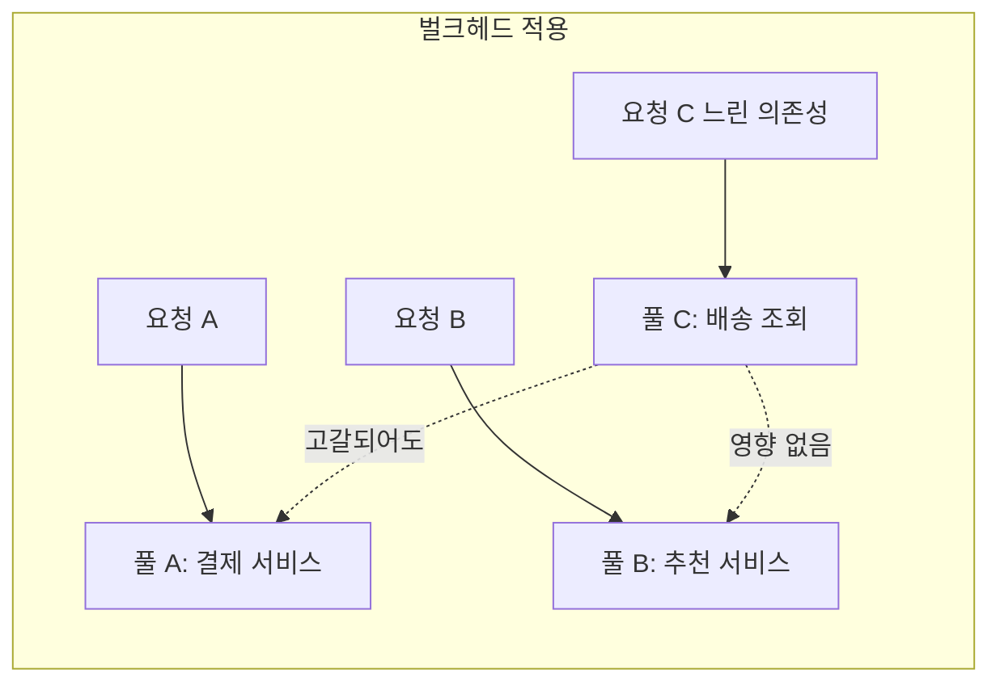

# Bulkhead 패턴

## 핵심 정의

벌크헤드(bulkhead) 패턴은 하나의 의존성(외부 API, DB, 특정 기능)이 시스템의 자원(스레드, 커넥션, 세마포어 permit)을 독점하지 못하도록 자원 풀을 미리 격실 단위로 분리하는 안정성 패턴이다. 배 밑바닥을 여러 방수 격실(bulkhead)로 나눠 한 칸에 물이 차도 배 전체가 침몰하지 않게 하는 조선 설계에서 이름을 따왔다. 서킷 브레이커(circuit breaker)가 "이 의존성 호출을 계속할지 말지"를 판단하는 것과 달리, 벌크헤드는 애초에 "이 의존성이 쓸 수 있는 자원의 상한"을 고정해 한 의존성의 장애가 다른 기능의 자원 고갈로 번지는 것(noisy neighbor)을 막는다.

## 동작 원리 / 구조

벌크헤드는 크게 두 가지 구현 방식이 있으며, Resilience4j는 둘 다 제공한다.





- **세마포어 기반(SemaphoreBulkhead)**: 호출 스레드를 그대로 사용하되 `Semaphore`로 동시 실행 개수(`maxConcurrentCalls`)만 제한한다. 스레드 전환 오버헤드가 없어 가볍지만, 느린 호출이 permit을 오래 붙잡으면 호출 스레드(예: 서블릿 스레드) 자체는 여전히 블로킹된다. `maxWaitDuration`으로 permit을 기다릴 최대 시간을 설정하며, 0으로 두면 permit이 없을 때 즉시 거부한다.
- **스레드 풀 기반(ThreadPoolBulkhead)**: core/max 크기를 갖는 별도 스레드 풀과 유한 큐(Resilience4j 2.3.0은 양수 용량에 ArrayBlockingQueue, 0에 SynchronousQueue)로 호출을 격리 실행한다. `coreThreadPoolSize`, `maxThreadPoolSize`, `queueCapacity`로 자원 상한을 정의하며, 호출 스레드와 실행 스레드가 분리되어 해당 실행 스레드 자원을 분리한다. CPU·힙·DB 풀까지 자동으로 분리하지는 않는다. 대신 스레드 전환 비용과 별도 스레드 풀 관리 오버헤드가 든다.

```yaml
resilience4j:
  bulkhead:
    instances:
      recommendationService:
        max-concurrent-calls: 20
        max-wait-duration: 10ms
  thread-pool-bulkhead:
    instances:
      shippingLookup:
        core-thread-pool-size: 4
        max-thread-pool-size: 8
        queue-capacity: 20
```

```java
@Bulkhead(name = "shippingLookup", type = Bulkhead.Type.THREADPOOL)
public CompletableFuture<ShippingStatus> lookup(String orderId) {
    // 메서드 본문은 THREADPOOL aspect가 선택한 worker에서 실행된다.
    return CompletableFuture.completedFuture(shippingClient.status(orderId));
}
```

위 예제는 Spring AOP 프록시를 통한 호출과 프로젝트의 shippingClient/ShippingStatus 타입을 전제로 한다. 메서드 안에서 실행기를 생략한 supplyAsync를 쓰면 실제 I/O가 commonPool에서 실행되어 별도 bulkhead worker는 그 완료를 기다리는 이중 실행 구조가 된다. HTTP client timeout도 별도로 설정해야 한다.

여러 데코레이터를 조합할 때 Resilience4j의 어노테이션 적용 순서는 `Retry(CircuitBreaker(RateLimiter(TimeLimiter(Bulkhead(Method)))))` 기본 순서를 사용하며 aspect order 설정이나 명시적 함수 데코레이터로 바꿀 수 있어, 벌크헤드가 가장 안쪽에서 실제 자원 격리를 담당하고 그 바깥을 서킷 브레이커·재시도가 감싸는 구조다.

인프라 레벨에서는 애플리케이션 내부의 스레드/세마포어 벌크헤드 외에, 커넥션 풀 자체를 의존성별로 분리(예: DB 리드 전용 풀과 배치 전용 풀 분리)하거나, 쿠버네티스에서 리소스 쿼터(resource quota)/네임스페이스로 워크로드를 격리하는 것도 넓은 의미의 벌크헤드 적용이다.

## 실무 관점

- **언제/왜 쓰는지**: 한 서비스가 여러 다운스트림 의존성을 호출하는데 그중 하나(예: 외부 결제사)가 느려질 가능성이 있고, 그 지연이 다른 기능(상품 조회 등)까지 전파되면 안 될 때 적용한다. 특히 동기 블로킹 I/O 기반 서비스에서 스레드 풀이 유한 자원이라는 점 때문에 필수적이다.
- **트레이드오프**: 자원을 미리 나눠 쓰기 때문에 트래픽이 특정 의존성에 몰릴 때 전체 자원을 유연하게 활용하지 못한다. 즉 격리(isolation)와 자원 효율(utilization) 사이의 트레이드오프다. 풀을 너무 잘게 쪼개면 평상시 자원 낭비가 커지고, 너무 크게 묶으면 격리 효과가 옅어진다.
- **흔한 실수**: 세마포어 벌크헤드만 적용하고 타임아웃을 걸지 않으면, 느린 호출이 permit을 계속 붙잡아 결국 대기 요청이 쌓이는 구조적 지연으로 이어진다. 세마포어 벌크헤드는 호출 스레드 자체를 격리하지 않으므로, 서블릿 컨테이너의 스레드 풀 고갈을 막으려면 maxWaitDuration=0과 호출자 풀보다 충분히 작은 permit 상한으로 점유량을 제한할 수도 있다. 별도 스레드 풀이나 비동기 처리도 선택지이며, Future.get/join으로 즉시 기다리면 호출 스레드는 계속 점유된다. 또한 벌크헤드 크기를 다운스트림의 실제 처리량(throughput)과 무관하게 임의로 정하면 정상 상황에서도 불필요한 거부가 발생한다.
- **설정/튜닝 포인트**: `maxConcurrentCalls`/스레드 풀 크기는 다운스트림의 평균 처리율 λ(요청/초)와 평균 체류 시간 W(초)를 곱한 평균 동시 요청 수 L=λW라는 리틀의 법칙(Little's Law) 기반으로 초깃값 추정을 할 수 있다. 이는 안정 상태의 평균 관계이며 tail latency·버스트·다운스트림 용량 상한을 보장하는 공식은 아니다. L·λ·W는 동일한 경계를 측정해야 한다. 예를 들어 거부된 요청까지 포함한 외부 도착률과 실제 실행에 들어온 요청의 서비스 시간만 섞으면 permit 점유량 추정이 맞지 않는다. `queueCapacity`가 너무 크면 대기 요청이 쌓여 응답 지연(latency)이 커지고, 너무 작으면 스파이크에 취약해진다. Micrometer로 `resilience4j.bulkhead.available.concurrent.calls`, `resilience4j.bulkhead.max.allowed.concurrent.calls` 등을 모니터링해 실제 사용률을 보고 조정해야 한다.

### 비동기 작업은 반환 시점과 완료 시점이 다르다

Resilience4j 2.3.0의 직접 함수 데코레이터에서 `decorateSupplier`는 supplier가 반환하면 permit을 돌려준다. supplier가 미완료 CompletableFuture를 반환한다면, 내부 I/O가 계속 실행 중이어도 permit은 이미 반환된다. 비동기 작업의 완료까지 동시성을 제한하려면 `decorateCompletionStage`처럼 완료 신호를 관찰하는 경로를 사용한다. 이름이 같은 Bulkhead를 붙였다는 사실보다 어떤 반환 타입을 어떤 데코레이터로 감쌌는지가 중요하다.

검증할 때는 한도 1에서 첫 future를 미완료로 유지하고 다음 호출이 실제로 거부되는지 확인한다. 또한 관찰 중인 future의 완료가 실제 하위 작업 종료를 뜻하는지도 점검한다. 시간 제한으로 바깥 future만 완료되고 실제 I/O가 남는 구성은 논리적 permit 수와 하위 자원 점유를 다르게 만들 수 있으므로 취소·client timeout을 별도로 설계한다.

## 심화 Q&A

### Q. 세마포어 벌크헤드와 스레드 풀 벌크헤드 중 언제 어느 쪽을 선택해야 하는가?
호출이 이미 비동기/논블로킹(WebClient, 리액티브 스택)이라면 세마포어 벌크헤드로 동시성만 제한해도 충분하다. 반면 블로킹 클라이언트(JDBC, 블로킹 HTTP 클라이언트)를 호출해야 하고 그 호출이 서블릿 스레드를 오래 점유할 위험이 있다면, 스레드 풀 벌크헤드로 실행 자체를 별도 스레드로 옮기는 방식이 유용하다. 호출자도 비동기로 결과를 받아야 호출자 풀 점유가 줄어든다. 스레드 풀 벌크헤드는 컨텍스트 전환 비용과 스레드 풀 관리 오버헤드가 추가된다는 점을 감안해야 한다.

### Q. 벌크헤드와 서킷 브레이커는 어떤 순서로, 왜 함께 적용해야 하는가?
벌크헤드는 자원 고갈을 막고, 서킷 브레이커는 실패가 뻔한 호출을 아예 차단한다. 벌크헤드만 있으면 자원은 보호되지만 이미 죽은 의존성에 계속 요청을 보내며 permit을 낭비하고, 서킷 브레이커만 있으면 회로가 열리기 전까지는 여전히 스레드/permit이 소진될 수 있다. Resilience4j 어노테이션 조합에서 벌크헤드가 가장 안쪽에 위치하는 것도 이 때문이다. 즉 서킷이 CLOSED인 정상 구간에서도 자원 상한 자체는 항상 벌크헤드가 지킨다.

### Q. 벌크헤드 크기를 너무 작게 잡으면 어떤 장애 패턴이 나타나는가?
정상 트래픽인데도 `BulkheadFullException`이 자주 발생해 실제로는 다운스트림이 멀쩡한데도 요청이 거부되는 오탐(false rejection)이 늘어난다. 이는 모니터링에서 다운스트림 에러율은 낮은데 자체 서비스의 거부율만 높게 나타나는 패턴으로 확인할 수 있으며, 원인 파악 없이 벌크헤드 크기만 늘리면 근본 문제(다운스트림 응답 시간 저하)를 가리게 되므로 응답 시간 지표를 같이 봐야 한다.

### Q. MSA에서 벌크헤드를 애플리케이션 레벨이 아니라 인프라 레벨에서 적용하는 방법은?
쿠버네티스에서는 파드별 CPU/메모리 리소스 요청·제한(requests/limits)과 네임스페이스 리소스 쿼터로 자원 소비/할당량을 제한할 수 있지만 네임스페이스와 quota만으로 CPU·네트워크·디스크 경합이 완전히 격리되지는 않으며, 서비스 메시(예: Istio)에서는 커넥션 풀 크기와 최대 동시 요청 수를 사이드카 레벨에서 제한해 애플리케이션 코드 변경 없이 벌크헤드 효과를 낼 수 있다. 애플리케이션 레벨 벌크헤드와 인프라 레벨 벌크헤드는 배타적이지 않고 계층을 이뤄 함께 적용되는 경우가 많다.

### Q. 벌크헤드로 격리했는데도 연쇄 장애가 발생할 수 있는 경우는?
벌크헤드가 스레드/커넥션은 격리해도, 여러 격실이 결국 같은 하위 자원(예: 단일 DB 커넥션 풀의 물리 커넥션 수, 단일 이벤트 루프, 공유 캐시 클러스터)을 공유하면 그 하위 자원에서 병목이 생겨 격리 효과가 무력화된다. 즉 벌크헤드는 자신이 관리하는 자원 계층까지만 격리하므로, 격리 경계를 설계할 때 실제 공유 자원이 어디까지인지 전체 스택을 확인해야 한다.

### Q. 벌크헤드 permit 대기(`maxWaitDuration`)를 0이 아닌 값으로 두는 것이 항상 안전한가?
아니다. 대기 시간을 늘리면 순간적인 트래픽 버스트를 흡수해 거부율은 낮아지지만, 그만큼 호출 스레드가 permit을 기다리게 되어 전체 응답 시간 분포의 꼬리(tail latency)가 길어진다. ThreadPoolBulkhead의 작업 큐 대기는 별도 개념이며 maxWaitDuration은 SemaphoreBulkhead 설정이다. 사용자 응답 시간 SLA가 엄격한 API라면 대기 시간을 짧게 잡고 빠르게 거부한 뒤 우아한 성능 저하로 대응하는 편이 낫다.

## 관련 개념

- [[서킷 브레이커와 장애 격리]]
- [[우아한 성능 저하]]
- [[Rate Limiting 알고리즘]]
- [[컨슈머 랙과 백프레셔]]

## 참고 자료

확인 날짜: 2026-09-08. 아래 버전과 범위의 공식 문서·소스로 본문을 대조했다. 성능 비교와 운영 선택은 워크로드에 따라 달라지는 판단 기준이다.

- [Resilience4j Bulkhead](https://resilience4j.readme.io/docs/bulkhead) — Semaphore/ThreadPool 기본 개념·대기 설정.
- [Resilience4j Spring Boot Integration](https://resilience4j.readme.io/docs/getting-started-3) — 어노테이션·fallback·설정·변경 가능한 aspect 순서.
- [BulkheadAspect 2.3.0 소스](https://raw.githubusercontent.com/resilience4j/resilience4j/v2.3.0/resilience4j-spring6/src/main/java/io/github/resilience4j/spring6/bulkhead/configure/BulkheadAspect.java) — THREADPOOL worker에서 본문 호출 및 future 완료 대기.
- [FixedThreadPoolBulkhead 2.3.0 소스](https://raw.githubusercontent.com/resilience4j/resilience4j/v2.3.0/resilience4j-bulkhead/src/main/java/io/github/resilience4j/bulkhead/internal/FixedThreadPoolBulkhead.java) — core/max executor와 유한/직접 전달 큐.
- [Resilience4j Micrometer](https://resilience4j.readme.io/docs/micrometer) — bulkhead metric 이름과 계측.
- [Azure Bulkhead Pattern](https://learn.microsoft.com/en-us/azure/architecture/patterns/bulkhead) — 격리 경계와 자원 효율 trade-off.
- [Kubernetes Resource Quotas](https://kubernetes.io/docs/concepts/policy/resource-quotas/) — 열람 문서의 namespace 할당량과 적용 한계.
- [John D. C. Little — A Proof for the Queuing Formula](https://pubsonline.informs.org/doi/abs/10.1287/opre.9.3.383?journalCode=opre) — 1961 논문 초록의 평균 관계 L=λW와 정상 상태 전제.

부분 재검증: 2026-09-22. [Little 원논문의 MIT 공개 사본](https://fisherp.scripts.mit.edu/wordpress/wp-content/uploads/2015/11/ContentServer.pdf) pp.383·387의 평균 관계·정상성 및 시스템 경계 일치 조건을 대조했다. 기존 INFORMS 원문 링크는 접근 제한(HTTP 403)이 있어 유지하면서 공개 사본을 보완했다. 그 외 서술은 이번 확인 범위 밖이므로 `verified`는 유지했다.

부분 재검증: 2026-10-04. [Resilience4j v2.3.0 Bulkhead 고정 소스](https://raw.githubusercontent.com/resilience4j/resilience4j/v2.3.0/resilience4j-bulkhead/src/main/java/io/github/resilience4j/bulkhead/Bulkhead.java)의 decorateSupplier finally와 decorateCompletionStage whenComplete를 대조했다. 같은 2.3.0 라이브러리·JDK 25.0.4에서 한도 1과 수동 완료 future로 실행해, Supplier는 미완료 작업 2개를 허용하고 CompletionStage는 첫 완료 전 두 번째를 거부하며 완료 후 permit을 반환함을 확인했다. 실제 I/O 취소·Spring AOP·ThreadPoolBulkhead의 동작까지 시험한 것은 아니며 `verified`는 유지했다.
