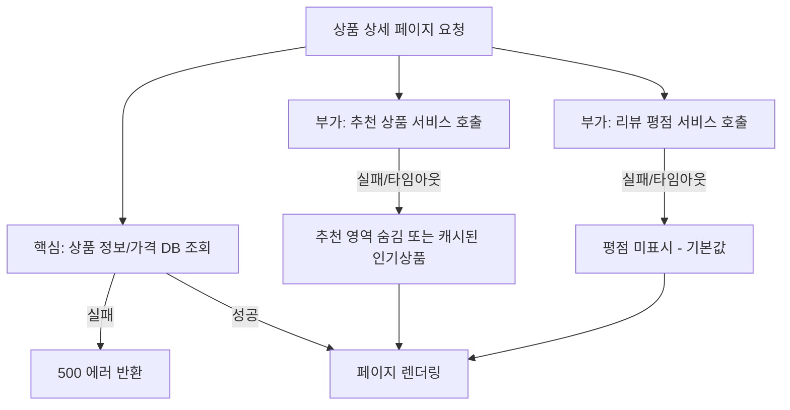

# 우아한 성능 저하

## 핵심 정의

우아한 성능 저하(graceful degradation)는 시스템 일부에 장애나 부하가 발생했을 때 전체 서비스를 완전히 중단시키는 대신, 핵심 기능은 유지하고 부가 기능이나 정확도를 의도적으로 낮춰서라도 서비스를 계속 제공하는 설계 원칙이다. "모 아니면 도"(all-or-nothing) 방식으로 하나라도 실패하면 전체 요청을 실패 처리하는 것과 반대되는 개념으로, 허용 가능한 기능·최신성·정밀도 범위를 정하고 그 안에서 가용성(availability)을 유지하는 명시적인 비즈니스 판단을 코드 레벨로 구현한 것이다. 서킷 브레이커의 폴백(fallback), 캐시 활용, 기능 플래그(feature flag) 기반 부분 비활성화 등이 이를 구현하는 구체적 수단이다.

## 동작 원리 / 구조

우아한 성능 저하는 보통 계층별로 "핵심 경로(critical path)"와 "부가 경로(non-critical path)"를 구분하는 데서 시작한다.



대표적인 저하 전략은 다음과 같이 분류할 수 있다.

| 전략 | 설명 | 예시 |
|---|---|---|
| 기능 생략(feature shedding) | 핵심이 아닌 UI 요소/기능을 통째로 제거 | 추천 위젯, 실시간 재고 수량 숨김 |
| 캐시 대체(stale fallback) | 최신 데이터 대신 오래된 캐시나 스냅샷 사용 | CDN 캐시, 로컬 캐시로 대체 응답 |
| 정적/기본값 대체 | 동적 계산 대신 미리 정의된 기본값 사용 | 개인화 추천 실패 시 인기 상품 고정 목록 |
| 정밀도 저하 | 정확한 집계 대신 근사치나 샘플링 결과 제공 | 실시간 조회수를 정확 카운트 대신 근사 카운터로 |
| 부하 기반 셰딩(load shedding) | 과부하 시 우선순위 낮은 요청을 아예 거부 | 무료 회원 요청보다 유료 회원 요청 우선 처리 |
| 읽기 전용 모드 | 쓰기 경로 장애 시 조회만 허용 | DB 마스터 장애 시 읽기 복제본으로만 서비스 |

```java
@CircuitBreaker(name = "recommendationService", fallbackMethod = "fallbackToPopular")
public List<Product> getRecommendations(Long userId) {
    return recommendationClient.forUser(userId);
}

private List<Product> fallbackToPopular(Long userId, Throwable t) {
    // 개인화 실패 시 캐시된 인기 상품 목록으로 저하
    return popularProductsCache.getOrDefault(DEFAULT_KEY, List.of());
}
```

핵심은 "무엇이 핵심 경로인가"를 사전에 명시적으로 정의하고, 부가 경로의 실패가 핵심 경로의 응답 자체를 막지 않도록 타임아웃/서킷 브레이커/비동기 처리로 분리하는 것이다. 프런트엔드에서는 서버가 부분 실패를 표시하는 필드(예: `recommendations: null`)를 내려주고 UI가 해당 영역만 자연스럽게 숨기는 방식으로 우아한 성능 저하를 완성한다.

## 실무 관점

- **언제/왜 쓰는지**: 여러 마이크로서비스를 조합해 하나의 화면/API 응답을 구성하는 구조(BFF, 애그리게이션 게이트웨이)에서 필수적이다. 하나의 부가 서비스 장애가 전체 페이지 500 에러로 이어지는 것은 대부분의 경우 과도한 결합(coupling)이며, 사용자 경험 관점에서도 부분 정보라도 보여주는 것이 완전 실패보다 낫다.
- **트레이드오프**: 저하된 응답은 정확성이나 최신성이 떨어질 수 있다. 재고 수량, 가격, 결제 상태처럼 정합성이 비즈니스에 직결되는 데이터는 함부로 캐시나 기본값으로 대체하면 안 되며, 어떤 데이터가 "저하 가능"이고 어떤 데이터가 "저하 불가"인지 도메인 전문가와 명시적으로 합의해야 한다.
- **흔한 실수**: 폴백 로직 자체에 버그가 있거나 폴백이 의존하는 캐시/기본값 저장소도 같은 인프라를 공유하거나 원격 폴백 자체에 timeout이 없어 함께 장애가 나는 경우(폴백의 폴백이 없는 상태)가 흔하다. 또한 저하가 발생했다는 사실을 로깅/메트릭으로 남기지 않아, 부분 장애가 장기간 방치되며 사용자만 계속 저하된 경험을 받는 경우도 잦다.
- **설정/튜닝 포인트**: 부가 경로에는 전체 deadline 안의 별도 timeout 예산을 정하고 필요하면 circuit breaker를 적용해 지연 영향을 제한한다. 동기 호출에 CircuitBreaker만 붙여도 timeout이 생기는 것은 아니다. 예를 들어 핵심 경로(상품/가격 DB 조회)의 타임아웃을 2~3초로 잡는다면, 추천/리뷰 같은 부가 경로는 300ms~500ms 수준으로 훨씬 짧게 잡아 부가 호출이 핵심 경로 SLA를 잠식하지 못하게 한다.

다음 TimeLimiter 수치는 예시이며 Future/CompletionStage 또는 지원되는 리액티브 타입에 TimeLimiter를 적용하는 별도 코드가 필요하다. 위 List 반환 동기 메서드에는 YAML만으로 TimeLimiter가 걸리지 않는다. 그 코드에는 실제 HTTP client timeout을 설정한다.

```yaml
resilience4j:
  timelimiter:
    instances:
      recommendationService:   # 부가 경로: 짧게
        timeout-duration: 300ms
      productDetailService:    # 핵심 경로: 상대적으로 여유 있게
        timeout-duration: 2500ms
  circuitbreaker:
    instances:
      recommendationService:
        sliding-window-size: 20
        failure-rate-threshold: 50
        wait-duration-in-open-state: 10s
```

저하 발생 시 별도의 메트릭(예: `degraded_response_total{service="recommendation"}`)을 남기고, 전체 응답 대비 저하 응답 비율이 특정 임계치(예: 5%)를 넘으면 알람을 걸어, 저하가 "가끔 있는 일"이 아니라 "지속적인 장애 신호"로 방치되지 않는지 추적해야 한다.

### 과부하를 실제로 줄이는 저하 경로

저하 응답을 돌려주더라도 이미 시작한 고비용 작업이 계속 돌면 자원은 회복되지 않는다. 추천 서비스를 포기한 뒤 동일한 DB에서 더 무거운 인기 상품 집계를 실행하는 폴백도 병목을 옮기거나 악화시킨다. 기능 생략·미리 계산한 결과·크기가 제한된 로컬 데이터처럼 실패한 경로보다 자원 비용이 낮은 대안을 준비하고, 원래 작업의 취소 또는 실행 시간 제한도 별도로 확인한다.

일부 인스턴스만 과부하이고 다른 인스턴스에 여유가 있다면 제한된 재시도가 도움이 될 수 있다. 전체 서비스가 포화되었다면 다른 인스턴스로 재시도하는 것도 부하를 늘린다. Google SRE는 요청별·클라이언트별 재시도 예산을 두고, 여러 계층이 같은 실패를 중첩 재시도하지 않게 설계하도록 설명한다. 저하 응답을 받아도 상위가 자동 재시도한다면 그 예산까지 포함해야 한다.

검증할 때는 정상 요청의 지연뿐 아니라 저하 전후의 DB 쿼리 수·실행 중 작업·CPU·큐 길이와 저하 비율을 함께 본다. 복구 경계에서 기능을 반복해서 켰다 끄는 현상을 피하려면 진입·복귀 조건을 분리하거나 안정화 시간을 둘 수 있다. 구체적인 임계치는 실제 부하 시험으로 정하는 운영 선택이다.

## 심화 Q&A

### Q. 우아한 성능 저하와 서킷 브레이커 폴백은 같은 개념인가?
서킷 브레이커 폴백은 우아한 성능 저하를 구현하는 하나의 메커니즘이지 동일 개념은 아니다. 우아한 성능 저하는 "무엇을 얼마나 낮출 것인가"에 대한 설계 원칙이자 비즈니스 정책이고, 서킷 브레이커/타임아웃/기능 플래그는 그 정책을 실행하는 기술적 수단이다. 예를 들어 부하 기반 셰딩처럼 서킷 브레이커 없이도 우아한 성능 저하를 구현하는 방식이 있다.

### Q. 어떤 데이터/기능을 저하 가능(degradable) 대상으로 정할지 어떻게 판단하는가?
일반적으로 (1) 사용자의 핵심 작업 완료 여부에 영향을 주는가, (2) 잘못된/오래된 값을 보여줬을 때 금전적·법적 리스크가 있는가, 두 축으로 판단한다. 결제 금액, 재고 확정 수량, 권한/인증 정보는 저하 불가 영역이고, 추천, 리뷰 평점, 배송 예상일 같은 보조 정보는 저하 가능 영역으로 분류하는 것이 일반적이다. 이 분류는 코드 작성 전에 도메인 담당자와 합의해 문서화해야 사후에 임의로 결정되는 것을 막을 수 있다.

### Q. 부하 기반 셰딩(load shedding)에서 어떤 요청을 우선적으로 버려야 하는가?
일반적으로 재시도 비용이 낮고 사용자 임팩트가 작은 요청(백그라운드 배치, 크롤러, 비로그인 사용자의 저가치 조회)부터 거부하고, 결제 완료 직전 단계처럼 이미 상태 변경이 진행 중인 요청은 최대한 보호한다. 신뢰할 수 있는 서버 정책으로 우선순위를 결정하고 외부 입력 헤더를 그대로 믿지 않도록 검증한 뒤 API 게이트웨이/로드밸런서 단에서 셰딩하는 것이 애플리케이션 코드에 로직을 흩뿌리는 것보다 유지보수하기 쉽다.

### Q. 캐시 기반 폴백을 쓸 때 캐시가 비었거나(cold) 오래되었으면(stale) 어떻게 대응해야 하는가?
캐시 만료 정책과 별개로 폴백 전용의 "최후 방어선(last-resort)" 캐시를 장수명(long TTL)으로 별도 유지하는 방법이 흔히 쓰인다. 이 캐시는 정상 요청 경로에서는 쓰이지 않다가 다운스트림 장애 시에만 조회되며, 장애 시 사용할 사전 데이터를 확보하는 것이 목적이다. cold cache는 반환할 값 자체가 없으므로 사전 적재·정적 기본값·기능 생략이 필요하다. stale cache는 업무적으로 허용한 최대 나이를 넘기지 않아야 한다. 이때 응답에 "지연된 정보입니다" 같은 명시적 신호를 포함해 사용자가 데이터의 최신성을 오해하지 않도록 해야 한다.

### Q. 우아한 성능 저하가 오히려 장애를 은폐해 사후 대응을 늦추는 부작용은 어떻게 방지하는가?
저하가 발동될 때마다 반드시 관측 가능성(observability) 지표(로그, 메트릭, 트레이스 스팬 태그)를 남기고, 정상 응답과 저하 응답의 비율을 대시보드로 상시 노출해야 한다. 우아한 성능 저하는 사용자에게 장애를 숨기기 위한 것이 아니라 사용자 영향을 최소화하면서 운영팀에게는 장애를 명확히 드러내기 위한 것이라는 원칙을 지켜야, 저하 상태가 "새로운 정상"으로 방치되는 것을 막을 수 있다.

### Q. MSA에서 여러 서비스를 병렬로 호출해 응답을 조합할 때, 일부만 실패한 경우 응답 코드는 어떻게 결정해야 하는가?
계약상 선택적인 부가 기능만 실패하고 핵심 요청 의미를 충족했다면 200 OK로 응답하되, 저하된 필드에 대해 명시적으로 null/빈 배열/상태 플래그(`partial: true`)를 내려 클라이언트가 구분할 수 있게 하는 것이 일반적이다. 모든 부가 실패를 5xx로 승격시키면 클라이언트 입장에서 재시도 로직이 불필요하게 트리거되고, 핵심 기능이 정상인데도 전체 실패로 집계되어 알람 노이즈가 커진다.

## 관련 개념

- [[서킷 브레이커와 장애 격리]]
- [[Bulkhead 패턴]]
- [[Rate Limiting 알고리즘]]

## 참고 자료

확인 날짜: 2026-09-08. 아래 버전과 범위의 공식 문서·소스로 본문을 대조했다. 성능 비교와 운영 선택은 워크로드에 따라 달라지는 판단 기준이다.

- [Google SRE — Handling Overload](https://sre.google/sre-book/handling-overload/) — graceful degradation·우선순위·load shedding 설계.
- [RFC 5861](https://www.rfc-editor.org/rfc/rfc5861.html) — HTTP stale-if-error와 허용 stale 기간.
- [Resilience4j TimeLimiter](https://resilience4j.readme.io/docs/timeout) — Future/CompletionStage 시간 제한 API 범위.
- [Resilience4j Spring Boot Integration](https://resilience4j.readme.io/docs/getting-started-3) — fallback 서명·어노테이션 및 설정 적용.

부분 재확인: 2026-09-23. [Google SRE — Handling Overload](https://sre.google/sre-book/handling-overload/)의 저하·요청 중요도, 과부하 범위별 재시도 판단, 요청별·클라이언트별 재시도 예산과 중첩 재시도 방지를 확인했다. 저비용 폴백의 측정 항목·복귀 조건은 이를 적용한 설계 제안이다. 기존 Resilience4j 설정을 모두 재검증한 것은 아니므로 `verified`는 유지한다.
