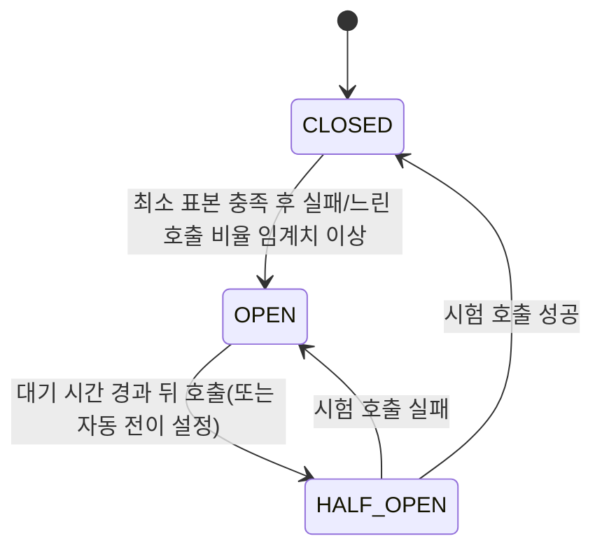

# 서킷 브레이커와 장애 격리

## 핵심 정의

서킷 브레이커(circuit breaker)는 특정 다운스트림 의존성(외부 API, DB, 다른 마이크로서비스)의 실패율이 높아졌을 때 해당 호출을 일시적으로 차단하여, 실패할 것이 뻔한 요청을 계속 시도하며 자원을 낭비하지 않도록 하는 패턴이다. 가정용 전기 회로 차단기와 같은 비유로, 이상 신호를 감지하면 회로를 끊어(open) 상위 시스템까지 장애가 전파되는 것을 막는다. 장애 격리(fault isolation)는 이보다 넓은 개념으로, 한 컴포넌트의 장애가 전체 시스템의 연쇄 장애(cascading failure)로 번지지 않도록 자원(스레드, 커넥션)과 실패 도메인을 분리하는 설계 원칙 전반을 가리키며, 서킷 브레이커는 그 구현 수단 중 하나다.

## 동작 원리 / 구조

대표 동작은 세 가지 상태로 설명한다. Resilience4j 2.3.0에는 운영용 DISABLED·FORCED_OPEN·METRICS_ONLY 상태도 있다.



- **CLOSED(닫힘)**: 정상 상태. 모든 요청이 실제로 호출되고, 설정에 따라 최근 N개 또는 N초의 완료 호출을 슬라이딩 윈도우(sliding window)로 집계한다.
- **OPEN(열림)**: 최소 표본을 충족한 실패율이나 느린 호출 비율이 임계치 이상이면 회로가 열리고, 이후 요청은 실제 호출 없이 즉시 실패(fail fast) 처리되거나 폴백(fallback)으로 우회한다.
- **HALF_OPEN(반열림)**: 설정된 대기 시간이 지나면 소수의 요청만 실제로 흘려보내 다운스트림이 회복됐는지 시험한다. 허용된 시험 호출 결과의 실패율·느린 호출 비율을 평가해 CLOSED 또는 OPEN으로 전이한다. 기본 설정은 대기 시간 경과만으로 자동 전이하지 않고 다음 호출에서 전이하며 자동 전이 옵션은 별도로 켤 수 있다.

Java/Spring 생태계에서는 Netflix Hystrix 공식 저장소는 maintenance mode를 선언하고 신규 개발에서 다른 프로젝트 사용을 안내한다. Resilience4j는 Spring 환경의 선택지 중 하나다. Resilience4j 2.x는 Java 17 이상을 요구하며, Spring Boot 3 계열에는 `resilience4j-spring-boot3` 스타터로 연동한다. 공식 저장소가 설명하는 Resilience4j 3(Java 21 요구)의 `resilience4j.thread.type: virtual`은 CircuitBreaker/RateLimiter 등 내부 스케줄러를 플랫폼 스레드 대신 가상 스레드(virtual thread)로 선택하는 설정이다. 이를 2.x 기능으로 적용하거나 모든 보호 대상 메서드가 자동으로 가상 스레드에서 실행된다고 해석하면 안 된다. 여러 보호 패턴을 어노테이션으로 조합할 때 기본 적용 순서는 `Retry(CircuitBreaker(RateLimiter(TimeLimiter(Bulkhead(Method)))))` 순이다(바깥쪽에서 안쪽으로 감싸는 구조). 다만 이 기본 순서에서는 재시도 한 번이 서킷 브레이커 관점에서는 매번 별개 호출로 집계되어 원치 않게 실패가 과다 집계될 수 있으므로, `circuitBreakerAspectOrder`를 `retryAspectOrder`보다 낮게 설정해 CircuitBreaker가 Retry를 감싸도록 순서를 바꾸는 경우도 실무에서 흔하다.

```java
@CircuitBreaker(name = "paymentService", fallbackMethod = "fallback")
@Bulkhead(name = "paymentService")
public PaymentResult charge(PaymentRequest req) {
    return paymentClient.charge(req);
}

private PaymentResult fallback(PaymentRequest req, Throwable t) {
    throw new IllegalStateException("결제 결과 미확정: 동일 결제 키로 조회·조정이 필요합니다.", t);
}
```

위 예제의 DTO·client는 프로젝트 타입이다. 실제 재처리 요청을 내구성 있게 저장하지 않고 pending/접수 성공을 반환하면 안 된다. 결제 재시도는 동일한 멱등성 키와 공급자의 중복 방지 계약이 있을 때만 적용한다. CircuitBreaker의 fallback이 예외를 성공 값으로 바꾸면 바깥 Retry는 그 실패를 보지 못할 수 있다.

```yaml
resilience4j:
  circuitbreaker:
    instances:
      paymentService:
        sliding-window-type: COUNT_BASED
        sliding-window-size: 20
        minimum-number-of-calls: 10
        failure-rate-threshold: 50
        wait-duration-in-open-state: 10s
        permitted-number-of-calls-in-half-open-state: 5
        slow-call-duration-threshold: 2s
        slow-call-rate-threshold: 80
```

장애 격리는 서킷 브레이커 외에도 다음 패턴과 함께 쓰인다.

- **벌크헤드(bulkhead)**: 배 밑바닥을 여러 격실로 나누듯, 의존성별로 스레드 풀/커넥션 풀을 분리해 한 의존성이 스레드를 전부 점유해도 다른 기능은 영향을 받지 않게 한다.
- **타임아웃(timeout)**: 응답 지연 자체를 실패로 간주해 스레드가 무한정 붙잡히는 것을 막는다. Resilience4j의 slow call 비율은 실패율과 별도 지표다. 느린 성공도 slow call일 수 있으며 slowCallDurationThreshold가 진행 중 호출을 중단시키지는 않는다.
- **재시도(retry)**: 일시적 장애에는 유효하지만, 서킷이 OPEN인 상태에서 재시도까지 겹치면 장애를 오히려 증폭시키므로 재시도 횟수/백오프(backoff)를 서킷 브레이커와 함께 설계해야 한다.

## 실무 관점

- **언제/왜**: 외부 API, 결제 게이트웨이, 다른 마이크로서비스처럼 자신이 통제할 수 없는 의존성을 호출할 때 반드시 고려한다. 특히 동기 호출 체인이 길어질수록 하나의 느린 의존성이 전체 요청 스레드를 고갈시켜 연쇄 장애로 번지기 쉽다.
- **트레이드오프**: 서킷이 열리면 사용자에게는 폴백 응답(캐시된 데이터, 기본값, "잠시 후 다시 시도")을 줘야 하는데, 이는 비즈니스 로직상 데이터 정합성/일관성과 가용성(availability) 사이의 타협이다. 폴백을 잘못 설계하면 장애를 숨기다가 더 큰 문제(예: 결제 중복)로 이어질 수 있다.
- **흔한 실수**: 모든 외부 호출에 동일한 서킷 브레이커 인스턴스를 공유해서 쓰는 경우가 많다. Resilience4j의 원칙대로 의존성마다(서비스별로) 별도 인스턴스를 만들어야 특정 의존성의 장애가 다른 의존성 호출까지 오염시키지 않는다. 또한 타임아웃을 설정하지 않고 서킷 브레이커만 붙이면, 끝나지 않는 호출은 완료 통계에 반영되지 않아 회로가 열리기 전에 스레드만 계속 고갈되는 경우가 흔하다.
- **설정/튜닝 포인트**: `failure-rate-threshold`(실패율 임계치), `sliding-window-size`(집계 윈도우 크기), `wait-duration-in-open-state`(OPEN 유지 시간), `slow-call-duration-threshold`(느린 호출 기준)를 다운스트림의 실제 SLA에 맞춰 조정해야 한다. 너무 민감하면 일시적 스파이크에도 회로가 열려 가용성이 떨어지고, 너무 둔감하면 장애 격리 효과가 없다. Actuator/Micrometer로 상태 전이를 모니터링하고 알람을 걸어두는 것이 실무 필수다.

## 심화 Q&A

### Q. 업무 예외를 실패 집계에서 빼려면 성공으로 처리하는 것과 무시하는 것이 같은가?
다르다. Resilience4j 2.3.0에서 `recordExceptions` 목록을 지정하면 목록 밖 예외는 명시적으로 무시하지 않는 한 성공으로 집계된다. `ignoreExceptions`에 해당하면 성공·실패 어느 쪽에도 집계하지 않는다. 재고 부족·잘못된 입력처럼 의존성 장애와 무관한 예외를 성공으로 많이 집계하면 실제 장애 비율이 희석될 수 있다. 반대로 모든 4xx를 무시하면 만료된 서비스 자격 증명처럼 운영 장애를 놓칠 수 있으므로 업무 의미로 분류한다.

원시 HTTP 응답 객체를 정상 반환하는 client는 500 응답도 Java 예외가 아닐 수 있다. HTTP/gRPC 상태를 예외나 결과 판정 정책에 어떻게 매핑하는지 확인해야 한다. 서킷의 실패율과 최종 사용자 실패율은 fallback·재시도 때문에 다르므로 별도 지표로 본다.

Resilience4j 2.3.0의 `maxWaitDurationInHalfOpenState` 기본값 0은 시험 호출 완료를 무한히 기다릴 수 있다는 뜻이다. 반열림 최대 대기를 설정하더라도 진행 중 I/O의 취소를 대신하지 않으므로 실제 client timeout과 함께 검증한다.


### Q. 서킷 브레이커와 타임아웃의 역할 차이는 무엇이고 왜 둘 다 필요한가?
타임아웃은 개별 호출 하나가 얼마나 오래 기다릴지를 제한하는 것이고, 서킷 브레이커는 여러 호출의 통계(실패율)를 보고 아예 호출 자체를 차단하는 것이다. 타임아웃만 있으면 매 요청이 타임아웃 시간만큼은 스레드를 점유하다 실패하므로 장애 상황에서도 자원 소모가 계속된다. 서킷 브레이커가 열리면 그 낭비를 즉시 차단할 수 있어 상호 보완적이다.

### Q. HALF_OPEN 상태에서 시험 요청이 하나라도 실패하면 바로 OPEN으로 돌아가야 하는가, 아니면 일정 비율을 봐야 하는가?
설정에 따라 다르다. `permitted-number-of-calls-in-half-open-state`로 시험 호출 수를 정하고, 그 결과에 대해서도 CLOSED와 동일한 실패율 임계치를 적용하는 것이 일반적이다. 단 1건 실패로 즉시 OPEN으로 돌리면 일시적 노이즈에도 회복 사이클이 계속 리셋되어 실제로는 복구된 의존성을 계속 차단하는 문제가 생길 수 있다.

### Q. 재시도와 서킷 브레이커를 함께 쓸 때 주의할 점은?
Resilience4j 기준 어노테이션 적용 순서는 Retry가 가장 바깥, CircuitBreaker가 그다음이다. 즉 재시도가 서킷 브레이커를 감싸는 구조라 재시도할 때마다 서킷 브레이커의 실패 집계에도 반영된다. 재시도 횟수와 간격을 너무 공격적으로 잡으면 서킷이 열리기도 전에 이미 다운스트림에 부하를 몇 배로 가중시킬 수 있으므로, 멱등성·전체 deadline·재시도 예산에 맞춰 시도 횟수와 지수 백오프(exponential backoff)·지터(jitter)를 정한다. 2~3회도 모든 작업에 안전한 기본값은 아니며 OPEN 거부나 bulkhead 포화를 무조건 재시도하지 않는다.

### Q. 벌크헤드 없이 서킷 브레이커만으로 장애 격리가 충분한가?
충분하지 않다. 서킷 브레이커는 회로가 OPEN되기 전까지는 여전히 요청이 실제로 흘러가고 스레드를 점유한다. 임계치에 도달하기 직전까지 특정 의존성이 스레드 풀 전체를 잠식하면, 그 의존성과 무관한 다른 요청까지 스레드 부족으로 대기하게 된다. 스레드 풀이나 세마포어(semaphore)를 의존성별로 나누는 벌크헤드를 같이 적용해야 진정한 격리가 된다.

### Q. 폴백(fallback) 응답을 캐시된 데이터로 줄 때 어떤 위험이 있는가?
오래된 데이터(stale data)를 최신 데이터처럼 사용자에게 보여줄 위험이 있다. 특히 재고, 잔액처럼 정합성이 중요한 도메인에서는 임의의 정상 수치를 만들지 않고 이용 불가/결과 미확정을 명시하거나, 조회는 캐시로 대응하되 쓰기 작업은 폴백 없이 실패를 명확히 알리는 방식으로 도메인별 정책을 다르게 가져가야 한다.

### Q. Hystrix 대신 Resilience4j를 쓰는 이유는 스레드 모델과 어떤 관련이 있는가?
Hystrix는 기본 스레드 풀 격리와 선택 가능한 세마포어 격리를 제공한다. 스레드 풀 격리는 큐·스레드 전환 비용을 수반하므로 격리 이점과 함께 평가한다. 공식 저장소는 신규 개발이 중단된 maintenance mode이며 신규 프로젝트에 다른 구현 사용을 권한다. Resilience4j는 함수형 데코레이터 방식으로 스레드 풀 격리 없이도(세마포어 기반 벌크헤드 포함) 가볍게 적용할 수 있고, 3.x의 내부 스케줄러 설정은 가상 스레드와도 연동되지만 보호 대상 I/O의 timeout·동시성 한도는 별도로 필요하다.

## 관련 개념

- [[수평 확장과 무상태성]]
- [[Spring Retry와 재시도 전략]]
- [[Bulkhead 패턴]]
- [[우아한 성능 저하]]

## 참고 자료

확인 날짜: 2026-09-08. 아래 버전과 범위의 공식 문서·소스로 본문을 대조했다. 성능 비교와 운영 선택은 워크로드에 따라 달라지는 판단 기준이다.

- [Resilience4j CircuitBreaker](https://resilience4j.readme.io/docs/circuitbreaker) — 상태·최소 표본·느린 호출·자동 전이 조건.
- [Resilience4j Spring Integration](https://resilience4j.readme.io/docs/getting-started-3) — 기본 aspect 순서와 fallback.
- [CircuitBreaker aspect 설정 2.3.0](https://raw.githubusercontent.com/resilience4j/resilience4j/v2.3.0/resilience4j-spring6/src/main/java/io/github/resilience4j/spring6/circuitbreaker/configure/CircuitBreakerConfigurationProperties.java) — order 기본값 및 사용자 재설정.
- [Retry aspect 설정 2.3.0](https://raw.githubusercontent.com/resilience4j/resilience4j/v2.3.0/resilience4j-spring6/src/main/java/io/github/resilience4j/spring6/retry/configure/RetryConfigurationProperties.java) — CircuitBreaker보다 바깥인 기본 order.
- [Resilience4j 2.3.0 README](https://raw.githubusercontent.com/resilience4j/resilience4j/v2.3.0/README.adoc) — Java 17 요구.
- [Resilience4j 공식 README](https://github.com/resilience4j/resilience4j) — 열람 시 3의 Java 21/내부 virtual scheduler 범위.
- [Hystrix 공식 저장소](https://github.com/Netflix/Hystrix) — maintenance mode 상태.

부분 재검증: 2026-09-22. [Hystrix 공식 저장소](https://github.com/Netflix/Hystrix)의 maintenance mode·스레드/세마포어 격리 설명을 대조했다. 그 외 서술은 이번 확인 범위 밖이므로 `verified`는 유지했다.

부분 재검증: 2026-09-23. [Resilience4j CircuitBreaker 가이드](https://resilience4j.readme.io/docs/circuitbreaker)와 [2.3.0 CircuitBreakerConfig 소스](https://raw.githubusercontent.com/resilience4j/resilience4j/v2.3.0/resilience4j-circuitbreaker/src/main/java/io/github/resilience4j/circuitbreaker/CircuitBreakerConfig.java)의 예외 성공·무시 구분 및 반열림 최대 대기 기본값을 대조했다. 예외 분류·최종 사용자 지표 구분은 운영 적용 기준이며 나머지 버전·aspect 순서는 이번 범위 밖이라 `verified`를 유지했다.
