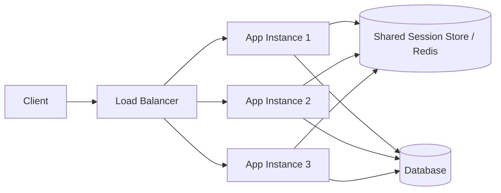

# 수평 확장과 무상태성

## 핵심 정의

수평 확장(horizontal scaling, scale-out)은 서버 한 대의 성능(CPU, 메모리)을 올리는 수직 확장(vertical scaling, scale-up) 대신, 동일한 역할을 하는 서버 인스턴스를 여러 대 늘려서 처리량을 확보하는 방식이다. 무상태성(statelessness)은 각 요청을 처리하는 서버가 특정 인스턴스에만 있는 대화 상태에 정확성이 의존하지 않도록 설계하는 원칙이다. 재구축 가능한 로컬 캐시는 가능하다. 상태 있는 시스템도 샤딩·복제·소유권 라우팅으로 수평 확장할 수 있으며 무상태성이 필수 조건은 아니다. 서버가 상태를 갖지 않으면 로드밸런서(load balancer)가 어떤 요청이든 어느 인스턴스로 보내도 결과가 동일하므로, 트래픽 증가에 따라 인스턴스를 자유롭게 추가/제거할 수 있다.

## 동작 원리 / 구조

무상태 서버 구조에서 인스턴스가 사라져도 보존해야 할 세션·인증·작업 상태는 서버 프로세스 밖의 공유 저장소(Redis, DB, 클라이언트 토큰)로 이동한다.



상태 외부화 및 라우팅 선택지(외부 세션은 애플리케이션 인스턴스를 무상태화하지만 엄격한 REST의 서버 세션 금지와는 구분):

- **JWT 등 자체 포함 토큰**: 세션 데이터를 서버가 아닌 클라이언트가 들고 있고, 서버는 매 요청마다 토큰을 검증만 한다. 서버 측 저장소 조회가 필요 없어 외부 세션 조회를 줄일 수 있지만, 토큰 무효화(로그아웃, 강제 만료)가 까다롭다.
- **외부 세션 스토어**: Redis 같은 인메모리 스토어에 세션을 저장하고, 모든 인스턴스가 공유 조회한다. Spring Session이 대표적 구현체다.
- **Sticky Session(고정 세션)**: 로드밸런서가 같은 클라이언트를 항상 같은 서버로 보내는 방식. 무상태 원칙을 어기고 서버 로컬 메모리에 세션을 두는 절충안인데, 특정 인스턴스에 트래픽이 쏠리거나 해당 인스턴스가 죽으면 세션이 유실되는 문제가 있어 진짜 수평 확장과는 상성이 나쁘다.

```java
// 무상태 인증 예시: 매 요청이 자기 완결적(self-contained)이어야 한다
@GetMapping("/orders")
public List<OrderDto> getOrders(@AuthenticationPrincipal Jwt jwt) {
    String userId = jwt.getSubject(); // 서버 로컬 세션에 의존하지 않음
    return orderService.findByUserId(userId);
}
```

라운드로빈(round robin)·최소 연결(least connection) 등은 인스턴스 교체 가능성이 높을수록 자유롭게 적용하기 쉽다. 상태가 있는 시스템에서도 새 연결을 분배하고 이후 affinity를 유지하는 방식으로 사용하며, 모든 라우팅 전략이 무력화되는 것은 아니다.

## 실무 관점

- **언제/왜**: 트래픽이 예측 불가능하게 증가하거나 오토스케일링(auto scaling)으로 비용을 탄력적으로 관리해야 할 때 수평 확장이 필수다. 무상태 설계는 인스턴스 교체를 단순하게 하므로, 확장을 염두에 둔 API 서버는 처음부터 세션을 서버 로컬에 두지 않는 것이 원칙이다.
- **트레이드오프**: 무상태화는 매 요청마다 인증/조회 비용(토큰 검증, 외부 스토어 조회)이 추가된다. JWT로 로컬 검증하면 세션 조회를 줄일 수 있지만 즉시 로그아웃, 권한 변경 반영이 어렵다. 외부 세션 스토어는 유연하지만 Redis 자체가 새로운 병목/SPOF(single point of failure)가 될 수 있다.
- **흔한 실수**: `HttpSession`에 사용자 정보나 장바구니를 담아두고 다중 인스턴스로 배포한 뒤, 로드밸런서에 sticky session 설정을 빼먹어 세션 유실 장애가 나는 패턴이 흔하다. 또한 서버 로컬 캐시(예: `ConcurrentHashMap`으로 만든 캐시)에 자주 바뀌는 데이터를 올려두면, 인스턴스마다 캐시 내용이 달라 데이터 불일치가 발생한다.
- **설정/튜닝 포인트**: 파일 업로드나 배치 결과물 등도 로컬 디스크가 아닌 S3 같은 공유 스토리지에 저장해야 한다. 로컬 디스크에 쓰면 그 인스턴스가 사라졌을 때 접근·복구가 보장되지 않는다. 임시 파일은 로컬에 둘 수 있으나 영속 결과는 생명주기와 공유 요구에 맞는 저장소에 둔다. 스케줄러(scheduled job)도 다중 인스턴스에서 중복 실행되지 않도록 분산 락(distributed lock)이나 리더 선출(leader election)로 제어해야 한다.

### 확장·배포 중 DB 연결 예산

DB 연결 예산은 평상시 목표 인스턴스 수만으로 계산하지 않는다. 애플리케이션 풀의 최대 연결 수 합계, 같은 DB를 쓰는 배치·관리 작업·다른 서비스의 연결을 포함하고, DB가 안정적으로 처리할 수 있는 동시 작업량 안에 여유를 둔다. DB의 접속 한도까지 채울 수 있다는 사실이 그만큼의 쿼리를 효율적으로 실행한다는 뜻은 아니다.

Kubernetes Deployment의 롤링 업데이트(rolling update)에서는 새 Pod와 종료 중인 Pod가 함께 살아 있을 수 있다. 공식 문서는 종료 중인 Pod를 포함한 총수가 일시적으로 `replicas + maxSurge`를 넘을 수 있다고 설명한다. 따라서 `목표 replicas × 풀 최대 크기`는 배포 중 최대 연결 수의 상한이 아니다. 종료 유예 중 기존 요청이 사용하는 연결과 새 인스턴스가 만드는 연결도 계산한다.

예를 들어 인스턴스 10개에 풀 상한 20개면 정상 목표의 합은 200개다. 배포 중에는 실제 살아 있는 인스턴스와 각 풀의 상한으로 다시 계산해야 하며, 풀이 여러 개면 각각 더한다. 이 수치는 예산 예시이며 모든 풀이 상한까지 즉시 연결을 만든다는 뜻은 아니다. 확장 상한·롤링 배포 정책·풀 크기·종료 시 풀 정리를 함께 정하고, 실제 DB 연결 수와 대기 시간을 관측한다.

## 심화 Q&A

### Q. Sticky session을 쓰면 결국 상태를 서버에 두는 것인데, 왜 완전히 없애지 못하는 경우가 있는가?
레거시 시스템 마이그레이션 과정에서 세션 저장소 분리 비용이 크거나, 실시간 게임 서버처럼 연결 상태 자체가 애플리케이션 로직의 일부인 경우 완전한 무상태화가 어렵다. 이런 경우 세션 affinity를 사용하는 것이 합리적인 선택일 수도 있다. 연결/룸 소유권, 장애 복구, 데이터 복제와 재연결 정책을 명확히 설계해야 한다.

### Q. 무상태 서버인데도 확장이 안 되는 경우가 있을까?
있다. 애플리케이션 계층은 무상태여도 뒤에 있는 DB나 외부 API가 스케일링되지 않으면 병목이 그쪽으로 이동할 뿐이다. 수평 확장의 효과를 보려면 커넥션 풀 크기, DB 커넥션 한도, 다운스트림 서비스의 처리량까지 함께 고려해야 한다.

### Q. JWT 기반 무상태 인증에서 즉시 로그아웃을 어떻게 구현하는가?
순수 무상태 원칙만 따르면 토큰 만료 전까지는 무효화가 불가능하다. 실무에서는 블랙리스트를 Redis에 짧게 유지하거나, 토큰 만료 시간을 짧게 잡고 리프레시 토큰으로 갱신하는 방식을 절충으로 쓴다. 이 경우 완전한 무상태는 아니지만 조회 비용이 세션 조회보다 항상 작다는 보장은 없다. 짧은 access token 만료와 refresh token 폐기는 기존 access token을 즉시 무효화하지 않고 유효 기간을 제한한다.

### Q. 무상태 서비스에서 멱등성(idempotency)은 왜 더 중요해지는가?
수평 확장 환경에서는 재시도(retry)나 로드밸런서의 요청 재분배로 같은 요청이 다른 인스턴스에서 중복 처리될 가능성이 있다. 서버가 상태를 들고 있지 않으니 중복 방지도 서버 로컬 로직으로 막을 수 없고, 멱등키(idempotency key)와 결과를 공유 저장소에 기록하거나 DB의 고유 제약·원자적 상태 전이로 중복 효과를 막는다. 멱등성은 단일 인스턴스에서도 네트워크 재시도 때문에 필요하다.

### Q. Sticky session과 외부 세션 스토어 중 어떤 것을 선택할 기준은?
세션 데이터의 크기와 갱신 빈도, 그리고 인스턴스 장애 시 세션 유실 허용 여부를 본다. 세션이 작고 read 위주면 외부 스토어(Redis) 비용이 크지 않으므로 무상태 원칙을 지키는 쪽을 기본으로 하고, sticky session은 세션 스토어를 아직 도입하지 못한 연결·상태 소유권과 복구 비용이 이를 정당화하는 상황에서 쓴다.

### Q. 수평 확장이 오히려 역효과를 내는 상황이 있는가?
DB 커넥션 풀처럼 공유 자원이 유한한 경우, 인스턴스를 늘릴수록 인스턴스당 커넥션 풀 크기를 줄여야 하므로 개별 인스턴스의 처리량이 떨어질 수 있다. 이때는 애플리케이션 확장보다 DB 커넥션 풀러(예: PgBouncer)나 읽기 복제본(read replica) 도입이 우선이다.

## 관련 개념

- [[서킷 브레이커와 장애 격리]]
- [[L4와 L7 로드밸런싱]]
- [[TTL과 캐시 무효화 전략]]

## 참고 자료

확인 날짜: 2026-09-08. 아래 버전과 범위의 공식 문서·소스로 본문을 대조했다. 성능 비교와 운영 선택은 워크로드에 따라 달라지는 판단 기준이다.

- [The Twelve-Factor App — Processes](https://12factor.net/processes) — stateless/share-nothing 프로세스와 임시 메모리/디스크.
- [Spring Session 공식 문서](https://docs.spring.io/spring-session/reference/index.html) — 외부 세션 저장소와 다중 인스턴스 세션.
- [Spring Security JWT Resource Server](https://docs.spring.io/spring-security/reference/servlet/oauth2/resource-server/jwt.html) — 토큰 검증과 claims.
- [Fielding REST §5.1.3](https://roy.gbiv.com/pubs/dissertation/rest_arch_style.htm) — 서버 세션 상태를 두지 않는 REST 제약.

부분 재확인: 2026-09-23. [Kubernetes Deployment](https://kubernetes.io/docs/concepts/workloads/controllers/deployment/) — 확인일 공식 문서의 Rolling Update Deployment에서 종료 중인 Pod로 인해 총수가 `replicas + maxSurge`를 초과할 수 있는 조건을 확인했다. DB 연결 예산 산식은 이 동작을 적용한 용량 설계이며 특정 풀의 기본값은 아니다. 기존 인증·세션 구현 전체는 재검증하지 않아 `verified`는 유지한다.
