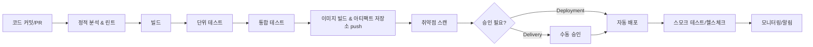

# CI-CD 파이프라인 구성

## 핵심 정의
CI(Continuous Integration, 지속적 통합)는 개발자가 작성한 코드 변경 사항을 자주 중앙 저장소에 병합하고, 그때마다 빌드와 테스트를 자동으로 수행해 통합 문제를 조기에 발견하는 방식이다. CD는 두 가지 의미로 갈리는데, Continuous Delivery(지속적 전달)는 언제든 배포 가능한 상태로 아티팩트를 준비해두고 실제 운영 배포 여부를 별도 결정할 수 있는 상태를 유지하는 것이고, Continuous Deployment(지속적 배포)는 승인 없이 검증을 통과하면 자동으로 운영 환경까지 배포하는 것이다.

CI-CD 파이프라인은 소스 코드 변경부터 운영 배포까지의 과정을 코드(파이프라인 as code)로 정의하고 자동화한 일련의 단계(stage)의 집합이다. 목표는 사람이 반복하는 수작업을 없애고, 변경 사항을 작게 자주 통합해 리스크를 줄이는 것이다.

## 동작 원리 / 구조

일반적인 백엔드(Java/Spring Boot) 프로젝트의 파이프라인 흐름:



각 단계의 역할:

| 단계 | 도구 예시 | 실패 시 동작 |
|---|---|---|
| 정적 분석 | SonarQube, Checkstyle, SpotBugs | 파이프라인 중단, PR 머지 차단 |
| 빌드 | Gradle/Maven | 컴파일 실패 시 즉시 중단 |
| 테스트 | JUnit5, Testcontainers | 커버리지/실패 기준 미달 시 중단 |
| 아티팩트 저장 | Docker Registry(ECR, Harbor), Nexus | 태깅 규칙(semver, git sha) 준수 |
| 배포 | Argo CD, Spinnaker, kubectl, Helm | 실패 감지 후 설정한 중단/롤백 정책 수행 |

GitHub Actions 흐름 예시(레지스트리 로그인·kubectl 설치·클러스터 인증은 환경별 단계로 추가해야 함):

```yaml
name: ci-cd
on:
  push:
    branches: [main]
  pull_request:

permissions:
  contents: read

jobs:
  build-test:
    runs-on: ubuntu-latest
    steps:
      - uses: actions/checkout@v6
      - uses: actions/setup-java@v5
        with:
          distribution: temurin
          java-version: '21'
      - run: ./gradlew build
      - run: ./gradlew jacocoTestReport # 프로젝트에 JaCoCo 플러그인 설정 필요

  build-image:
    needs: build-test
    if: github.ref == 'refs/heads/main'
    runs-on: ubuntu-latest
    steps:
      - uses: actions/checkout@v6
      - run: docker build -t registry/app:${{ github.sha }} .
      - run: docker push registry/app:${{ github.sha }}

  deploy:
    needs: build-image
    runs-on: ubuntu-latest
    steps:
      - run: kubectl set image deployment/app app=registry/app:${{ github.sha }}
      - run: kubectl rollout status deployment/app --timeout=5m
```

파이프라인은 GitOps 방식(Argo CD, Flux)으로 구성하면 "배포 = 매니페스트 저장소의 상태 변경"이 되어, 배포 이력이 Git 커밋 로그로 남고 롤백도 `git revert` 수준으로 단순해진다.

예제의 Java 21은 프로젝트가 선택한 기준 버전이며 최신 버전을 뜻하지 않는다. GitHub Actions major tag도 이동할 수 있으므로 운영에서는 검증한 full commit SHA로 고정하고 업데이트를 관리한다. 각 job은 별도 러너이므로 인증·도구 설정이 공유되지 않는다. PR의 비신뢰 코드를 운영 자격증명으로 실행하지 않고, 배포 job은 보호된 환경·동시성 정책과 실제 롤아웃 결과 확인을 구성한다. Git revert는 원하는 코드 상태를 되돌릴 뿐 이미 실행한 데이터 변경을 취소하지 않는다.

## 실무 관점
- CI는 필수, CD는 조직 성숙도에 따라 Delivery까지만 두는 경우가 많다. 금융권/규제 산업은 수동 승인 게이트(Delivery)를 남기는 경우가 흔하다.
- 트레이드오프: 파이프라인 단계를 늘릴수록 안전성은 올라가지만 리드타임(커밋~배포)이 늘어난다. 단위 테스트는 매 커밋마다, 느린 통합/E2E 테스트는 병렬화하거나 머지 후 별도 파이프라인으로 분리하는 것이 일반적이다.
- 흔한 실수: 테스트 환경과 운영 환경의 설정(프로파일, 시크릿)을 코드에 하드코딩해 파이프라인에서만 통과하고 운영에서 장애가 나는 패턴. 반드시 Spring profile, Vault/Secrets Manager 등으로 분리해야 한다.
- 흔한 장애 패턴: 캐시된 의존성이나 Docker 레이어 캐시가 오염되어 "로컬은 되는데 파이프라인은 실패"하는 경우. 캐시 키에 lock 파일 해시를 포함시켜 무효화 조건을 명확히 해야 한다.
- 아티팩트는 git SHA/빌드 번호 태그와 레지스트리의 tag immutability 정책 또는 digest로 관리하고, `latest` 태그로 배포하지 않는다. 그래야 어떤 커밋이 운영에 떠 있는지 추적 가능하다.
- 튜닝 포인트: 테스트 병렬 실행(Gradle의 `--parallel`, JUnit5 parallel execution), 빌드 캐시(Gradle build cache, Docker BuildKit cache mount), 파이프라인 단계별 타임아웃 설정.
- 시크릿 관리: 파이프라인 로그에 시크릿이 노출되지 않도록 마스킹 설정을 확인하고, 장기 저장 크리덴셜보다 OIDC 기반 단기 토큰(예: GitHub Actions OIDC → AWS IAM Role)을 우선 고려한다.

### PR 코드·아티팩트와 배포 권한의 신뢰 경계

GitHub Actions의 `pull_request_target`·`workflow_run`은 특권 컨텍스트에서 실행될 수 있다. 이 워크플로가 비신뢰 PR의 head를 checkout해 실행하면, 워크플로 파일 자체가 안전해도 빌드 스크립트·테스트·설치 훅을 통해 자격증명과 저장소 권한을 악용할 수 있다. 비신뢰 코드를 평가하는 단계와 배포 권한을 가진 단계를 분리한다.

단계를 나누는 것만으로 안전해지는 것도 아니다. 비신뢰 단계가 만든 아티팩트·캐시·스크립트를 후속 특권 단계가 실행하거나 설정으로 해석하면 경계가 다시 연결된다. 후속 작업은 산출물의 출처·대상 커밋·형식을 검증하고, 처리 목적에 필요한 데이터만 받아야 한다. 승인 게이트는 이런 입력을 자동으로 신뢰할 수 있게 바꾸지 않는다.

PR 제목·브랜치명 등 외부 입력을 `${{ ... }}`로 `run` 스크립트 본문에 직접 삽입하는 것도 피한다. 액션의 데이터 인자나 중간 환경변수로 넘긴 뒤 올바르게 인용하고, `eval` 등으로 다시 코드화하지 않는다. 토큰 권한을 최소화하는 것과 스크립트 주입을 막는 것은 함께 필요하다.

### 동시 실행 제한과 배포 순서·취소를 구분한다

GitHub Actions의 같은 concurrency group은 실행 중인 작업 수를 제한하지만 모든 커밋을 순서대로 배포하는 큐를 자동으로 뜻하지 않는다. 기본 `queue: single`에서는 새 작업이 기존 pending 작업을 대체한다. 여러 대기를 보존하려면 `queue: max`의 정책을 확인하고, 이 설정은 `cancel-in-progress: true`와 함께 사용할 수 없다. 처리 순서도 커밋 시각이 아니라 그룹에서 대기를 시작한 시각에 영향을 받으므로 배포 직전 대상 커밋·이미지·환경의 적합성을 다시 확인한다.

워크플로 취소는 러너의 작업 프로세스를 중단하는 절차이지, 이미 Kubernetes나 클라우드에 제출한 변경을 취소·롤백하는 트랜잭션이 아니다. 취소 뒤에는 외부 배포 상태를 대조하고 다음 실행이 이어받을지 복구할지 정한다. 서로 다른 브랜치가 같은 운영 환경을 변경한다면 브랜치별 그룹만으로 배포 충돌을 막을 수 없으므로 보호할 배포 대상 기준으로 그룹을 설계한다.

## 심화 Q&A

### Q. Continuous Delivery와 Continuous Deployment의 차이가 단순히 "승인 유무"라고 했는데, 조직에서 어떤 기준으로 둘 중 하나를 선택해야 하는가?
A. 배포 실패 시 되돌리는 비용과 탐지 시간이 기준이 된다. 카나리/블루-그린처럼 자동 롤백 메커니즘과 충분한 모니터링/알림 체계가 갖춰져 있다면 Deployment까지 자동화해도 리스크가 낮다. 반대로 규제 요건, 데이터 마이그레이션을 동반하는 배포, 롤백이 어려운 변경(스키마 변경 등)이 잦다면 Delivery 단계에서 사람의 승인을 두는 것이 안전하다. 둘은 이분법이 아니라 팀/서비스별로 혼용 가능하다.

### Q. 파이프라인에서 테스트 단계가 실패했는데 재실행하면 통과하는 flaky test가 반복된다면 어떻게 접근하는가?
A. 재시도 로직으로 덮지 않고 원인을 분리해야 한다. 흔한 원인은 (1) 테스트 간 공유 상태/실행 순서 의존, (2) 외부 리소스(포트, DB) 경합, (3) 비동기 처리에 대한 타이밍 가정. Testcontainers처럼 격리된 환경을 쓰고, 시간 의존 로직은 Clock 주입으로 제어 가능하게 바꾼다. 임시방편으로 격리된 flaky 테스트 태그를 붙여 별도 리포트로 추적하되, 방치하면 파이프라인 신뢰도 자체가 무너진다.

### Q. 모놀리스에서 마이크로서비스로 전환할 때 CI-CD 파이프라인 구조는 어떻게 달라지는가?
A. 모놀리스는 단일 파이프라인으로 빌드-테스트-배포가 한 흐름이지만, 서비스별로 파이프라인이 분리되면 서비스 간 계약(API 스펙, 이벤트 스키마)을 깨지 않는지 검증하는 단계가 추가로 필요하다. Consumer-Driven Contract 테스트(Pact 등)나 스키마 레지스트리 검증을 파이프라인에 넣고, 배포 순서/버전 호환성(하위 호환 API 유지)을 관리하는 것이 핵심 차이다. 또한 서비스 수만큼 파이프라인이 늘어나므로 공통 파이프라인 템플릿(재사용 가능한 워크플로)으로 관리 비용을 줄인다.

### Q. 빌드 아티팩트에 취약점 스캔을 넣었는데 CVE가 발견되면 무조건 배포를 막아야 하는가?
A. 심각도(Critical/High/Medium)와 실제 공격 가능 경로(exploitability) 기준으로 정책을 나눠야 한다. 무조건 차단하면 오탐이나 패치 불가능한 이행성 의존성 때문에 파이프라인이 마비될 수 있다. 일반적으로 Critical은 배포 차단, High는 유예 기간(SLA, 예: 7일 내 패치)을 두고 경고, Medium 이하는 리포트만 남기는 식의 정책적 게이트를 둔다.

### Q. GitOps 방식(Argo CD)과 전통적인 Push 기반 배포(CI에서 직접 kubectl apply)의 근본적인 차이는 무엇이고, 왜 GitOps가 더 안전하다고 하는가?
A. Push 방식은 CI 러너가 클러스터에 대한 강한 권한(kubeconfig)을 가져야 하고, 실제 클러스터 상태와 Git의 선언이 어긋나도 감지가 어렵다(configuration drift). GitOps(Pull 방식)는 클러스터 내부 에이전트(Argo CD)가 Git 저장소를 지속적으로 폴링/watch하며 원하는 상태(desired state)와 실제 상태를 동기화하므로, 클러스터 자격 증명을 외부 CI에 노출할 필요가 없고, 누군가 수동으로 클러스터를 건드려도 selfHeal을 활성화하면 Git 상태로 되돌릴 수 있다. 자동 동기화·삭제(prune)·selfHeal은 각각 정책을 확인해야 한다. 다만 즉시성이 필요한 배포에는 폴링 주기나 webhook 설정이 추가로 필요하다.

### Q. 파이프라인 단계 중 어떤 것을 PR(머지 전)에서 돌리고, 어떤 것을 머지 후에 돌려야 하는가?
A. 빠르고 결정적인 검증(컴파일, 단위 테스트, 린트, 정적 분석)은 PR 단계에서 필수로 돌려 리뷰어의 시간을 아낀다. 느리거나 외부 인프라에 의존하는 검증(E2E, 부하 테스트, 실제 스테이징 배포 후 통합 테스트)은 머지 후 파이프라인에서 처리해 PR 피드백 루프를 짧게 유지한다. 단, 머지 후 실패가 발견되면 롤백 또는 후속 커밋으로 즉시 대응할 수 있는 체계가 전제되어야 한다.

## 관련 개념
- [[배포 전략 Blue-Green Canary Rolling]]
- [[관측 가능성 3요소]] (모니터링/알림)
- [[Kubernetes 핵심 오브젝트]] (컨테이너 오케스트레이션)

## 참고 자료

- [GitHub Actions Secure Use](https://docs.github.com/en/actions/security-for-github-actions/security-guides/security-hardening-for-github-actions) — 권한·불변 action SHA·OIDC. 확인: 2026-09-08.
- [actions/checkout](https://github.com/actions/checkout) — v6 README. 확인: 2026-09-08.
- [actions/setup-java](https://github.com/actions/setup-java) — v5 README. 확인: 2026-09-08.
- [Argo CD auto sync](https://argo-cd.readthedocs.io/en/stable/user-guide/auto_sync/) — selfHeal/prune 명시 설정. 확인: 2026-09-08.

부분 재확인: 2026-09-23. [GitHub Actions Secure Use](https://docs.github.com/en/actions/reference/security/secure-use)의 특권 트리거·비신뢰 checkout/아티팩트/캐시와 스크립트 주입 방지를 확인했다. 기존 액션 태그·도구 버전·전체 파이프라인 예제를 실행한 것은 아니므로 `verified`는 유지한다.

부분 재검증: 2026-10-04. [GitHub Actions concurrency](https://docs.github.com/en/actions/how-tos/write-workflows/choose-when-workflows-run/control-workflow-concurrency)의 single/max 대기 정책·cancel-in-progress 조합 제약·대기 시작 시각 기준을 확인하고 [Workflow cancellation](https://docs.github.com/en/actions/reference/workflows-and-actions/workflow-cancellation)의 러너 프로세스 종료 절차와 대조했다. 적용 범위는 조회일 GitHub.com Actions 문서이며 GHES별 지원 버전은 미확인이다. 외부 배포 복구는 이 취소 경계에서 도출한 운영 절차다. 실제 워크플로·취소·배포 실행은 하지 않았고 `verified`는 유지했다.
