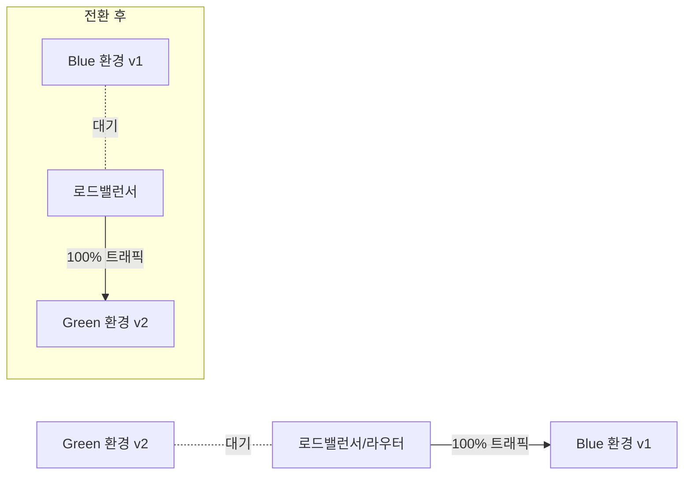
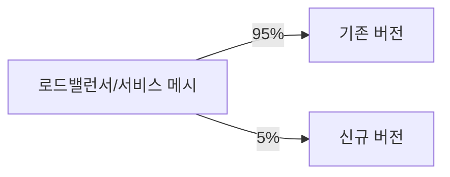
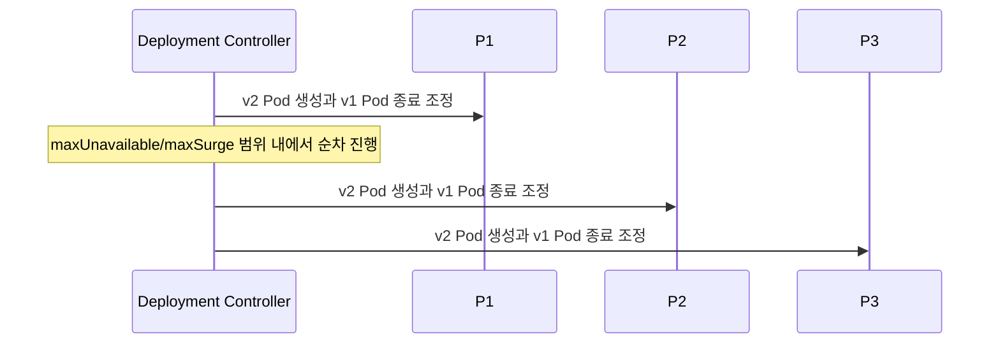

# 배포 전략 Blue-Green Canary Rolling

## 핵심 정의
운영 서비스를 중단 없이(무중단, zero-downtime) 새 버전으로 교체하기 위한 대표적인 세 가지 배포 전략이다. Blue-Green은 완전히 동일한 두 환경을 두고 트래픽을 한 번에 전환하는 방식, Canary는 신규 버전에 트래픽 일부만 점진적으로 흘려보내며 검증하는 방식, Rolling(Rolling Update)은 기존 인스턴스를 점진적으로 새 버전으로 하나씩(또는 일부씩) 교체하는 방식이다. 세 전략 모두 "구버전에서 신버전으로 어떻게 트래픽/인스턴스를 옮기느냐"에 대한 답이며, 안전성, 인프라 비용, 롤백 속도 사이의 트레이드오프가 다르다.

## 동작 원리 / 구조

**Blue-Green**

- 신버전(Green)을 구버전(Blue)과 동일한 규모로 별도로 띄운 뒤, 검증이 끝나면 라우터/DNS/로드밸런서 설정을 한 번에 전환한다.
- 라우팅을 Blue로 되돌려 신규 요청 경로를 빠르게 복구할 수 있지만 설정 전파·기존 연결과 데이터 변경은 별도로 처리한다.
- 두 환경을 동시에 운영해야 하므로 순간적으로 인프라 리소스가 2배 필요하다.

**Canary**

- 신버전에 트래픽의 일부(예: 5% → 25% → 50% → 100%)만 단계적으로 보내며 에러율, 지연시간 등 지표를 관찰한다.
- 지표가 기준을 벗어나면 자동/수동으로 트래픽을 0%로 되돌린다(자동화하면 Progressive Delivery, Argo Rollouts/Flagger가 대표적).
- 특정 사용자군(내부 직원, 특정 지역)만 신버전으로 보내는 방식도 넓은 의미의 카나리아에 포함된다.

**Rolling Update**

- Kubernetes Deployment의 기본 전략이며, `maxSurge`(추가로 띄울 수 있는 초과 Pod 비율/개수)와 `maxUnavailable`(허용 가능한 사용 불가 Pod 비율/개수)로 속도와 안전성을 조절한다. 기본값은 둘 다 25%다.
- 별도 완전한 환경 없이 점진 교체하지만 surge와 종료 유예 중 Pod에 추가 용량이 필요할 수 있다. 보통 신구 버전이 공존하며 replica 수와 전략에 따라 공존 없이 중단이 생길 수도 있다.

```yaml
spec:
  strategy:
    type: RollingUpdate
    rollingUpdate:
      maxSurge: 25%
      maxUnavailable: 25%
```

| 전략 | 인프라 비용 | 롤백 속도 | 신구 버전 공존 | 주요 리스크 |
|---|---|---|---|---|
| Blue-Green | 높음(2배 순간 필요) | 매우 빠름(라우팅 전환) | Green 사전 검증부터 Blue drain·롤백 보존까지 공존 가능 | DB 스키마 호환성, 세션 처리 |
| Canary | 중간 | 빠름(트래픽 비율 조정) | 검증 기간 동안 지속 | 관측 지표 설계, 트래픽 분할 인프라 필요 |
| Rolling | 낮음 | 느림(재배포 필요) | 보통 공존; replica·전략에 따라 공존 없이 중단 가능 | 하위 호환 API/DB 필수 |

Deployment apps/v1의 maxUnavailable 기본 25%는 내림, maxSurge 기본 25%는 올림으로 계산하며 둘 다 0일 수 없다. progressDeadlineSeconds 초과는 진행 실패 상태를 보고할 뿐 기본 Deployment가 자동 rollback하는 것은 아니다. PDB는 Deployment의 rolling update 제어를 대체하지 않는다.

## 실무 관점
- 세 전략 모두 "구버전과 신버전이 동시에 떠 있는 동안 DB 스키마와 API가 서로 호환되어야 한다"는 전제가 깔린다. 이를 어기면(예: 컬럼 삭제를 배포와 동시에 실행) 구버전 인스턴스가 에러를 낸다. 스키마 변경은 확장(add) → 배포 → 정리(cleanup, 이전 컬럼 제거)의 다단계로 나누는 것이 원칙(expand-contract 패턴).
- Blue-Green은 상태 저장(stateful) 컴포넌트(세션, 커넥션 풀, 캐시 워밍업)가 있으면 전환 직후 Green이 아직 "차가운" 상태라 지연이 튈 수 있다. 사전 워밍업 트래픽을 흘려주는 것이 좋다.
- Canary는 표본 크기가 작을 때(트래픽이 적은 서비스) 통계적으로 유의미한 판단이 어렵다. 최소 트래픽/시간 기준을 정해두고 자동 판단 로직을 설계해야 한다.
- Rolling은 별도 설정 없이 Kubernetes 기본값으로도 동작하지만, `readinessProbe`가 제대로 설정되어 있지 않으면 아직 준비 안 된 Pod로 트래픽이 흘러 순간 에러율이 튄다. Rolling 배포의 안전성은 사실상 헬스체크(liveness/readiness probe) 설계 품질에 달려 있다.
- 흔한 장애 사례: 세션 클러스터링 없이 Blue-Green 전환 시 로그인 세션이 끊기는 문제, Canary 단계에서 신버전이 이벤트를 중복 발행해 하위 시스템에 이중 처리가 발생하는 문제(멱등성 미보장), Rolling 중 커넥션 풀이 종료 중인 Pod로 계속 요청을 보내 순간 에러(그레이스풀 셧다운 미흡).
- 그레이스풀 셧다운(SIGTERM 수신 후 진행 중 요청 완료, `terminationGracePeriodSeconds`, Spring Boot의 `server.shutdown=graceful`)은 세 전략 모두에서 공통으로 챙겨야 할 튜닝 포인트다.
- 비용과 복잡도의 고정 순서는 없다. Blue-Green은 용량 비용, Canary는 트래픽 제어와 관측, Rolling은 신구 호환성과 종료 처리가 주요 부담이다. 서비스 중요도와 조직의 관측 성숙도에 맞게 선택한다.

### 롤백 단위와 카나리 중단 기준

Kubernetes v1.37의 Deployment revision은 Pod template을 보관한다. `rollout undo`는 그 template을 되돌리며, 같은 이름의 ConfigMap·Secret 내용이나 외부 DB 변경까지 복구하지 않는다. 이전 ReplicaSet을 정리하면 해당 revision으로 되돌릴 수도 없다. 이미지와 설정 버전을 함께 식별하고, rollback 기간 동안 필요한 revision·설정·데이터 호환성을 보존한다.

카나리 판정은 전체 서비스 평균과 신버전 지표를 함께 본다. 전체 평균이 정상이어도 신버전의 결제 실패가 희석될 수 있고, HTTP 오류가 없어도 비동기 소비 지연이나 잘못된 데이터 쓰기가 발생할 수 있다. 사전에 신버전 요청 수·주요 업무 성공률·지연·하위 의존성 부하의 중단 조건을 정한다. 트래픽을 0%로 바꿔도 이미 받은 요청·큐 작업·정기 작업이 끝난 것은 아니므로 이 경로의 중단과 데이터 대사까지 복구 절차에 넣는다. 이는 Deployment가 보장하는 동작과 별도로 설계할 운영 기준이다.

## 심화 Q&A

### Q. Blue-Green 배포에서 라우팅을 전환한 직후 심각한 버그가 발견됐다. "즉시 롤백"이 항상 안전한 선택인가?
A. 아니다. 전환 이후 Green 버전이 이미 쓰기 작업(주문 생성, 결제 등)을 수행했고 그 데이터가 Blue 버전 스키마와 호환되지 않는다면, 단순히 라우팅만 Blue로 되돌리는 것으로는 데이터 정합성이 깨질 수 있다. 롤백 전에 신버전이 만든 데이터가 구버전에서도 처리 가능한지 확인해야 하며, 그렇지 않다면 데이터 마이그레이션이나 보정 로직이 롤백에 포함되어야 한다. 이 때문에 배포 전에 "롤백 시나리오에서 데이터는 안전한가"를 항상 점검해야 한다.

### Q. Canary 배포에서 신버전에 5%의 트래픽만 보냈는데도 에러율이 급증했다. 왜 소량 트래픽에서 문제가 더 크게 드러날 수 있는가?
A. 로드밸런서의 트래픽 분산 알고리즘에 따라 특정 사용자/세션이 지속적으로 신버전에 몰리거나(sticky session), 특정 리전/캐시 노드로 편중될 수 있어 실제로는 5%가 균등 표본이 아닐 수 있다. 또한 카나리 인스턴스 수가 적으면 커넥션 풀, 스레드 풀 같은 리소스가 상대적으로 빨리 고갈되어 동일 비율의 실제 사용자 트래픽보다 부하가 집중되는 효과가 생긴다. 트래픽 비율뿐 아니라 절대 인스턴스 수와 리소스 설정도 함께 고려해야 한다.

### Q. Rolling Update 중 `maxUnavailable: 0`, `maxSurge: 1`로 설정하면 무중단이 완전히 보장되는가?
A. 컨트롤러가 계획한 교체 과정에서 Available replica 감소를 제한하지만 노드 장애·스케줄링·readiness 오판까지 막지는 못하므로, 애플리케이션 수준의 무중단까지 보장하지는 않는다. `readinessProbe`가 실제 트래픽 처리 가능 시점보다 먼저 성공을 반환하면(예: 헬스체크는 통과했지만 캐시 워밍업이 안 끝난 상태) 준비되지 않은 Pod로 요청이 흘러 에러가 날 수 있다. 또한 종료되는 Pod가 SIGTERM 이후 진행 중인 요청을 마무리하지 못하고 강제 종료(`terminationGracePeriodSeconds` 초과)되면 순간적인 요청 실패가 발생한다. 즉 인프라 설정과 애플리케이션의 헬스체크/셧다운 로직이 함께 맞아야 한다.

### Q. 카나리 배포와 A/B 테스트는 둘 다 트래픽을 나눈다는 점에서 비슷해 보이는데 근본적으로 무엇이 다른가?
A. 카나리는 배포 안정성(신버전이 장애 없이 동작하는가)을 검증하기 위한 운영 기법으로, 목적이 달성되면(안정성 확인) 결국 100%로 승격되고 카나리 개념 자체가 사라진다. A/B 테스트는 비즈니스 지표(전환율, 클릭률 등)를 비교하기 위한 실험이고, 두 버전이 상당 기간 동시에 존재하는 것이 오히려 목적이다. 트래픽 분할이라는 메커니즘은 공유하지만 판단 기준(시스템 안정성 vs 비즈니스 지표)과 종료 조건이 다르다.

### Q. 세 전략 중 데이터베이스 마이그레이션이 필요한 배포에 가장 안전한 것은 무엇인가?
A. 특정 전략이 우월하다기보다, 전략과 무관하게 expand-contract 패턴을 따르는 것이 핵심이다. 먼저 하위 호환되는 스키마 확장(새 컬럼 추가, nullable 허용)을 배포하고, 신구 버전이 모두 새 스키마에서 동작 가능함을 확인한 뒤, 애플리케이션을 배포하고, 마지막으로 이전 스키마 요소를 정리하는 별도 배포를 수행한다. Blue-Green은 전환이 순간적이라 마이그레이션 타이밍을 맞추기 까다롭고, Rolling/Canary는 신구 버전이 상대적으로 오래 공존하므로 확장 단계의 호환성이 더욱 중요해진다.

### Q. 서비스 메시(Istio 등) 없이 Kubernetes 기본 기능만으로 Canary를 구현할 수 있는가?
A. 제한적으로 가능하다. 동일 Service 셀렉터 아래 신구 버전 Deployment를 두고 각각의 replica 수 비율로 트래픽 비율을 근사할 수 있다(예: v1 9개, v2 1개면 약 10% 트래픽). 하지만 이는 요청 단위의 정밀한 트래픽 제어가 아니라 Pod 수 기반의 근사치이고, 특정 헤더/사용자 기준 라우팅, 세밀한 비율 조정, 자동 지표 기반 롤백 같은 기능은 서비스 메시나 Ingress 컨트롤러의 트래픽 분할 기능(Argo Rollouts, Flagger, Istio VirtualService weight) 없이는 구현이 번거롭다.

## 관련 개념
- [[CI-CD 파이프라인 구성]]
- [[Kubernetes 핵심 오브젝트]] (Deployment/Service, RollingUpdate 전략)
- [[Kubernetes 프로브와 안전한 종료]] (readiness·종료 전파·drain)
- [[Actuator와 헬스체크]] (liveness/readiness 프로브, 그레이스풀 셧다운)
- [[서비스 메시]] (Istio, Argo Rollouts)

## 참고 자료

- [Kubernetes Deployment](https://kubernetes.io/docs/concepts/workloads/controllers/deployment/) — apps/v1 RollingUpdate 25% 기본·반올림·progress deadline. 확인: 2026-09-08.
- [Argo CD sync](https://argo-cd.readthedocs.io/en/stable/user-guide/auto_sync/) — 동기화와 rollback 정책. 확인: 2026-09-08.

부분 재검증: 2026-09-22. [AWS ALB Blue/Green 안내](https://aws.amazon.com/blogs/devops/blue-green-deployments-with-application-load-balancer/)의 stickiness·connection draining과 [Kubernetes Deployment](https://kubernetes.io/docs/concepts/workloads/controllers/deployment/)의 rollout·종료 Pod를 대조했다. 그 외 서술은 이번 확인 범위 밖이므로 `verified`는 유지했다.

부분 재검증: 2026-10-04. [Kubernetes Deployment의 rollback·history](https://kubernetes.io/docs/concepts/workloads/controllers/deployment/#rolling-back-a-deployment) — 표시 버전 v1.37, apps/v1의 Pod template 복구 범위·ReplicaSet history 보존을 확인했다. 카나리 중단 조건은 이 경계에서 도출한 운영 설계 기준이다. 실제 rollout·트래픽 전환·DB 복구 시험과 그 외 기존 주장은 재검증하지 않아 `verified`를 유지했다.
