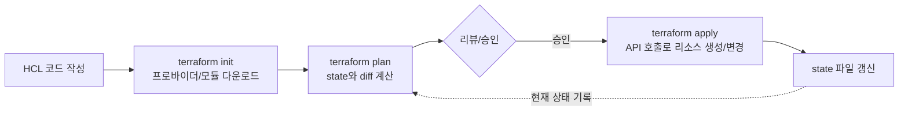

# Terraform과 IaC 원칙

## 핵심 정의
IaC(Infrastructure as Code)는 서버, 네트워크, 데이터베이스 같은 인프라 리소스를 수동 콘솔 조작이 아니라 선언적(declarative) 또는 절차적(imperative) 코드로 정의하고, 버전 관리 시스템에서 관리하는 방식이다. 목표는 인프라 변경을 코드 리뷰·테스트·재현 가능한 프로세스로 만들어 "누가 콘솔에서 뭘 바꿨는지 모르는" 설정 드리프트(configuration drift)를 없애는 것이다.

Terraform은 HashiCorp가 만든 선언적 IaC 도구로, HCL(HashiCorp Configuration Language)로 원하는 상태(desired state)를 기술하면 프로바이더(provider)를 통해 AWS/GCP/Azure 등 다양한 클라우드/SaaS API를 호출해 실제 상태를 그 선언에 맞춘다. Ansible 플레이북이 작업 순서를 기술하면서도 모듈에 원하는 상태를 선언할 수 있는 것과 비교하면, Terraform은 "무엇(What)"을 선언하고 실행 계획 수립은 도구에 위임한다.

## 동작 원리 / 구조

### 핵심 워크플로


- **State**: Terraform이 관리하는 리소스 주소와 원격 ID 및 마지막으로 관측한 속성를 JSON으로 기록한 파일(`terraform.tfstate`). 실제 클라우드 리소스와 HCL 코드 사이의 매핑 정보(리소스 ID 포함)를 담고 있어, state를 잃으면 기존 리소스의 연결 관계를 알 수 없어 재생성 계획이나 이름 충돌이 생길 수 있다.
- **Provider**: 특정 API(AWS, Kubernetes, GitHub 등)와 통신하는 플러그인. `terraform init`이 `required_providers` 블록을 보고 다운로드한다.
- **Plan/Apply 분리**: `plan`은 실제 변경 없이 "무엇을 생성/변경/삭제할지" 계산만 하고, `apply`가 실제로 API를 호출한다. 이 분리 덕분에 파괴적 변경을 미리 검토할 수 있다.
- **의존성 그래프**: 리소스 간 참조(`aws_instance.web.id`처럼)를 통해 Terraform이 자동으로 DAG(방향성 비순환 그래프)를 구성하고, 병렬 실행 가능한 리소스는 동시에 생성한다.
- **모듈(Module)**: 재사용 가능한 리소스 묶음. 루트 모듈이 하위 모듈을 호출하는 방식으로 팀/환경 간 코드 중복을 줄인다.

### 원격 State와 잠금(Locking)
로컬 state 파일을 여러 명이 공유하면 동시 apply 시 충돌이 발생하므로, 실무에서는 반드시 원격 백엔드(S3, Terraform Cloud/HCP Terraform 등)에 state를 저장하고 잠금을 건다.

```hcl
terraform {
  backend "s3" {
    bucket       = "my-tfstate-bucket"
    key          = "prod/network/terraform.tfstate"
    region       = "ap-northeast-2"
    use_lockfile = true   # S3 조건부 쓰기(If-None-Match) 기반 네이티브 잠금
    encrypt      = true
  }
}
```
S3 백엔드는 Terraform 1.10부터 `use_lockfile`로 DynamoDB 없이 S3 자체의 조건부 쓰기(conditional write)만으로 잠금을 구현할 수 있게 되었고, 조회한 S3 backend 문서는 use_lockfile을 제공하고 기존 DynamoDB 잠금을 deprecated로 표시한다. Deprecated는 즉시 제거되었다는 뜻은 아니다. 신규 구성은 `use_lockfile`을 쓰고, 기존 DynamoDB 잠금을 쓰던 팀은 점진적으로 마이그레이션하는 것이 권장된다.

### 코드 조직 예시
```hcl
module "vpc" {
  source = "./modules/vpc"
  cidr_block = "10.0.0.0/16"
}

resource "aws_instance" "app" {
  ami           = data.aws_ami.app.id
  instance_type = "t3.medium"
  subnet_id     = module.vpc.private_subnet_ids[0]

  lifecycle {
    create_before_destroy = true
    # prevent_destroy = true를 함께 쓰면 교체의 기존 리소스 삭제도 거부됨
  }
}
```

sensitive는 출력 마스킹이며 state/plan 저장을 생략하는 기능이 아니다. Terraform 1.10+의 ephemeral과 1.11+의 provider write-only 인수는 지원 범위에서 저장을 피할 수 있다. saved plan에 확정된 값이 apply 때 임의로 재평가되는 것은 아니며 count/for_each의 인스턴스 식별값은 plan 단계에 알아야 한다. prevent_destroy는 리소스 블록 자체를 설정에서 제거하거나 외부 API로 삭제하는 행위를 막지 못한다.

## 실무 관점
- **환경별 state 격리**: dev/staging/prod를 하나의 state로 묶으면 dev 작업 실수가 prod에 영향을 줄 수 있다. 워크스페이스(workspace)보다는 디렉터리/백엔드 키를 완전히 분리하는 방식을 더 안전하게 본다.
- **State 파일에 시크릿이 평문으로 남는 문제**: 데이터베이스 비밀번호를 리소스 속성으로 넘기면 state 파일에 평문으로 저장된다. state는 절대 git에 커밋하지 않고, 원격 백엔드의 서버 측 암호화(SSE-KMS)와 접근 제어(IAM/버킷 정책)를 반드시 설정해야 한다. 외부 저장소를 data source로 읽어도 값이 state에 남을 수 있다. 지원되는 provider의 ephemeral·write-only 속성 또는 런타임 직접 조회를 검토한다.
- **drift 감지**: 누군가 콘솔에서 수동으로 리소스를 바꾸면 실제 상태와 state가 어긋난다(drift). `terraform plan`을 주기적으로(CI 스케줄) 돌려 drift를 감지하고, 발견하면 코드로 반영하거나 `terraform apply`로 되돌린다.
- **`terraform import`와 삭제 방지**: 이미 존재하는 리소스를 Terraform 관리 하에 두려면 import가 필요하며 실수하기 쉽다. 운영 DB처럼 절대 삭제되면 안 되는 리소스는 `lifecycle { prevent_destroy = true }`로 보호한다.
- **모듈 버전 고정**: 원격 모듈(Terraform Registry, git)을 버전 핀 없이 쓰면 모듈 작성자의 변경이 그대로 반영되어 예기치 않은 리소스 변경이 발생한다. `version` 또는 git 태그로 고정한다.
- **`create_before_destroy`**: 무중단으로 리소스를 교체해야 할 때(예: 시작 스크립트 변경으로 인스턴스 재생성) 기본 동작인 destroy-then-create 대신 새 리소스를 먼저 만들고 이전 것을 삭제하도록 지정한다. 단, 이름 충돌(unique 제약)이 있는 리소스는 별도 처리가 필요하다.
- **비용 관리**: `plan` 결과를 Infracost 같은 도구와 CI에 연계해 리소스 변경이 초래할 비용 증가를 배포 전에 가시화하는 패턴이 흔하다.

### 잠금 장애와 저장된 plan의 운영 경계

State 잠금은 해당 backend가 제공하는 동일 state의 협력적 배타 제어다. 다른 state로 같은 리소스를 관리하거나 콘솔에서 변경하는 작업까지 잠그지 않는다. 잠금 대기 때문에 `-lock=false`로 우회하면 동시 writer가 생길 수 있다. 실행 중인 CI job·작업자·backend와 lock ID를 먼저 대조하고, 자동 해제에 실패한 **자신의 잠금**이며 기존 실행이 끝났음을 확인한 경우에만 `force-unlock`을 검토한다. lock ID는 해제 대상을 식별할 뿐 소유 프로세스의 종료를 보증하지 않는다.

`terraform plan -out=...`으로 저장한 파일에는 구성·입력 변수·계획 값이 들어가며 터미널에서 가린 민감 값도 포함될 수 있다. CI 아티팩트 권한·보존 기간·다운로드 로그를 state 수준으로 관리한다. 승인한 plan의 코드와 대상 환경을 식별하고, 적용 실패 뒤에는 이전 plan이나 state를 무조건 재사용하지 말고 실제 변경과 새 plan을 대조한다.

## 심화 Q&A

### Q. Terraform state 파일을 잃어버리면 어떻게 복구하는가?
A. 원격 백엔드에 버저닝(versioning)이 켜져 있다면 이전 state snapshot으로 복구할 수 있다. 이것은 실제 클라우드 리소스를 이전 상태로 되돌리는 rollback이 아니다. 복구한 state와 실제 리소스를 대조하고 새 plan을 검토해야 한다. 그마저 없다면 각 리소스를 `terraform import`로 하나씩 다시 등록해야 하는데, 리소스 수가 많으면 사실상 재해 복구 수준의 작업이 된다. 이 때문에 원격 백엔드의 버저닝과 백업은 선택이 아니라 필수로 취급해야 한다.

### Q. `plan`에서 문제없어 보였는데 `apply` 시점에 실패하는 경우는 왜 발생하는가?
A. plan은 계산 시점의 스냅샷이므로, 같은 리소스를 다른 프로세스가 동시에 변경했거나(경쟁 상태), 클라우드 API 쿼터/일시적 오류, 혹은 권한/리소스 상태가 달라졌거나 apply까지 읽기가 지연된 data source가 예상과 다른 값을 반환한 경우 발생할 수 있다. 잠금(locking)은 Terraform 프로세스 간 동시 실행을 막아주지만, 외부에서 콘솔로 리소스를 바꾸는 것까지는 막지 못한다. apply는 여러 리소스를 묶은 원자적 트랜잭션이 아니어서 일부 변경 후 실패할 수 있고 자동 rollback하지 않는다. 성공·실패 리소스와 최신 state를 확인하고 원인을 수정한 뒤 새 plan으로 남은 변경을 검토한다. 이전 state를 덮어쓰는 것만으로 부분 적용을 취소하면 안 된다.

### Q. 선언적 도구인 Terraform이 절차적 로직(조건 분기, 반복)을 어떻게 표현하는가? 이것이 한계가 되는 지점은?
A. `count`, `for_each`, `dynamic` 블록, 삼항 연산자 형태의 표현식으로 제한적인 절차적 로직을 흉내낸다. 하지만 임의의 명령형 스크립트(예: "리소스 A가 실패하면 B로 재시도")는 표현하기 어렵고, 복잡한 조건 분기가 늘어나면 코드 가독성이 급격히 떨어진다. 이런 경우 Terraform 밖에서(CI 스크립트, 별도 오케스트레이션) 흐름 제어를 하고 Terraform은 리소스 선언에만 집중시키는 것이 유지보수에 유리하다.

### Q. 모놀리식(monolithic) 단일 state와 리소스별로 잘게 쪼갠 다중 state 중 어떤 기준으로 선택하는가?
A. 단일 state는 리소스 간 참조가 쉽고 의존성 그래프가 한눈에 보이지만, state가 커질수록 `plan` 속도가 느려지고 한 사람의 실수가 전체 인프라에 영향을 줄 반경(blast radius)이 커진다. 변경 빈도와 소유 팀이 다른 리소스(예: 네트워크 vs 애플리케이션 인프라)는 별도 state로 쪼개고 `terraform_remote_state` 데이터 소스나 SSM Parameter Store 같은 매개체로 값을 주고받는 것이 일반적이다. 다만 `terraform_remote_state`가 코드에 노출하는 값은 root output뿐이어도 독자는 전체 state snapshot을 읽을 권한이 필요하므로 시크릿 노출 경계가 넓어진다. 공유 값만 별도 Parameter Store 등에 게시하면 state와 독립적인 읽기 권한을 줄 수 있다. 너무 잘게 쪼개면 배포 순서 조율 비용이 늘어난다.

### Q. `terraform destroy`나 실수로 인한 리소스 삭제를 방지하기 위한 다층 방어는 무엇인가?
A. 코드 레벨에서는 `lifecycle { prevent_destroy = true }`, CI 레벨에서는 prod 워크스페이스에 대한 apply/destroy 파이프라인 분리와 수동 승인 게이트, 클라우드 레벨에서는 IAM 정책으로 특정 역할의 삭제 권한 자체를 제한하는 방어가 함께 필요하다. 코드만 믿으면 `prevent_destroy`를 실수로 지우고 apply하는 순간 방어가 무력화되므로 최소 하나는 코드 밖(IAM, 승인 절차)에 둬야 한다.

### Q. GitOps 기반 Kubernetes 배포(Argo CD 등)와 Terraform의 역할 분담은 어떻게 하는가?
A. 일반적으로 Terraform은 클러스터 자체, VPC, IAM, 관리형 데이터베이스 같은 상대적으로 변경 빈도가 낮은 "기반(foundation)" 인프라를 담당하고, 애플리케이션 매니페스트처럼 배포마다 바뀌는 리소스는 Argo CD/Flux 같은 GitOps 도구가 담당하도록 경계를 나눈다. 둘 다로 같은 Kubernetes 리소스를 관리하면 소유권 충돌(누가 최종 상태를 결정하는지)이 발생하므로, `kubernetes_manifest` 같은 Terraform 프로바이더로 애플리케이션 배포까지 관리하는 것은 지양하는 편이다.

## 관련 개념
- [[시크릿 관리]]
- [[CI-CD 파이프라인 구성]]
- [[Kubernetes ConfigMap과 Secret]]
- [[VPC 구조]]

## 참고 자료

- [Terraform S3 backend](https://developer.hashicorp.com/terraform/language/backend/s3) — use_lockfile·DynamoDB deprecation. 확인: 2026-09-08.
- [Terraform lifecycle](https://developer.hashicorp.com/terraform/language/meta-arguments/lifecycle) — create_before_destroy·prevent_destroy. 확인: 2026-09-08.
- [Terraform sensitive data](https://developer.hashicorp.com/terraform/language/manage-sensitive-data) — sensitive·ephemeral(1.10+)·write-only(1.11+). 확인: 2026-09-08.

부분 재검증: 2026-09-22. [Terraform apply](https://docs.hashicorp.com/terraform/tutorials/cli/apply)의 부분 적용·자동 rollback 부재와 [terraform_remote_state](https://developer.hashicorp.com/terraform/language/state/remote-state-data)의 전체 snapshot 접근 경고를 대조했다. 그 외 서술은 이번 확인 범위 밖이므로 `verified`는 유지했다.

부분 재검증: 2026-10-04. [Terraform State Locking](https://developer.hashicorp.com/terraform/language/state/locking)와 [plan 명령](https://developer.hashicorp.com/terraform/cli/commands/plan#out-filename) — 조회 문서 v1.16.x의 backend별 잠금 지원·자신의 lock 해제 조건·saved plan의 민감 데이터 저장을 확인했다. CI 실행 종료 확인과 아티팩트 관리는 이 계약에 따른 운영 절차다. 실제 backend 잠금·force-unlock·apply 실행과 전체 기존 주장은 재검증하지 않아 `verified`를 유지했다.
