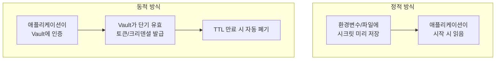
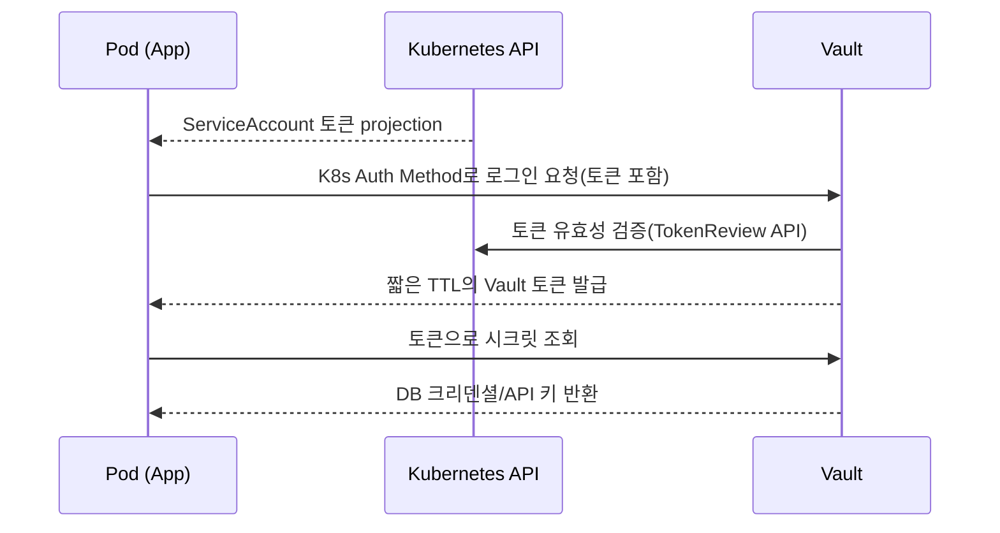

# 시크릿 관리

## 핵심 정의
시크릿(secret)은 데이터베이스 비밀번호, API 키, TLS 인증서 개인키, OAuth 클라이언트 시크릿처럼 노출되면 시스템 보안이 무너지는 민감정보다. 시크릿 관리(Secrets Management)는 이런 값을 소스 코드나 설정 파일에 하드코딩하지 않고, 별도의 저장소에서 암호화해 보관하며, 필요한 주체(애플리케이션, 서비스)에게만 최소 권한으로 동적으로 공급하고, 주기적으로 교체(rotation)하는 체계 전반을 말한다.

핵심 원칙은 "시크릿은 코드/이미지/Git 히스토리에 절대 남지 않아야 하고, 저장 시점과 전송 시점 모두 암호화되어야 하며, 접근 이력이 감사(audit) 가능해야 한다"는 것이다.

## 동작 원리 / 구조

### 정적 주입 vs 동적 발급


- **정적(static) 시크릿**: 값이 바뀌지 않고 오래 유지된다. 관리가 단순하지만 유출 시 피해 범위가 크고, 고정된 값을 정기적으로 자동 회전하도록 구성할 수 있다.
- **동적(dynamic) 시크릿**: HashiCorp Vault의 DB Secrets Engine처럼, 요청 시점에 짧은 TTL(Time To Live)을 가진 임시 자격증명을 생성한다. 예를 들어 Vault가 DB에 직접 접속해 즉석에서 계정을 만들고 lease 만료 시 backend 폐기를 수행한다. 저장소/DB 장애나 폐기 권한 문제로 지연될 수 있어 실패를 감시해야 한다. 유출되어도 유효 시간이 짧아 피해가 제한적이다.

### 대표 아키텍처 (Vault + Kubernetes)

사이드카(Vault Agent Injector)를 쓰면 애플리케이션 코드가 Vault API를 직접 호출하지 않고도, 사이드카가 시크릿을 파일로 마운트해주는 방식으로 통합할 수 있다.

### 클라우드 관리형 서비스와 External Secrets Operator
AWS Secrets Manager, GCP Secret Manager, Azure Key Vault 같은 관리형 서비스는 자동 로테이션 훅, KMS 기반 암호화, IAM 연동을 기본 제공한다. Kubernetes 환경에서는 External Secrets Operator(ESO)가 이런 외부 저장소의 시크릿을 폴링/watch해 클러스터 내부의 Kubernetes Secret 오브젝트로 동기화하는 역할을 한다.

```yaml
apiVersion: external-secrets.io/v1
kind: ExternalSecret
metadata:
  name: db-credentials
spec:
  refreshInterval: 1h
  secretStoreRef:
    name: aws-secrets-manager
    kind: ClusterSecretStore
  target:
    name: db-credentials-k8s
  data:
    - secretKey: password
      remoteRef:
        key: prod/db/password
```
이 패턴은 클러스터 내부에는 여전히 [[Kubernetes ConfigMap과 Secret]]의 Secret 오브젝트가 존재하지만, 실제 원본은 외부 저장소가 소유하고 Kubernetes는 캐시 역할만 하는 구조가 된다.

ESO v1 예제는 설치된 CRD가 external-secrets.io/v1을 제공하고 ClusterSecretStore 및 외부 저장소 접근 권한이 구성되어 있어야 한다. Kubernetes Secret 동기화가 원본 자격증명 회전을 자동 실행하는 것은 아니다. 파일 마운트도 동일 UID의 코드 실행이나 노드 권한 탈취로 읽힐 수 있으므로 저장 방식만으로 침해를 방어하지 못한다.

## 실무 관점
- **Git 히스토리 유출**: `.env` 파일이나 자격증명을 실수로 커밋하면 이후 삭제해도 Git 히스토리에 영구히 남는다. `git-secrets`, `gitleaks` 같은 pre-commit 훅으로 커밋 시점에 차단하고, 이미 유출됐다면 삭제가 아니라 즉시 폐기(revoke) 및 재발급이 정답이다. 히스토리에서 지우는 것은 부차적 조치일 뿐이다.
- **CI/CD 파이프라인 로그 노출**: 빌드 로그에 환경변수를 `echo`로 출력하거나 디버그 모드에서 시크릿이 그대로 찍히는 사고가 흔하다. GitHub Actions/GitLab CI는 등록된 시크릿 값을 로그에서 자동 마스킹하지만, 값을 가공(인코딩, 부분 문자열)하면 마스킹이 깨질 수 있다.
- **장기 자격증명 대신 단기 토큰**: CI가 클라우드에 접근할 때 액세스 키를 영구 저장하는 대신, OIDC(OpenID Connect) 연동으로 파이프라인 실행마다 단기 토큰을 발급받는 방식(GitHub Actions OIDC → AWS IAM Role)이 표준이 되었다. 키 유출 시에도 만료되면 무력화된다는 장점이 있다.
- **애플리케이션 로그를 통한 유출**: 예외 스택 트레이스나 디버그 로그에 DB 커넥션 문자열, 헤더의 Authorization 값이 그대로 찍히는 실수가 잦다. 로깅 프레임워크에서 민감 필드를 마스킹하는 규칙을 팀 공통 컨벤션으로 둔다.
- **로테이션 자동화**: 수동 로테이션은 담당자가 잊어버리면 몇 년째 그대로인 키가 흔하다. 관리형 시크릿 저장소의 자동 로테이션 훅(Lambda 등)을 연결하거나, 애플리케이션이 시크릿 버전 변경을 감지해 재연결하는 로직(예: DB 커넥션 풀 재생성)을 함께 설계해야 로테이션이 실제로 무중단으로 동작한다.
- **환경변수 주입의 한계**: 환경변수는 해당 프로세스와 기본적으로 상속받는 자식 프로세스에 노출되며 /proc 접근도 UID·ptrace·namespace 권한에 영향을 받으므로 완전히 안전하지 않다. 민감도가 높은 값은 파일 마운트(권한 제한 가능) 방식을 선호하는 팀도 많다.

## 심화 Q&A

### Q. 정적 시크릿 대신 동적 시크릿을 쓰면 항상 더 안전한가? 어떤 비용을 감수해야 하는가?
A. 유출 시 피해 반경은 확실히 줄어들지만, 시크릿 저장소(Vault 등)가 단일 장애점(SPOF)이 되어 저장소 장애 시 애플리케이션이 새 크리덴셜을 발급받지 못해 연쇄 장애로 번질 수 있다. 또한 DB 커넥션 풀처럼 상태를 오래 유지하는 컴포넌트는 TTL 만료 시 재인증/재연결 로직을 애플리케이션이 직접 구현해야 하므로 초기 구축 복잡도가 올라간다. 고가용성 저장소 구성과 캐싱/재시도 전략이 함께 필요하다.

### Q. Kubernetes Secret 오브젝트만으로 시크릿 관리가 충분하지 않은 이유는 무엇인가?
A. Kubernetes Secret은 기본적으로 base64 인코딩일 뿐 암호화가 아니고, etcd에 평문에 가깝게 저장된다(EncryptionConfiguration을 별도로 켜지 않으면). Secret의 get/list 권한이 있으면 API에서 값을 읽을 수 있다. 직접 읽기 권한이 없어도 같은 namespace에서 Secret을 마운트하는 Pod를 생성할 수 있다면 워크로드를 통해 간접적으로 값을 노출할 수 있다. 두 권한 경로를 구분해 RBAC·namespace·admission 정책을 설계한다. API audit는 접근을 기록할 수 있지만 원본 자격증명의 자동 회전은 별도 컨트롤러/서비스가 필요하다. 이 때문에 실제 원본은 Vault/Secrets Manager 같은 전용 저장소에 두고, Kubernetes Secret은 동기화된 캐시로만 취급하는 것이 일반적이다.

### Q. 시크릿을 환경변수로 주입하는 방식과 볼륨 마운트(파일)로 주입하는 방식 중 어느 쪽이 더 안전하고, 왜 그런가?
A. 파일 마운트가 일반적으로 더 안전하다고 본다. 환경변수는 `docker inspect`, `/proc/<pid>/environ`, 예외 처리 시 전체 환경변수를 로그에 덤프하는 라이브러리 등을 통해 의도치 않게 노출될 경로가 많다. 반면 파일은 파일 시스템 권한(mode 0400 등)으로 접근을 제한할 수 있고, 로테이션 시에도 파일 내용만 갱신하면 되어 컨테이너 재시작이 필요 없는 경우가 많다(단, 애플리케이션이 파일 변경을 감지해 재로드해야 함).

### Q. CI 파이프라인에서 OIDC 기반 단기 토큰 방식이 장기 액세스 키보다 나은 이유를, 실제 유출 시나리오로 설명하면?
A. 장기 액세스 키가 파이프라인 로그나 서드파티 액션 코드를 통해 유출되면, 키를 수동으로 폐기하기 전까지 공격자가 계속 사용할 수 있다. OIDC 방식은 파이프라인 실행마다 STS `AssumeRoleWithWebIdentity`로 몇 분~몇 시간짜리 임시 자격증명을 발급받으므로, 설령 로그에 토큰이 노출되어도 발급된 자격증명의 만료 시각에 무효화된다. job 종료 자체가 STS 자격증명을 즉시 폐기하지는 않는다. 또한 저장소/브랜치/워크플로 조건(trust policy)으로 어떤 리포지토리의 어떤 브랜치만 역할을 assume할 수 있는지 세밀하게 제한할 수 있다는 점도 장기 키보다 공격 표면을 줄인다.

### Q. 시크릿 로테이션을 자동화했는데도 배포 중 서비스가 순간적으로 인증 실패를 겪는다면 원인은 무엇일까?
A. DB의 비밀번호 변경, 시크릿 저장소 버전 전환, 애플리케이션의 재조회·풀 갱신은 한 트랜잭션이 아니다. 그 사이 옛 비밀번호로 새 연결을 만들거나 인스턴스마다 다른 버전을 사용하면 인증이 실패할 수 있다. 저장소에 이전 값을 보관하는 것만으로 DB가 그 비밀번호를 계속 받아주지는 않는다. 실제 인증 시스템이 지원하는 병행 자격증명이나 교대 사용자 방식, 인증 실패 후 최신 값의 제한적 재조회·재연결을 선택한다. 연결 인증 실패의 재시도와 이미 실행한 업무 트랜잭션의 재시도는 구분한다.

AWS Secrets Manager의 Lambda DB 회전은 single-user와 alternating-users 전략을 구분한다. single-user에서는 DB 변경과 secret 갱신 사이에 새 연결이 실패할 수 있지만 기존 열린 DB 연결은 이 회전 때문에 끊기지 않는다고 문서화되어 있다. alternating-users는 두 사용자를 교대로 갱신해 회전 직후 양쪽 자격증명을 유효하게 유지하며, 복제 사용자 권한을 나중에 변경할 때도 양쪽을 관리해야 한다. `AWSPREVIOUS`라는 레이블 자체는 인증 대상에서의 유효성을 보증하지 않는다.

### Q. 시크릿 스캐닝 도구(gitleaks 등)를 CI에 넣었는데도 유출을 막지 못하는 경우는 언제인가?
A. 스캐닝 도구는 알려진 패턴(AWS 키 형식, JWT 등)이나 엔트로피 기반 휴리스틱으로 탐지하므로, 커스텀 포맷의 내부 API 키나 이미 base64/hex로 한 번 더 인코딩된 값은 놓치기 쉽다. 또한 PR 단계에서만 스캔하고 이미 병합된 과거 히스토리는 스캔하지 않는 설정이면 과거 커밋에 남은 시크릿을 잡지 못한다. 정기적인 전체 히스토리 스캔과, 스캐너가 놓친 경우를 대비한 최소 권한 원칙(설령 유출돼도 피해가 제한되도록)을 함께 적용해야 한다.

## 관련 개념
- [[Terraform과 IaC 원칙]]
- [[Kubernetes ConfigMap과 Secret]]
- [[CI-CD 파이프라인 구성]]

## 참고 자료

- [Vault Lease Renew Revoke](https://developer.hashicorp.com/vault/docs/concepts/lease) — TTL과 backend revocation. 확인: 2026-09-08.
- [External Secrets ExternalSecret](https://external-secrets.io/latest/api/externalsecret/) — external-secrets.io/v1·refresh policy. 확인: 2026-09-08.
- [AWS Secrets Manager rotation](https://docs.aws.amazon.com/secretsmanager/latest/userguide/rotating-secrets.html) — managed/Lambda rotation. 확인: 2026-09-08.
- [GitHub Actions security](https://docs.github.com/en/actions/security-for-github-actions/security-guides/security-hardening-for-github-actions) — OIDC·로그 마스킹. 확인: 2026-09-08.

부분 재검증: 2026-09-22. [Kubernetes v1.37 Secrets](https://kubernetes.io/docs/concepts/configuration/secret/)와 [Secret 운영 지침](https://kubernetes.io/docs/concepts/security/secrets-good-practices/)의 직접 API 조회와 Pod 생성에 의한 간접 접근을 대조했다. 그 외 서술은 이번 확인 범위 밖이므로 `verified`는 유지했다.

부분 재검증: 2026-10-04. [AWS Secrets Manager Lambda rotation strategies](https://docs.aws.amazon.com/secretsmanager/latest/userguide/rotation-strategy.html) — 관리형 서비스 문서(별도 제품 버전 없음), DB single-user/alternating-users의 인증 공백·기존 연결·복제 사용자 권한 관리 범위를 확인했다. 이를 모든 DB·Vault lease 동작으로 일반화하지 않는다. 실제 DB 회전·풀 갱신 시험과 다른 기존 주장은 재검증하지 않아 `verified`를 유지했다.
