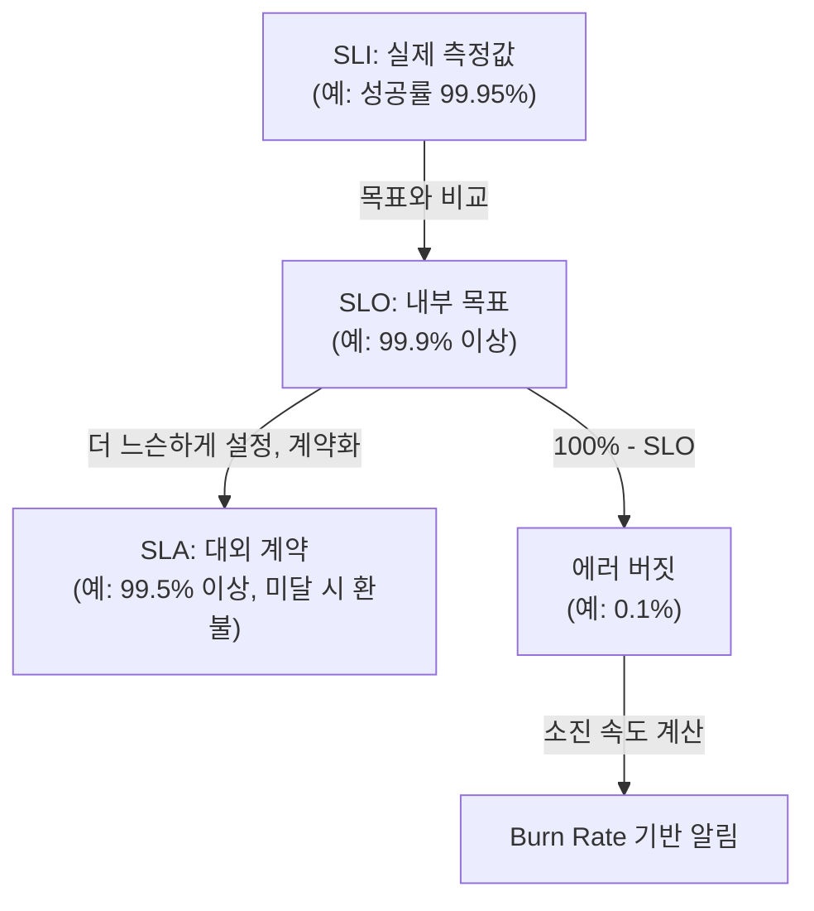

# SLI SLO와 에러 버짓

## 핵심 정의
SLI(Service Level Indicator)는 서비스 품질을 정량적으로 측정하는 지표(예: 성공 요청 비율, p99 지연시간)이고, SLO(Service Level Objective)는 그 SLI가 만족해야 할 목표 수치(예: "30일 동안 가용성 99.9% 이상")다. SLA(Service Level Agreement)는 SLO를 지키지 못했을 때 위약금 등 계약상 책임이 따르는 대외 약속으로, SLO보다 보통 느슨하게 잡는다. 세 용어는 "측정값 → 내부 목표 → 대외 계약"으로 이어지는 위계를 이룬다.

에러 버짓(error budget)은 "100% - SLO"로 정의되는 허용 가능한 실패량이다. SLO가 99.9%라면 에러 버짓은 0.1%이며, 이는 "이 기간 동안 얼마든지 써도 되는 실패 예산"으로 취급된다. 에러 버짓의 핵심 가치는 신뢰성과 배포 속도라는 상충하는 목표를 하나의 숫자로 중재한다는 데 있다. 버짓이 남아있으면 공격적으로 배포하고, 소진되면 신규 기능 배포를 멈추고 안정화에 집중한다는 의사결정 규칙을 조직 차원에서 명시적으로 둘 수 있다.

## 동작 원리 / 구조

### 세 개념의 관계



- 동일한 지표·측정 범위를 쓰는 경우 SLO를 SLA보다 엄격하게 잡아, SLO 위반이 곧바로 SLA 위반(계약 책임)으로 번지지 않도록 여유를 둔다.
- 좋은 SLI 후보: 가용성(성공 응답 비율), 지연시간(latency, 특정 백분위수 기준), 처리량(throughput), 정확성(데이터 정합성 등). 흔히 "요청 기반(request-based)" SLI를 선호한다 — "성공한 요청 수 / 전체 요청 수" 형태로 정의하면 집계와 버짓 계산이 단순해진다.

### 에러 버짓 계산

```
에러 버짓(허용 실패 비율) = 1 - SLO
예) SLO 99.9% → 에러 버짓 0.1%

30일 윈도우, 일일 요청 100만 건 가정 시
허용 가능한 실패 요청 수 = 100만 × 30 × 0.001 = 30,000건
```

버짓은 절대적인 "실패 허용 횟수"로 환산했을 때 실감이 난다. 0.1%라는 숫자는 작아 보이지만 트래픽 규모에 따라 수만 건의 실패를 의미할 수 있다.

### Burn Rate(소진 속도)와 다중 윈도우 알림

Burn rate는 "에러 버짓을 얼마나 빠르게 소진하고 있는가"를 나타내는 배수다. Burn rate가 1이면 버짓이 정확히 SLO 윈도우(예: 30일) 동안 균등하게 소진되어 딱 맞춰 바닥난다는 뜻이고, 14.4라면 그 14.4배 속도로 소진 중이라는 뜻이다.

Google SRE 진영에서 정립한 **다중 윈도우·다중 소진율(multiwindow, multi-burn-rate) 알림**이 실무 표준으로 널리 쓰인다. 짧은 확인 윈도우와 긴 감지 윈도우를 함께 조건으로 걸어, 순간적인 스파이크로 인한 오탐과 완만한 저속 소진을 놓치는 미탐을 동시에 줄인다. 30일 SLO 기준 대표적인 3단계 조합은 다음과 같다.

| 단계 | 긴 윈도우 | Burn Rate 임계치 | 의미(버짓 소진 비율) | 대응 |
|---|---|---|---|---|
| 긴급(page) | 1시간 (+ 5분 확인 윈도우) | 14.4x | 1시간 만에 30일 버짓의 2% 소진 | 즉시 대응(page) |
| 경고(page) | 6시간 (+ 30분 확인 윈도우) | 6x | 6시간 만에 버짓의 5% 소진 | 즉시 대응(page) |
| 완만(ticket) | 3일 | 1x | 3일간 버짓의 10% 소진 | 티켓 생성, 다음 근무일 처리 |

계산식: `전체_버짓_소진시간 = 전체_SLO_기간 / burn_rate`, `소진된_버짓_비율 = burn_rate × 윈도우_크기 / 전체_SLO_기간`. 예를 들어 99.9% SLO에서 1시간 동안 에러율이 1.44%(=14.4 × 0.1%)를 넘으면 해당 속도로 30일 버짓의 2%를 단 1시간에 태우고 있다는 뜻이므로 즉시 알림을 울린다.

```yaml
# Prometheus 룰 예시 (Google SRE Workbook 패턴)
- alert: ErrorBudgetBurnFast
  expr: |
    (job:slo_errors_per_request:ratio_rate1h{job="myapp"} > (14.4*0.001))
    and
    (job:slo_errors_per_request:ratio_rate5m{job="myapp"} > (14.4*0.001))
  labels:
    severity: page
```

요청 기반 SLO에서 관측 구간의 실제 소진 비율은 실패 요청 수 / 전체 평가 기간의 허용 실패 요청 수다. burn_rate × 관측시간 / SLO기간 환산은 요청률이 일정하다는 가정의 근사이며 트래픽 변동 시 요청 수로 계산한다. 잔여 버짓 비율 r의 소진 예상 시간은 같은 가정에서 r × SLO기간 / burn_rate다. 지연 SLI의 개별 요청 임계치와 집계 percentile은 서로 다른 정의다.

## 실무 관점

### 분모·누락·집계 단위 점검

SLO를 계산하기 전에 유효 요청의 경계와 실패 판정을 정한다. 클라이언트 재시도 각각을 셀지 최종 사용자 작업을 셀지, 정상적인 404·정책에 맞는 429와 서버 과부하로 생긴 실패를 어떻게 구분할지 명시한다. 애플리케이션까지 도착하지 않은 DNS·TLS·게이트웨이 실패는 서버 내부 메트릭만으로 포착할 수 없으므로 외부 관측과 대조한다.

인스턴스별 성공률이나 p99를 평균내면 서비스 전체의 성공률·p99가 되지 않는다. 성공·전체 요청 수를 각각 합산한 뒤 비율을 계산하고, 지연 SLO는 임계치 이하 histogram bucket의 요청 수를 전체 관측 수와 비교한다. classic histogram은 SLO 임계치와 같은 bucket 경계를 두면 그 경계의 비율을 직접 집계할 수 있다.

트래픽이 없어서 분모가 0인 경우, 메트릭 수집이 중단된 경우, 실제로 모두 성공한 경우를 구분한다. 빈 시계열을 무조건 100% 성공으로 바꾸면 장애를 가릴 수 있다. 저트래픽 서비스는 단일 실패에도 비율이 크게 변하므로 실패의 업무 가치에 맞춰 경보 정책을 정한다. 합성 요청을 추가하더라도 정상 합성 트래픽이 실제 사용자 실패를 희석하지 않도록 별도로 관찰한다.

- **왜 쓰는가**: 신뢰성 지표 없이 "장애를 무조건 0으로" 목표하면 배포 속도가 극단적으로 느려지고, 반대로 지표 없이 속도만 추구하면 장애가 누적된다. SLO/에러 버짓은 "이만큼은 실패해도 괜찮다"는 합의된 숫자로 두 목표의 긴장을 조직적 의사결정 규칙으로 전환한다.
- **정책 연동**: 에러 버짓이 남아있을 때는 신규 기능 배포·실험(A/B 테스트)을 허용하고, 소진되면 배포 동결(freeze) 후 안정화 작업에 우선순위를 준다는 규칙을 사전에 문서화해둬야 실제 장애 상황에서 감정적 논쟁 없이 규칙대로 움직일 수 있다.
- **흔한 실수 1**: SLO를 SLA와 동일하게 설정한다. 그러면 SLO를 살짝만 벗어나도 곧바로 계약 위반(SLA)이 되어 여유가 전혀 없다. SLA와 측정 범위·예외가 같은지 확인하고 대응 여유를 두도록 SLO를 정한다.
- **흔한 실수 2**: 가용성 SLI를 인프라 관점(서버가 떠 있는가)으로만 정의한다. 사용자 관점에서는 서버가 떠 있어도 응답이 5xx거나 타임아웃이면 실패다. 요청 기반 SLI("성공 응답 / 전체 요청")가 사용자 체감과 더 가깝다.
- **흔한 실수 3**: 단일 윈도우·단일 임계치로 알림을 걸어, 짧은 스파이크에도 페이지가 울리거나(오탐 과다) 반대로 완만한 장기 소진을 놓친다(미탐). 다중 윈도우·다중 소진율 조합으로 완화한다.
- **튜닝 포인트**: SLO 목표치를 얼마나 엄격하게 잡을지는 비즈니스 임팩트와 현재 실제 달성 수준(과거 데이터)을 함께 봐야 한다. 실측이 99.99%여도 사용자가 99.9%를 필요로 한다면 99.9% SLO가 합리적일 수 있으며, 반대로 실제 역량보다 훨씬 높은 목표를 걸면 항상 버짓 소진 경고에 시달리는 "양치기 소년" 알림 피로(alert fatigue)가 생긴다.
- **관측 인프라 연동**: SLI 집계는 보통 [[관측 가능성 3요소]]의 메트릭 파이프라인(Prometheus 등)에서 recording rule로 사전 계산해두고, 대시보드에서 버짓 소진 추이를 시계열로 시각화한다.

## 심화 Q&A

### Q. 에러 버짓이 이미 소진된 상태에서 긴급한 비즈니스 기능 배포 요청이 들어오면 어떻게 판단하는가?
원칙적으로는 버짓 소진 시 배포 동결 정책을 우선 적용하되, 예외를 허용할지는 사전에 정의된 에스컬레이션 절차(예: 서비스 소유자와 신뢰성 담당 조직의 합의)를 거치도록 한다. 예외를 임의로 허용하는 관행이 반복되면 에러 버짓 정책 자체가 유명무실해지므로, 예외 사례와 근거를 기록해 다음 SLO 재검토 주기에 목표치가 현실적인지 함께 재평가하는 것이 중요하다.

### Q. SLO를 지나치게 높게(예: 99.999%) 설정하면 어떤 부작용이 생기는가?
현재 시스템의 실제 역량을 크게 초과하는 목표를 걸면 항상 버짓이 마이너스에 가까운 상태로 유지되어 배포 동결이 상시화되거나, 알림이 끊임없이 울려 알림 피로로 이어진다. 결과적으로 팀이 알림을 무시하기 시작하면 정작 중요한 이상 신호도 놓치게 된다. SLO는 과거 실측 데이터와 사용자가 실제로 체감하는 임계선을 근거로 설정하고, 필요하면 단계적으로 상향하는 편이 안전하다.

### Q. 짧은 윈도우(예: 5분) 하나만으로 알림을 걸면 왜 부족한가?
짧은 윈도우는 반응 속도는 빠르지만 순간적인 배포 직후 워밍업, 일시적 네트워크 지연 같은 짧은 스파이크에도 쉽게 임계치를 넘어 오탐이 잦다. 반대로 긴 윈도우만 쓰면 실제 장애가 발생해도 그 긴 윈도우의 평균이 임계치를 넘길 때까지 시간이 걸려 대응이 늦어진다(느린 탐지). 다중 윈도우 방식은 짧은 윈도우로 "지금도 여전히 발생 중인가"를 확인하고 긴 윈도우로 "일시적 스파이크가 아니라 지속적인 현상인가"를 확인해 두 문제를 동시에 완화한다.

### Q. 지연시간(latency) 기반 SLI는 가용성 기반 SLI와 계산 방식이 어떻게 다른가?
가용성 SLI는 보통 "성공/실패"라는 이진 판정을 비율로 집계하면 되지만, 지연시간은 연속값이라 단일 평균으로는 꼬리 지연(tail latency)을 놓친다. 그래서 지연시간 SLO는 흔히 "유효 요청 중 응답시간이 300ms 이하인 요청의 비율이 99.9% 이상"처럼, 임계치를 넘는지 여부를 판정한 뒤 다시 성공/실패 비율로 환산해 가용성 SLI와 같은 방식(에러 버짓)으로 다룰 수 있게 만든다. 즉 지연시간 SLO도 결국 "임계치 통과 여부"라는 이진화를 거쳐야 버짓 계산에 재사용할 수 있다.

### Q. 여러 마이크로서비스로 구성된 시스템에서 사용자 체감 SLO와 개별 서비스 SLO는 어떻게 다르게 설계해야 하는가?
사용자 체감 성공률은 의존 서비스의 실패 상관관계, 재시도·대체 경로, 선택적 기능 여부에 영향을 받는다. 독립적인 필수 직렬 호출이고 재시도·fallback이 없다는 가정에서 각 성공률의 곱으로 근사할 수 있다. 예를 들어 5개 서비스가 순차 호출되고 각각 99.9%라면 이론상 종단 간 가용성은 약 99.5% 수준까지 떨어질 수 있다. 따라서 개별 서비스 SLO는 종단 간 목표보다 한 단계 더 엄격하게 잡아야 하며, 임계 경로(critical path)에 있는 서비스일수록 더 높은 SLO를 배정하고 부가 기능성 서비스는 다소 느슨하게 배정하는 식으로 예산을 배분한다.

### Q. SLA 위반 시 환불 등 계약 책임이 있는 서비스에서 SLO를 SLA보다 얼마나 여유 있게 잡아야 하는가에 대한 일반 원칙이 있는가?
정해진 배수는 없지만, 실무에서는 SLO 위반이 발생해도 이를 감지하고 대응해 SLA 위반으로 번지기 전에 조치할 수 있는 시간적 여유를 기준으로 역산한다. 예를 들어 SLA가 월간 99.5%라면 내부 SLO는 99.9% 수준으로 잡아, SLO를 벗어나기 시작한 시점부터 SLA 마지노선에 도달하기까지 알림·대응·복구에 쓸 수 있는 완충 구간을 확보한다. 이 완충 폭은 조직의 사고 대응(incident response) 속도와 과거 장애의 평균 복구 시간(MTTR)을 참고해 정한다.

## 관련 개념
- [[관측 가능성 3요소]]
- [[카오스 엔지니어링과 부하 테스트]]
- [[분산 트레이싱]]
- [[서비스 메시]]

## 참고 자료

- [Google SRE Workbook Alerting on SLOs](https://sre.google/workbook/alerting-on-slos/) — burn rate·multiwindow 계산. 확인: 2026-09-08.
- [Google SRE Workbook Implementing SLOs](https://sre.google/workbook/implementing-slos/) — SLI 정의·사용자 관점·error budget. 확인: 2026-09-08.

부분 재검증: 2026-09-23. [Google SRE Workbook의 low-traffic 논의](https://sre.google/workbook/alerting-on-slos/#low-traffic-services-and-error-budget-alerting)와 [Prometheus Histograms and summaries](https://prometheus.io/docs/practices/histograms/)의 집계·quantile 평균 불가·임계치 bucket을 확인했다. 유효 요청·수집 누락 구분은 측정 계약 설계 기준이며 기존 전체 계산·알림 구현을 실행 재검증한 것은 아니므로 `verified`는 유지했다.
