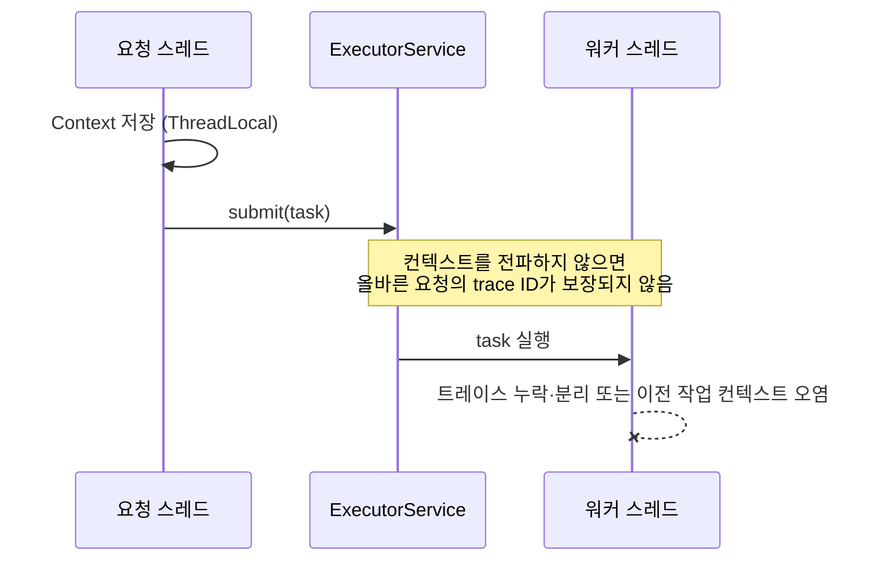
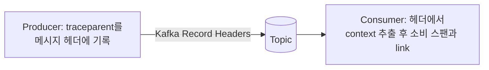

# 분산 트레이스 ID 전파

## 핵심 정의
트레이스 ID 전파(trace context propagation)는 하나의 요청이 여러 스레드·프로세스·서비스 경계를 넘나드는 동안 동일한 trace ID와 현재 span ID(부모 컨텍스트)를 계속 이어받아, 흩어진 실행 구간들을 하나의 트레이스(trace)로 재구성할 수 있게 만드는 메커니즘이다. [[분산 트레이싱]]이 "무엇을 측정하는가"에 대한 개념이라면, 전파는 "그 식별자가 끊기지 않고 어떻게 다음 실행 지점까지 도달하는가"라는 구현 디테일에 해당한다.

전파는 크게 두 층위로 나뉜다. 같은 프로세스 안에서 스레드를 넘나드는 **프로세스 내 전파(in-process propagation)**와, 네트워크 호출을 통해 다른 서비스로 넘어가는 **프로세스 간 전파(cross-process propagation)**다. 실무에서 트레이스가 끊기는 대부분의 장애는 이 둘 중 하나를 놓쳤을 때 발생한다.

## 동작 원리 / 구조

### 프로세스 간 전파: W3C Trace Context

현재 사실상 표준은 W3C Trace Context다. HTTP 헤더 두 개로 구성된다.

```
traceparent: 00-4bf92f3577b34da6a3ce929d0e0e4736-00f067aa0ba902b7-01
             │  │                                │                │
             버전 trace-id(32hex, 16byte)          parent-id(span-id, 16hex) trace-flags(01=sampled)

tracestate: vendora=value1,vendorb=value2   # 벤더별 부가 정보, 순서 보존 필수
```

- `traceparent`: 트레이스를 식별하는 핵심 정보. 수신 측은 이 parent-id를 부모로 삼아 새 span-id를 발급하고, 자신이 하위 호출로 넘길 때는 자신의 span-id로 갱신해서 내려보낸다.
- `tracestate`: 벤더 고유 데이터의 컨테이너. 정상 엔트리는 순서를 유지해 전파하는 것이 원칙이지만 용량 제한·신뢰 경계에 따른 제거가 가능하며, 자신이 값을 갱신하면 자기 엔트리를 맨 앞으로 옮긴다(W3C Trace Context 스펙의 "Mutating the tracestate field" 규칙). 헤더 이름 자체는 HTTP 스펙에 따라 대소문자를 구분하지 않으므로 구현체 간 대소문자 표기가 달라도 문제되지 않는다.
- **Baggage**: `traceparent`/`tracestate`와는 별개의 W3C 스펙(`baggage` 헤더)으로, 스팬을 연결하는 용도가 아니라 "고객 등급", "기능 플래그" 같은 애플리케이션 레벨 키-값을 서비스 경계 너머로 전달하는 용도다. 트레이스 컨텍스트와 혼동하지 않아야 한다.

과거 Zipkin 계열에서 쓰던 B3 포맷(`X-B3-TraceId`, `X-B3-SpanId`, `X-B3-Sampled`)은 헤더 이름과 필드 구조가 달라 W3C 포맷만 이해하는 서비스와 섞이면 트레이스가 그 경계에서 새로 시작된다. 레거시-신규 혼재 기간에는 propagator를 멀티 포맷(B3 + W3C 동시 파싱/전파)으로 설정해야 한다.

### 프로세스 내 전파: 스레드 경계를 넘는 문제

단일 JVM 안에서도 컨텍스트는 기본적으로 스레드에 종속된 저장소(ThreadLocal)에 보관되기 때문에, 요청 처리가 다른 스레드로 넘어가는 순간 컨텍스트가 끊길 수 있다.



대표적인 단절 지점:
- `@Async`, `CompletableFuture`, 커스텀 `ExecutorService`로 넘어가는 별도 스레드
- 리액티브 스택(WebFlux)에서 하나의 요청이 여러 스레드를 오가며 실행되는 경우 → ThreadLocal이 아니라 Reactor `Context`/`Context View`를 통해 전파해야 함
- 배치 작업에서 워커 스레드 풀로 작업을 분배하는 경우
- 메시지 큐 발행/구독처럼 애초에 동기 호출이 아닌 경우 (아래 별도 서술)

Micrometer Observation API/OpenTelemetry Java 계측은 `TaskDecorator`(Spring `ThreadPoolTaskExecutor`), Reactor의 `Context` 연동, 각 클라이언트 라이브러리(RestTemplate, WebClient, Kafka, JDBC 등)에 대한 자동 계측을 제공해 이런 지점들을 감싸주지만, **자동 적용 범위는 agent/라이브러리 버전과 활성화한 계측에 달려 있다.** 자동 전파가 적용되지 않는 경계에 컨텍스트를 캡처·복원하는 래핑 코드를 적용한다.

```java
// 예시: 커스텀 Executor에 트레이스 컨텍스트를 수동으로 전파
Runnable task = Context.current().wrap(() -> doWork());
executorService.submit(task);
```

### 비동기 메시징을 통한 전파

Kafka, RabbitMQ 같은 메시지 큐는 요청-응답처럼 컨텍스트가 콜스택을 따라 자연스럽게 흐르지 않는다. 발행자가 명시적으로 트레이스 컨텍스트를 메시지에 실어 보내고, 컨슈머가 이를 추출해 소비 스팬과 연결한다. 대조한 OpenTelemetry messaging 규약은 메시지 생성 context와의 link를 기본 연결로 권고한다. 단일 메시지 Process 스팬은 계측 정책에 따라 이를 부모로 삼을 수도 있다.



Kafka는 `ProducerRecord.headers()`에 `traceparent`를 바이트 배열로 심는 방식이 표준적이며, Spring Kafka는 Micrometer Observation과 연동해 이를 자동화할 수 있다. 컨슈머가 배치로 여러 메시지를 한 번에 처리하는 경우 메시지들이 같은 트레이스 또는 서로 다른 트레이스에서 올 수 있다. 스팬의 부모는 하나뿐이므로 여러 생성 context를 연결할 때는  배치 처리 로직 자체는 별도의 "배치 스팬"으로 두고 메시지별 원본 트레이스는 링크(span link)로만 연결하는 방식이 흔히 쓰인다.

### 샘플링 결정의 전파

`trace-flags`의 `01` 비트(sampled)는 최초 진입점에서 결정된 뒤 하위 서비스에서 부모 기반 샘플링 정책으로 존중하는 것이 보통이지만 W3C가 절대 불변으로 규정하지는 않는다. 중간 서비스가 임의로 샘플링 여부를 재결정하면 트레이스 트리의 일부만 남는 반쪽짜리 트레이스가 만들어진다. Head-based 샘플링에서는 이 플래그가 곧 최종 결정이고, Tail-based 샘플링에서는 일단 모든 스팬을 전파/버퍼링한 뒤 수집기(collector) 단에서 사후 결정한다.

traceparent v00의 ID는 정해진 길이의 소문자 16진수이며 all-zero ID는 유효하지 않다. tracestate key의 문법도 소문자 기반이므로 HTTP 헤더 이름의 대소문자 무관 규칙과 구분한다. OpenTelemetry 메시징의 단일 메시지 parent 관계와 여러 메시지의 span links는 계측 규약에 맞춰 선택하며, batch가 반드시 서로 다른 trace라는 가정은 하지 않는다. tail sampling은 head에서 이미 버린 span을 복원할 수 없다.

## 실무 관점
- **자동 계측을 우선 신뢰하되 경계 지점을 목록화한다.** Spring Boot Micrometer와 OpenTelemetry Java Agent는 서로 다른 계측 범위를 갖는다. HTTP·JDBC·Kafka·gRPC별 지원·builder 사용·Observation 활성화를 확인해야 하며 Tracing 의존성만으로 모두 계측되지는 않는다. 문제는 항상 "표준을 벗어난 지점"—커스텀 스레드 풀, 직접 만든 큐, 서드파티 SDK 내부 콜백—에서 생긴다.
- **흔한 장애 패턴 1**: 스레드 풀 기반 비동기 처리에서 컨텍스트를 안 넘겨서 자식 작업들이 전부 별도 트레이스로 보이거나, 심하면 trace ID가 아예 없는 상태로 로그가 찍힌다. MDC 로깅 패턴에 `traceId`가 비어 있는 로그가 섞여 있다면 이 문제를 의심한다.
- **흔한 장애 패턴 2**: 레거시 서비스(B3)와 신규 서비스(W3C)가 같은 호출 경로에 섞여 있을 때, 포맷을 모르는 쪽이 헤더를 무시하고 새 trace ID를 발급해 트레이스가 서비스 경계마다 조각난다. 마이그레이션 기간에는 게이트웨이나 사이드카에서 양쪽 포맷을 동시에 주입하는 방식으로 완충한다.
- **흔한 장애 패턴 3**: 메시지 큐 경유 구간에서 발행 시점의 trace context를 헤더에 싣지 않아, 컨슈머 쪽 처리가 완전히 새로운 트레이스로 시작되며 "메시지가 언제 발행됐고 언제 소비됐는지"의 인과관계가 끊긴다. [[컨슈머 랙과 백프레셔]] 원인 분석 시에도 이 연결이 없으면 특정 메시지의 지연 원인을 추적하기 어렵다.
- **튜닝/설정 포인트**: OpenTelemetry SDK의 `propagators` 설정(`tracecontext`, `baggage`, `b3` 등 콤마 구분 나열로 다중 포맷 동시 지원 가능), Spring `ThreadPoolTaskExecutor`에 `TaskDecorator` 등록, WebFlux에서는 Reactor `Context` 기반 전파 확인.
- **보안 관점**: `baggage` 헤더는 애플리케이션 값을 그대로 실어 나르므로 개인정보나 민감한 값을 담지 않는다. 외부로 나가는 요청에도 그대로 전파되기 때문에 서드파티에 내부 정보가 유출될 수 있다.

### 재사용 워커에서는 주입 뒤 복원까지 확인한다

OpenTelemetry Java 1.55.0에서 `makeCurrent()`가 반환한 `Scope`를 닫으면 이전 컨텍스트가 복원된다. 닫지 않으면 같은 풀 스레드를 쓰는 다음 요청에 앞 요청의 값이 남아 트레이스가 섞일 수 있다. 단순히 trace ID가 보이는지만 확인하지 말고, 예외를 낸 요청 다음에 다른 요청을 같은 워커로 실행해 오염 여부를 검사한다.

기존 예제의 `Context.wrap(Runnable)`은 작업 실행을 try-with-resources로 감싸므로 예외가 나도 scope를 복원한다. 수동 `makeCurrent()`에도 같은 수명 관리를 적용한다. 중첩된 상위 컨텍스트가 있을 수 있으므로 작업 종료 때 무조건 빈 컨텍스트로 덮는 방식으로 대체하지 않는다.

외부에서 받은 baggage에는 값의 발급자를 증명하는 무결성 검사가 기본 제공되지 않는다. 따라서 tenant·role 등의 문자열을 그대로 인가 근거로 쓰지 않고 인증 결과와 서버 측 정책으로 판단한다. 전파할 수 있는 값과 믿고 권한을 부여할 수 있는 값은 구분한다.

## 심화 Q&A

### Q. WebFlux 같은 리액티브 스택에서 ThreadLocal 기반 전파가 왜 실패하는가?
리액티브 실행 모델은 하나의 논리적 요청 처리가 이벤트 루프의 여러 워커 스레드를 오가며 콜백 형태로 실행되기 때문에, 특정 스레드에 값을 고정하는 ThreadLocal은 애초에 "요청 하나 = 스레드 하나"라는 전제가 깨진 환경에 맞지 않는다. Reactor는 이를 해결하기 위해 실행 스레드가 아니라 구독(subscription) 체인을 따라다니는 불변 `Context` 객체를 제공하며, 트레이싱 계측 라이브러리는 각 연산자 경계에서 이 Context를 읽어 트레이스 정보를 복원한다. 즉 "스레드에 값을 심는" 방식에서 "실행 체인에 값을 심는" 방식으로 패러다임이 바뀐 것이다.

### Q. tracestate와 baggage는 둘 다 key-value를 실어 나르는데 왜 분리되어 있는가?
tracestate는 트레이싱 벤더/시스템이 스팬 연결과 관련된 자기 자신의 내부 상태(예: 특정 벤더의 샘플링 결정 근거)를 다른 벤더의 개입 없이 통과시키기 위한 채널이고, 응용 계층 로직에서 읽고 쓰도록 설계되지 않았다. 반면 baggage는 처음부터 애플리케이션 코드가 명시적으로 읽고 쓰는, 요청 전역에 걸친 사용자 정의 컨텍스트(테넌트 ID, 실험군 플래그 등)를 위한 것이다. 두 헤더를 분리해두면 트레이싱 인프라의 내부 동작과 애플리케이션 비즈니스 로직이 서로 헤더 하나를 놓고 충돌하지 않는다.

### Q. 샘플링 플래그가 하위 서비스마다 다르게 해석되면 어떤 문제가 생기는가?
상위 서비스가 `sampled=1`로 결정해 전파했는데 중간 서비스가 자체 정책으로 스팬을 버리면, 트레이스 트리에서 해당 서비스 구간만 비어 있는 "구멍 뚫린 트레이스"가 만들어진다. 반대로 상위가 `sampled=0`으로 전파했는데 하위가 독자적으로 100% 수집하면 트레이스 조각은 남지만 부모와 연결되지 않는 고아 스팬이 된다. ParentBased sampler를 사용하면 부분 트레이스를 줄일 수 있다. W3C 규칙상 sampled를 변경할 때 parent-id도 변경해야 하며, 외부 입력의 sampled=1을 무조건 수집 명령으로 신뢰하지 않는다.

### Q. 메시지 큐를 거치는 구간에서 컨슈머가 메시지를 배치로 묶어 처리하면 트레이스를 어떻게 설계해야 하는가?
배치 메시지들이 반드시 서로 다른 트레이스인 것은 아니다. 서로 다른 생성 context를 가진 메시지들이 섞일 수 있으므로 하나만 임의로 부모로 선택하면 나머지 인과관계가 사라진다. 실무에서는 배치 처리 구간을 별도의 독립 트레이스(또는 스팬)로 두고, 그 안에서 처리되는 각 메시지의 원래 trace ID는 부모-자식 관계가 아니라 스팬 링크(span link)로 참조만 남기는 방식을 쓴다. 이렇게 하면 "이 배치가 어떤 메시지들을 포함했는가"와 "각 메시지가 원래 어떤 트레이스에서 왔는가"를 모두 보존할 수 있다.

### Q. B3와 W3C Trace Context가 혼재된 환경에서 마이그레이션 순서를 어떻게 잡아야 하는가?
먼저 진입점(API Gateway, 로드밸런서, 서비스 메시 사이드카)에서 두 포맷을 동시에 파싱하고 동시에 전파하도록 설정해 "포맷 차이로 트레이스가 끊기는 것"부터 막는다. 이후 트래픽이 많은 핵심 서비스부터 순차적으로 W3C 기본 전파로 전환하고, 레거시 서비스는 propagator 설정에서 B3를 계속 유지한 채 마지막에 걷어낸다. 한쪽만 먼저 걷어내면 그 서비스를 경유하는 트레이스가 즉시 조각나므로, 전체 호출 그래프에서 어떤 서비스가 아직 B3만 이해하는지 사전에 파악하는 작업이 선행되어야 한다.

### Q. 커스텀 스레드 풀에 트레이스 컨텍스트를 수동으로 전파할 때 놓치기 쉬운 지점은?
`Runnable`/`Callable` 제출 시점에 컨텍스트를 캡처해서 래핑하는 것만으로는 부족하고, 예외 발생 시 실행되는 콜백(`whenComplete`, 에러 핸들러)이나 재시도 로직에서 컨텍스트가 다시 원래 스레드의 것으로 되돌아가는지도 확인해야 한다. 또한 스레드 풀이 작업을 큐에 쌓아두는 시간이 길어지면 캡처된 컨텍스트와 실제 실행 시점 사이에 시차가 생겨, 스팬의 시작 시각이 "큐에 들어간 시각"인지 "실제 실행된 시각"인지에 따라 지연 원인 분석 결과가 달라질 수 있다. 큐 대기 시간 자체를 별도 스팬으로 분리해 기록하는 것이 원인 분석에 도움이 된다.

## 관련 개념
- [[분산 트레이싱]]
- [[관측 가능성 3요소]]
- [[컨슈머 랙과 백프레셔]]
- [[서비스 메시]]
- [[Micrometer와 분산 트레이싱 연동]]

## 참고 자료

- [W3C Trace Context Level 1](https://www.w3.org/TR/trace-context/) — traceparent·tracestate 문법·sampled 변경 규칙. 확인: 2026-09-08.
- [OpenTelemetry Context Propagation](https://opentelemetry.io/docs/concepts/context-propagation/) — 프로세스 내외 context·baggage. 확인: 2026-09-08.
- [OpenTelemetry Messaging Spans](https://opentelemetry.io/docs/specs/semconv/messaging/messaging-spans/) — 조회한 semantic conventions·batch links. 확인: 2026-09-08.
- [OpenTelemetry Sampling](https://opentelemetry.io/docs/concepts/sampling/) — head/tail sampling 조건. 확인: 2026-09-08.

부분 재검증: 2026-09-22. [OpenTelemetry messaging spans](https://opentelemetry.io/docs/specs/semconv/messaging/messaging-spans/)의 개발 중 규약에서 Process/Receive의 link 기본과 단일 메시지 parent 선택 범위를 대조해 본문·도식·Q&A를 일치시켰다. 그 외 서술은 이번 확인 범위 밖이므로 `verified`는 유지했다.

부분 재검증: 2026-10-04. [OpenTelemetry Java v1.55.0 Context 고정 소스](https://raw.githubusercontent.com/open-telemetry/opentelemetry-java/v1.55.0/context/src/main/java/io/opentelemetry/context/Context.java)의 makeCurrent·Scope.close·wrap을 대조했다. opentelemetry-context/common 1.55.0과 JDK 25.0.4로 단일 워커를 재사용해 wrap의 예외 후 복원 및 close 생략 시 다음 작업 오염을 실행 확인했다. [OTel Baggage 보안 고려사항](https://opentelemetry.io/docs/concepts/signals/baggage/)의 기본 무결성 검사 부재도 확인했다. 실제 Java Agent·Reactor·MDC·원격 전파·인가 통합 시험은 하지 않았고 `verified`는 유지했다.
