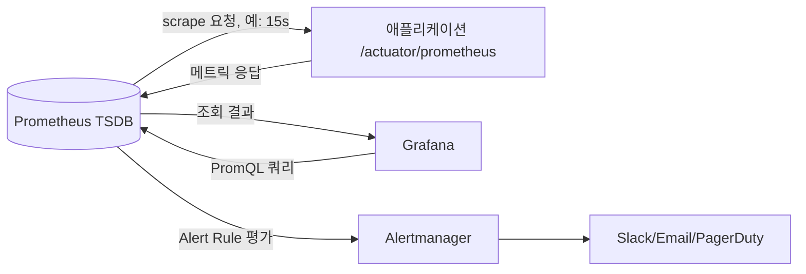

# ELK와 Prometheus Grafana

## 핵심 정의
ELK 스택(ELK Stack)은 Elasticsearch(검색·저장), Logstash(수집·가공), Kibana(시각화)로 구성된 로그 중심 관측 플랫폼이다. Elastic Stack은 여기에 Beats·Elastic Agent 등 수집 구성요소를 포함하는 더 넓은 제품군이다. 반면 Prometheus + Grafana 조합은 메트릭(metrics) 중심 모니터링 스택으로, Prometheus가 시계열 데이터를 수집·저장하고 Grafana가 이를 대시보드로 시각화한다.

두 스택은 기능이 일부 겹치지만 로그와 메트릭 수집을 나누어 상호 보완적으로 구성할 수 있다. ELK는 비정형/반정형 로그 텍스트를 전문 검색(full-text search) 가능한 형태로 저장하는 데 강하고, Prometheus는 숫자형 시계열을 저비용으로 수집해 임계치 기반 알림(alerting)을 걸기에 적합하다. 실무에서는 로그는 ELK(또는 Loki), 메트릭은 Prometheus+Grafana, 두 데이터를 한 화면에서 보기 위해 Grafana가 Elasticsearch를 데이터 소스로 추가하는 구조를 흔히 쓴다.

## 동작 원리 / 구조

### ELK 스택 데이터 흐름


- **Filebeat**: 로그 파일을 tail 하며 저비용으로 전송하는 경량 에이전트. Logstash보다 리소스 사용이 적어 애플리케이션 서버에 상주시키기 적합하다.
- **Logstash**: input(수집) → filter(grok 패턴 등으로 파싱, 필드 추출) → output(전송) 파이프라인. CPU/메모리 사용량이 커서 별도 노드로 분리 운영하는 경우가 많다.
- **Elasticsearch**: 역색인(inverted index) 기반 검색 엔진. 로그를 인덱스(index)에 저장하며 시계열 로그에는 data stream의 backing index와 rollover를 활용하고, 샤드(shard)/레플리카(replica)로 분산·복제한다.
- **Kibana**: Elasticsearch 데이터를 쿼리하고 대시보드로 시각화. Discover 화면에서 로그 원문 검색, Dashboard에서 집계 시각화를 담당한다.

### Prometheus + Grafana 데이터 흐름



Prometheus는 **Pull 방식**이 기본이다. 대상 애플리케이션이 `/metrics`(Spring Boot의 경우 Micrometer가 노출하는 `/actuator/prometheus`) 엔드포인트를 열어두면, Prometheus 서버가 주기적으로 스크래핑(scraping)한다. 서비스 수준의 단명 배치 결과에는 Pushgateway를 쓸 수 있다. 남은 시계열을 자동 만료하지 않으므로 삭제 수명주기를 관리해야 한다.

```yaml
# prometheus.yml 스크랩 설정 예시
scrape_configs:
  - job_name: 'spring-boot-app'
    metrics_path: '/actuator/prometheus'
    scrape_interval: 15s
    static_configs:
      - targets: ['app-host:8080']
```

Grafana는 Prometheus를 데이터 소스로 등록하고 PromQL(Prometheus Query Language)로 쿼리해 그래프를 그린다. 동일한 Grafana 인스턴스에 Elasticsearch, Loki, Tempo 등을 데이터 소스로 함께 등록하면 메트릭·로그·트레이스를 한 화면에서 볼 수 있다.

### 두 스택 비교

| 구분 | ELK | Prometheus + Grafana |
|---|---|---|
| 주 대상 데이터 | 로그(텍스트, 반정형) | 메트릭(시계열 숫자) |
| 수집 방식 | Push (Filebeat/Logstash가 전송) | Pull (서버가 스크랩) 기본 |
| 저장 방식 | 역색인 기반 문서 저장 | 시계열 DB(TSDB), 압축된 chunk |
| 강점 | 원문 전문 검색, 임의 필드 탐색 | 저비용 장기 추세, 알림 규칙 |
| 약점 | 저장 비용 큼, 카디널리티 높은 집계 비효율 | 원문 텍스트/상세 컨텍스트 부적합 |
| 대표 대안 | OpenSearch, Grafana Loki | Datadog, VictoriaMetrics |

설정의 15s는 예시이며 Spring Boot는 prometheus registry 의존성과 actuator endpoint 노출 설정이 필요하다. Elasticsearch force merge는 인덱스 안의 segment 수를 줄이며 shard 수를 줄이는 shrink와 다르다. Loki의 비용·검색 성능 우위는 데이터량·라벨 선택·쿼리 패턴에 따라 달라진다.

## 실무 관점
- 로그 전량을 Elasticsearch에 넣으면 저장 비용과 인덱싱 부하가 빠르게 커진다. 보존 기간(retention) 정책을 인덱스 라이프사이클 관리(ILM, Index Lifecycle Management)로 자동화해 오래된 인덱스를 warm/cold/삭제 단계로 이동시키는 것이 표준적인 운영 방식이다.
- Logstash의 grok 필터는 정규식 기반이라 파싱 실패(_grokparsefailure) 태그가 누적되기 쉽다. 가능하면 애플리케이션에서 JSON 등 구조화 로그를 직접 출력해 Logstash/Filebeat의 파싱 부담을 줄이는 편이 안정적이다.
- Elasticsearch/Logstash 조합은 리소스 사용량(특히 JVM 힙)이 크므로, 로그 볼륨이 매우 크거나 비용에 민감한 환경에서는 Logstash 대신 Fluent Bit, Elasticsearch 대신 OpenSearch나 Grafana Loki(라벨 기반 색인이라 저장 비용이 낮음)로 대체하는 경우가 늘고 있다.
- Prometheus는 기본적으로 단일 노드 로컬 저장이라 장기 보관과 고가용성(HA)에 한계가 있다. 장기 보관이 필요하면 Thanos, Mimir, VictoriaMetrics 같은 원격 저장소(remote storage)를 연동한다.
- 규칙 평가는 Grafana Alerting 또는 Prometheus가 수행하고 Alertmanager는 알림 중복 제거·그룹화·라우팅을 담당한다. 두 경로를 함께 운영하면, 알림 규칙과 라우팅(silencing, grouping, inhibition)을 이원화하면 관리 포인트가 늘어나므로 팀 내에서 하나로 통일하는 것이 유지보수에 유리하다.
- 흔한 장애 패턴: 라벨 카디널리티가 급증해 Prometheus 메모리가 OOM(Out Of Memory)으로 죽거나, Elasticsearch에서 샤드 할당 실패가 발생하는 경우다. yellow는 replica 미할당, red는 primary 미할당이며 용량 부족 외에도 노드 장애·할당 정책이 원인일 수 있다.

### 카디널리티 폭증을 수집 경계에서 막는다

라벨 카디널리티(label cardinality)는 개별 라벨 값의 개수만이 아니라 전체 라벨 조합이 만드는 시계열 수로 평가한다. 사용자·요청·주문 ID나 원본 URL을 메트릭 라벨에 넣지 않고 `/orders/{id}` 같은 제한된 경로 템플릿을 사용한다. 상세 식별자는 로그·트레이스로 연결한다. 수집 뒤 PromQL로 합쳐도 이미 만든 시계열의 저장 비용을 없애지는 못한다.

Prometheus 3.5.0 설정 계약에서 `metric_relabel_configs`는 저장 직전 샘플을 제외할 수 있으며 자동 생성되는 `up`에는 적용하지 않는다. `sample_limit`은 relabel 이후 한 scrape의 샘플 수 제한이고 초과분만 버리는 대신 **해당 scrape 전체를 실패**로 처리한다. 따라서 급증 방어와 동시에 수집 누락을 감시해야 한다. 이 제한은 애플리케이션 내부에서 이미 생성한 계측 객체의 메모리를 회수해 주지도 않는다.

높은 카디널리티 라벨만 `labeldrop`하면 해결된다고 가정하지 않는다. 서로 다른 시계열이 같은 라벨 집합으로 충돌할 수 있으며 이 처리는 합산 연산이 아니다. 원천 계측에서 집계 단위를 고치거나 불필요한 메트릭 전체를 제외하고, 라벨 제거 후에도 시계열 식별이 유일한지 확인한다. Prometheus 3.5.0의 단순 gauge 시험에서는 식별 라벨 제거 뒤 값 하나만 남아도 `up=1`이었다. 수집 성공 지표만으로 모든 샘플의 보존이나 올바른 집계를 보증하지 않는다.

## 심화 Q&A

### Q. Prometheus의 Pull 방식이 Push 방식보다 갖는 구조적 장점은 무엇인가?
Pull 방식은 Prometheus 서버가 스크랩 대상 목록(서비스 디스커버리 포함)을 직접 관리하므로 대상이 살아있는지 여부(up 메트릭)를 자연스럽게 판단할 수 있고, 수집 주기·타임아웃을 중앙에서 통제할 수 있다. 또한 애플리케이션은 메트릭을 엔드포인트에 노출만 하면 되므로 수집 서버 주소를 알 필요가 없어 결합도가 낮다. 방화벽 문제에는 네트워크 배치·에이전트 remote write 등을 검토한다. Pushgateway는 일반적인 모든 대상의 Push 대체 수단이 아니다.

### Q. Elasticsearch 로그를 시간·크기 기준 인덱스로 나누는 이유는?
로그처럼 시간이 지나면 조회 빈도가 급격히 낮아지는 데이터는 오래된 인덱스를 통째로 삭제하거나 저비용 노드로 옮기는 것이 개별 문서를 삭제하는 것보다 훨씬 효율적이다. 또한 인덱스 단위로 샤드 수를 조정할 수 있어 최근 데이터에는 샤드를 더 배분하고 과거 데이터는 병합(force merge)해 세그먼트 수를 줄이는 식의 최적화가 가능하다. ILM 정책이 바로 이 흐름을 자동화한다.

### Q. Grafana Loki가 Elasticsearch 대비 저장 비용이 낮은 이유는 무엇이며, 어떤 트레이드오프가 있는가?
Loki는 로그 원문 전체를 역색인하지 않고 레이블(label)만 색인한 뒤 로그 본문은 압축된 청크(chunk)로 저장한다. 그래서 색인 크기가 Elasticsearch보다 훨씬 작고 저장 비용이 낮다. 대신 레이블에 없는 임의 텍스트로 전문 검색을 하면 관련된 청크를 순차적으로 스캔(grep과 유사)해야 해서 Elasticsearch만큼 유연한 자유 텍스트 검색 성능은 나오지 않는다. 즉 "저장은 싸게, 검색은 레이블 기반으로 좁혀서"라는 설계 철학의 차이다.

### Q. Prometheus에서 counter 타입 메트릭이 재시작 후 0으로 리셋되면 대시보드에 어떤 왜곡이 생기고, 어떻게 대응하는가?
A. 원시 값의 단순 차분은 리셋 때 음수가 될 수 있지만 rate()/increase()는 감소를 reset으로 처리해 보정한다. 증가율은 rate(), 구간 증가량은 increase()로 표현한다. 여러 인스턴스를 합칠 때는 먼저 각 시계열에 rate()를 적용한 뒤 sum()해야 개별 reset을 식별할 수 있다. 누적값 자체의 확인이 목적이면 counter 원시 값을 표시해도 된다.

### Q. 로그(ELK)와 메트릭(Prometheus)을 동시에 갖췄는데도 장애 원인 파악이 느리다면 무엇을 점검해야 하는가?
가장 흔한 원인은 두 시스템 간 상관관계 식별자(trace ID, 요청 ID)가 공유되지 않아 "메트릭에서 이상 구간을 확인 → 그 시간대 로그를 텍스트로 다시 검색"하는 수작업이 필요하기 때문이다. Grafana에서 메트릭 그래프의 특정 지점을 클릭하면 해당 시간대의 관련 로그로 바로 이동하는 explore 연동, 또는 애플리케이션 로그에 trace ID를 남기고 Grafana Tempo/Jaeger와 연계하는 구조를 갖추면 조사 시간이 크게 줄어든다.

### Q. Logstash 대신 Filebeat만으로 파이프라인을 구성할 수 있는가? 어떤 경우에 Logstash가 필요한가?
Filebeat도 자체 필터(ingest node processor 연계 등)로 간단한 파싱은 가능하지만, 복잡한 grok 파싱, 다중 소스 조건 분기, 외부 조회(lookup) 등 무거운 변환 로직이 필요하면 Logstash의 필터 파이프라인이 유리하다. 단순히 로그를 있는 그대로(혹은 애플리케이션이 이미 JSON으로 구조화해 출력) 전달만 하면 되는 경우에는 Filebeat가 Elasticsearch ingest pipeline과 직접 연동해 Logstash 없이 구성하는 것도 충분히 가능하며, 이는 인프라 구성 요소를 줄여 운영 부담을 낮추는 선택이 된다.

## 관련 개념
- [[관측 가능성 3요소]]
- [[분산 트레이싱]]
- [[SLI SLO와 에러 버짓]]

## 참고 자료

- [Prometheus Query functions](https://prometheus.io/docs/prometheus/latest/querying/functions/) — rate/increase의 reset 보정과 집계 순서. 확인: 2026-09-08.
- [Prometheus Pushgateway](https://prometheus.io/docs/practices/pushing/) — service-level batch와 stale series 삭제. 확인: 2026-09-08.
- [Elasticsearch Data streams](https://www.elastic.co/docs/manage-data/data-store/data-streams) — append-only 로그·rollover. 확인: 2026-09-08.
- [Grafana Loki Overview](https://grafana.com/docs/loki/latest/get-started/overview/) — label index·chunk 저장. 확인: 2026-09-08.

부분 재검증: 2026-10-04. [Prometheus naming 지침](https://prometheus.io/docs/practices/naming/#labels)의 조합별 시계열·무제한 ID 라벨 경고와 [Prometheus v3.5.0 고정 configuration 문서](https://raw.githubusercontent.com/prometheus/prometheus/v3.5.0/docs/configuration/configuration.md)의 `metric_relabel_configs`·`sample_limit`·`labeldrop` 제약을 확인하고 [조회 시점 configuration](https://prometheus.io/docs/prometheus/latest/configuration/configuration/)과 대조했다. 원천 계측 메모리와 저장 후 집계 구분은 수집 경계에 따른 운영 판단이다. Prometheus 부하 시험·Elasticsearch 설정 재검증은 하지 않아 `verified`를 유지했다.

실행 확인: 2026-10-04, [Prometheus v3.5.0 공식 배포](https://github.com/prometheus/prometheus/releases/tag/v3.5.0)의 darwin/arm64 바이너리와 loopback exporter로 검증했다. 두 샘플에 `sample_limit: 1`을 적용하자 `up=0`, `sample limit exceeded`, 해당 scrape의 애플리케이션 샘플 0개를 확인했다. relabel로 한 샘플을 먼저 제외하면 같은 한도에서 `up=1`과 남은 샘플 1개가 저장됐고, `up` 제외 relabel 규칙은 자동 생성 `up`에 적용되지 않았다. 추가 job에서 값 1·2인 두 gauge의 구분 라벨을 labeldrop하자 `up=1`과 값 1 하나가 남아 합산이 아님을 확인했다. [v3.5.0 scrape 소스](https://raw.githubusercontent.com/prometheus/prometheus/v3.5.0/scrape/scrape.go)의 중복 timestamp 샘플 오류 처리도 대조했다. 이 시험은 격리 job의 단순 gauge 수집이며 고카디널리티 부하·histogram·원격 저장·운영 클러스터는 실행하지 않았다.
