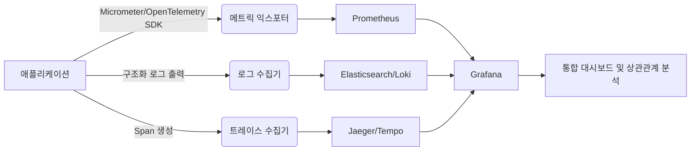

# 관측 가능성 3요소

## 핵심 정의
관측 가능성(observability)은 시스템 외부에서 수집한 신호만으로 내부 상태를 추론할 수 있는 능력을 말한다. 전통적인 모니터링(monitoring)이 "미리 정의한 문제가 발생했는가"를 감시하는 것이라면, 관측 가능성은 "미리 예상하지 못한 문제도 원인을 추적할 수 있는가"에 초점을 맞춘다. 이를 뒷받침하는 세 가지 데이터 축이 메트릭(metrics), 로그(logs), 분산 추적(distributed tracing)이며 흔히 "관측 가능성의 3대 기둥(three pillars)"이라 부른다.

세 요소는 서로 대체 관계가 아니라 보완 관계다. 메트릭은 "무엇이 이상한가"를 빠르게 알려주고, 로그는 "무슨 일이 있었는가"를 상세히 설명하며, 트레이스는 "어디서 시간이 소요됐는가"를 요청 단위로 추적한다. MSA(Microservices Architecture) 환경에서는 하나의 신호만으로는 장애 원인 분석(root cause analysis)에 필요한 맥락이 부족할 수 있어 세 요소를 상관관계(correlation)로 엮는 것이 실무의 핵심 과제다.

## 동작 원리 / 구조

### 세 요소의 특성 비교

| 구분 | 메트릭 | 로그 | 트레이스 |
|---|---|---|---|
| 형태 | 시계열 숫자 (counter, gauge, histogram) | 타임스탬프가 찍힌 이벤트 텍스트/구조화 데이터 | parent-child span과 필요 시 span link |
| 저장 비용 | 낮음 (집계된 수치) | 높음 (원본 텍스트 전체) | 중간 (샘플링으로 조절) |
| 강점 | 추세 파악, 알림(alerting), 대시보드 | 상세 컨텍스트, 예외 스택 | 서비스 간 호출 지연 구간 특정 |
| 약점 | 개별 요청 단위 원인 파악 불가 | 집계/추세 파악에 부적합, 비용 큼 | 계측(instrumentation) 비용, 부분 도입 시 사각지대 |
| 대표 도구 | Prometheus, Datadog | ELK(Elasticsearch, Logstash, Kibana), Loki | Jaeger, Zipkin, Tempo |

### 신호가 하나로 모이는 흐름



핵심은 세 시스템이 별개로 존재하더라도 **공통 식별자**로 연결되어야 한다는 점이다. 대표적으로 trace ID를 로그 메시지에 함께 출력하면, 특정 요청의 트레이스를 보다가 바로 해당 구간의 로그로 점프할 수 있다. Spring Boot 환경에서는 Spring Cloud Sleuth에서 이전할 수 있는 Micrometer Tracing을 구성하면 계측된 span 범위의 trace ID/span ID를 MDC(Mapped Diagnostic Context)에 연결해 로그 패턴에 노출시켜준다.

```
# logback 패턴 예시 - traceId, spanId를 로그에 함께 출력
<pattern>%d{HH:mm:ss.SSS} [%X{traceId:-},%X{spanId:-}] %-5level %logger{36} - %msg%n</pattern>
```

메트릭의 일반 라벨에 trace ID를 넣으면 요청 수만큼 시계열이 증가한다. exemplar는 일부 관측값에 trace ID를 연결하는 별도 기능이며 백엔드·익스포터 지원을 확인한다. 세 신호의 저장 비용 순서는 카디널리티·수집량·보존·샘플링에 따라 바뀌며, 프로파일링 등도 관측에 유용한 신호다.

## 실무 관점
- **메트릭은 저비용·상시 감시용, 로그는 사후 원인 분석용, 트레이스는 지연(latency) 원인 특정용**으로 역할을 나눠 설계한다. 모든 걸 로그로만 해결하려 하면 저장 비용과 검색 속도에서 한계에 부딪힌다.
- 흔한 실수는 세 시스템을 도입해놓고 **연결(correlation) 설계를 빠뜨리는 것**이다. trace ID가 로그에 없으면 알림을 받고도 관련 로그를 텍스트 검색으로 찾아야 해서 MTTR(Mean Time To Resolution)이 크게 늘어난다.
- 트레이스는 100% 수집 시 오버헤드와 저장 비용이 크므로 **샘플링(sampling)** 전략이 필요하다. 수집기에 도착한 에러 트레이스를 우선 보관하고 정상 요청은 일부만 보관하는 tail-based sampling이 실무에서 널리 쓰인다.
- 메트릭 카디널리티(cardinality) 폭발에 주의한다. 사용자 ID나 요청 파라미터를 라벨(label)로 그대로 붙이면 시계열 수가 기하급수적으로 늘어 Prometheus 메모리를 고갈시키는 장애 패턴이 흔하다.
- 로그는 비정형 텍스트보다 **구조화 로깅(structured logging, JSON 등)**으로 남겨야 이후 파싱/검색/집계가 쉬워진다.
- OpenTelemetry(OTel)가 사실상 표준 계측 규격으로 자리잡으면서, 메트릭·로그·트레이스를 하나의 SDK/프로토콜로 수집해 백엔드(Prometheus, Elasticsearch, Jaeger 등)로 나눠 보내는 구조가 일반적이다.

## 심화 Q&A

### Q. 애플리케이션이 로그·스팬을 보냈는데 백엔드에 없으면 어디서 확인하는가?
수집 API 호출 성공, Collector 수신, exporter 전송, 백엔드 저장·검색 가능 상태는 서로 다른 경계다. SDK·Collector의 큐, 샘플링, 재시도 한도, 백엔드 거부를 순서대로 확인한다. Collector의 메모리 전송 큐는 가득 차거나 재시도 제한을 넘으면 데이터를 잃을 수 있고, 재시작에도 보존되지 않는다.

`file_storage`를 이용한 영속 전송 큐는 Collector 재시작 시 복구를 돕지만 디스크 장애·용량 부족·전송 재시도 제한까지 없애지는 않는다. 따라서 큐 사용량·용량·전송 실패·드롭을 Collector 자체 지표로 관찰하고, 관측 경로가 멈춘 사실을 같은 고장 경로 하나에만 의존해 알리지 않도록 설계한다.

재시도가 있는 파이프라인은 중복 가능성도 고려한다. 유실·중복 정책이 엄격한 감사 이벤트를 일반 트레이스 샘플링·메모리 버퍼에만 맡기면 안 되며, [[감사 로그와 보안 모니터링]]의 영속 기록 경계를 별도로 적용한다.


### Q. 메트릭 알림(alert)은 정상인데 사용자 불만이 들어온다면 어떤 순서로 조사하는가?
메트릭이 평균/percentile 기반 집계이기 때문에 소수 사용자에게만 영향을 주는 문제(특정 리전, 특정 데이터 패턴)는 임계치를 넘지 않아 감지되지 않을 수 있다. 이 경우 해당 사용자의 요청과 연관된 trace ID를 역으로 찾아 트레이스와 로그를 대조하는 방식으로 좁혀간다. 즉 메트릭이 "감지 실패"했다는 사실 자체가 트레이스/로그 기반 조사로 전환해야 한다는 신호다.

### Q. 트레이스 샘플링 비율을 낮추면 어떤 부작용이 생기는가?
드물게 발생하는 오류나 특정 조건에서만 나타나는 지연이 샘플에서 누락될 수 있다. 이를 보완하려면 head-based sampling(요청 시작 시점에 확률적으로 결정) 대신 tail-based sampling(요청이 끝난 후 에러/고지연 요청만 선별 저장)을 쓰거나, 오류 로그를 별도로 보존한다. head에서 이미 버린 span은 tail sampler가 복원할 수 없으며 버퍼·수집 지연·용량에 따라 에러 트레이스도 누락될 수 있다.

### Q. 로그만으로 관측 가능성을 확보할 수 없는 이유는?
로그는 개별 이벤트 단위라 추세나 비율(rate) 계산에는 비효율적이다. 예를 들어 "최근 5분간 5xx 비율"을 로그 검색으로 매번 집계하면 비용과 지연이 크다. 메트릭은 이런 집계를 사전에 시계열로 저장해두므로 즉시 조회 가능하다. 또한 로그에 호출 ID와 부모 관계를 직접 계측하지 않으면 분산 환경에서 지연 구간을 특정하기 어렵다.

### Q. 메트릭 카디널리티 문제를 설계 단계에서 어떻게 예방하는가?
라벨로 사용할 값의 가능한 종류(cardinality)를 사전에 검토한다. HTTP 상태 코드, 메서드, API 경로 템플릿(`/users/{id}`처럼 파라미터를 치환한 형태)처럼 유한 집합만 라벨로 쓰고, 사용자 ID·세션 ID·원본 쿼리스트링처럼 무한히 늘어나는 값은 라벨이 아니라 로그나 트레이스의 속성(attribute)으로 남긴다.

### Q. 세 신호를 하나로 통합해 보여주는 도구(예: Grafana)를 쓰면 별도의 상관관계 설계가 필요 없는가?
아니다. Grafana 같은 시각화 도구는 여러 데이터 소스를 한 화면에 띄워줄 뿐, 신호 간 연결은 애플리케이션이 공통 식별자(trace ID 등)를 심어줘야 성립한다. 도구가 통합 UI를 제공해도 계측 코드에서 로그에는 trace ID를, 메트릭에는 가능한 경우 exemplar의 trace 참조를 연결하지 않으면 화면만 나란히 있을 뿐 실제로는 클릭 한 번에 넘나들 수 있는 연결이 되지 않는다.

### Q. 관측 가능성 도입 초기에 우선순위를 어떻게 정하는가?
일반적으로 메트릭(알림 체계) → 구조화 로깅 → 분산 트레이싱 순으로 도입한다. 메트릭은 구축 비용이 가장 낮고 즉각적인 장애 감지 효과가 크며, 로그는 기존 시스템에 구조화만 추가하면 되고, 트레이싱은 서비스 코드 계측과 인프라(collector, 저장소) 구축 비용이 가장 크기 때문에 MSA 규모가 커지고 서비스 간 호출이 복잡해지는 시점에 우선순위가 올라간다.

## 관련 개념
- [[ELK와 Prometheus Grafana]]
- [[분산 트레이싱]]
- [[MSA와 모놀리식 비교]]

## 참고 자료

부분 재검증: 2026-09-23. [OpenTelemetry Collector Resiliency](https://opentelemetry.io/docs/collector/resiliency/)의 메모리 큐·재시도 중단·file_storage·디스크 장애 경계를 확인했다. 가이드는 버전 고정이 없는 공통 동작이며 exporter별 기본값을 일괄 적용하지 않는다. 기존 Spring·백엔드 연동 전체는 이번 범위 밖이므로 `verified`는 유지했다.


- [OpenTelemetry Signals](https://opentelemetry.io/docs/concepts/signals/) — metrics·logs·traces와 기타 신호. 확인: 2026-09-08.
- [OpenTelemetry Sampling](https://opentelemetry.io/docs/concepts/sampling/) — head/tail 수집 조건. 확인: 2026-09-08.
- [OpenTelemetry Metrics](https://opentelemetry.io/docs/concepts/signals/metrics/) — exemplar와 trace 상관관계. 확인: 2026-09-08.
