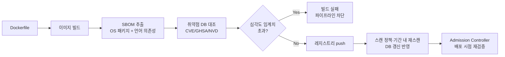

# 컨테이너 이미지 보안 스캔

## 핵심 정의
컨테이너 이미지 보안 스캔(Container Image Security Scanning)은 이미지에 포함된 OS 패키지, 언어별 의존성(라이브러리), 패키지 메타데이터 등을 분석해 알려진 취약점(CVE, Common Vulnerabilities and Exposures), 하드코딩된 시크릿, 잘못된 설정(misconfiguration), 라이선스 정책 위반 등을 활성화한 스캐너 기능에 따라 탐지하는 과정이다. CVE 패키지 분석이 자체 애플리케이션 로직의 정적 분석(SAST)을 대신하지는 않는다. 빌드 시점(CI), 레지스트리 저장 시점, 배포 시점(admission control) 등 파이프라인 여러 단계에서 반복적으로 수행해 취약한 이미지가 운영 환경까지 도달하지 못하게 막는 것이 목표다.

핵심은 스캐너가 이미지 안의 패키지 목록(SBOM, Software Bill of Materials)을 추출한 뒤, 이를 지속적으로 갱신되는 취약점 데이터베이스와 대조하는 방식으로 동작한다는 점이다. 즉 스캔 결과는 스캔 시점의 데이터베이스 상태에 종속적이며, 어제는 안전했던 이미지가 오늘은 새로 공개된 CVE 때문에 취약 판정을 받을 수 있다.

## 동작 원리 / 구조

### 스캔 파이프라인

- **SBOM 생성**: Syft, Trivy 등이 이미지 레이어를 열어 OS 패키지 매니저(apt, apk, yum) 메타데이터와 언어별 패키지 파일(`package-lock.json`, `pom.xml`/`build.gradle` 산출물, `go.sum` 등)을 파싱해 컴포넌트 목록을 만든다. 형식은 CycloneDX나 SPDX 표준을 따른다.
- **취약점 매칭**: SBOM의 각 컴포넌트(이름+버전)를 NVD(National Vulnerability Database), GitHub Security Advisory, 배포판별 보안 피드와 대조해 일치하는 CVE를 찾는다. 이미지 자체를 매번 재분석하지 않고 저장해둔 SBOM만 최신 DB로 재대조하면 스캔이 빨라진다.
- **심각도 판단**: CVSS(Common Vulnerability Scoring System) 점수만으로는 우선순위가 왜곡될 수 있어, 실제 악용 가능성을 나타내는 EPSS(Exploit Prediction Scoring System) 점수와 CISA KEV(Known Exploited Vulnerabilities) 카탈로그 등록 여부를 함께 본다. CVSS는 높지만 EPSS가 낮은(향후 30일 악용 확률 예측이 낮은) CVE보다, CVSS는 중간이라도 KEV에 등록되어 실제로 악용 중인 CVE를 먼저 처리하는 것이 합리적이다.
- **VEX(Vulnerability Exploitability eXchange)**: SBOM이 "이 컴포넌트가 존재한다"는 사실만 말한다면, VEX는 "이 CVE는 우리 제품에서 실제로는 영향이 없다/있다"는 판단을 구조화된 문서로 표현한다. 예를 들어 취약한 함수가 코드 경로상 호출되지 않는 경우 `not_affected`로 명시해, 다운스트림 소비자가 같은 CVE를 매번 재검토하지 않아도 되게 한다.

### 대표 도구 비교
| 도구 | 특징 |
|---|---|
| Trivy | 이미지/IaC/시크릿/K8s 매니페스트까지 한 바이너리로 스캔하는 올인원, CI 통합이 쉬움 |
| Grype | CVE 스캔에 특화, SBOM(Syft 산출물)을 입력으로 재스캔 가능 |
| Snyk | SaaS 기반, 수정 PR 자동 생성 등 개발자 워크플로 통합에 강점 |
| 클라우드 레지스트리 내장 스캔 (ECR Enhanced Scanning 등) | 설정한 scanning mode·필터·재스캔 기간 안에서 신규 CVE를 사후 통지 |

동일한 이미지라도 스캐너마다 사용하는 DB와 패키지 매칭 로직이 달라 탐지 결과가 다를 수 있어, 외부 노출이 큰 이미지는 두 개 이상의 스캐너를 병행하는 것이 실무에서 흔한 전략이다.

Gatekeeper/Kyverno를 설치하는 것만으로 이미지 스캔이 자동 수행되지는 않는다. 이미지 digest에 연결된 서명·검사 attestation 검증 정책, 허용 signer, 결과 신선도와 검증 실패 처리를 구성해야 한다. VEX not_affected는 동적 로딩·설정·실행 경로까지 검토한 근거와 재검토 조건을 기록한다.

## 실무 관점
- **게이트 설정**: 스캐너 기본 동작은 종료 코드 0(통과)인 경우가 많아, `--severity CRITICAL,HIGH`와 `--exit-code 1` 같은 옵션을 명시적으로 켜지 않으면 취약점이 있어도 파이프라인이 그대로 통과한다. 반대로 임계치를 너무 엄격하게 잡으면(예: MEDIUM까지 차단) 고치기 어려운 base 이미지 CVE 때문에 배포가 상시 막혀 팀이 게이트를 우회하는 역효과가 난다.
- **`--ignore-unfixed`의 함정**: 아직 패치가 없는 CVE를 무시하는 옵션인데, 갱신된 DB에 수정 버전이 등록되면 다음 스캔에서는 이 옵션으로 제외되지 않는다. 재스캔하지 않거나 별도의 무시 목록에 남겨두면 방치될 수 있다. 무시 목록(ignore file)에는 반드시 사유와 만료일(expiry)을 남기고 주기적으로 재검토해야 한다.
- **멀티스테이지 빌드와 스캔 대상**: 빌드 스테이지에는 컴파일러, 테스트 도구 등 CVE가 많은 패키지가 잔뜩 들어있지만 실제로 배포되지 않는다. 운영 배포 판정은 최종 이미지 digest로 하되 빌더·CI 도구도 공급망을 오염시킬 수 있으므로 별도로 검사한다.
- **base 이미지 최소화**: distroless나 alpine처럼 패키지 수가 적은 base 이미지를 쓰면 애초에 스캔에 걸릴 대상 자체가 줄어든다. [[Docker 이미지와 레이어 구조]]에서 다룬 불필요한 패키지 제거는 공격 표면(attack surface)을 줄인다. 레이어 개수 자체는 취약점 수를 결정하지 않으며 Alpine의 musl 호환성도 확인한다.
- **배포 시점 재검증**: CI에서 통과한 이미지라도 레지스트리에 몇 주간 머무는 동안 새 CVE가 공개될 수 있다. Kubernetes에서는 admission controller(OPA Gatekeeper, Kyverno)가 배포 요청이 들어올 때 이미지 서명과 스캔 결과를 재검증해, 오래된 이미지나 스캔되지 않은 이미지의 배포 자체를 막는 정책을 둔다.
- **흔한 실수/사고 패턴**: 스캔 통과를 "안전 인증"으로 오해하는 것. 패키지 취약점 매칭은 알려진 취약점 데이터에 의존해 제로데이나 자체 코드의 로직 취약점까지 보장하지 못한다. Trivy 등은 시크릿 탐지도 지원하지만 활성화된 검사 종류와 탐지 범위를 확인해야 하며, SAST·시크릿 검사([[시크릿 관리]] 참고)를 함께 구성한다. 또한 CI 단계에서만 스캔하고 이미 배포된 이미지를 재스캔하지 않으면, 배포 이후 공개된 CVE를 몇 달간 놓치는 경우가 많다.

### 취약점 0건과 스캔 대상 포함 여부를 구분한다

ECR 향상된 스캔(enhanced scanning)에서는 필터에 맞지 않는 저장소의 스캔 빈도가 Off가 되어 검사 대상에서 빠질 수 있다. push 시 스캔(scan on push)도 지속 스캔(continuous scanning)과 같지 않다. 따라서 대시보드의 미해결 취약점이 0건이라는 결과만 보지 말고, 실제 배포한 이미지 다이제스트가 대상인지, 스캔 상태와 마지막 검사 시각이 무엇인지 함께 확인한다. 롤백용으로 남긴 이미지도 다시 배포할 수 있다면 같은 점검 대상이다.

Amazon Inspector의 ECR 검사에는 이미지 상태와 재스캔 자격 조건이 있다. 보관(archived) 상태로 바뀌어 검사가 멈추면 관련 finding이 자동으로 닫힐 수 있으므로, finding 감소를 곧바로 패치 완료로 해석하면 안 된다. 재스캔 기간·최근 push 또는 사용 상태와 실제 실행 다이제스트를 대조해 “수정됨”과 “검사 범위에서 제외됨”을 구분한다.

## 심화 Q&A

### Q. CVSS 점수가 같은 두 CVE인데 왜 하나를 먼저 고쳐야 한다고 판단하는가?
A. CVSS Base는 취약점의 기술적 심각도를 나타내며 CVSS v4 Threat의 Exploit Maturity 등과 구분해야 한다. EPSS는 악용 확률 예측이고 KEV는 알려진 실제 악용의 근거이므로, CVSS가 동일하다면 EPSS/KEV 상태를 기준으로 우선순위를 재조정하는 것이 합리적이다. 이론적 위험도와 실질적 위험도를 분리해서 판단해야 유한한 패치 리소스를 효율적으로 쓸 수 있다.

### Q. SBOM만 있으면 취약점 스캔이 필요 없는 것 아닌가?
A. SBOM은 "무엇이 들어있는가"에 대한 정적 목록일 뿐, 그 자체로는 취약점 여부를 판단하지 않는다. 취약점 데이터베이스는 계속 갱신되므로, 동일한 SBOM을 시간이 지나 다시 대조하면 이전에는 없던 CVE가 새로 발견될 수 있다. SBOM을 한 번 생성해 저장해두고 DB 갱신 주기마다 재스캔하는 것이 이미지 전체를 매번 재분석하는 것보다 효율적인 이유이기도 하다.

### Q. 개발 환경에서는 통과했는데 운영 배포 직전에 같은 이미지가 차단되는 경우는 왜 발생하는가?
A. 이미지를 빌드한 시점과 배포 승인(admission)이 일어나는 시점 사이에 취약점 DB가 갱신되어 새로운 CVE가 매칭될 수 있다. CI에서 스캔을 통과했다는 사실은 그 시점 DB와 정책에서 차단 기준을 넘지 않았다는 뜻이므로, 배포 파이프라인이 길거나 이미지를 오래 보관했다가 배포하는 경우 배포 시 최신 정책을 만족하는 결과인지 확인해야 한다. admission에서 직접 스캔하거나 외부에서 갱신한 signed attestation을 검증할 수 있다.

### Q. Trivy와 Grype를 동시에 돌렸는데 한쪽에서만 특정 CVE가 잡히는 이유는 무엇인가?
A. 두 도구는 참조하는 취약점 데이터 소스와 패키지 버전 매칭 로직이 다르다. 예를 들어 배포판 패치 백포트(backport) 버전 문자열을 해석하는 방식이 다르면 같은 실제 패키지라도 한쪽은 취약, 다른 쪽은 패치됨으로 판정할 수 있다. 이 때문에 고위험 이미지는 단일 스캐너 결과를 신뢰하지 않고 교차 검증하는 이중 스캐너 전략을 쓴다.

### Q. `latest` 태그 이미지를 스캔해서 통과시켰는데, 나중에 같은 태그로 배포된 이미지에서 문제가 생기는 이유는?
A. 태그는 가변 포인터라 스캔 이후 같은 태그가 다른 다이제스트(digest)를 가리키는 이미지로 덮어써질 수 있다. 스캔 결과와 배포 대상이 실제로 같은 이미지임을 보장하려면 태그가 아니라 불변인 다이제스트 기준으로 스캔-서명-배포를 연결해야 한다. 이는 [[Docker 이미지와 레이어 구조]]에서 다룬 다이제스트 고정 원칙과 동일한 문제의식이다.

### Q. 이미지 서명(image signing)은 취약점 스캔과 어떤 관계가 있는가?
A. 스캔은 "이미지 내용에 알려진 문제가 있는가"를 검사하고, 서명(Cosign/Sigstore 등)은 이미지 digest가 허용된 키/identity로 서명되었는지 검증한다. 실제 빌드 출처와 절차는 provenance·issuer·signer 정책을 함께 확인해야 한다. 스캔을 통과한 이미지라도 레지스트리와 배포 사이에서 다른 이미지로 바꿔치기(supply chain 공격)될 수 있으므로, admission controller는 스캔 결과뿐 아니라 서명 검증도 함께 요구하는 것이 공급망 보안의 표준 패턴이다.

### Q. 보안 스캐너 자체의 공급망도 검증해야 하는 이유는?
A. 스캐너는 CI 자격증명과 소스에 접근할 수 있는 실행 프로그램이다. Trivy의 공식 사고 공지는 2026-03-19 악성 v0.69.4 배포와 GitHub Action 태그 변조, 03-22 Docker Hub의 악성 v0.69.5·v0.69.6 이미지를 기록한다. 이 버전들은 역사적 노출 범위를 설명하는 사례이며 현재 권장 버전 목록이 아니다. 사고 여부는 버전명뿐 아니라 사용 시각·배포 채널·실제 digest/commit으로 조사한다. 검토한 full commit SHA·image digest 고정과 서명 출처 확인, 전이 액션 및 설치 스크립트의 가변 다운로드 점검을 함께 적용한다. 고정한 바이트가 원래 악성이었다면 고정만으로 안전해지지는 않는다. 스캔 job에도 최소 권한과 짧은 자격증명 수명을 적용한다.

## 관련 개념
- [[Docker 이미지와 레이어 구조]]
- [[시크릿 관리]]
- [[CI-CD 파이프라인 구성]]
- [[클라우드 IAM 최소 권한 원칙]]
- [[의존성 취약점 관리]]

## 참고 자료

- [Trivy Filtering](https://trivy.dev/latest/docs/configuration/filtering/) — severity·exit-code·ignore-unfixed. 확인: 2026-09-08.
- [ECR Enhanced scanning](https://docs.aws.amazon.com/AmazonECR/latest/userguide/image-scanning-enhanced.html) — Inspector continuous scan·rescan duration. 확인: 2026-09-08.
- [FIRST EPSS](https://www.first.org/epss/) — 향후 30일 exploitation 확률. 확인: 2026-09-08.
- [Sigstore Verify](https://docs.sigstore.dev/cosign/verifying/verify/) — digest·signer identity·issuer 검증. 확인: 2026-09-08.

부분 재검증: 2026-09-22. [Trivy Secret scanning](https://trivy.dev/docs/latest/guide/scanner/secret/)의 시크릿 탐지 범위와 [공식 사고 공지 GHSA-69fq-xp46-6x23](https://github.com/aquasecurity/trivy/security/advisories/GHSA-69fq-xp46-6x23)의 2026년 3월 배포·태그·전이 액션 노출 범위를 대조했다. 그 외 서술은 이번 확인 범위 밖이므로 `verified`는 유지했다.

부분 재검증: 2026-10-04. [ECR enhanced scanning](https://docs.aws.amazon.com/AmazonECR/latest/userguide/image-scanning-enhanced.html)에서 필터 비일치 시 Off·스캔 빈도를, [Amazon Inspector ECR scanning](https://docs.aws.amazon.com/inspector/latest/user/scanning-ecr.html)에서 ACTIVE/archived 상태·재스캔 자격·Last scanned at·보관 시 finding 종료를 확인했다. 적용 범위는 AWS ECR/Inspector 관리형 서비스 문서이며 계정별 재스캔 기본값이나 기간 수치를 새로 일반화하지 않았다. 실제 계정의 coverage·이미지 상태·finding 전이는 조회하지 않았고 `verified`는 유지했다.
