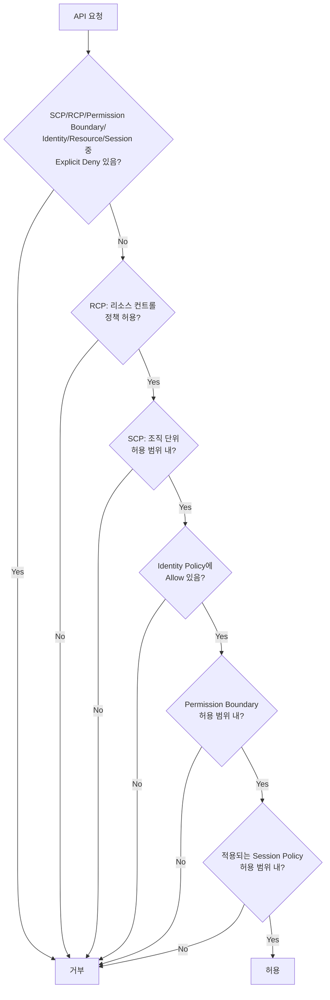
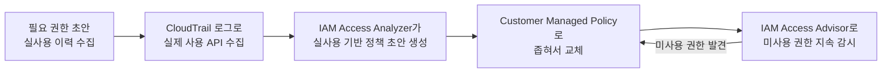

# 클라우드 IAM 최소 권한 원칙

## 핵심 정의
최소 권한 원칙(Principle of Least Privilege)은 사용자, 역할(role), 서비스 등 모든 주체(principal)에게 특정 작업을 수행하는 데 꼭 필요한 최소한의 권한만 부여해야 한다는 보안 설계 원칙이다. AWS IAM(Identity and Access Management)에서는 이 원칙이 "기본적으로 아무 권한도 없음(default deny)"에서 출발해, 정책(policy)으로 필요한 액션·리소스·조건을 명시적으로 허용(Allow)해 나가는 방식으로 구현된다.

클라우드 환경에서는 하나의 잘못 설정된 정책이 EC2 인스턴스 하나가 아니라 계정 전체, 나아가 조직 전체의 리소스에 접근할 수 있는 권한으로 이어질 수 있어, 계정 경계와 역할 위임 범위를 함께 통제해야 한다.

## 동작 원리 / 구조

### 권한 평가 흐름
AWS IAM은 하나의 요청에 대해 여러 정책 유형을 종합 평가한다. 아래는 identity-based Allow 경로를 단순화한 흐름이다. 동일 계정 resource-based Allow는 principal 유형에 따라 boundary/session의 implicit deny를 우회할 수 있으므로 일반적인 전체 평가 순서로 사용하면 안 된다.

- **평가 원칙**: 명시적 거부(explicit deny)는 SCP, RCP, Permission Boundary, Identity/Resource Policy, Session Policy 등 요청에 적용되는 모든 정책을 통틀어 가장 먼저 검사되며, 그중 하나라도 있으면 다른 모든 허용을 무시하고 최종 거부된다. 그 다음 단계로 RCP(2024년 도입된 리소스 컨트롤 정책)를 SCP보다 먼저 평가하는데, 이는 AWS IAM 공식 문서의 평가 순서(RCP → SCP → Resource-based → Identity-based → Permission Boundary → Session Policy)를 따른 것이다. 그 외에는 기본이 거부이며, 어느 한 정책이라도 명시적으로 허용해야 통과한다.
- **경계 계층**: SCP(Service Control Policy)는 적용 대상 계정의 주체가 행사할 수 있는 권한 범위를 제한하고, Permission Boundary는 IAM 사용자/역할의 identity policy가 부여할 수 있는 최대 범위를 제한한다. 둘 다 그 자체로 권한을 부여하지 않는다. resource policy가 주체나 세션에 직접 부여한 권한까지 항상 같은 교집합으로 제한하는 것은 아니므로 아래 예외를 함께 확인한다.
- **정책 조건(Condition)**: 단순히 액션과 리소스만 제한하는 것을 넘어, 소스 IP, MFA 사용 여부, 태그, 요청 시간대 같은 조건으로 권한을 더 세밀하게 제약할 수 있다. `aws:PrincipalOrgID` 조건으로 조직 외부 계정의 접근을 차단하거나, `aws:MultiFactorAuthPresent`로 민감한 작업에 MFA를 강제하는 식이다.

### 권한 축소 워크플로

AWS Managed Policy를 초기 초안으로 활용할 수 있지만 운영에 넓은 권한을 먼저 열어야 하는 것은 아니다. 필요한 권한을 식별하고 실제 사용 이력(CloudTrail, Access Advisor의 last accessed 정보)을 근거로 점진적으로 좁혀나가는 반복적 축소(iterative narrowing) 방식이다. IAM Access Analyzer는 CloudTrail 로그를 분석해 지원하는 서비스의 액션/서비스 수준 사용 정보를 기반으로 정책 초안을 생성한다. 리소스 범위·조건은 추가 보완이 필요하다.

SCP는 Organizations 관리 계정과 service-linked role에 적용되지 않으며 직접 권한을 부여하지 않는다. 동일 계정에서 IAM user ARN 또는 role session ARN을 직접 허용한 resource policy에는 permissions boundary의 implicit deny가 제한하지 않는 경우가 있다. 반면 적용되는 explicit deny는 우선한다. IAM role trust·KMS key policy처럼 별도 명시 허용이 필요한 예외도 확인한다. MFA 조건 키는 모든 자격증명 유형에 항상 존재하지 않으므로 long-term key·federation별 키 존재와 Bool/BoolIfExists 효과를 검토한다.

## 실무 관점
- **와일드카드 남용**: `"Action": "s3:*"`, `"Resource": "*"`처럼 서비스 전체나 모든 리소스에 권한을 여는 패턴이 가장 흔한 위반이다. 특정 버킷의 특정 prefix에 대한 `GetObject`/`PutObject`만 필요한데도 관리 편의를 위해 전체를 열어두면, 해당 역할의 자격증명이 유출됐을 때 피해 범위가 계정 전체 S3로 확대된다.
- **역할 위임 체인**: EC2의 instance profile, ECS의 task role, Lambda의 execution role처럼 애플리케이션에 임시 자격증명을 전달할 때, 애플리케이션 하나가 필요로 하는 권한보다 훨씬 넓은 "공용" 역할을 여러 서비스가 공유하는 경우가 많다. 서비스별로 역할을 분리해 침해 영향을 제한한다. ECS의 task execution role은 이미지 pull·로그 전송·task 정의의 시크릿 주입 등을 수행하는 ECS/Fargate 에이전트용이다. 컨테이너 애플리케이션의 S3 호출 등에 필요한 task role과 구분한다.
- **Permission Boundary와 위임 관리**: 조직이 커지면 플랫폼팀이 애플리케이션팀에게 "본인 서비스에 필요한 IAM 정책을 스스로 작성할 권한"까지 위임해야 할 때가 있다. 이때 Permission Boundary 없이 `iam:CreatePolicy`, `iam:AttachRolePolicy` 권한을 주면 애플리케이션팀이 자기 자신에게 관리자 권한을 부여하는 권한 상승(privilege escalation) 경로가 열린다. Permission Boundary로 위임 가능한 최대 범위를 미리 못박아야 안전하다.
- **장기 자격증명 대신 역할 기반 임시 자격증명**: IAM 사용자의 액세스 키를 코드에 심는 대신, EC2는 instance profile, ECS 애플리케이션은 task role, Lambda는 execution role을, CI 파이프라인은 OIDC 연동 역할(AssumeRoleWithWebIdentity)을 쓰는 것이 표준이다. 자세한 로테이션/유출 대응은 [[시크릿 관리]]에서 다룬 내용과 이어진다.
- **정기 감사의 필요성**: 프로젝트 초기에 최소 권한으로 설계해도 시간이 지나며 임시로 추가한 권한이 방치되는 권한 잠식(permission creep)이 발생한다. IAM Access Analyzer의 외부 접근 분석과 Access Advisor의 미사용 권한 리포트를 정기적으로(예: 분기별) 검토해 사용하지 않는 권한을 제거해야 한다.
- **흔한 사고 패턴**: 삭제되지 않은 테스트/PoC 단계의 관리자 권한 역할이 그대로 운영에 남아있다가, 해당 역할을 assume할 수 있는 자격증명이 유출되며 전체 계정이 침해되는 사고가 반복적으로 보고된다. 최소 권한은 "설계 시점"뿐 아니라 "운영 기간 내내" 유지되어야 하는 지속적 프로세스임을 시사한다.

### Boundary를 평가할 때 ARN 종류 구분

같은 계정의 resource policy에서 IAM role ARN을 허용하는 것과 STS role session ARN을 직접 허용하는 것은 평가가 다르다. AWS 문서는 전자는 permissions boundary·session policy의 implicit deny에 제한되지만, 후자의 직접 세션 허용은 identity policy·boundary·session policy의 implicit deny로 제한되지 않는다고 설명한다. 적용되는 explicit deny는 여전히 우선한다. 역할에 boundary를 붙였다는 사실만으로 모든 리소스 정책 경로가 차단되었다고 판단하지 않는다.

또한 boundary가 붙은 사용자·역할에 resource policy의 `Deny` + `NotPrincipal`을 적용하면, 예외로 적어 놓은 주체까지 접근이 거부될 수 있다. AWS는 이러한 제한에 `aws:PrincipalArn`과 `ArnNotEquals` 조건을 검토하도록 안내한다. 단순 문법 교체로 끝내지 말고 실제 주체 유형·교차 계정 여부·적용 정책을 포함해 허용 및 거부 사례를 확인한다.

### 역할 체인의 세션 수명은 대상 역할 설정만으로 결정되지 않는다

역할을 assume해 받은 임시 자격증명으로 다시 AssumeRole하는 역할 체인(role chaining)은 AWS CLI/API 세션이 최대 1시간으로 제한된다. 대상 역할의 최대 세션 시간을 더 길게 설정해도 이 한도는 늘어나지 않으며, 체인 호출에서 DurationSeconds를 1시간보다 크게 요청하면 실패한다. 긴 배포나 배치가 중간에 인증 실패를 겪으면 권한 정책뿐 아니라 실제 AssumeRole 경로와 반환된 자격증명의 만료 시각을 확인한다.

작업 시작 시 받은 access key·secret key·session token을 고정 환경변수로 복사했다면 원래 발급 경로의 갱신이 실행 중인 프로세스에 자동 반영된다고 가정하지 않는다. 사용하는 자격증명 공급자와 갱신 경로를 확인하고, 갱신 이후의 새 API 호출까지 시험한다. 만료로 실패한 API와 이미 완료된 외부 작업을 구분해 업무 전체를 무조건 재실행하지 않는다.

## 심화 Q&A

### Q. SCP와 Permission Boundary는 둘 다 "상한선"을 정의하는데 실무에서 어떻게 구분해서 쓰는가?
A. SCP는 AWS Organizations의 조직 단위(OU)나 계정 전체에 적용되어, 계정 관리자를 포함한 적용 대상 계정 주체의 조직 차원의 방침(예: 특정 리전 사용 금지, 루트 사용자 사용 금지)을 강제할 때 쓴다. Permission Boundary는 개별 IAM 사용자/역할 단위로 적용되어, 위임받은 관리자가 특정 역할에 부여할 수 있는 권한의 최대치를 제한할 때 쓴다. 조직 정책은 SCP, 개별 위임 통제는 Permission Boundary로 계층을 나누는 것이 일반적이다.

### Q. Identity 정책에서는 허용했는데 Resource 정책에서는 언급이 없으면 접근이 되는가?
A. 같은 계정 내에서는 Identity 정책의 Allow만으로 충분한 경우가 많지만, S3 버킷 정책처럼 리소스 정책이 있는 서비스에서 계정 간(cross-account) 접근을 시도하면 두 정책 모두에서 최소한 하나 이상의 명시적 Allow가 있어야 하고 어느 한쪽에 Deny가 있으면 전체가 거부된다. 즉 리소스 정책이 "허용을 추가"할 수도 있지만, 계정 간 접근에서는 신뢰하는 두 당사자(리소스 소유자와 주체) 양쪽의 허용이 함께 필요하다.

### Q. AWS Managed Policy와 실사용 이력을 초기 권한 설계에 어떻게 활용하는가?
A. 실제 운영 전 단계에서 애플리케이션이 정확히 어떤 API를 호출하는지 완벽히 예측하기 어렵다. 처음부터 지나치게 좁은 정책을 쓰면 예상치 못한 권한 부족으로 장애가 반복되고, 그 과정에서 임시방편으로 권한을 광범위하게 열어버리는 역효과가 나기 쉽다. Managed Policy로 시작해 CloudTrail 기반 실사용 데이터로 축소하면, 실제 필요 권한을 근거 있게 파악한 뒤 정책을 좁힐 수 있어 결과적으로 더 정확한 최소 권한에 도달한다.

### Q. IAM Access Analyzer가 생성해주는 정책만 그대로 적용하면 최소 권한이 완성되는가?
A. Access Analyzer는 CloudTrail에 기록된 "실제로 호출된" 액션만 근거로 정책을 만들기 때문에, 분석 기간 동안 호출되지 않았을 뿐 정상 운영에 필요한 액션(예: 장애 복구 시에만 쓰는 권한, 월 1회 배치 작업)을 누락시킬 수 있다. 자동 생성 정책은 시작점으로 쓰되, 저빈도 경로까지 포함해 검토한 뒤 적용해야 하며, 적용 후에도 감사 로그를 계속 관찰해 새로운 거부(AccessDenied) 발생 여부를 확인해야 한다.

### Q. 최소 권한을 지나치게 강하게 적용하면 어떤 운영 리스크가 생기는가?
A. 장애 대응처럼 예외적으로 넓은 권한이 즉시 필요한 상황에서, 평소에 너무 좁게 잠가둔 정책 때문에 대응이 지연될 수 있다. 이런 경우를 위해 평상시에는 최소 권한을 유지하되, 승인 절차를 거쳐 제한된 시간 동안만 넓은 권한을 부여하는 임시 권한 상승(just-in-time elevation, 예: IAM Identity Center의 임시 세션이나 별도의 break-glass 역할)을 별도로 설계해두는 것이 트레이드오프를 해소하는 방법이다.

### Q. Kubernetes RBAC과 AWS IAM의 최소 권한 개념은 어떻게 연결되는가?
A. 두 시스템 모두 "주체(principal)-액션-리소스"를 명시적으로 매칭시키는 default-deny 모델을 공유한다. EKS 환경에서는 IRSA(IAM Roles for Service Accounts)나 Pod Identity로 Kubernetes ServiceAccount와 AWS IAM 역할을 연결하는데, 이때 파드 하나에 클러스터 전체가 공유하는 넓은 IAM 역할을 붙이면 Kubernetes RBAC으로 파드 간 권한을 아무리 세밀하게 나눠도 AWS 리소스 접근 권한은 여전히 뭉뚱그려진 채로 남는다. 두 레이어의 최소 권한을 함께 설계해야 한 쪽에서 뚫려도 다른 쪽이 방어선이 된다.

## 관련 개념
- [[SSRF와 아웃바운드 요청 검증]]
- [[시크릿 관리]]
- [[VPC 구조]]
- [[AWS 핵심 컴퓨트와 네트워크 서비스]]
- [[컨테이너 이미지 보안 스캔]]

## 참고 자료

- [AWS IAM policy evaluation](https://docs.aws.amazon.com/IAM/latest/UserGuide/reference_policies_evaluation-logic_policy-eval-denyallow.html) — 동일 계정 resource policy·principal type 예외. 확인: 2026-09-08.
- [IAM Permissions boundaries](https://docs.aws.amazon.com/IAM/latest/UserGuide/access_policies_boundaries.html) — identity 권한 상한과 resource grants. 확인: 2026-09-08.
- [AWS Organizations SCP](https://docs.aws.amazon.com/organizations/latest/userguide/orgs_manage_policies_scps.html) — management account·service-linked role 제외. 확인: 2026-09-08.

부분 재검증: 2026-09-22. [AWS IAM 평가 로직](https://docs.aws.amazon.com/IAM/latest/UserGuide/reference_policies_evaluation-logic_policy-eval-denyallow.html)의 identity Allow 경로와 session policy를 도식에 반영하고, [ECS 역할 구분](https://docs.aws.amazon.com/AmazonECS/latest/developerguide/security-iam-roles.html)·[task execution role](https://docs.aws.amazon.com/AmazonECS/latest/developerguide/task_execution_IAM_role.html)을 대조했다. 그 외 서술은 이번 확인 범위 밖이므로 `verified`는 유지했다.

부분 재확인: 2026-09-23. [AWS IAM Permissions Boundaries](https://docs.aws.amazon.com/IAM/latest/UserGuide/access_policies_boundaries.html)의 identity 정책 교집합, 동일 계정 role ARN/session ARN 직접 허용 차이, Deny+NotPrincipal 주의와 권고 대안을 확인했다. 기존 조직·역할·MFA 계약 전체는 재검증하지 않아 `verified`는 유지한다.

부분 재검증: 2026-10-04. [AWS STS AssumeRole — DurationSeconds](https://docs.aws.amazon.com/STS/latest/APIReference/API_AssumeRole.html)의 역할 체인 CLI/API 세션 최대 1시간·초과 요청 실패를 확인했다. 적용 범위는 STS AssumeRole 역할 체인이며 모든 OIDC·콘솔 세션에 같은 상한을 일반화하지 않는다. 환경변수 복사와 갱신 확인은 이를 적용한 운영 점검 항목이다. 실제 STS 발급·SDK 자동 갱신·장시간 배치는 실행하지 않았고 `verified`는 유지했다.
