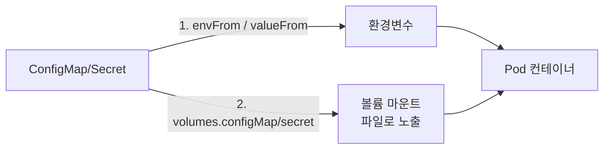
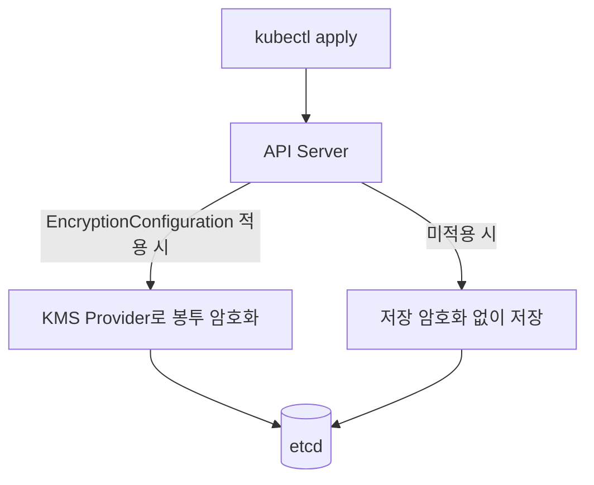

# Kubernetes ConfigMap과 Secret

## 핵심 정의
ConfigMap과 Secret은 애플리케이션 설정값을 컨테이너 이미지와 분리해 Kubernetes API 오브젝트로 관리하는 수단이다. ConfigMap은 포트 번호, 피처 플래그, 프로퍼티 파일처럼 민감하지 않은 설정을 담고, Secret은 비밀번호, 토큰, 인증서 개인키처럼 민감한 값을 담는다는 용도 차이가 있다. ConfigMap은 data/binaryData, Secret은 data와 쓰기용 stringData 및 type별 검증을 제공한다. Secret data의 JSON 표현은 base64이며 stringData에는 평문을 작성한다.

두 오브젝트 모두 데이터 총량이 1MiB로 제한되어 대용량 파일이나 바이너리 저장 용도로는 적합하지 않다.

## 동작 원리 / 구조

### 주입 방식


- **환경변수 주입**: `envFrom` 또는 `env.valueFrom.configMapKeyRef`/`secretKeyRef`로 특정 키를 환경변수로 매핑. 컨테이너 시작 시점에 값이 확정되며, 이후 ConfigMap/Secret이 바뀌어도 **재시작 없이는 반영되지 않는다**.
- **볼륨 마운트**: `volumes.configMap`/`volumes.secret`으로 파일 시스템에 마운트. kubelet이 동기화 루프에서 주기적으로(기본 동기화 주기, 캐시 지연 존재) 변경을 감지해 파일 내용을 갱신하므로 컨테이너 재시작 없이 반영될 수 있다. 단 subPath 마운트는 자동 갱신되지 않으며 애플리케이션이 파일 변경을 감지해 재로드하는 로직이 없다면 여전히 반영되지 않는다.
- **불변(immutable) 오브젝트**: `immutable: true`로 생성하면 이후 데이터 변경이 API 서버 단에서 거부된다. kubelet이 해당 오브젝트를 watch할 필요가 없어져 대규모 클러스터에서 API 서버 부하가 줄고, 실수로 운영 중인 설정을 덮어쓰는 사고도 방지한다. 값을 바꾸려면 새 이름(버전/해시 포함)으로 다시 만들고 워크로드가 참조하는 이름을 바꿔야 한다.

```yaml
apiVersion: v1
kind: ConfigMap
metadata:
  name: app-config-7f9c2a
immutable: true
data:
  application.yml: |
    server:
      port: 8080
---
apiVersion: v1
kind: Secret
metadata:
  name: db-secret
type: Opaque
stringData:            # 쓰기 전용 평문 입력; API 서버가 data로 병합
  password: "s3cr3t"
```

### Secret의 실제 보안 수준
업스트림 기본 설정에서 Secret은 암호화되지 않은 채 etcd에 저장된다. base64는 API JSON의 표현이며 저장 암호화를 뜻하지 않는다. `EncryptionConfiguration`으로 API 서버에 저장 시 암호화(encryption at rest)를 설정하지 않으면, etcd 접근 권한을 가진 누구나 평문 수준으로 값을 복원할 수 있다.


키 수명주기 분리가 필요한 운영 환경에서는 KMS 프로바이더(AWS KMS, GCP KMS 등)를 통한 봉투 암호화(envelope encryption)를 검토하며, 암호화 키 자체를 클러스터 외부에 두는 방식이다.

크기 제한은 Secret data 값의 합, ConfigMap data와 binaryData의 합에 적용되며 metadata를 포함한 직렬화 파일 전체가 정확히 1MiB라는 뜻이 아니다. immutable은 false로 되돌릴 수 없고 삭제 후 재생성은 가능하지만 기존 Pod 마운트 재사용에 의존하지 않는다. projection은 파일 교체 방식이므로 오래 열린 file descriptor나 파일 inode만 감시하는 watcher는 갱신을 놓칠 수 있다.

## 실무 관점
- **변경 후 롤아웃 강제**: 환경변수로 주입한 설정은 재시작 전까지 반영되지 않는다는 점을 놓쳐 "설정을 바꿨는데 왜 안 먹히지" 하는 문제가 잦다. Helm/Kustomize에서 ConfigMap 내용의 해시를 Pod 템플릿의 annotation에 넣어(`checksum/config`) 내용이 바뀌면 Pod 스펙 자체가 바뀐 것으로 인식시켜 자동 롤아웃을 트리거하는 패턴을 쓴다.
- **불변 ConfigMap + 버전 네이밍 패턴**: `app-config-<content-hash>` 형태로 이름을 짓고 Deployment가 항상 최신 이름을 참조하도록 하면, 설정 변경이 곧 새 리소스 생성이 되어 변경 이력이 명확히 남고 롤백도 이전 이름으로 되돌리면 된다. Kustomize의 `configMapGenerator`가 이 패턴을 자동화해준다.
- **RBAC 최소 권한**: 네임스페이스 전체에 대한 `get secrets` 권한을 광범위하게 부여하면, 특정 앱만 필요로 하는 시크릿을 다른 서비스 계정도 읽을 수 있게 된다. Role/RoleBinding을 리소스 이름 단위로 좁히거나, 애초에 Secret 오브젝트 자체를 최소화하고 [[시크릿 관리]]에서 다루는 외부 저장소를 쓰는 방향으로 가는 것이 최근 흐름이다.
- **Secret이 로그/디스크에 남는 경로**: 환경변수는 `docker inspect`, 코어 덤프, 예외 스택 트레이스로 노출될 수 있고, Linux의 Secret 볼륨은 tmpfs를 사용하지만 Windows나 swap·덤프·애플리케이션 복사까지 디스크 무기록을 보장하지 않는다. 민감도가 높을수록 볼륨 마운트를 선호하는 이유 중 하나다.
- **네임스페이스 스코프 한계**: ConfigMap/Secret은 네임스페이스 리소스라 여러 네임스페이스에서 같은 값을 쓰려면 복제해야 한다. Kyverno의 generate 정책, Reflector 같은 컨트롤러로 동기화하거나, 애초에 External Secrets Operator로 외부 저장소에서 각 네임스페이스에 배포하는 방식을 쓴다.
- **1MiB 크기 제한**: TLS 인증서 체인이 길거나 대용량 설정 파일을 통째로 넣으면 한도를 넘을 수 있다. 이 경우 초기화 컨테이너(init container)에서 외부 스토리지(S3 등)로부터 내려받는 방식으로 우회한다.

## 심화 Q&A

### Q. Secret의 get 권한을 막았는데도 Pod 생성 권한으로 내용을 읽을 수 있는가?
A. 해당 Secret을 참조하는 Pod를 만들 수 있다면 그 Pod 안에서 값을 읽어 노출시킬 수 있다. 따라서 Secret의 `get`만 제거해도 네임스페이스 안의 비밀이 격리된다고 판단하면 안 된다. `list`·`watch`도 Secret 내용을 반환할 수 있으므로 메타데이터 조회 정도의 약한 권한으로 취급하지 않는다.

워크로드 생성·수정 권한, Secret 마운트 허용 정책, 네임스페이스 경계를 함께 검토한다. 외부 Secret 저장소를 쓰더라도 어떤 워크로드 신원에 어떤 경로를 허용하는지가 핵심이며, Kubernetes Secret으로 동기화한다면 그 복제본의 권한도 계속 관리해야 한다. 저장 암호화는 etcd 유출 경계를 보호하지만 정상 API 권한이나 허가된 Pod의 읽기를 차단하지 않는다.


### Q. ConfigMap과 Secret을 API 스펙 수준에서 굳이 분리해 둔 이유는 무엇이고, base64 인코딩 외에 실질적으로 다른 점이 있는가?
A. base64 인코딩 외에 API 서버 차원에서 Secret에는 몇 가지 추가 처리가 있다. 기본 표 형태 get/describe는 값을 직접 표시하지 않지만 get -o yaml/json은 base64 값을 노출하고, 일부 클러스터 구성에서는 Secret만 별도의 암호화 정책(EncryptionConfiguration의 `resources` 목록)을 적용하기 쉽게 분리되어 있다. 즉 "민감정보는 이 타입에 넣어야 한다"는 관례와 도구 생태계(RBAC 정책, 스캐너)가 Secret 타입을 기준으로 동작하도록 만들어져 있다는 점이 실질적 차이이며, 암호화 강제 여부 자체는 클러스터 설정에 달려 있다.

### Q. 불변(immutable) ConfigMap을 쓰면 설정 변경 시 Pod가 항상 재시작되는가? 볼륨 마운트의 "재시작 없는 반영" 이점을 포기하는 셈 아닌가?
A. 같은 객체의 데이터를 변경할 수 없으므로 새 이름을 참조하는 방식을 권장한다. 이때 Deployment의 Pod 템플릿을 갱신해 롤링 업데이트를 유발해야 하고, 이는 "재시작 없이 반영"이라는 편의는 포기하는 대신 변경 이력 추적, API 서버 부하 감소, 실수 방지라는 이득을 얻는 설계다. 민감하지 않고 자주 바뀌는 설정(피처 플래그 등)은 가변 ConfigMap + 볼륨 마운트로 빠르게 반영하고, 구조적으로 중요한 설정은 불변 방식으로 배포 파이프라인에 태우는 식으로 혼용하는 것이 일반적이다.

### Q. Secret을 볼륨으로 마운트했는데 애플리케이션이 시작 시점에 한 번만 읽고 캐싱한다면, 로테이션이 실제로 반영되는가?
A. 아니다. kubelet이 파일 내용을 갱신해도 그것은 파일 시스템 레벨의 변화일 뿐이고, 애플리케이션 프로세스가 그 파일을 다시 읽지 않으면 메모리에 캐싱된 옛 값을 계속 쓴다. 이 문제 때문에 시크릿 로테이션에 민감한 서비스는 파일 변경을 감지하는 워처(inotify 등)를 붙이거나, Vault Agent Sidecar처럼 갱신 시 애플리케이션에 SIGHUP 등의 신호를 보내는 보조 프로세스를 함께 두는 설계를 쓴다.

### Q. 왜 Secret을 환경변수로 주입하는 것이 "가장 쉬운데 가장 위험한 방식"이라고 하는가, 구체적으로 어떤 공격 경로가 있는가?
A. 애플리케이션 내부 코드와 기본적으로 환경을 상속한 자식 프로세스가 값을 읽을 수 있다. 다른 프로세스의 /proc/<pid>/environ 접근은 UID·ptrace·namespace 권한에 달려 있다. 원격 코드 실행이나 환경을 노출하는 디버그 엔드포인트는 유출 경로지만 SSRF만으로 파일 읽기가 자동 성립하지는 않는다. 파일 마운트도 해당 UID의 코드 실행으로 읽힐 수 있으므로 접근 권한·덤프·로그 노출을 함께 통제한다.

### Q. EncryptionConfiguration을 적용해 등록한 이후, 이미 etcd에 저장되어 있던 기존 Secret들은 자동으로 암호화되는가?
A. 아니다. EncryptionConfiguration은 이후 쓰기(write) 시점부터 적용되므로, 기존에 저장된 Secret은 여전히 암호화되지 않은 채 남아 있다. 클러스터 전체를 재암호화하려면 모든 기존 Secret에 대해 빈 업데이트를 수행하는 방식(`kubectl get secrets --all-namespaces -o json | kubectl replace -f -` 류의 작업이나 공식 마이그레이션 절차)으로 강제로 다시 쓰기를 유발해야 한다. 이 단계를 누락하면 "암호화를 켰다고 생각했는데 실제로는 과거 데이터가 그대로"인 상황이 발생한다.

### Q. 여러 네임스페이스에 동일한 Secret을 복제해서 쓰는 것과, 클러스터 범위(cluster-scoped)로 공유 가능한 방식의 차이는 무엇인가?
A. Kubernetes의 Secret/ConfigMap은 설계상 네임스페이스 스코프 리소스라 다른 네임스페이스 객체를 Pod의 secretKeyRef/volume으로 직접 참조할 수 없다. API 클라이언트는 권한을 받으면 다른 네임스페이스를 조회할 수 있다. 복제 방식(Reflector, Kyverno generate policy 등)을 쓰면 네임스페이스별 격리(다른 팀이 실수로 접근하기 어려움)는 유지하면서 값만 동기화할 수 있지만, 복제본 수만큼 갱신 지연과 정합성 관리 비용이 생긴다. 반대로 External Secrets Operator처럼 외부 저장소를 단일 진실 공급원(source of truth)으로 두고 각 네임스페이스가 필요한 시점에 동기화받는 구조가 관리 비용과 감사 추적 측면에서 더 널리 쓰인다.

## 관련 개념
- [[시크릿 관리]]
- [[Kubernetes 핵심 오브젝트]]
- [[리소스 Requests와 Limits]]

## 참고 자료

- [Kubernetes Secrets](https://kubernetes.io/docs/concepts/configuration/secret/) — v1 API·1MiB·subPath·immutable·tmpfs. 확인: 2026-09-08.
- [Kubernetes ConfigMap](https://kubernetes.io/docs/concepts/configuration/configmap/) — data/binaryData·크기·동기화. 확인: 2026-09-08.
- [Kubernetes Encrypt data](https://kubernetes.io/docs/tasks/administer-cluster/encrypt-data/) — encryption provider·기존 데이터 다시 쓰기. 확인: 2026-09-08.

부분 재검증: 2026-09-23. [Kubernetes Secrets good practices](https://kubernetes.io/docs/concepts/security/secrets-good-practices/)의 v1 Secret API에 대한 get/list/watch·Secret 참조 Pod 생성 권한·네임스페이스 경계를 확인했다. 클러스터별 admission 정책과 기존 크기·동기화 구현 전체는 이번 범위 밖이므로 `verified`는 유지했다.
