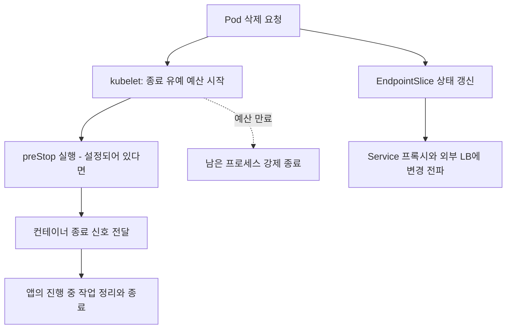

# Kubernetes 프로브와 안전한 종료

## 핵심 정의

프로브(probe)는 kubelet이 컨테이너의 시작·생존·준비 상태를 확인하는 검사다. 안전한 종료(graceful termination)는 새 작업 유입을 줄이고 진행 중 작업을 정리한 뒤 프로세스를 끝내는 과정이다. 프로브가 성공하거나 Pod가 정상 삭제되었다는 사실만으로 사용자 요청의 무손실 처리가 보장되지는 않는다.

이 노트는 Kubernetes v1.37 공식 문서를 기준으로 일반적인 Linux Pod의 HTTP 서비스 운영을 다룬다. 애플리케이션의 상태 정의는 [[Actuator와 헬스체크]], Spring 웹 서버의 종료 구현은 [[내장 WAS]]에서 이어서 읽는다.

## 동작 원리 / 구조

### 세 가지 프로브의 역할

| 프로브 | 확인할 상태 | 실패 임계치 도달 시 |
|---|---|---|
| startup | 초기화가 완료되어 정상 상태 검사를 시작할 수 있는가 | 컨테이너 종료 후 restart policy에 따라 처리 |
| readiness | 지금 이 인스턴스로 새 서비스 요청을 보내도 되는가 | 컨테이너는 계속 실행하되 Pod Ready가 false로 전환 |
| liveness | 프로세스가 스스로 회복하지 못해 재시작이 필요한가 | 컨테이너 종료 후 restart policy에 따라 처리 |

startup이 설정되면 성공할 때까지 readiness와 liveness를 실행하지 않는다. readiness 실패 자체는 재시작 명령이 아니다. Deployment의 일반적인 `restartPolicy: Always`에서는 liveness/startup 실패 후 해당 컨테이너를 재시작하며 Pod 전체를 다른 노드로 옮기는 것은 아니다.

다음은 Pod template의 설정 조각이다. 앱이 `/livez`와 `/readyz`를 구현해야 하며 수치는 예시다. 기동 시간 분포와 부하 중 응답시간을 측정해 조정한다.

```yaml
spec:
  terminationGracePeriodSeconds: 60
  containers:
    - name: app
      # image 등 나머지 필드는 실제 워크로드에서 설정
      ports:
        - name: http
          containerPort: 8080
      startupProbe:
        httpGet: {path: /livez, port: http}
        periodSeconds: 5
        timeoutSeconds: 2
        failureThreshold: 36
      readinessProbe:
        httpGet: {path: /readyz, port: http}
        periodSeconds: 5
        timeoutSeconds: 2
        failureThreshold: 2
      livenessProbe:
        httpGet: {path: /livez, port: http}
        periodSeconds: 10
        timeoutSeconds: 2
        failureThreshold: 3
```

HTTP 검사는 200 이상 400 미만을 성공으로 판단한다. TCP 연결 성공은 업무 처리 가능성을 확인하지 못하며, HTTPS 프로브는 인증서를 검증하지 않으므로 TLS 인증서 유효성 감시를 대신하지 못한다. `timeoutSeconds` 기본값은 1초다. CPU throttling이나 긴 GC 중에는 건강한 프로세스도 검사에 실패할 수 있다.

### Pod 삭제와 트래픽 제거



두 경로 사이에 전역적인 완료 순서는 없다. 종료 중 endpoint는 즉시 삭제되기보다 `terminating: true`, 일반 트래픽용 `ready: false`로 표시된다(`publishNotReadyAddresses: true` 서비스는 ready 예외). drain 구현은 `serving` 상태도 사용할 수 있다. 이미 열린 연결과 외부 로드밸런서의 갱신 지연은 별도이므로 종료 신호를 받자마자 모든 연결을 닫으면 요청이 유실될 수 있다.

Pod의 `terminationGracePeriodSeconds` 기본값은 30초이며 **preStop과 애플리케이션 종료가 같은 예산을 나눠 쓴다**. `preStop` 뒤에 보통 SIGTERM이 컨테이너의 PID 1로 전달되고, 예산이 끝나면 남은 프로세스를 강제 종료한다. 이미지의 `STOPSIGNAL`과 런타임에 따라 종료 신호가 다를 수 있다. hook 초과 시의 짧은 추가 유예를 정상 운영 예산으로 계산하지 않는다.

### 삭제와 프로브 실패의 종료 예산을 구분한다

Pod 삭제에는 Pod 수준 종료 유예가 적용되지만, liveness/startup 실패로 해당 컨테이너를 종료할 때는 프로브의 `terminationGracePeriodSeconds`가 있으면 그 값을 우선한다. 이 기능은 v1.28부터 stable이며 readiness에는 설정할 수 없다. 따라서 정상 배포 종료는 성공해도 liveness 실패 때 더 짧은 예산으로 요청·메시지 처리가 끊길 수 있다. 두 종료 경로를 따로 시험한다.

HTTP 프로브가 로그인 페이지로 redirect되거나 본문에 오류를 담은 200을 반환하면 상태 판단이 왜곡될 수 있다. v1.37의 kubelet HTTP 프로브는 다른 호스트로 redirect되면 따라가지 않고 성공과 `ProbeWarning`을 기록한다. 전용 health 경로에서 redirect 없이 상태 코드를 반환하고, 프로브 성공과 warning 이벤트를 함께 확인한다.

## 실무 관점

- **검사 범위**: 외부 DB·API 장애를 liveness에 넣으면 재시작으로 해결되지 않는 장애에 모든 컨테이너가 재시작할 수 있다. readiness에 공유 의존성을 넣을 때도 모든 Pod가 한꺼번에 제외되는 결과를 평가한다. 부가 기능만 실패한 경우에는 [[우아한 성능 저하]]가 더 적합할 수 있다.
- **종료 예산**: 전파 대기·진행 중 HTTP 요청·메시지 소비 중단과 ack·애플리케이션 정리·사이드카 종료에 필요한 시간을 측정한다. 긴 작업은 단순 대기보다 재개·멱등성·체크포인트가 필요하다. 프로세스가 종료 신호를 실제로 받는지도 확인한다.
- **롤링 배포**: `maxUnavailable`은 가용 Pod 감소, `maxSurge`는 추가 Pod 생성을 제어한다. `minReadySeconds`는 잠깐 Ready가 된 Pod를 곧바로 available로 세는 것을 늦춘다. 종료 중인 Pod가 자원을 계속 사용하므로 surge만으로 피크 자원량을 계산하지 않는다.
- **실무 확인 포인트**: 정상 부하를 유지하며 rollout·Pod 삭제·노드 drain을 각각 시험한다. 5xx, connection reset, 요청 완료율, 메시지 재전달, 강제 종료를 함께 관찰하고 프로브 성공률만으로 배포 성공을 판단하지 않는다.

## 심화 Q&A

### Q. readiness가 false가 되었는데 요청이 계속 들어올 수 있는가?
A. 있다. Service·프록시·외부 LB는 상태 변경을 비동기로 반영하며 기존 연결은 별도 생명주기를 갖는다. 직접 Pod IP로 접속하거나 `publishNotReadyAddresses`를 사용하는 서비스는 일반 readiness 라우팅 전제와도 다르다. 앱의 수신·연결 drain과 앞단 LB 설정을 함께 설계해야 한다.

### Q. preStop에 sleep을 넣으면 무중단 배포가 보장되는가?
A. 고정 대기는 라우팅 변경이 전파될 시간을 줄 수 있지만 실제 전파 완료를 확인하지 않으며 그동안 종료 예산을 소비한다. 충분하지 않으면 늦게 도착한 요청이 실패하고 너무 길면 실제 작업 정리 시간이 부족해진다. 측정한 전파 지연과 앱의 graceful shutdown을 조합하고 부하 테스트로 확인한다.

### Q. PDB가 있으면 Deployment 롤링 업데이트에서도 최소 가용 수가 보장되는가?
A. PodDisruptionBudget(PDB)은 Eviction API를 따르는 자발적 중단을 제한한다. Deployment의 자체 rolling update는 PDB에 의해 제한되지 않으므로 rollout 전략을 별도로 설정한다. 노드 고장 같은 비자발적 중단도 PDB가 막지 못하며 직접 Pod 삭제는 Eviction API와 다르다.

### Q. 사이드카가 앱보다 먼저 내려가면 어떤 문제가 생기는가?
A. 앱이 완료하려는 요청의 프록시나 마지막 로그 전송 경로가 사라질 수 있다. 일반 컨테이너끼리는 종료 순서가 보장되지 않는다. Kubernetes native sidecar(`initContainers`의 `restartPolicy: Always`)는 main container 종료 뒤 정의의 역순으로 종료되지만, 전체 유예 시간이 부족하면 강제 종료될 수 있다. 서비스 메시의 구체적인 drain 정책은 구현별로 검증한다.

### Q. 강제 삭제로 Terminating을 없애면 기존 프로세스도 멈췄다고 볼 수 있는가?
A. 아니다. 강제 삭제는 노드에서 종료되었다는 확인을 기다리지 않고 API 객체를 없앨 수 있다. 통신이 끊긴 노드에서 이전 프로세스가 계속 실행되는 상황에서는 새 Pod와 업무를 중복 수행할 수 있다. 상태 저장 작업은 소유권·fencing·멱등성을 별도로 보호해야 한다.

## 관련 개념

- [[Kubernetes 핵심 오브젝트]]
- [[리소스 Requests와 Limits]]
- [[배포 전략 Blue-Green Canary Rolling]]
- [[Actuator와 헬스체크]]
- [[내장 WAS]]
- [[멱등성 키 설계]]

## 참고 자료

확인 날짜: 2026-09-22. Kubernetes 문서의 표시 버전 v1.37을 기준으로 프로브·종료·PDB·Deployment 동작을 대조했다. 설정 수치는 권장 기본값이 아닌 예시이며 실제 클러스터 실행 검증은 수행하지 않았다.

- [Kubernetes Probes](https://kubernetes.io/docs/concepts/workloads/pods/probes/) — 검사 역할·판정·설정·HTTPS 인증서 검증 생략.
- [Configure Probes](https://kubernetes.io/docs/tasks/configure-pod-container/configure-liveness-readiness-probes/) — HTTP probe YAML과 임계치·timeout 구성.
- [Pod Lifecycle](https://kubernetes.io/docs/concepts/workloads/pods/pod-lifecycle/) — 삭제·EndpointSlice·종료 신호.
- [Sidecar Containers](https://kubernetes.io/docs/concepts/workloads/pods/sidecar-containers/) — native sidecar의 종료 순서와 유예 시간.
- [kubectl delete](https://kubernetes.io/docs/reference/kubectl/generated/kubectl_delete/) — 강제 삭제와 실제 프로세스 종료 확인의 차이.
- [Container Lifecycle Hooks](https://kubernetes.io/docs/concepts/containers/container-lifecycle-hooks/) — preStop과 공유 종료 예산.
- [EndpointSlice](https://kubernetes.io/docs/concepts/services-networking/endpoint-slices/) — ready/serving/terminating과 publishNotReadyAddresses 예외.
- [Disruptions](https://kubernetes.io/docs/concepts/workloads/pods/disruptions/) — PDB와 Eviction API·rolling update·비자발적 중단의 경계.
- [Deployments](https://kubernetes.io/docs/concepts/workloads/controllers/deployment/) — maxSurge/maxUnavailable·minReadySeconds·종료 중 Pod의 자원 사용.

부분 재검증: 2026-10-04. [Kubernetes Probes](https://kubernetes.io/docs/concepts/workloads/pods/probes/#probe-level-terminationgraceperiodseconds) — 표시 버전 v1.37, 프로브별 종료 유예(v1.28 stable)·readiness 설정 금지·HTTP redirect 처리와 상태 코드 판정을 확인했다. [Pod Lifecycle](https://kubernetes.io/docs/concepts/workloads/pods/pod-lifecycle/#pod-termination)로 삭제 경로의 예산과 대조했다. 실제 클러스터의 재시작·종료 시험과 전체 기존 주장 재검증은 수행하지 않아 `verified`를 유지했다.
