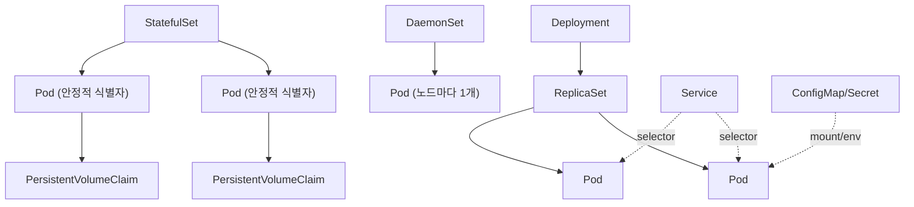

# Kubernetes 핵심 오브젝트

## 핵심 정의
Kubernetes 오브젝트(Object)는 클러스터에 존재하는 상태를 나타내는 영속적 엔티티로, YAML/JSON 스펙(`spec`)으로 원하는 상태(desired state)를 선언하면 컨트롤러(controller)가 현재 상태(status)를 그 값에 맞추도록 지속적으로 조정(reconcile)한다. Pod, Deployment, StatefulSet, DaemonSet, Service, ConfigMap/Secret 등이 대표적인 핵심 오브젝트이며, 각각 워크로드 실행 단위, 배포 전략, 네트워킹, 설정 주입이라는 서로 다른 관심사를 담당한다.

오브젝트는 apiVersion/kind/metadata를 사용하지만 ConfigMap·Secret처럼 spec 대신 data 등의 필드를 사용하는 유형도 있다. 일반적으로, etcd에 저장된 원하는 상태를 각종 컨트롤러가 watch하여 실제 상태로 수렴시키는 것이 Kubernetes 전체의 동작 원리다.

## 동작 원리 / 구조

### 계층 구조

- **Pod**: 하나 이상의 컨테이너가 네트워크 네임스페이스(IP)를 공유하고 명시적으로 마운트한 볼륨을 공유할 수 있는 최소 배포 단위. Pod 자체는 자기 치유(self-healing)를 하지 않으며, 상위 컨트롤러(Deployment, StatefulSet 등)가 없으면 삭제되어도 재생성되지 않는다.
- **ReplicaSet**: 지정된 수의 동일한 Pod 복제본을 유지. 보통 Deployment가 내부적으로 생성/관리하며 직접 다루는 일은 드물다.
- **Deployment**: ReplicaSet을 소유하며 롤링 업데이트(rolling update), 롤백(rollback), 리비전 히스토리를 관리한다. Pod는 상호 교체 가능(interchangeable)하다고 가정하며, 재생성 시 Pod 이름은 바뀌며 볼륨 지속성은 PVC 등 명시한 저장 설정에 달린다. 무상태(stateless) 애플리케이션에 적합.
- **StatefulSet**: Pod마다 안정적인 네트워크 식별자(`<name>-N` 형태 호스트네임)와 전용 PersistentVolumeClaim을 유지한다. 순서 보장 생성·스케일다운(OrderedReady, 기본값)과 Headless Service를 통한 개별 DNS 접근이 특징이다. StatefulSet 객체 자체를 삭제할 때의 Pod 종료 순서까지 보장하는 것은 아니다. 기본적으로 스케일 다운/삭제 시에도 볼륨은 자동 삭제되지 않아 데이터 유실을 방지하지만, `persistentVolumeClaimRetentionPolicy`(`whenDeleted`/`whenScaled`)를 설정하면 삭제·스케일다운 시점에 PVC를 자동 정리하도록 명시적으로 바꿀 수도 있다.
- **DaemonSet**: 클러스터의 모든(또는 특정 라벨의) eligible node마다 Pod 하나를 유지하도록 조정. 로그 수집기, 노드 모니터링 에이전트, CNI 플러그인 등 노드 단위 인프라 컴포넌트에 사용.
- **Job/CronJob**: 완료를 목표로 하는 단발성/주기적 배치 작업. `completions`, `parallelism`, `backoffLimit`으로 재시도와 병렬성을 제어.
- **Service**: 라벨 셀렉터(selector)로 묶인 Pod 집합에 안정적인 가상 IP(ClusterIP)와 DNS 이름을 부여. `ClusterIP`, `NodePort`, `LoadBalancer`, `ExternalName` 타입이 있으며 kube-proxy의 Linux iptables/nftables/IPVS 모드 또는 이를 대체하는 네트워크 구현이 전달을 처리한다. Headless Service는 ClusterIP가 없고 ExternalName은 DNS CNAME이며 selector 없는 Service도 가능하다.
- **ConfigMap/Secret**: 설정값과 민감정보를 컨테이너 이미지와 분리해 환경변수 또는 볼륨 마운트로 주입. Secret은 기본적으로 base64 인코딩일 뿐 암호화가 아니므로, etcd 암호화(encryption at rest)나 외부 Secret 관리 도구(Vault, External Secrets Operator)를 함께 고려해야 한다.

### 컨트롤 루프
모든 컨트롤러는 "관찰(Observe) → 비교(Diff) → 조정(Act)"의 무한 루프로 동작한다. API Server가 etcd 변경을 이벤트로 전파하면 각 컨트롤러의 informer가 이를 캐싱하고, 워크큐에 넣어 조정(reconcile) 함수를 호출하는 구조다. 이 패턴이 커스텀 컨트롤러/오퍼레이터(Operator) 설계의 기반이 된다.

Linux kube-proxy IPVS 모드는 v1.35부터 deprecated이며 새 구성은 해당 클러스터가 지원하는 nftables/iptables 또는 대체 dataplane을 검토한다. kubelet은 상위 컨트롤러가 없는 Pod에서도 restartPolicy에 따라 컨테이너를 재시작한다. Job 재시도는 같은 작업을 중복 실행할 수 있어 부작용을 멱등하게 처리한다. PDB는 Eviction API를 통한 자발적 중단을 제어하며 노드 장애나 Deployment rollout 가용성 자체를 보장하지 않는다.

## 실무 관점
- **Deployment vs StatefulSet 선택 기준**: 애플리케이션이 어떤 인스턴스가 요청을 처리해도 무관하면 Deployment, 노드 식별자·순서·전용 스토리지가 필요하면(DB, 메시지 브로커, 분산 캐시 클러스터 등) StatefulSet을 쓴다. StatefulSet을 무상태 서비스에 잘못 적용하면 배포 속도가 느려지고(OrderedReady 기본값 때문에 순차 롤아웃) 불필요한 운영 복잡도만 늘어난다.
- **리소스 요청/제한(requests/limits) 미설정**: `requests`를 지정하지 않으면 스케줄러가 노드 여유 자원을 제대로 판단하지 못해 특정 노드에 Pod가 몰리는 문제가 생긴다. limits만 있으면 admission 기본값이 없는 해당 리소스의 request를 limit 값으로 복사한다. 최종 QoS와 예약량을 생성된 Pod에서 확인한다.
- **liveness/readiness probe 설계 실수**: liveness probe가 너무 민감하면(예: DB 커넥션 실패를 liveness 실패로 처리) 컨테이너가 불필요하게 재시작을 반복하며 장애를 오히려 증폭시킨다. readiness와 liveness의 책임을 분리하는 것이 핵심.
- **롤링 업데이트 파라미터**: `maxSurge`/`maxUnavailable`을 트래픽 특성에 맞게 조정. 카나리(canary) 배포나 블루/그린(blue-green)이 필요하면 Deployment의 기본 롤링 업데이트만으로는 부족하고 Argo Rollouts, Flagger 같은 프로그레시브 딜리버리 도구를 함께 쓴다.
- **ConfigMap/Secret 변경 후 미반영**: ConfigMap 볼륨은 subPath를 제외하면 파일에 변경이 전파될 수 있지만(캐시 지연·앱 재로드 필요), 환경변수로 주입하면 Pod를 재시작해야 반영된다. 이를 놓쳐 "설정을 바꿨는데 반영이 안 된다"는 장애가 흔하다. Checksum 어노테이션을 배포 템플릿에 넣어 강제로 롤아웃을 트리거하는 패턴을 자주 사용한다.
- **PodDisruptionBudget(PDB) 누락**: 노드 드레인(drain)이나 클러스터 업그레이드 시 PDB가 없으면 한 번에 너무 많은 레플리카가 동시에 내려가 서비스 가용성이 떨어질 수 있다.

### StatefulSet 삭제와 롤백의 운영 경계

종료 순서가 필요한 StatefulSet은 객체를 바로 삭제하는 것과 `replicas: 0`으로 스케일다운한 뒤 삭제하는 것을 구분한다. 공식 문서는 순차 종료가 필요할 때 먼저 0으로 축소하는 절차를 안내한다. 다만 PVC 유지 정책의 `whenScaled: Delete`를 설정했다면 이 축소 자체가 PVC 정리를 유발할 수 있으므로, 애플리케이션의 데이터 보존·백업 정책도 함께 확인한다.

`OrderedReady`와 `RollingUpdate`에서 잘못된 이미지·설정으로 새 Pod가 끝내 Ready가 되지 않으면 rollout이 멈춘다. Kubernetes v1.37 문서는 이 상태에서 **Pod template을 이전 값으로 되돌리는 것만으로는 복구되지 않는 알려진 문제**를 명시한다. 템플릿을 복원한 다음 잘못된 설정으로 생성된 Pod를 삭제해야 복원된 템플릿으로 다시 생성한다. 이를 일반 Pod 강제 삭제의 근거로 확대하지 말고, 정상 종료·스토리지 소유권은 [[Kubernetes 프로브와 안전한 종료]]의 경계를 함께 적용한다.

### PVC 접근 모드는 애플리케이션의 단일 작성자 보장과 다르다

`ReadWriteOnce`(RWO)는 한 노드에서 읽기·쓰기 마운트할 수 있다는 뜻이다. 같은 노드의 여러 Pod가 같은 볼륨에 접근할 수 있으므로, RWO라는 이유만으로 작성자가 하나라고 가정하지 않는다. 롤링 배포 중 구·신 Pod가 같은 PVC를 쓰면 애플리케이션이 동시 접근을 지원하는지 별도로 확인한다.

단일 Pod 접근이 필요하면 `ReadWriteOncePod`(RWOP)를 검토한다. 이 기능은 Kubernetes v1.29부터 stable이며 CSI 볼륨과 지원 드라이버·sidecar 조합이 필요하다. 일반 access mode는 바인딩·마운트 조건이고, `ReadOnlyMany`를 적었다는 사실만으로 마운트된 파일시스템의 쓰기 방지가 강제되는 것도 아니다. 실제 마운트의 readOnly 설정·스토리지 권한과 장애 시 소유권 이전을 함께 검증한다.

## 심화 Q&A

### Q. Deployment가 파드를 교체할 때 ReplicaSet은 왜 삭제하지 않고 남겨두는가?
A. 롤백(rollback)을 지원하기 위해서다. Deployment는 리비전마다 새 ReplicaSet을 생성하고 이전 ReplicaSet의 레플리카 수를 0으로 줄여 유지한다(`revisionHistoryLimit`까지). `kubectl rollout undo`는 사실 이전 ReplicaSet의 스펙으로 새 리비전을 만드는 것에 가깝고, 이 히스토리 덕분에 특정 리비전으로 즉시 되돌아갈 수 있다.

### Q. StatefulSet의 Pod가 삭제 후 재생성될 때 왜 같은 PVC를 다시 연결하는가? 이게 항상 안전한가?
A. StatefulSet은 `volumeClaimTemplates`로 Pod 서수(ordinal)와 PVC를 1:1로 매핑하기 때문에 `web-0`이 재생성되면 항상 `www-web-0`이라는 동일 PVC를 바인딩한다. 다만 완전히 안전하지는 않다. StorageClass가 노드 로컬 볼륨(예: `local` provisioner)이면 Pod가 다른 노드로 재스케줄될 때 볼륨 어피니티(volume affinity) 제약 때문에 스케줄링이 실패할 수 있고, EBS처럼 AZ에 묶인 스토리지는 다른 AZ로 attach할 수 없다. CSI라는 인터페이스 자체가 AZ 범위를 정하지는 않으며 드라이버·스토리지 topology와 fencing을 확인한다.

### Q. DaemonSet과 "모든 노드에 Deployment를 노드 어피니티로 분산 배치"하는 방식의 차이는?
A. DaemonSet 컨트롤러가 eligible node마다 대상 nodeAffinity를 가진 Pod를 생성하고 기본 scheduler가 이를 바인딩한다. 리소스가 부족하면 Pending이 되거나 Priority에 따라 다른 Pod를 선점할 수 있다. 자동 toleration은 일부 노드 상태 taint에 대한 것이며 control-plane taint 등은 별도 허용이 필요할 수 있다. Deployment는 replica 수를 노드 수에 맞춰 자동 조정하지 않으므로 노드별 에이전트 유지에는 DaemonSet이 적합하다.

### Q. Service의 ClusterIP는 실제로 어디에 존재하며, 어떻게 여러 Pod로 트래픽이 분산되는가?
A. ClusterIP는 Service를 식별하는 VIP다. iptables/nftables 모드는 규칙으로 endpoint를 선택하고 주소를 변환하며, IPVS 모드에서는 dummy interface에 VIP를 바인딩할 수 있다. Cilium의 eBPF 서비스 전달은 kube-proxy 대체 구현이다. 따라서 모든 방식이 특정 인터페이스 없이 netfilter DNAT만 수행한다고 일반화할 수 없다.

### Q. requests와 limits를 동일하게 설정하는 것(Guaranteed QoS)이 항상 최선의 선택인가?
A. 아니다. Guaranteed는 메모리 사용량이 request 안에 머무르는 데 유리하지만 eviction 면역은 아니며, 실제 사용량 변동 폭이 큰 워크로드에서는 피크 기준으로 자원을 예약해 두는 셈이라 클러스터 전체 자원 효율이 떨어진다. 트래픽 변동이 큰 서비스는 오히려 `requests`를 평균값 근처로, `limits`를 여유 있게 설정한 Burstable QoS + HPA/VPA 조합이 비용 효율적일 수 있다.

### Q. Job의 `backoffLimit`과 `restartPolicy`는 어떻게 상호작용하는가?
A. Pod 템플릿의 `restartPolicy`는 `Never` 또는 `OnFailure`만 허용된다(`Always`는 Job semantics와 맞지 않아 금지). `OnFailure`면 같은 Pod 내에서 컨테이너를 재시작하며 시도 횟수를 카운트하고, `Never`면 실패할 때마다 새 Pod를 생성한다. 두 경우 모두 실패 횟수가 `backoffLimit`을 넘으면 Job 전체가 `Failed`로 처리되며, 재시도 간격은 지수 백오프(exponential backoff)로 증가한다.

## 관련 개념
- [[Kubernetes 프로브와 안전한 종료]]
- [[오토스케일링]]
- [[서비스 메시]]
- [[CI-CD 파이프라인 구성]]

## 참고 자료

- [Kubernetes DaemonSet](https://kubernetes.io/docs/concepts/workloads/controllers/daemonset/) — apps/v1·eligible node·scheduler. 확인: 2026-09-08.
- [Kubernetes Virtual IPs](https://kubernetes.io/docs/reference/networking/virtual-ips/) — iptables/IPVS/nftables·IPVS v1.35 deprecated. 확인: 2026-09-08.
- [Kubernetes Resource Management](https://kubernetes.io/docs/concepts/configuration/manage-resources-containers/) — 조회한 v1.37 문서·requests/limits·defaulting·Pod-level resources. 확인: 2026-09-08.
- [Kubernetes Node pressure eviction](https://kubernetes.io/docs/concepts/scheduling-eviction/node-pressure-eviction/) — requests 초과·priority·사용량 순서. 확인: 2026-09-08.

부분 재검증: 2026-09-23. [StatefulSets 공식 문서](https://kubernetes.io/docs/concepts/workloads/controllers/statefulset/)의 v1.37 표시 내용을 기준으로 객체 삭제 시 순서 미보장, OrderedReady의 강제 롤백 복구 조건, PVC retention의 whenScaled 경계를 확인했다. 실제 클러스터 삭제·롤백·스토리지 동작은 실행하지 않았으며 다른 오브젝트 전체의 `verified`는 유지한다.

부분 재검증: 2026-10-04. [Kubernetes Persistent Volumes — Access Modes](https://kubernetes.io/docs/concepts/storage/persistent-volumes/#access-modes)의 표시 v1.37 문서에서 RWO의 노드 범위·RWOP의 Pod 범위·CSI 전제·v1.29 stable과 일반 access mode의 쓰기 보호 비보장을 대조했다. 실제 CSI 드라이버·롤링 배포·마운트·장애 fencing 시험은 실행하지 않았고 기존 오브젝트 전체의 `verified`는 유지했다.
