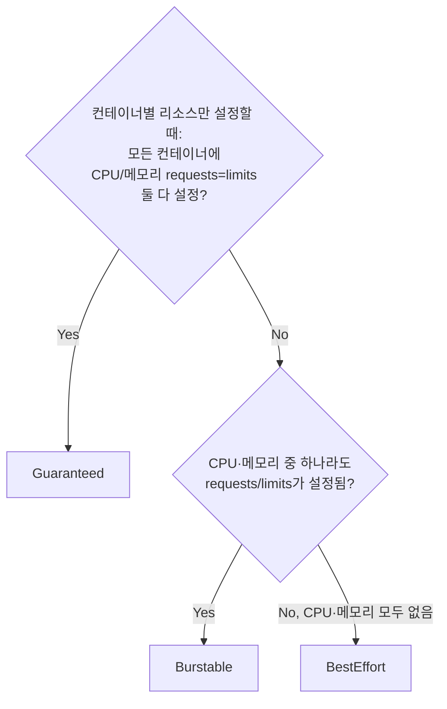

# 리소스 Requests와 Limits

## 핵심 정의
requests는 주로 스케줄링에서 계산하는 리소스 요구량이고 limits는 런타임 사용을 제어하는 한도다. requests가 물리 메모리의 사전 할당이나 장애 없는 실행을 보장하지는 않는다. 스케줄러(scheduler)는 requests 외에도 affinity·taint·volume topology 등 제약을 함께 검사하며, Linux의 CPU·메모리 `limits`는 커널의 자원 제어 기능(cgroups)을 통해 런타임에 강제된다.

CPU·메모리의 requests와 limits 조합이 Pod의 QoS(Quality of Service) 클래스를 결정하고, 노드 자원이 부족할 때 어떤 Pod가 먼저 축출(evict)되는지, 어떤 Pod가 CPU 스로틀링(throttling)이나 OOMKill 대상이 되는지를 좌우한다.

## 동작 원리 / 구조

### CPU와 메모리의 제어 방식 차이
CPU와 메모리는 커널 수준에서 압축 가능한(compressible) 자원이냐 아니냐가 달라 처리 방식이 다르다.

| 구분 | CPU | 메모리 |
|---|---|---|
| 압축 가능 여부 | 가능(느려질 뿐 죽지 않음) | 불가능 |
| limit 초과 시 | cgroup CFS bandwidth로 스로틀링(사용 가능 시간을 나눠 지연시킴) | 회수·할당 실패 또는 OOM kill; 즉시 종료 보장은 아님 |
| 측정 단위 | millicore(예: `500m` = 0.5 core) | 바이트(`Mi`, `Gi`) |

### QoS 클래스 결정 규칙

- **Guaranteed**: 메모리 사용량이 requests를 넘지 않도록 구성되지만 노드 압박에서 절대 보호되지는 않는다. 컨테이너별로 CPU/메모리 requests와 limits가 정확히 같아야 한다.
- **Burstable**: requests보다 더 쓸 수 있지만(limits까지), 축출 순서는 requests 초과 여부, Pod Priority, requests 대비 사용량에 달려 있다.
- **BestEffort**: CPU·메모리 requests/limits가 모두 없는 경우. 스케줄러가 여유 자원을 신뢰성 있게 계산할 수 없어 노드에 자원이 몰리기 쉽고, 메모리 부족 시 가장 먼저 축출 대상이 된다.

QoS 클래스는 Pod 생성 시점에 한 번 결정되면 **Pod 생명주기 동안 불변**이다.

### 네임스페이스 단위 가드레일
```yaml
apiVersion: v1
kind: LimitRange
metadata:
  name: default-limits
spec:
  limits:
    - default:
        cpu: "500m"
        memory: "512Mi"
      defaultRequest:
        cpu: "100m"
        memory: "128Mi"
      type: Container
---
apiVersion: v1
kind: ResourceQuota
metadata:
  name: team-quota
spec:
  hard:
    requests.cpu: "20"
    requests.memory: 40Gi
    limits.cpu: "40"
```
`LimitRange`는 requests/limits를 명시하지 않은 Pod에 기본값을 주입하고 상한/하한을 강제하며, `ResourceQuota`는 네임스페이스 전체가 소비할 수 있는 총량을 제한한다.

### In-place Pod Resize
과거에는 requests/limits를 바꾸려면 Pod를 삭제 후 재생성해야 했다. In-place Pod Resize 기능은 실행 중인 Pod의 CPU/메모리 값을 컨테이너 재시작 없이 변경할 수 있게 하며, Kubernetes 1.27에서 알파로 도입되어 1.33에서 베타로 기본 활성화됐고 1.35에서 정식(stable) 기능으로 승격됐다. `spec.containers[*].resources`가 desired 값을 나타내고 실제 적용된 값은 `status.containerStatuses[*].resources`에 별도로 노출된다. 단, 이 리사이즈로 인해 QoS 클래스 자체가 바뀌는 변경(예: Burstable → Guaranteed)은 API 서버가 거부하므로, 그 경우는 여전히 롤링 업데이트가 필요하다.

QoS 도식은 컨테이너 단위 CPU·메모리 설정을 기준으로 한다. v1.34+ Pod-level resources를 쓰면 Pod 수준 설정도 QoS 판정에 영향을 주므로 별도로 확인한다. v1.37 MemoryQoS 기능의 존재와 memory.high 기반 throttling 활성화는 다르며 기본 kubelet은 메모리 throttling/protection을 켜지 않는다. request는 해당 limit 이하이어야 한다. Linux CPU quota period의 kubelet 기본값은 100ms이며 CPU 관측 평균 구간과 다르다. in-place resize도 resizePolicy=RestartContainer면 재시작하며 부족한 노드 용량·지원 제한으로 보류될 수 있다. VPA는 독립적으로 설치되는 구성요소로 API/source의 기능을 설치 버전 CRD와 대조해야 한다.

## 실무 관점
- **requests 미설정의 연쇄 문제**: CPU·메모리 requests/limits가 모두 없으면 BestEffort가 되어 스케줄링 예측 가능성이 떨어질 뿐 아니라, 나중에 VPA(Vertical Pod Autoscaler)가 값을 채워 넣으려 할 때 QoS 클래스가 바뀌면서 Pod가 리사이즈가 아니라 삭제 후 재생성되는 부작용도 있다. 처음부터 대략적인 값이라도 명시하는 것이 원칙이다.
- **limits만 걸고 requests를 생략하는 실수**: 다른 admission 기본값이 없다면 해당 리소스의 requests를 limits와 동일하게 설정하므로 의도치 않게 Guaranteed에 준하는 예약을 하게 되거나, 반대로 컨테이너 간 값이 어긋나 예상과 다른 스케줄링 결과가 나올 수 있다.
- **CPU limits와 지연시간(latency) 문제**: CPU limits를 걸면 CFS bandwidth 스로틀링 때문에 순간적인 버스트 트래픽에서 실제 사용량이 limit 이하인데도 스케줄링 주기(기본 100ms) 단위로 인위적으로 지연이 발생하는 현상이 있다. 지연에 민감한 서비스는 CPU limits를 아예 걸지 않거나(requests만 설정), 넉넉한 값으로 설정하는 편을 택하기도 한다.
- **JVM과 메모리 limits의 상호작용**: JVM 힙 크기를 컨테이너 메모리 limits 대비 너무 크게 잡으면 OOMKilled가 발생한다. 최신 JDK는 cgroup 인지(container-aware) 기능으로 컨테이너 메모리 한도를 자동 인식해 힙 기본값을 산정하지만, 메타스페이스·스레드 스택·네이티브 메모리까지 고려해 native memory·direct buffer·GC·부하를 측정해 힙과 전체 메모리 한도 사이의 여유를 정한다. 보편적으로 안전한 고정 힙 비율은 없다.
- **HPA와 VPA의 충돌**: 같은 메트릭(CPU 사용률)을 HPA(수평)와 VPA(수직)가 동시에 기준으로 삼으면 VPA가 requests를 바꾸는 것 자체가 HPA의 목표 사용률 계산(사용량/requests)을 흔들어 오실레이션이 발생할 수 있다. HPA는 커스텀 메트릭(RPS 등)이나 `AverageValue` 타입을, VPA는 별도 리소스 최적화 목적으로 분리해 사용하는 것이 권장된다.
- **LimitRange/ResourceQuota 운영**: 멀티테넌트 클러스터에서 팀별 네임스페이스에 ResourceQuota를 걸지 않으면 한 팀의 리소스 과다 사용이 클러스터 전체 스케줄링 가능 용량을 잠식할 수 있다. 신규 네임스페이스 생성 템플릿에 기본 LimitRange/ResourceQuota를 포함시키는 것이 실무적으로 안전하다.

### JVM heap 밖의 메모리와 메모리 볼륨

`emptyDir.medium: Memory`는 메모리 기반 파일 시스템(tmpfs)을 사용하며, kubelet은 그 사용량을 로컬 ephemeral-storage가 아니라 컨테이너 메모리 사용량으로 추적한다. JVM heap이 여유로워도 직접 버퍼·스레드 스택·기타 네이티브 메모리와 이런 볼륨 사용량이 겹치면 컨테이너 메모리 한도에 도달할 수 있다. heap 그래프만으로 OOM 원인을 제외하지 않는다.

메모리 기반 `emptyDir` 파일은 Java GC가 지워주지 않는다. 파일의 `sizeLimit`, 생성량·삭제 시점, 컨테이너 memory limit을 함께 설계하고 실패한 업로드·압축 작업의 임시 파일도 정리한다. `sizeLimit`을 지정하지 않으면 볼륨이 Pod 메모리 한도까지 자랄 수 있고, 메모리 한도조차 없으면 노드 메모리를 고갈시킬 수 있다. 볼륨 상한과 heap 상한을 각각 최대 메모리 한도와 같게 설정해도 둘이 동시에 그만큼 쓸 수 있다는 보장은 없다.

### 메모리가 남아 있어도 디스크 사용량 때문에 축출될 수 있다

디스크 기반 emptyDir, 컨테이너의 쓰기 레이어, 로그는 로컬 임시 저장소(local ephemeral storage)를 소비한다. 이 사용량은 메모리 기반 emptyDir와 다르게 `ephemeral-storage`로 관리한다. CPU·메모리만 정상이어도 업로드 임시 파일이나 로그가 커져 Pod가 축출될 수 있으므로, 종료 이유·노드 저장소 압박·각 저장 위치의 사용량을 함께 확인한다.

Kubernetes v1.37에서 kubelet이 이 자원을 측정하는 구성이라면 컨테이너의 쓰기 레이어와 로그가 해당 limit을 넘거나, 전체 컨테이너와 emptyDir 합이 Pod의 합산 limit을 넘으면 축출 대상으로 표시한다. 이는 파일 쓰기마다 즉시 차단하는 디스크 할당 한도와 다르다. 지원하지 않는 파일 시스템 배치는 집계가 부정확할 수 있고, 디렉터리 주기 스캔 방식은 삭제했지만 열린 파일의 점유량을 놓칠 수 있다. “파일을 지웠는데 공간이 안 돌아옴”은 열린 파일 핸들과 실제 파일 시스템 사용량을 따로 확인한다.

## 심화 Q&A

### Q. requests < limits와 requests = limits 전략 중 어느 것이 적합한가?
A. 정답은 워크로드 중요도에 달려 있다. 결제, 인증처럼 장애 시 사람이 즉시 대응해야 하는 서비스는 Guaranteed 구성과 Pod Priority·복제·장애 분산을 함께 검토한다. 반대로 트래픽 변동이 크고 순간적인 버스트가 허용되는 웹 서버/워커는 requests를 평균 사용량 근처로, limits는 여유 있게 설정한 Burstable이 클러스터 전체 자원 활용도를 높인다. Guaranteed를 모든 워크로드에 일괄 적용하면 피크 기준으로 자원을 예약하는 셈이라 클러스터 비용이 크게 늘어난다.

### Q. 메모리 limits 초과가 OOMKill로 이어지는 이유와 예외는 무엇인가?
A. 메모리는 CPU처럼 시간 몫만 줄여 이미 사용 중인 데이터를 없앨 수 없다. 커널은 reclaim 등을 시도하고 할당을 충족할 수 없으면 cgroup 내 프로세스를 OOM kill할 수 있으므로 limit 도달 순간 항상 즉시 종료되는 것은 아니다. exit code 137은 SIGKILL 종료를 뜻하므로 그것만으로 OOM을 확정하지 않고 reason=OOMKilled·커널/cgroup 이벤트를 함께 확인한다.

### Q. CPU limits로 인한 스로틀링을 CPU 사용률 지표만 보고는 왜 눈치채기 어려운가?
A. CFS bandwidth 컨트롤러는 스케줄링 주기(기본 100ms) 단위로 할당된 쿼터를 다 쓰면 그 주기가 끝날 때까지 스레드를 완전히 멈춘다. 평균 CPU 사용률은 낮게 보여도(예: limit의 50%), 순간적으로 멀티스레드 요청이 몰리는 짧은 구간에서 쿼터를 소진해 수십~수백 ms 단위로 정지하는 마이크로 스톨(microstall)이 반복될 수 있다. 이는 평균 지표에는 드러나지 않고 `container_cpu_cfs_throttled_periods_total` 같은 스로틀링 전용 메트릭을 봐야 감지된다.

### Q. In-place Pod Resize에서 QoS와 실제 적용 여부를 어떻게 확인하는가?
A. v1.37 문서는 resize가 기존 QoS를 유지해야 한다고 명시한다. Burstable도 requests가 이미 스케줄링에 반영되므로 “여유분만 썼기 때문”으로 설명하면 틀린다. 원하는 spec 변경 후 status.containerStatuses의 resources와 resize 조건·observedGeneration을 확인한다. QoS 변경이 필요한 경우 새 Pod로 교체한다.

### Q. VPA가 Off 모드(추천만)로 오래 운영되다가 Recreate/InPlaceOrRecreate 모드로 전환할 때 흔히 겪는 실패 패턴은 무엇인가?
A. 대표적으로 requests/limits를 아예 설정하지 않아 BestEffort였던 Pod에 VPA가 처음으로 값을 채워 넣으면 QoS가 BestEffort에서 Burstable로 바뀌게 되는데, QoS는 불변이므로 in-place 리사이즈가 아니라 Pod 삭제 후 재생성으로 처리된다. 이 때문에 "리사이즈라 무중단일 것"이라 기대했던 워크로드가 실제로는 축출/재스케줄링을 겪어 순간적인 처리 실패가 발생한다. minAllowed는 추천값 하한이며 기존 Off 모드 Pod의 값을 즉시 채우지는 않는다. 새 Pod admission 또는 명시적 rollout으로 초기 요청량을 설정하고 재시작 가능성을 점검한다.

### Q. ResourceQuota를 네임스페이스에 걸었는데 Pod가 생성되지 않는다면 어떤 순서로 원인을 좁혀가야 하는가?
A. 먼저 ResourceQuota가 `requests.cpu`/`requests.memory`에 대한 하드 한도를 걸고 있는지 확인하고, 이 경우 해당 네임스페이스의 모든 Pod가 반드시 명시적인 requests를 가져야 생성이 허용된다는 규칙을 떠올려야 한다(LimitRange의 기본값이 없다면 requests 미지정 Pod 자체가 거부된다). 다음으로 현재 네임스페이스의 총 사용량을 `kubectl describe quota`로 확인해 한도 초과인지, 아니면 단순히 개별 Pod가 requests를 빠뜨려 admission이 거부된 것인지(에러 메시지의 `must specify` 문구로 구분)를 나눠서 본다.

## 관련 개념
- [[Kubernetes 프로브와 안전한 종료]]
- [[Kubernetes 핵심 오브젝트]]
- [[오토스케일링]]
- [[Kubernetes ConfigMap과 Secret]]

## 참고 자료

- [Kubernetes Resource Management](https://kubernetes.io/docs/concepts/configuration/manage-resources-containers/) — 조회한 v1.37 문서·requests/limits·defaulting·Pod-level resources. 확인: 2026-09-08.
- [Kubernetes Node pressure eviction](https://kubernetes.io/docs/concepts/scheduling-eviction/node-pressure-eviction/) — requests 초과·priority·사용량 순서. 확인: 2026-09-08.
- [Kubernetes In-place resize](https://kubernetes.io/docs/tasks/configure-pod-container/resize-container-resources/) — v1.35 stable·v1.37 제약·resizePolicy. 확인: 2026-09-08.
- [VPA API source](https://raw.githubusercontent.com/kubernetes/autoscaler/master/vertical-pod-autoscaler/docs/api.md) — 2026-09-08 master·updateMode enum과 의미; 설치 release 지원 별도 대조. 확인: 2026-09-08.
- [Kubernetes Pod QoS](https://kubernetes.io/docs/concepts/workloads/pods/pod-qos/) — v1.37·Pod-level 조건·MemoryQoS 선택 설정. 확인: 2026-09-08.

부분 재확인: 2026-09-23. [Kubernetes Resource Management](https://kubernetes.io/docs/concepts/configuration/manage-resources-containers/)의 메모리 기반 emptyDir 집계·sizeLimit 미지정·언어 GC와 파일 수명 차이를 확인했다. JVM 전체 메모리 예산은 이 자원 경계를 적용한 운영 판단이다. 기존 QoS·resize·VPA 버전 계약 전체는 재검증하지 않아 `verified`는 유지한다.

부분 재검증: 2026-10-04. [Kubernetes Local ephemeral storage](https://kubernetes.io/docs/concepts/storage/ephemeral-storage/)의 표시 v1.37 문서에서 집계 대상·컨테이너/Pod 한도·축출·지원 파일 시스템 배치·열린 삭제 파일의 스캔 제약을 확인했다. 같은 v1.37 공식 Resource Management·Pod QoS 문서에서 Linux cgroups 강제와 QoS 분류가 CPU·메모리 기준임도 대조해 정의의 적용 범위를 좁혔다. 메모리 기반 볼륨과 구분한 운영 진단 범위이며 실제 노드 디스크 고갈·축출·프로젝트 quota 실험은 수행하지 않았다. 기존 CPU·메모리·VPA 전체 계약은 재검증하지 않아 `verified`를 유지했다.
