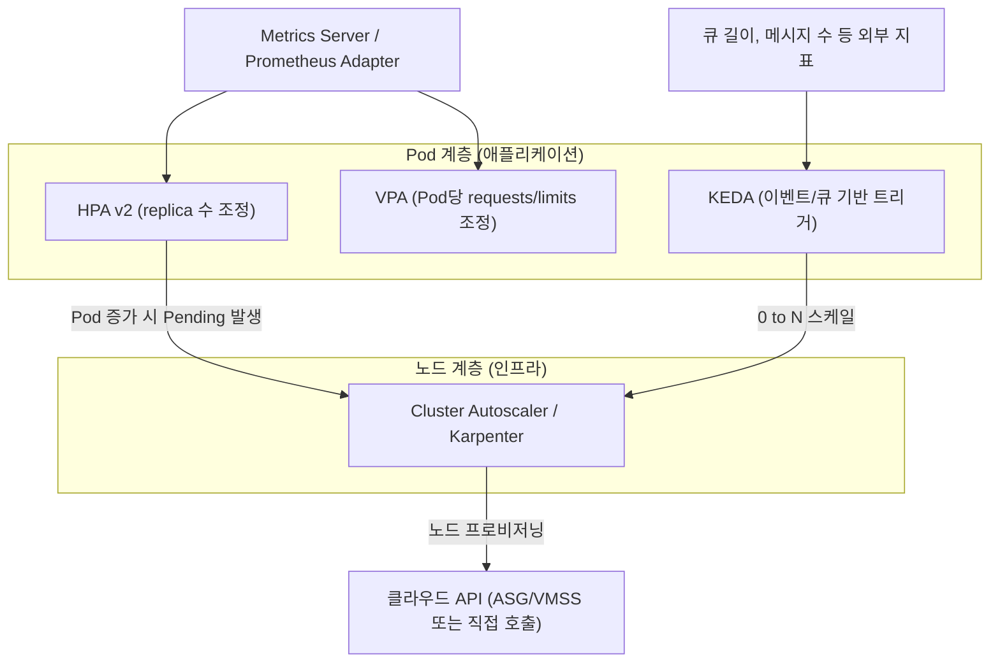

# 오토스케일링

## 핵심 정의
Kubernetes 오토스케일링(Autoscaling)은 워크로드의 부하나 자원 사용률에 맞춰 Pod 개수(수평), Pod당 리소스 할당량(수직), 클러스터 노드 수(인프라)를 자동으로 조정하는 메커니즘의 총칭이다. 크게 애플리케이션 계층의 HPA(Horizontal Pod Autoscaler)·VPA(Vertical Pod Autoscaler)·KEDA(Kubernetes Event-Driven Autoscaling)와, 인프라 계층의 Cluster Autoscaler·Karpenter로 나뉘며, 두 계층이 함께 맞물려야 실제로 스케일이 완성된다(Pod가 늘어도 노드가 없으면 `Pending` 상태로 남는다).

각 도구는 서로 다른 축을 조정하므로 단독으로는 비용/성능 최적화에 한계가 있고, 실무에서는 여러 도구를 계층별로 조합해 사용하는 것이 가능한 설계다. 실제 부하·운영 비용에 맞게 필요한 계층만 도입한다.

## 동작 원리 / 구조

### 계층 구조


### HPA (Horizontal Pod Autoscaler, `autoscaling/v2`)
- `metrics-server`가 노드/Pod의 CPU·메모리 사용량을 수집하고, HPA 컨트롤러가 15초(기본) 주기로 기본식 ceil(currentReplicas × currentMetric / targetMetric)으로 목표 수를 구하고 tolerance·준비 상태·누락 지표·안정화 정책을 반영한다.
- `autoscaling/v2`부터 CPU/메모리 외에 커스텀 메트릭(Custom Metrics), 외부 메트릭(External Metrics, 예: 클라우드 큐 길이)을 동시에 조합해 메트릭마다 계산한 목표 레플리카 수 중 가장 큰 수를 기준으로 스케일한다.
- 급격한 스케일 인/아웃을 막기 위해 `behavior.scaleUp/scaleDown`에 안정화 윈도우(stabilization window)와 정책(Percent/Pods 단위, `periodSeconds` 기간에 허용할 최대 변화량)을 설정할 수 있다.

```yaml
apiVersion: autoscaling/v2
kind: HorizontalPodAutoscaler
metadata:
  name: api-hpa
spec:
  scaleTargetRef:
    apiVersion: apps/v1
    kind: Deployment
    name: api
  minReplicas: 3
  maxReplicas: 30
  metrics:
    - type: Resource
      resource:
        name: cpu
        target:
          type: Utilization
          averageUtilization: 60
  behavior:
    scaleDown:
      stabilizationWindowSeconds: 300
      policies:
        - type: Percent
          value: 20
          periodSeconds: 60
```

### VPA (Vertical Pod Autoscaler)
- Recommender가 적정 requests를 추천하고 Updater와 Admission Controller가 모드에 따라 적용한다. limits 변경은 controlledValues 정책 등에 달린다.
- 전통적으로는 값 변경 시 Pod를 삭제 후 재생성해야 했지만, Kubernetes 1.35에서 In-Place Pod Resize가 안정화되면서 `updateMode: "InPlaceOrRecreate"`로 재시작 없이 리소스 값을 조정하는 경로가 열렸다. 다만 실제 적용 여부는 커널/cgroup, 컨테이너 런타임, 클라우드 벤더 지원 상태에 따라 달라지므로 도입 전 클러스터 버전과 CSP 지원 여부를 반드시 확인해야 한다.
- **HPA 사용률의 분모인 requests를 VPA가 바꾸는 결합에 주의한다.** 예를 들어 CPU 기준으로 HPA와 VPA를 동시에 운영하면 두 컨트롤러가 서로 다른 방향(레플리카 수 vs 리소스량)으로 반응하며 리소스 스래싱(thrashing)이 발생한다. 일반적으로 VPA는 메모리, HPA는 CPU/커스텀 메트릭을 담당하도록 역할을 분리한다.

### KEDA
- HPA의 확장(add-on) 형태로 동작하며, Kafka lag, SQS 큐 길이, cron 스케줄, Prometheus 쿼리 등 다양한 Scaler를 트리거로 사용한다.
- 가장 큰 차이점은 **0으로의 스케일 다운(scale-to-zero)**을 지원한다는 것이다. HPA의 일반 구성은 minReplicas가 1 이상이지만, Object/External 메트릭과 alpha HPAScaleToZero 기능을 켠 경우의 예외가 있다. 반면 KEDA는 이벤트가 없을 때 레플리카를 0까지 줄였다가 이벤트 발생 시 다시 올릴 수 있어 배치/이벤트성 워크로드 비용 절감에 유리하다.

### Cluster Autoscaler vs Karpenter
- **Cluster Autoscaler**는 클라우드의 Auto Scaling Group(AWS)/VM Scale Set(Azure) 같은 노드 그룹 단위로 동작한다. Pending Pod가 생기면 어떤 노드 그룹을 몇 개 늘릴지 판단해 그룹의 desired count를 변경하는 방식이라, 클라우드 API 호출과 인스턴스 부팅, 노드 등록까지 포함해 용량 확보·이미지·부트스트랩에 따라 시간이 달라진다.
- **Karpenter**는 노드 그룹이라는 중간 계층 없이 클라우드 API를 직접 호출해 Pending Pod의 스펙(CPU/메모리/GPU/아키텍처 요구사항)에 맞는 인스턴스 타입을 즉시 선택해 프로비저닝한다. 노드 그룹 사전 정의가 필요 없고, 저활용 노드를 적극적으로 통합(consolidation)해 빈 노드를 빠르게 반납하기 때문에 노드 가동 시간과 비용 측면에서 Cluster Autoscaler보다 효율적인 경우가 많다. 지원 provider와 운영 모델에 맞게 선택하며 Karpenter가 항상 더 빠르거나 저렴하다고 단정할 수 없다.

VPA는 Kubernetes와 별도 버전이며 InPlaceOrRecreate 지원 CRD·controller를 설치해야 한다. 조회한 VPA API는 Auto를 deprecated로 표기하며 Recreate/Initial/InPlaceOrRecreate 등 명시 모드를 권장한다. InPlaceOrRecreate는 실패 시 eviction으로 전환할 수 있고 InPlace 모드는 별도 VPA feature gate와 버전 지원이 필요하다. CPU Utilization에는 requests가 필요하다. 일부 메트릭 조회 실패 시 다른 정상 메트릭의 scale-up은 가능해도 scale-down은 생략될 수 있다. CA 로컬 스토리지 제외에는 safe-to-evict·플래그 예외가 있으며 PDB 누락은 차단이 아니라 과도한 동시 축소 위험이다.

## 실무 관점
- **레이어를 분리해서 설계**: "이벤트/큐 기반 워크로드는 KEDA, 상시 트래픽 기반 웹 서비스는 HPA(CPU/커스텀 메트릭), 리소스 요청값이 애초에 잘못 잡힌 워크로드는 VPA Off로 추천을 검토하거나 Initial로 생성 시에만 반영" 식으로 역할을 나누는 것이 하나의 구성 예다.
- **HPA만 켜두고 Cluster Autoscaler/Karpenter를 안 쓰는 실수**: 레플리카는 늘어나는데 노드가 부족해 Pod가 계속 `Pending`으로 남는 장애 패턴이 흔하다. 반대로 노드 오토스케일러만 있고 Pod 오토스케일러가 없으면 트래픽이 늘어도 기존 Pod 수만큼만 처리하다가 응답 지연이 발생한다.
- **HPA와 배포 매니페스트의 충돌**: HPA가 replica 수를 관리하는데 GitOps/apply가 `spec.replicas` 고정값을 반복 적용하면 서로 값을 되돌리며 플래핑이 생길 수 있다. 배포 도구의 필드 소유권과 replica 관리 정책을 정한다.
- **스케일 다운 안정화 부족**: `scaleDown.stabilizationWindowSeconds`를 짧게 두면 트래픽이 잠깐 줄었다가 다시 늘어나는 스파이크 패턴에서 스케일 인/아웃을 반복하는 플래핑(flapping)이 발생해 오히려 지연과 비용 낭비를 키운다.
- **VPA Auto 모드와 StatefulSet 조합 주의**: VPA가 Pod를 재생성하는 방식(Recreate)으로 동작하면 StatefulSet의 순서 보장(OrderedReady) 특성과 겹쳐 예상보다 느린 롤아웃이나 일시적 가용성 저하를 유발할 수 있다. In-Place Resize 지원 여부를 먼저 확인하는 것이 안전하다.
- **비용 최적화는 한 가지 도구로 끝나지 않는다**: 리소스 과다 할당(over-provisioning)으로 인한 낭비는 HPA만으로는 해결되지 않는다. VPA/리소스 추천 도구로 requests를 현실화하고, Karpenter/Cluster Autoscaler로 노드 단위 유휴 자원을 줄이는 식으로 계층별 최적화를 함께 가야 실질적인 비용 절감 효과가 난다.
- **PodDisruptionBudget과의 상호작용**: 노드 오토스케일러가 노드를 축소(scale-in)할 때 PDB 설정이 지나치게 타이트하면 노드 드레인이 지연되거나 실패해 스케일 다운 자체가 막힐 수 있다.

### 사이드카가 있는 Pod는 어떤 컨테이너를 기준으로 늘리는지 확인한다

Resource 메트릭의 Pod 사용률은 컨테이너들의 사용량과 requests를 합쳐 평가하므로, 애플리케이션만 포화되어도 여유 있는 사이드카 때문에 전체 사용률이 목표보다 낮을 수 있다. 반대로 사이드카 부하만으로 불필요한 확장이 일어날 수도 있다. 특정 애플리케이션 컨테이너의 사용률이 확장 기준이라면 `ContainerResource`를 검토한다. 이는 Kubernetes v1.30부터 stable이며, 사이드카 자체의 병목과 모니터링까지 해결하는 것은 아니다.

이 방식은 컨테이너 이름을 지정하므로 배포 중 이름 변경도 HPA 변경이다. 지정한 컨테이너가 없는 Pod는 계산에서 제외될 수 있다. 이름을 바꿀 때는 먼저 HPA가 구·신 이름을 모두 추적하도록 하고, 워크로드 롤아웃 완료 후 구 이름을 제거하는 순서를 사용한다. 새 이름의 requests와 실제 메트릭 수집 여부까지 확인해야 배포 도중 확장 신호가 사라지는 문제를 피할 수 있다.

## 심화 Q&A

### Q. HPA와 VPA를 같은 Deployment에 동시에 적용했을 때 왜 스래싱이 발생하는가, 그리고 어떻게 피하는가?
A. HPA는 "Pod당 평균 사용률"을 목표치로 맞추기 위해 레플리카 수를 조정하고, VPA는 반대로 레플리카당 리소스 할당량을 조정해 사용률 자체를 바꾼다. 같은 메트릭(예: CPU 사용률)을 두 컨트롤러가 동시에 다른 축으로 건드리면, VPA가 requests를 올려 사용률을 낮추는 순간 HPA는 "사용률이 낮아졌다"고 판단해 레플리카를 줄이고, 다시 사용률이 올라가는 식의 진동이 생긴다. 이를 피하려면 VPA와 HPA가 서로 다른 메트릭(예: VPA는 메모리, HPA는 CPU 또는 커스텀 비즈니스 메트릭)을 담당하도록 역할을 분리하거나, VPA를 `Off`/추천 전용 모드로 두고 사람이 검토 후 requests를 반영하는 방식을 쓴다.

### Q. 사용률 기반 HPA의 scale-to-zero 한계를 KEDA는 어떻게 보완하는가?
A. CPU/메모리 사용률 기반 HPA는 Deployment의 현재 레플리카 수를 기준으로 스케일 비율을 계산하는 구조라 레플리카가 0이 되면 참조할 사용률 지표 자체가 사라져 다시 스케일 업을 트리거할 신호를 만들 수 없다. KEDA는 HPA 이전 단계에 별도의 ScaledObject 컨트롤러를 두어, 외부 이벤트 소스(큐 길이 등)를 직접 폴링해 0에서 1로의 최초 스케일업을 트리거하고, 그 이후 구간은 내부적으로 HPA를 생성해 넘겨주는 하이브리드 구조로 이 문제를 해결한다.

### Q. Cluster Autoscaler가 노드를 스케일 인할 때 어떤 조건에서 특정 노드를 축소 대상에서 제외하는가?
A. 로컬 저장소(hostPath·메모리가 아닌 emptyDir), 축출 제한이 있는 시스템 Pod, PDB 위반 가능성, 노드의 `cluster-autoscaler.kubernetes.io/scale-down-disabled: "true"` 등이 원인이 된다. 다만 모두 무조건적인 제외 규칙은 아니다. `skip-nodes-with-local-storage` 같은 플래그와 Pod의 `safe-to-evict` 예외, 시스템 Pod 처리 시간 제한은 설치 버전에 따라 확인한다. 저장 데이터 손실을 검토하지 않고 예외를 켜서는 안 되며 CA 이벤트에서 실제 차단 사유를 확인한다.

### Q. Karpenter의 직접 프로비저닝 구조가 갖는 장점과 리스크는?
A. AWS에서 Cluster Autoscaler는 Auto Scaling Group의 크기를 조정하는 구성을 사용하므로 인스턴스 선택은 해당 그룹의 설정에 의존한다. CA 전체가 AWS ASG에만 묶인 것은 아니며 다른 cloud provider에서는 그에 맞는 노드 그룹 API를 사용한다. Karpenter는 이 중간 계층을 걷어내고 Pending Pod의 요구사항을 직접 클라우드 API(RunInstances 등)에 매핑해 인스턴스를 요청해 그룹 구성에 덜 묶인다. 실제 기동 지연은 클라우드 용량과 부트스트랩에 달린다. 다만 노드 그룹이라는 안전판이 없다는 것은, 클러스터 관리자가 IAM 권한·인스턴스 타입 제한·스팟 사용 정책 등을 Karpenter의 `NodePool`/`EC2NodeClass` 설정으로 직접, 세밀하게 관리해야 한다는 뜻이기도 하다. 설정을 잘못하면 예상치 못한 고가 인스턴스 타입이 선택되거나 스팟 회수(interruption)에 취약해질 수 있다.

### Q. In-Place Pod Resize가 안정화되기 전, VPA Auto 모드가 Pod를 재생성하는 방식은 배포 중인 서비스에 어떤 영향을 주었는가? 지금은 이 문제가 완전히 해결되었다고 볼 수 있는가?
A. 재생성 방식의 VPA는 리소스 값을 바꿀 때마다 대상 Pod를 삭제하고 새로 스케줄링했기 때문에, 순간적으로 레플리카 수가 줄어들거나(PDB로 완화 가능) 커넥션이 끊기는 부수 효과가 있었다. In-Place Resize가 도입되며 재시작 없이 requests/limits를 바꿀 수 있는 경로가 생겼지만, 실제로는 컨테이너 런타임과 클라우드 관리형 Kubernetes 서비스(EKS/GKE/AKS)의 지원 시점, 그리고 리소스를 줄이는 방향(다운사이즈)에 대한 제약이 남아 있을 수 있어, 완전히 무중단이라고 단정하기보다는 클러스터의 실제 버전과 벤더 문서를 확인하고 적용해야 한다.

### Q. 트래픽이 예측 가능한 배치성 피크(예: 매일 저녁 특정 시간)가 있는 서비스에 HPA만 적용하는 것이 최선인가?
A. 반응형(reactive) HPA는 메트릭이 임계치를 넘은 뒤에야 스케일 업을 시작하므로, Pod 기동 시간이 긴 애플리케이션(JVM 기반 Spring Boot 등 콜드스타트 지연이 있는 경우)에서는 트래픽 피크 초반에 지연이나 오류가 발생할 수 있다. 이런 경우 예측 가능한 피크 시간대에 맞춰 `minReplicas`를 스케줄에 따라 미리 올려두는 CronJob 기반 사전 스케일링이나, KEDA의 cron 트리거를 함께 사용해 반응형 스케일링의 지연을 보완하는 것이 일반적인 실무 패턴이다.

## 관련 개념
- [[Kubernetes 핵심 오브젝트]]
- [[관측 가능성 3요소]]
- [[리소스 Requests와 Limits]]

## 참고 자료

- [Kubernetes HPA](https://kubernetes.io/docs/concepts/workloads/autoscaling/horizontal-pod-autoscale/) — autoscaling/v2·15s·ceil·다중메트릭. 확인: 2026-09-08.
- [Kubernetes In-place resize](https://kubernetes.io/docs/tasks/configure-pod-container/resize-container-resources/) — v1.35 stable·v1.37 제약·resizePolicy. 확인: 2026-09-08.
- [VPA API source](https://raw.githubusercontent.com/kubernetes/autoscaler/master/vertical-pod-autoscaler/docs/api.md) — 2026-09-08 master·updateMode enum과 의미; 설치 release 지원 별도 대조. 확인: 2026-09-08.
- [Cluster Autoscaler FAQ](https://github.com/kubernetes/autoscaler/blob/master/cluster-autoscaler/FAQ.md) — 2026-09-08 master·축소 제외·로컬스토리지. 확인: 2026-09-08.
- [KEDA ScaledObject](https://keda.sh/docs/2.18/concepts/scaling-deployments/) — v2.18·0↔1 activation·HPA 위임. 확인: 2026-09-08.
- [Karpenter Disruption](https://karpenter.sh/docs/concepts/disruption/) — NodePool 예산·PDB·consolidation. 확인: 2026-09-08.

부분 재검증: 2026-09-22. [Kubernetes v1.37 HPA](https://kubernetes.io/docs/concepts/workloads/autoscaling/horizontal-pod-autoscale/)의 메트릭 계산·누락값·downscale·replicas 충돌, [Cluster Autoscaler FAQ](https://github.com/kubernetes/autoscaler/blob/master/cluster-autoscaler/FAQ.md)와 [AWS provider](https://github.com/kubernetes/autoscaler/blob/master/cluster-autoscaler/cloudprovider/aws/README.md)의 노드 그룹·축소 예외를 대조했다. CA 근거는 열람일 master 문서이므로 설치 release의 플래그와 별도 대조한다. 그 외 서술은 이번 확인 범위 밖이므로 `verified`는 유지했다.

부분 재확인: 2026-09-23. [Kubernetes HPA — Scaling policies](https://kubernetes.io/docs/concepts/workloads/autoscaling/horizontal-pod-autoscale/#scaling-policies)의 `periodSeconds`가 정책을 평가하는 과거 시간 범위라는 의미를 확인해 “초당 변화량” 표현을 교정했다. 기존 예제의 Percent 20·periodSeconds 60은 60초 범위의 변화량 제한이다. 그 외 버전별 기능과 외부 오토스케일러 전체는 재검증하지 않아 `verified`는 유지한다.

부분 재검증: 2026-10-04. [Kubernetes HPA — Container resource metrics](https://kubernetes.io/docs/concepts/workloads/autoscaling/horizontal-pod-autoscale/#container-resource-metrics)의 표시 v1.37 문서에서 Pod 합산 사용률·ContainerResource(v1.30 stable)·지정 컨테이너 누락·이름 변경 순서를 확인했다. 적용 범위는 autoscaling/v2의 자원 메트릭이다. 실제 HPA·metrics-server·사이드카 부하 및 이름 변경 롤아웃은 실행하지 않았고 `verified`는 유지했다.
