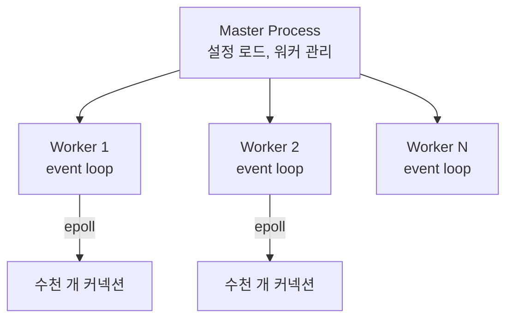

# Nginx 리버스 프록시 설정

## 핵심 정의
Nginx는 이벤트 기반(event-driven) 비동기 아키텍처로 동작하는 웹 서버 겸 리버스 프록시(reverse proxy)로, 적은 수의 워커 프로세스만으로도 대량의 동시 커넥션을 처리할 수 있다는 점이 Apache prefork/worker MPM과 비교할 때 차이가 있다. Apache event MPM 역시 유휴 연결을 비동기로 처리하므로 Apache 전체를 동일 모델로 묶지 않는다. [[리버스 프록시]] 개념 자체와 프록시-백엔드 헤더 전달, 타임아웃 정합성 같은 일반론은 해당 노트에서 다루므로, 이 노트는 Nginx 고유의 내부 동작(워커 모델, 업스트림 로드밸런싱 알고리즘, 캐싱/레이트리밋 설정)에 집중한다.

## 동작 원리 / 구조

### 워커 프로세스 모델
Nginx는 하나의 마스터 프로세스(master process)가 설정 읽기, 워커 프로세스 관리, 시그널 처리를 담당하고, 실제 요청 처리는 여러 워커 프로세스(worker process)가 나눠 맡는다. 각 워커는 단일 스레드에서 `epoll`(Linux)/`kqueue`(BSD) 같은 OS의 I/O 준비 상태 기반 멀티플렉싱을 이용해 수천~수만 개의 커넥션을 논블로킹(non-blocking) 방식으로 동시에 처리한다.



`worker_processes auto;`로 CPU 코어 수만큼 워커를 띄우는 것이 일반적이며, 워커당 최대 커넥션 수는 `worker_connections`로 제한한다. 이 모델 덕분에 커넥션이 늘어나도 컨텍스트 스위칭 비용이 프로세스/스레드 모델보다 훨씬 낮다.

### upstream과 로드밸런싱 알고리즘
```nginx
upstream backend_pool {
    least_conn;
    server 10.0.0.11:8080 weight=3 max_fails=3 fail_timeout=10s;
    server 10.0.0.12:8080 weight=1;
    server 10.0.0.13:8080 backup;
    keepalive 32;
}

server {
    listen 443 ssl;
    http2 on;
    server_name api.example.com;
    ssl_certificate /etc/nginx/tls/fullchain.pem;
    ssl_certificate_key /etc/nginx/tls/privkey.pem;

    location /v1/ {
        proxy_pass http://backend_pool;
        proxy_http_version 1.1;
        proxy_set_header Connection "";
        proxy_next_upstream error timeout http_502 http_503;
        proxy_next_upstream_tries 2;
        proxy_next_upstream_timeout 5s;
        proxy_connect_timeout 3s;
        proxy_read_timeout 30s;
    }
}
```
> nginx 1.25.1(NGINX Plus R30)부터 `listen ... http2;`처럼 `listen` 지시어에 `http2` 파라미터를 붙이는 문법은 deprecated되었고, 위 예시처럼 `listen 443 ssl;`과 `http2 on;`을 분리해서 쓰는 것이 현재 권장 문법이다.

| 알고리즘 | 지시어 | 특징 |
|---|---|---|
| 라운드로빈(기본) | (지시어 없음) | 순서대로 균등 분산, `weight`로 가중치 조정 가능 |
| least_conn | `least_conn;` | 활성 커넥션 수가 가장 적은 서버로 전달, 처리 시간 편차가 큰 워크로드에 유리 |
| ip_hash | `ip_hash;` | 클라이언트 IP 기반 해시로 같은 서버로 고정(세션 어피니티) |
| hash(키 지정) | `hash $request_uri consistent;` | 임의 키 기준 일관 해시(consistent hash), 캐싱 서버 앞단에서 캐시 적중률을 높일 때 사용 |

`proxy_next_upstream`은 지정한 실패와 재시도 가능한 요청·응답 상태 조건에서 다음 업스트림을 시도한다. 예제의 `proxy_next_upstream_timeout 5s`는 다음 서버로 넘길 수 있는 재시도 시간 범위를 제한하며 요청 전체를 5초에 강제 종료하는 deadline은 아니다. `proxy_read_timeout` 역시 연속된 읽기 사이의 제한이므로 전체 요청 예산은 호출자·앱과 함께 설계한다. 다만 오픈소스 Nginx는 능동적 헬스체크(active health check)를 지원하지 않고, `max_fails`/`fail_timeout` 기반의 수동적(passive) 장애 감지만 가능하다. 능동적 헬스체크는 NGINX Plus(상용) 또는 Kubernetes Ingress Controller 같은 상위 계층에서 보완해야 한다.

### 캐싱(proxy_cache)
```nginx
proxy_cache_path /var/cache/nginx levels=1:2 keys_zone=api_cache:10m max_size=1g inactive=60m;

location /v1/products/ {
    proxy_pass http://backend_pool;
    proxy_cache api_cache;
    proxy_cache_valid 200 5m;
    proxy_cache_key "$scheme$request_method$host$request_uri";
    proxy_cache_use_stale error timeout updating;
    add_header X-Cache-Status $upstream_cache_status;
}
```
`proxy_cache_use_stale`는 백엔드 장애/타임아웃 시 만료된(stale) 캐시라도 반환해 가용성을 우선시하는 설정이다. `X-Cache-Status` 헤더로 HIT/MISS/EXPIRED/UPDATING 여부를 응답에 노출해두면 캐시 동작을 운영 중에 바로 확인할 수 있다.

### 레이트 리밋(limit_req/limit_conn)
```nginx
limit_req_zone $binary_remote_addr zone=api_limit:10m rate=20r/s;
limit_conn_zone $binary_remote_addr zone=conn_limit:10m;

location /v1/ {
    proxy_pass http://backend_pool;
    limit_req zone=api_limit burst=40 nodelay;
    limit_conn conn_limit 10;
}
```
`limit_req`는 누출 버킷(leaky bucket) 알고리즘으로 초당 요청 수를 제한하고, `burst`는 순간적으로 허용할 초과 요청 큐 크기, `nodelay`는 burst 한도 내 요청을 지연 없이 즉시 처리하되 초과분은 거부하는 옵션이다. limit_conn은 전체 헤더를 읽고 요청을 처리 중인 연결을 센다. HTTP/2·HTTP/3에서는 동시에 처리 중인 요청을 각각 별도 connection으로 계산한다.

설정은 http/server 문맥에 배치할 부분 예제다. 동일한 /v1/ location을 중복 정의하지 말고 limit 설정을 기존 블록에 합친다. 실제 인증서 파일과 쓰기 가능한 cache 경로, HTTP/2 빌드 지원이 필요하며 적용 전 nginx -t로 검사한다. keepalive 32는 워커당 유휴 upstream 연결 캐시 크기이며 총 동시 연결 상한이 아니다. 재시도는 클라이언트에 응답을 보내기 전 등의 조건에서만 가능하고 전송한 POST 같은 non-idempotent 요청은 기본적으로 재시도하지 않는다. proxy_read_timeout은 전체 응답 시간이 아닌 연속 두 read 사이 시간이다. sendfile의 TLS zero-copy 효과는 kTLS·OS·빌드에 달려 있다.

### 요청 버퍼링과 응답 버퍼링을 구분한다

`proxy_buffering`은 upstream **응답**을, `proxy_request_buffering`은 클라이언트 **요청 본문**을 버퍼링한다. 후자는 NGINX 1.7.11부터 제공되며 기본 `on`에서는 본문을 모두 읽은 뒤 upstream에 보낸다. `off`는 업로드를 받는 즉시 전달할 수 있지만 본문 전송을 시작한 요청은 다른 upstream으로 넘길 수 없다. 요청 재전송이 가능한지를 `proxy_next_upstream` 설정만으로 판단하면 안 된다.

큰 업로드에서 요청 버퍼링을 끄면 프록시 저장 부담은 줄 수 있어도 느린 클라이언트와 중간 업로드 실패가 backend 자원 점유로 이어진다. 반대로 응답 버퍼링을 켜도 메모리·임시 파일의 한도가 있으므로 무한히 backend를 분리하지는 못한다. 업로드와 다운로드의 크기·속도·취소 상황을 나누어 측정한다. 클라이언트가 HTTP/1.1 chunked 본문을 보낼 때는 proxy 측 HTTP 버전 조건에 따라 `off`여도 버퍼링할 수 있어 wire 동작을 확인한다.

## 실무 관점
- **Spring Boot 앞단 구성**: Tomcat의 blocking request 처리와 Netty event loop는 구분해야 한다.  Nginx가 프론트에서 커넥션을 흡수하고 백엔드와는 Keep-Alive 커넥션 풀(`upstream { keepalive }`)을 재사용하도록 구성해야 매 요청마다 TCP 핸드셰이크가 발생하는 것을 막을 수 있다. 구버전 호환을 위해 HTTP/1.1과 Connection 헤더 제거를 명시한다. 1.29.7부터 proxy_http_version 기본이 1.1이고 upstream keepalive도 워커당 idle 32개가 기본 활성화된다.
- **worker_connections 상한과 파일 디스크립터**: `worker_connections`를 늘려도 OS의 `ulimit -n`(open file 제한)이 낮으면 실제 동시 커넥션 처리량이 그 이하로 제한된다. 고트래픽 환경에서는 OS 레벨 리밋도 함께 튜닝해야 한다.
- **정적 파일 서빙과 sendfile**: `sendfile on; tcp_nopush on;`으로 커널 레벨 zero-copy 전송을 활성화하면 정적 파일 서빙 시 애플리케이션 레벨 버퍼 복사를 줄여 CPU 사용량을 낮출 수 있다.
- **흔한 실수/장애 패턴**
  - `proxy_buffering off`를 이유 없이 켜서 느린 클라이언트(slow client)에 대한 응답 전송이 백엔드 워커 스레드를 계속 점유하게 만드는 경우(원래 버퍼링은 느린 클라이언트로부터 백엔드를 보호하는 역할도 한다).
  - `limit_req`의 `burst`만 크게 잡고 `nodelay`를 빠뜨려, 순간 트래픽이 몰리면 요청이 즉시 거부되지 않고 큐에 쌓여 지연이 누적되는 문제.
  - `server_tokens on`(기본값)을 그대로 둬 응답 헤더에 Nginx 버전을 노출해 취약점 스캐닝의 표적이 되는 경우. `server_tokens off;`로 끄는 것이 기본 보안 점검 포인트.
  - `location` 매칭 규칙을 "exact match > `^~` 접두 > 정규식 > 일반 접두" 같은 단순 카테고리 우선순위로 잘못 암기해, 실제로는 "가장 긴 접두사를 먼저 찾고 그 접두사가 `^~`인지 아닌지로 정규식 검사 여부를 결정한다"는 점을 놓쳐 의도하지 않은 location으로 요청이 라우팅되는 경우.
- **튜닝/설정 포인트**: `worker_processes`/`worker_connections`, `keepalive_timeout`, `client_max_body_size`, `gzip`/`brotli` 압축 레벨, `proxy_buffer_size`/`proxy_buffers`, 액세스 로그 버퍼링(`access_log ... buffer=32k flush=5s`)으로 디스크 I/O 부담 완화.

## 심화 Q&A

### Q. Nginx의 이벤트 기반 워커 모델이 Apache의 prefork/worker MPM보다 대량 동시 커넥션에 유리한 이유는 무엇인가?
A. Apache의 prefork MPM은 커넥션 하나당 프로세스를, worker MPM은 스레드를 사용하므로, 동시 커넥션 수가 늘어나면 프로세스 생성/컨텍스트 스위칭 오버헤드와 메모리 사용량이 선형적으로 증가한다. Apache event MPM은 이 문제를 완화한다. 특히 prefork/worker에서 유휴 상태로 오래 열려 있는 커넥션(Keep-Alive, 롱폴링)이 많으면 자원 낭비가 커진다. Nginx는 단일 워커가 `epoll` 기반 이벤트 루프로 수천 개 커넥션의 I/O 준비 상태를 논블로킹으로 감시하다가, 실제로 읽고 쓸 데이터가 준비된 커넥션만 처리하므로 커넥션 수 증가에 따른 오버헤드가 훨씬 완만하게 늘어난다. C10K(동시 커넥션 1만 개) 문제에 대한 대표적인 해법으로 꼽히는 이유다.

### Q. `proxy_pass`에 업스트림 URL을 슬래시(`/`)로 끝맺느냐 아니냐에 따라 요청 경로가 어떻게 달라지는가?
A. `location /api/ { proxy_pass http://backend/; }`처럼 `proxy_pass` 뒤에 경로가 있고 슬래시로 끝나면, `location`에 매칭된 `/api/` 접두사를 제거하고 나머지 경로만 백엔드로 전달한다(`/api/users` → `/users`). 반면 `proxy_pass http://backend;`처럼 경로 없이 슬래시도 없으면, 원본 요청 URI 전체가 그대로 전달된다(`/api/users` → `/api/users`). 이 차이를 모르고 설정하면 백엔드가 예상한 경로와 실제 전달된 경로가 달라 404가 발생하는데, 로그만 봐서는 원인을 바로 알기 어려운 흔한 함정이다.

### Q. `limit_req`의 `burst`와 `nodelay` 조합이 없을 때와 있을 때 클라이언트가 체감하는 지연은 어떻게 다른가?
A. `burst`만 있고 `nodelay`가 없으면, 설정된 `rate`를 초과한 요청은 즉시 거부되지 않고 burst 큐에 쌓인 뒤 rate에 맞춰 순차적으로 지연 처리된다(누출 버킷의 기본 동작). 이는 순간 트래픽 스파이크에서 요청이 실패하는 대신 느려지는 방향으로 흡수되지만, 사용자 입장에서는 응답이 늦어지는 지연으로 나타난다. `nodelay`를 추가하면 burst 한도 내의 요청은 지연 없이 즉시 처리하고, burst까지 초과한 요청만 기본적으로 503으로 거부하며 limit_req_status로 429 등 정책에 맞는 코드를 선택할 수 있다. 즉 "느리게 다 받아줄지" 대 "빠르게 처리하되 한도 초과분은 바로 끊을지"의 트레이드오프이며, 실시간성이 중요한 API는 보통 `nodelay`를 함께 켠다.

### Q. Nginx 오픈소스 버전만으로 업스트림 서버의 능동적 헬스체크를 구현할 수 없다면, 어떤 대안으로 이를 보완하는가?
A. 오픈소스 Nginx는 실패한 요청이 실제로 발생해야(passive) `max_fails`/`fail_timeout` 기준으로 해당 서버를 일시 제외하는 방식만 지원하므로, 트래픽이 없는 상태에서 백엔드가 죽어 있어도 다음 실제 요청이 들어오기 전까지는 감지하지 못한다. 실무에서는 (1) NGINX Plus의 `health_check` 지시어로 능동적 헬스체크를 쓰거나, (2) Kubernetes 환경이라면 Ingress Controller/서비스 레벨 헬스체크와 readiness probe에 장애 감지를 위임하고 Nginx는 순수 프록시 역할만 담당하거나, (3) 외부 오케스트레이션(Consul, 클라우드 로드밸런서)이 헬스체크 결과에 따라 upstream 설정 자체를 동적으로 갱신(reload)하는 방식으로 보완한다.

### Q. `proxy_buffering`을 끄면 어떤 상황에서 도움이 되고, 어떤 상황에서 오히려 위험한가?
A. `proxy_buffering off`는 백엔드 응답을 받는 대로 클라이언트로 전달하고 전체 응답을 미리 읽으려 하지 않으므로, Server-Sent Events나 스트리밍 응답처럼 저지연 전달이 중요한 엔드포인트에 유용하다. 반대로 일반적인 API 응답에서 버퍼링을 끄면, 느린 클라이언트의 전송 역압력이 upstream까지 전달되어 백엔드의 응답 완료와 커넥션 해제가 늦어질 수 있다. 이때 동기 서버의 워커 스레드 점유와 비동기 서버의 연결·전송 대기 상태 비용은 구분한다. 버퍼링을 켜면 Nginx가 가능한 빨리 응답을 읽어 클라이언트 전송보다 먼저 백엔드 응답을 완료시킬 수 있다. 다만 메모리·임시 파일 한도와 전송 진행에 따라 계속 upstream을 점유할 수 있어 즉시 반환을 보장하지 않는다. 느린 클라이언트로부터 백엔드를 보호하는 효과와 전달 지연을 함께 보고, 스트리밍이 필요한 location에서 선택적으로 끈다.

### Q. 동일한 요청 경로에 `location = /health`, `location ^~ /api/`, `location /api/v1/` 세 블록이 있다면 매칭 우선순위는 어떻게 결정되는가?
A. Nginx의 location 매칭은 선언 순서가 아니라 정해진 알고리즘을 따르지만, "exact > `^~` > 정규식 > 일반 접두"처럼 `^~`가 무조건 모든 일반 접두사보다 우선한다고 단순 암기하면 틀린다. 실제 순서는 (1) 정확 일치(`=`)가 있으면 즉시 확정, (2) 없으면 `^~` 여부와 무관하게 모든 접두사(prefix) location 중 **가장 긴 것**을 먼저 찾아 "기억"해두고, (3) 그 기억된 최장 접두사 location이 `^~`가 붙어 있다면 정규식 검사를 건너뛰고 즉시 그 location으로 확정하며, (4) `^~`가 없다면 정규식(`~`, `~*`)을 선언 순서대로 검사해 처음 매칭되는 것을 쓰고, (5) 매칭되는 정규식이 없으면 (2)에서 기억해둔 최장 접두사 location으로 돌아간다. 위 예시에서 `/health` 요청은 `= /health`로 즉시 확정된다. `/api/v1/x` 요청은 접두사 location인 `^~ /api/`(5자)와 `/api/v1/`(8자) 중 더 긴 `/api/v1/`이 먼저 "기억"되고, 이 location에는 `^~`가 없으므로 정규식을 마저 검사하지만 매칭되는 정규식이 없어 결국 기억해둔 `/api/v1/`이 최종 선택된다. 만약 반대로 `^~ /api/v1/`(길지만 `^~` 있음)과 `/api/`(짧고 일반 접두사)였다면 여전히 더 긴 `/api/v1/`이 기억되고 이번엔 `^~`가 붙어 있으므로 정규식 검사 없이 즉시 확정된다. 이렇게 "먼저 최장 접두사를 고르고, 그다음에야 `^~` 여부를 본다"는 순서를 거꾸로 이해하면(즉 `^~`라는 이유만으로 더 짧은 접두사가 항상 이긴다고 착각하면) 의도한 것과 다른 location이 매칭되는 사고로 이어진다.

## 관련 개념
- [[리버스 프록시]]
- [[L4와 L7 로드밸런싱]]
- [[컨테이너 네트워킹]]

## 참고 자료

- [NGINX Proxy module](https://nginx.org/en/docs/http/ngx_http_proxy_module.html) — proxy_pass·retry·timeout·1.29.7 HTTP/1.1 기본 변경. 확인: 2026-09-08.
- [NGINX Upstream module](https://nginx.org/en/docs/http/ngx_http_upstream_module.html) — keepalive idle cache·1.29.7 기본32. 확인: 2026-09-08.
- [NGINX Core module](https://nginx.org/en/docs/http/ngx_http_core_module.html) — location·server_tokens·sendfile. 확인: 2026-09-08.
- [NGINX HTTP/2 module](https://nginx.org/en/docs/http/ngx_http_v2_module.html) — http2 on은1.25.1+. 확인: 2026-09-08.
- [NGINX Limit connections](https://nginx.org/en/docs/http/ngx_http_limit_conn_module.html) — HTTP/2·3 request counting. 확인: 2026-09-08.
- [NGINX Limit requests](https://nginx.org/en/docs/http/ngx_http_limit_req_module.html) — burst·nodelay·기본503. 확인: 2026-09-08.
- [NGINX Health checks](https://nginx.org/en/docs/http/ngx_http_upstream_hc_module.html) — 상용 모듈. 확인: 2026-09-08.
- [Apache event MPM](https://httpd.apache.org/docs/2.4/mod/event.html) — 2.4·keepalive 비동기 처리. 확인: 2026-09-08.

부분 재검증: 2026-09-22. [NGINX Proxy module](https://nginx.org/en/docs/http/ngx_http_proxy_module.html)의 next-upstream 시간 범위·재시도 조건·read timeout 의미를 대조했다. `proxy_next_upstream_timeout`은 1.7.5 이상 지시어다. 그 외 서술은 이번 확인 범위 밖이므로 `verified`는 유지했다.

부분 재검증: 2026-10-04. [NGINX proxy_request_buffering](https://nginx.org/en/docs/http/ngx_http_proxy_module.html#proxy_request_buffering) — 1.7.11+ 지시어의 기본 `on`·전송 시작 후 다음 upstream 재시도 불가·chunked 본문의 proxy HTTP 버전 조건과 [proxy_buffering](https://nginx.org/en/docs/http/ngx_http_proxy_module.html#proxy_buffering)의 메모리·임시 파일 사용을 확인했다. 같은 문서의 proxy_busy_buffers_size·proxy_max_temp_file_size와 대조해 Q&A의 무조건 즉시 반환 표현도 좁혔다. 자원 점유 비교는 이 계약에서 도출한 운영 판단이다. 실제 nginx 설정 검사·느린 업로드/응답 시험과 기존 전체 주장은 재검증하지 않아 `verified`를 유지했다.
