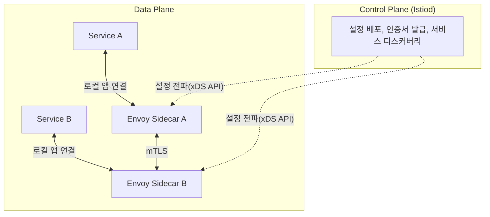

# 서비스 메시

## 핵심 정의
서비스 메시(Service Mesh)는 마이크로서비스 간 통신(서비스 디스커버리, 로드밸런싱, 재시도, mTLS 암호화, 트래픽 라우팅, 관측성)을 애플리케이션 코드에서 분리해 별도의 인프라 계층에서 처리하는 아키텍처다. 애플리케이션은 비즈니스 로직에만 집중하고, 서비스 간 통신 로직(재시도, 서킷 브레이커, 암호화, 지표 수집)은 프록시가 대신 담당하게 만드는 것이 핵심 목표다.

대표 구현체는 Istio(사이드카/waypoint는 Envoy, ambient L4는 ztunnel 사용), Linkerd, Consul Connect 등이 있으며, 조회한 Istio 문서는 기존 사이드카(sidecar) 모드에 더해 앰비언트 메시(ambient mesh)라는 사이드카 없는(sidecar-less) 아키텍처를 함께 제공한다. 지원 기능과 CRD는 설치 버전 문서에 맞춘다.

## 동작 원리 / 구조

### 데이터 플레인과 컨트롤 플레인

- **컨트롤 플레인(control plane)**: 트래픽 라우팅 규칙, mTLS 인증서, 서비스 디스커버리 정보를 데이터 플레인 프록시에 전파한다. Istio에서는 `istiod`가 이 역할을 하며, Envoy의 xDS API(Discovery Service)로 설정을 동적으로 밀어 넣는다.
- **데이터 플레인(data plane)**: 실제 트래픽이 지나가는 프록시. 기존 사이드카 모드에서는 각 Pod에 Envoy 컨테이너가 함께 주입(injection)되어 설정된 포트·주소의 트래픽을 가로챈다. Istio의 기본 트래픽 전환은 iptables를 사용하며 제외 규칙과 우회 경로가 있다.

### 사이드카 모드 vs 앰비언트 메시
| 구분 | 사이드카(Sidecar) 모드 | 앰비언트 메시(Ambient Mesh) |
|---|---|---|
| 프록시 배치 | Pod마다 Envoy 컨테이너 주입 | 노드당 1개 ztunnel(DaemonSet) + 필요한 네임스페이스/서비스에만 선택적 Waypoint 프록시 |
| Pod 스펙 변경 | 필요(초기화 컨테이너, 사이드카 주입) | 불필요(애플리케이션 Pod는 그대로) |
| L4 기능(mTLS, 기본 인가) | 모든 Pod가 L7 프록시까지 포함해 부담 | ambient에 편입된 워크로드의 L4 보안 처리 |
| L7 기능(경로 라우팅, 헤더 기반 정책) | 기본 제공 | Waypoint 프록시를 필요한 서비스에만 선택적으로 배포(옵트인) |
| 업그레이드 | 메시에 속한 모든 Pod 롤링 재시작 필요 | ztunnel·waypoint를 독립 갱신; 앱 Pod 재시작 불필요 |
| 리소스 사용 | 워크로드 수만큼 Envoy 인스턴스 존재 | 공유 ztunnel과 필요한 waypoint 비용; L4도 오버헤드 존재 |

앰비언트 메시는 대부분의 워크로드가 mTLS/기본 인가 정도만 필요하고 일부만 정교한 L7 라우팅이 필요한 환경에서 자원 효율이 크며, 사이드카 모드는 모든 서비스에 L7 기능(헤더 기반 라우팅, 장애 주입, 요청 단위 지표)이 필요할 때 여전히 더 성숙하고 기능이 완전하다.

### 트래픽 관리 예시(Istio VirtualService)
```yaml
apiVersion: networking.istio.io/v1
kind: VirtualService
metadata:
  name: reviews-route
spec:
  hosts:
    - reviews
  http:
    - match:
        - headers:
            x-canary:
              exact: "true"
      route:
        - destination:
            host: reviews
            subset: v2
    - route:
        - destination:
            host: reviews
            subset: v1
          weight: 90
        - destination:
            host: reviews
            subset: v2
          weight: 10
```
헤더 값에 따라 특정 버전으로 라우팅하거나, 가중치 기반으로 트래픽을 분할해 카나리 배포를 구현할 수 있다. 이런 라우팅 로직은 애플리케이션 코드를 전혀 건드리지 않고 메시 설정만으로 적용된다.

VirtualService 예제는 사이드카 경로를 기준으로 한다. 별도 DestinationRule에서 host=reviews의 subsets v1/v2를 실제 Pod label version=v1/v2에 매핑하고 Service selector·포트 구성을 갖춰야 한다. ambient L7은 waypoint와 Gateway API HTTPRoute 등 해당 버전의 지원 모델을 확인한다. 로컬 앱↔프록시 구간은 기본 mTLS 보호 구간과 다르며 end-to-end TLS가 필요하면 별도 구성한다. control plane이 중단되어도 기존 프록시는 받은 설정으로 계속 처리할 수 있지만 새 endpoint 반영·인증서 갱신이 지연된다.

## 실무 관점
- **API 게이트웨이와의 역할 차이**: API 게이트웨이는 외부(North-South) 트래픽의 진입점에서 인증, 라우팅, 레이트리밋을 담당하는 반면, 서비스 메시는 클러스터 내부(East-West) 서비스 간 통신을 대상으로 한다. 두 계층은 배타적이지 않고, 실무에서는 게이트웨이로 외부 트래픽을 받아들인 뒤 메시 내부에서 서비스 간 통신을 관리하는 계층형 구조가 흔하다.
- **Spring Cloud와의 관계**: Spring Cloud(Eureka, Spring Cloud LoadBalancer, Resilience4j)는 서비스 디스커버리/로드밸런싱/서킷 브레이커를 애플리케이션 라이브러리 레벨에서 구현하는 방식이다. 서비스 메시는 같은 문제를 인프라 계층(프록시)에서 해결하므로, 언어/프레임워크에 무관하게 일관된 정책을 적용할 수 있다는 장점이 있지만, 애플리케이션이 세밀하게 통신 로직을 제어해야 하는 경우(비즈니스 로직과 강하게 결합된 재시도 정책 등)에는 라이브러리 방식이 더 유연할 수 있다. 두 방식을 혼용하면 재시도/타임아웃 정책이 이중으로 적용되어 예상치 못한 총 지연이 발생할 수 있으므로 어느 계층이 해당 정책을 소유하는지 명확히 정해야 한다.
- **도입 비용과 트레이드오프**: 서비스 메시는 mTLS 자동화, 세밀한 트래픽 제어, 통합 관측성이라는 강력한 이점을 주지만, 사이드카 모드에서는 모든 요청이 최소 2번의 추가 홉(발신 측 프록시, 수신 측 프록시)을 거치므로 지연이 늘고, 컨트롤 플레인 자체가 새로운 장애점이자 운영 복잡도가 된다. 서비스 수가 적거나(수 개~십여 개) 팀이 아직 MSA 운영 경험이 부족한 초기 단계에서는 도입 비용 대비 이득이 크지 않을 수 있다.
- **흔한 실수/장애 사례 패턴**
  - 컨트롤 플레인 업그레이드 중 xDS 설정 전파가 지연되어 일부 프록시만 새 라우팅 규칙을 받아 트래픽이 일관되지 않게 분산되는 문제.
  - mTLS를 STRICT 모드로 전환하는 과정에서 메시에 아직 편입되지 않은 레거시 서비스와의 통신이 갑자기 끊기는 장애(PERMISSIVE 모드로 점진 전환 필요).
  - 사이드카 리소스 requests/limits를 기본값으로 방치해 워크로드 수가 늘어날수록 클러스터 전체 리소스 사용량이 눈에 띄게 증가하는 문제.
- **관련 설정/튜닝 포인트**: mTLS 모드(PERMISSIVE/STRICT) 전환 계획, 연결/요청 상한(connectionPool)과 실패 endpoint 축출(outlierDetection), 재시도/타임아웃 정책의 소유 계층 결정, 사이드카 리소스 requests/limits, 앰비언트 메시 도입 시 Waypoint 배포 범위 선정.

### 재시도 횟수와 503의 발생 지점을 함께 읽는다

Istio VirtualService의 `HTTPRetry.attempts`는 최초 요청을 제외한 재시도 횟수다. 전체 최대 시도는 최초 1회와 attempts의 합이지만, 상위 요청 시간 제한을 먼저 소진하면 설정한 횟수를 모두 실행하지 못한다. `perTryTimeout`은 재시도뿐 아니라 최초 시도에도 적용되므로, 개별 시도의 예산과 전체 요청 예산을 따로 검토한다. 횟수만 늘려도 성공 가능 시간이 늘어나는 것은 아니다.

응답 코드 503도 발생 원인을 구분한다. Istio의 `retryOn: "503"`은 업스트림이 실제로 반환한 503에 대한 조건이며, 연결 reset을 프록시가 503으로 표현한 경우에는 `reset` 같은 실패 조건이 필요할 수 있다. 최종 상태 코드만 보고 정책이 무시됐다고 판단하지 말고 프록시의 응답 플래그·실패 이유와 백엔드 수신 여부를 대조한다. 조건을 넓히기 전에는 요청의 멱등성과 중복 실행 가능성을 함께 확인한다.

## 심화 Q&A

### Q. 서비스 메시의 mTLS 자동화는 애플리케이션이 직접 TLS를 구현하는 것과 비교해 어떤 근본적인 이점이 있는가?
A. 애플리케이션이 각자 TLS 설정, 인증서 로테이션, 키 관리를 구현하면 언어/프레임워크마다 구현이 갈리고, 인증서 만료로 인한 장애가 서비스별로 산발적으로 발생하기 쉽다. 서비스 메시는 컨트롤 플레인(Istio의 경우 내장 CA 또는 외부 CA 연동)이 짧은 수명의 인증서를 자동으로 발급·로테이션하고 사이드카/ztunnel이 이를 투명하게 적용하므로, 애플리케이션 코드는 TLS의 존재 자체를 몰라도 되고 인증서 관리 정책을 클러스터 전체에 일관되게 강제할 수 있다. 다만 이는 컨트롤 플레인을 신뢰 루트로 만드는 것이므로, 컨트롤 플레인 자체의 가용성과 보안이 메시 전체 통신의 전제 조건이 된다는 트레이드오프가 생긴다.

### Q. 사이드카와 앰비언트 메시의 성능을 어떻게 비교해야 하는가?
A. ambient의 L4 전용 ztunnel은 L7 파싱을 생략하고 프록시를 공유하므로 자원 사용을 줄일 여지가 있다. 그러나 실제로는 로컬 트래픽 전환과 mTLS 처리 비용이 있고 waypoint를 추가하면 경로도 달라진다. Istio ambient를 기본 eBPF 구현으로 설명하면 틀리다. 동일한 보안·라우팅 기능, CPU 제한, payload·연결 재사용·부하에서 p50/p95/p99와 CPU·메모리를 측정해 비교한다. p50/p90은 평균값이 아니며 특정 모드가 항상 더 낮은 p99를 보장하지 않는다.

### Q. 서비스 메시와 API 게이트웨이 기능이 겹치는 부분(라우팅, 인증)이 있는데, 왜 둘 다 필요한 경우가 많은가?
A. API 게이트웨이는 클러스터 경계에서 외부 클라이언트를 상대하며 API 키 검증, 클라이언트별 레이트리밋, 응답 스키마 변환처럼 "외부와의 계약"에 관련된 정책을 담당한다. 서비스 메시는 이미 인증된 내부 서비스 간의 통신을 대상으로 mTLS, 세밀한 재시도/서킷 브레이커, 서비스 단위 관측성을 담당한다. 이 두 경계의 관심사가 다르기 때문에, 규모가 있는 MSA에서는 게이트웨이가 North-South 트래픽을, 메시가 East-West 트래픽을 나눠 맡는 계층형 구조가 일반적이다.

### Q. 서비스 메시의 재시도(retry) 정책을 잘못 설정하면 어떤 연쇄 장애로 이어질 수 있는가?
A. 메시 레벨에서 모든 요청에 대해 재시도 횟수를 높게 설정하면, 백엔드 서비스가 이미 과부하 상태일 때 실패한 요청이 반복적으로 재시도되면서 오히려 부하를 증폭시키는 재시도 폭풍(retry storm)이 발생할 수 있다. 여러 계층(애플리케이션 라이브러리, 메시 사이드카, 클라이언트)에서 각자 재시도를 설정해두면 총 재시도 횟수가 곱으로 늘어나는 것도 흔한 실수다. 이를 막으려면 재시도 정책을 소유하는 계층을 하나로 명확히 정하고, 지수 백오프(exponential backoff)와 서킷 브레이커([[서킷 브레이커와 장애 격리]])를 함께 적용해 실패가 지속되는 대상에는 재시도 자체를 중단시켜야 한다.

### Q. 서비스 메시 도입이 조직/운영 관점에서 지불해야 하는 비용은 성능 오버헤드 외에 무엇이 있는가?
A. 컨트롤 플레인 운영(업그레이드, 인증서 관리, xDS 설정 배포 지연 모니터링)이라는 새로운 운영 부담이 생기고, 트래픽 문제 디버깅 시 "애플리케이션 문제인지, 사이드카/ztunnel 설정 문제인지"를 구분해야 하는 진단 복잡도가 늘어난다. 또한 트래픽 정책(라우팅, 재시도, mTLS)이 애플리케이션 코드가 아니라 별도의 YAML 리소스(VirtualService, DestinationRule 등)로 관리되므로, 이 설정들을 애플리케이션 배포와 별도로 버전 관리하고 검증하는 프로세스(정책 변경에 대한 카나리 검증 등)를 조직적으로 갖춰야 실제 이득을 볼 수 있다.

### Q. 사이드카 모드와 앰비언트 모드를 같은 클러스터에서 혼용할 수 있다고 하는데, 어떤 상황에서 이런 혼합 구성을 선택하는가?
A. 이미 사이드카 기반으로 운영 중인 대규모 클러스터를 한 번에 앰비언트로 전환하는 것은 위험 부담이 크므로, 네임스페이스 단위로 점진적으로 앰비언트 라벨을 붙여가며 마이그레이션하는 전략이 실무적이다. 또한 특정 서비스군(레거시 시스템, 아직 검증되지 않은 L7 기능 의존 서비스)은 사이드카 모드로 남겨두고, 신규 서비스나 L4 수준의 mTLS만 필요한 워크로드는 앰비언트로 옮겨 자원 효율을 얻는 식의 영구적인 혼합 구성도 가능하다. 다만 두 모드가 공존하면 트래픽 흐름을 추적할 때 어떤 워크로드가 어느 모드에 속하는지 파악하는 운영 부담이 추가로 생긴다.

## 관련 개념
- [[Spring Cloud Config와 서비스 디스커버리]]
- [[서킷 브레이커와 장애 격리]]
- [[L4와 L7 로드밸런싱]]
- [[Kubernetes 핵심 오브젝트]]

## 참고 자료

- [Istio Ambient traffic redirection](https://istio.io/latest/docs/ambient/architecture/traffic-redirection/) — 조회한 latest·in-pod iptables·ztunnel. 확인: 2026-09-08.
- [Istio Waypoint](https://istio.io/latest/docs/ambient/usage/waypoint/) — 선택적L7·Gateway API. 확인: 2026-09-08.
- [Istio DestinationRule](https://istio.io/latest/docs/reference/config/networking/destination-rule/) — networking.istio.io/v1 subsets·connectionPool·outlierDetection. 확인: 2026-09-08.
- [Istio Security](https://istio.io/latest/docs/concepts/security/) — workload identity·mTLS·인증서. 확인: 2026-09-08.

부분 재검증: 2026-10-04. [Istio VirtualService HTTPRetry](https://istio.io/latest/docs/reference/config/networking/virtual-service/)와 [Istio API 1.28.0 고정 소스](https://raw.githubusercontent.com/istio/api/1.28.0/networking/v1alpha3/virtual_service.proto)의 attempts·perTryTimeout·503/reset 조건을 대조했다. 적용 범위는 VirtualService HTTPRetry이며 모든 Envoy/Istio 버전의 기본 재시도 정책을 새로 확정한 것은 아니다. 실제 메시·upstream reset·중복 처리 재현은 하지 않았고 `verified`는 유지했다.
