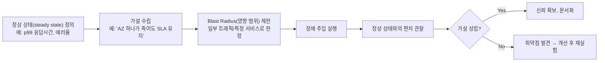

# 카오스 엔지니어링과 부하 테스트

## 핵심 정의
카오스 엔지니어링(Chaos Engineering)은 운영 중인 시스템에 의도적으로 장애(인스턴스 종료, 네트워크 지연/단절, 리소스 고갈 등)를 주입해, 시스템이 실제로 예상한 대로 장애를 견뎌내는지 실험적으로 검증하는 방법론이다. Netflix가 Chaos Monkey로 대중화시켰으며, 핵심은 "장애가 없는 상태를 유지"하는 것이 아니라 "장애가 났을 때 시스템이 어떻게 반응하는지 사전에 통제된 환경에서 확인"하는 데 있다.

부하 테스트(Load Testing)는 시스템이 예상 트래픽 또는 그 이상의 부하에서 성능 목표(응답 시간, 처리량, 에러율)를 만족하는지 측정하는 테스트로, 카오스 엔지니어링과는 별개의 활동이지만 실무에서는 "부하가 걸린 상태에서 장애까지 주입했을 때"처럼 두 가지를 결합해 실제 장애 상황에 가까운 시나리오를 검증하는 경우가 많다.

## 동작 원리 / 구조

### 카오스 엔지니어링의 실험 절차

정상 상태(steady state)를 먼저 정량적으로 정의하지 않으면 실험 결과를 판단할 기준이 없다는 점이 카오스 엔지니어링에서 가장 중요한 전제다. 또한 Blast Radius(영향 범위)를 최소한으로 제한한 뒤 점진적으로 넓혀가는 것이 실무 원칙이며, 통제 불가능한 전면 장애로 번지지 않도록 실험 중단 조건과 별도 복구 절차을 실험 전에 정의해둔다.

### 대표 도구
| 도구 | 유형 | 특징 |
|---|---|---|
| Chaos Mesh | Kubernetes 네이티브(CNCF) | CRD 기반으로 Pod 실패, 네트워크 지연/단절, I/O 지연, 타임 스큐 등을 정의, 대시보드 제공, 오픈소스 |
| LitmusChaos | Kubernetes 네이티브(CNCF) | ChaosHub라는 사전 정의 실험 저장소 제공, ChaosCenter 웹 UI |
| AWS Fault Injection Service (FIS) | 관리형 클라우드 서비스 | EC2 종료, RDS 페일오버, ECS 태스크 중단, API 스로틀링 등을 AWS 제어 영역에서 직접 주입, CloudWatch 알람과 연동해 조건 위반 시 자동 중단 |
| Gremlin | 상용 SaaS | VM/컨테이너 환경 모두 지원, 팀 단위 게임데이(GameDay) 운영에 특화 |
| Chaos Monkey | OSS(Netflix 원조) | 인스턴스 무작위 종료에 특화된 초기 도구 |

### 부하 테스트의 유형
| 유형 | 목적 |
|---|---|
| 부하 테스트(Load Test) | 예상 평균/피크 트래픽에서 목표 응답시간·처리량 충족 여부 확인 |
| 스트레스 테스트(Stress Test) | 시스템이 무너지는 한계점(breaking point)을 찾고 실패 양상을 관찰 |
| 스파이크 테스트(Spike Test) | 순간적인 트래픽 급증에 대한 오토스케일링/큐잉 대응력 검증 |
| 지속 테스트(Soak/Endurance Test) | 장시간 부하를 유지해 메모리 누수, 커넥션 누수 등 서서히 드러나는 문제 탐지 |

대표 도구로는 k6(스크립트 기반, CI 파이프라인 연동에 강함), Gatling(Java·Kotlin·Scala·JavaScript/TypeScript DSL, 리포트), JMeter(GUI 기반, 오래된 생태계), Locust(Python 기반) 등이 있다. 도구 선택은 부하 모델, 프로토콜 지원, 스크립트 언어와 배포 환경에 맞춘다.

```javascript
// k6 부하 테스트 스크립트 예시
import http from 'k6/http';
import { check, sleep } from 'k6';

export const options = {
  stages: [
    { duration: '2m', target: 100 },   // 100 VU까지 램프업
    { duration: '5m', target: 100 },   // 부하 유지
    { duration: '2m', target: 0 },     // 램프다운
  ],
  thresholds: {
    http_req_duration: ['p(99)<500'],  // p99 500ms 미만
    checks: ['rate>0.99'],            // 상태 검증도 CI 실패 기준에 포함
    http_req_failed: ['rate<0.01'],    // 에러율 1% 미만
  },
};

export default function () {
  const res = http.get('https://api.example.com/v1/orders');
  check(res, { 'status is 200': (r) => r.status === 200 });
  sleep(1);
}
```

FIS stop은 실행 중인 action을 중단하는 기능이며 이미 종료한 EC2나 수행한 데이터 변경을 원상복구하지 않는다. action별 취소·복구 동작과 stop condition 지표의 지연을 따로 확인한다. k6 check 실패만으로 프로세스 종료 코드가 실패하지 않으므로 checks threshold를 둔다. 예제 stages는 VU 수를 조정하는 closed model이며 100 VU가 100 RPS라는 뜻이 아니다. 응답이 느려지면 요청률도 줄어 coordinated omission이 생길 수 있으므로 일정 도착률을 검증할 때 arrival-rate executor와 dropped_iterations·부하 생성기 병목을 함께 측정한다. 순간 부하가 실제 목표라면 ramp-up 없이 주는 spike 자체가 유효한 시나리오다.

## 실무 관점
- **부하 테스트 없이 카오스 실험을 하면 놓치는 것**: 트래픽이 낮은 상태에서 인스턴스를 하나 죽여보는 실험은 통과해도, 피크 트래픽에서는 여유 용량이 줄어 다른 실패 양상이 나타날 수 있다. 부하가 걸린 상태에서 노드 하나를 제거했을 때 나머지 노드가 급증한 부하를 감당하지 못해 연쇄적으로 무너지는 패턴(카스케이딩 실패, cascading failure)은 평시 카오스 실험만으로는 드러나지 않는다.
- **Blast Radius 관리 실패 사례**: 실험 대상 범위를 제대로 좁히지 않고 프로덕션 전체 트래픽에 네트워크 장애를 주입했다가 실제 서비스 장애로 번지는 사고가 흔하다. 카나리 환경이나 트래픽의 일부(퍼센티지 기반)에만 먼저 적용하고, 자동 중단 조건(에러율 임계치 초과 시 즉시 실험 중단)을 CloudWatch 알람이나 모니터링 도구와 연동해두는 것이 필수다.
- **오토스케일링/서킷 브레이커 검증의 실질적 가치**: [[오토스케일링]] 설정이나 [[서킷 브레이커와 장애 격리]] 로직은 코드 리뷰만으로는 실제 동작을 검증하기 어렵다. 카오스 실험으로 실제 노드 장애나 지연을 주입해 HPA/Cluster Autoscaler가 설정한 시간 내에 반응하는지, 서킷 브레이커의 open/half-open 전환 임계치가 실제 장애 패턴에 적절한지 실측하면 단위/통합 테스트만으로 확인하기 어려운 실제 상호작용을 검증할 수 있다.
- **부하 테스트의 흔한 실수**: 테스트 환경이 프로덕션과 리소스 스펙(CPU/메모리, 커넥션 풀 크기, 캐시 워밍 상태)이 달라 결과를 그대로 프로덕션에 대입하면 오판하는 경우, DB나 외부 연동 시스템을 모킹하지 않고 실제로 때려 의도치 않게 타 시스템에 부하를 주는 경우, 램프업(ramp-up) 구간 없이 목표 부하를 순간적으로 걸어 오토스케일링이 반응할 시간을 주지 않고 실패로 오판하는 경우.
- **관련 설정/튜닝 포인트**: SLO/에러 버짓과 연계한 실험 빈도 결정, 게임데이(GameDay) 정례화, CI 파이프라인에 부하 테스트 임계치(threshold)를 넣어 회귀 배포 전 자동 검증, 카오스 실험 결과를 런북(runbook)/장애 대응 문서에 반영.

### 도착률 목표를 채웠는지와 응답 지연을 함께 판단한다

k6 arrival-rate의 rate는 HTTP 요청 수가 아니라 반복(iteration)의 시작 수다. 한 iteration에서 여러 API를 호출하거나 재시도하면 실제 요청 수와 달라진다. 목표가 주문 여정 처리량인지 특정 API의 RPS인지 먼저 정하고, 시작한 iteration 수·실제 HTTP 요청 수·완료한 업무 수를 따로 기록한다.

사용 가능한 가상 사용자(Virtual User, VU)가 없어서 시작하지 못한 iteration은 `dropped_iterations`에 집계된다. 보내지 못한 작업은 정상 응답의 지연 표본에 들어가지 않으므로, p99가 기준 안에 있어도 목표 부하를 달성했다는 뜻은 아니다. 초반부터 drop이 발생하면 사전 VU 할당량을 확인하고, 부하가 유지되는 동안 증가하면 응답 지연 증가와 생성기 CPU·메모리 병목을 함께 확인한다. 요구 도착률을 검증할 때는 dropped_iterations 허용량도 threshold로 정한다. `maxVUs`만 계속 늘리면 부하 생성기 자체가 자원을 소모해 측정을 왜곡할 수 있다.

## 심화 Q&A

### Q. 카오스 엔지니어링에서 "정상 상태(steady state)"를 먼저 정의해야 하는 이유는 무엇이고, 이를 생략하면 어떤 문제가 생기는가?
A. 정상 상태를 정량 지표(예: p99 응답시간 300ms 이하, 에러율 0.1% 이하)로 미리 정의해두지 않으면, 장애를 주입한 뒤 관찰되는 변화가 "허용 가능한 수준의 저하"인지 "실제 장애"인지 판단할 기준이 없어진다. 그 결과 실험 결과 해석이 담당자의 주관에 의존하게 되고, 같은 실험을 반복해도 매번 다른 결론이 나올 수 있다. 정상 상태 정의는 [[관측 가능성 3요소]]에서 다루는 지표 체계를 기반으로 실험 전에 대시보드에 이미 존재해야 하는 값이어야 한다.

### Q. Blast Radius를 점진적으로 넓혀가는 절차가 왜 필요하며, 이를 생략하고 전체 프로덕션에 바로 실험하면 어떤 리스크가 있는가?
A. 시스템의 실제 장애 내성은 이론적으로 예측한 것과 다를 수 있으므로, 처음부터 전체 트래픽에 장애를 주입하면 예상치 못한 취약점이 곧바로 전면 장애로 번질 위험이 크다. 트래픽의 1%, 특정 가용 영역, 비핵심 서비스처럼 영향 범위를 점진적으로 좁게 시작해 안전을 확인한 뒤 범위를 넓히면, 취약점이 발견되더라도 피해를 통제 가능한 수준으로 국한시킬 수 있다. 이는 카나리 배포에서 트래픽을 점진적으로 늘리는 원칙과 같은 사고방식이다.

### Q. 부하 테스트에서 스트레스 테스트와 스파이크 테스트는 목적이 비슷해 보이는데, 어떻게 구분해서 설계해야 하는가?
A. 스트레스 테스트는 부하를 점진적으로 계속 늘려가며 시스템이 어느 지점에서 어떤 방식으로 무너지는지(느려지다가 무너지는지, 특정 컴포넌트부터 병목이 생기는지) 한계점을 찾는 것이 목적이다. 반면 스파이크 테스트는 평상시 부하에서 갑자기 몇 배로 트래픽이 튀는 상황(이벤트성 트래픽, 배치 작업 시작 등)을 재현해 오토스케일링과 큐잉 메커니즘이 순간적인 변화에 얼마나 빨리 반응하는지를 확인한다. 전자는 "한계가 어디인가", 후자는 "변화 속도에 얼마나 잘 대응하는가"를 검증한다는 점에서 부하 곡선의 형태(점진적 증가 vs 계단식 급증)를 다르게 설계해야 한다.

### Q. 지속 테스트(Soak Test)에서만 드러나는 문제의 예를 들고, 왜 짧은 부하 테스트로는 발견되지 않는지 설명하라.
A. 커넥션 풀에서 반환되지 않은 커넥션이 서서히 누적되는 누수, 캐시 엔트리가 TTL 없이 계속 쌓여 메모리를 잠식하는 문제, 로그 파일이나 임시 파일이 정리되지 않아 디스크 공간을 서서히 소진하는 문제 등은 수 분~수십 분짜리 짧은 부하 테스트로는 누적량이 임계치에 도달하지 않아 드러나지 않는다. 지속 테스트는 수 시간 이상 동일한 부하를 유지해 이런 완만한 자원 고갈 패턴이 실제로 임계치를 넘어서는 시점까지 관찰하므로, 프로덕션에서 "며칠 뒤에야 발생하는" 지연성 장애를 사전에 잡아낼 수 있다.

### Q. AWS FIS 같은 관리형 클라우드 장애 주입 서비스와 Chaos Mesh 같은 Kubernetes 네이티브 도구는 어떤 기준으로 선택하는가?
A. AWS FIS는 EC2 종료, RDS 페일오버, API 스로틀링처럼 클라우드 제어 영역(control plane) 자체의 동작(관리형 서비스의 페일오버, 인스턴스 라이프사이클)을 검증하는 데 강점이 있고, IAM 기반 권한 제어와 CloudWatch 알람 연동으로 안전장치를 갖추기 쉽다. Chaos Mesh/LitmusChaos는 Kubernetes 클러스터 내부(Pod 간 네트워크 지연, 특정 컨테이너의 CPU/메모리 스트레스, 파드 실패)처럼 애플리케이션에 더 가까운 계층의 장애를 세밀하게 제어할 수 있다. 실무에서는 인프라 계층 장애는 FIS, 애플리케이션/클러스터 내부 장애는 Kubernetes 네이티브 도구로 역할을 나눠 함께 쓰는 경우가 많다.

### Q. 카오스 실험과 부하 테스트를 CI/CD 파이프라인에 자동화해 넣을 때 어떤 안전장치가 반드시 필요한가?
A. 파이프라인에 자동으로 편입하면 사람이 매번 지켜보지 않는 상태에서 실험이 실행되므로, (1) 실험 전 자동으로 정상 상태 지표를 확인해 이미 비정상이면 실험을 건너뛰는 사전 조건, (2) 실험 중 실시간으로 에러율/지연을 모니터링해 임계치를 넘으면 수집·알람 지연을 고려해 중단하는 Kill Switch, (3) 실험 대상 범위를 코드로 명시적으로 제한(특정 네임스페이스, 특정 퍼센티지)하는 설정이 반드시 있어야 한다. 이런 안전장치 없이 자동화만 우선하면, 배포 파이프라인이 스스로 장애를 유발하고 그 장애가 다음 파이프라인 실행까지 이어지는 악순환이 생길 수 있다.

## 관련 개념
- [[오토스케일링]]
- [[서킷 브레이커와 장애 격리]]
- [[관측 가능성 3요소]]
- [[배포 전략 Blue-Green Canary Rolling]]

## 참고 자료

- [Principles of Chaos Engineering](https://principlesofchaos.org/) — 가설·steady state·blast radius. 확인: 2026-09-08.
- [k6 Checks](https://grafana.com/docs/k6/latest/using-k6/checks/) — check와threshold 차이. 확인: 2026-09-08.
- [k6 Open/closed models](https://grafana.com/docs/k6/latest/using-k6/scenarios/concepts/open-vs-closed/) — VU와arrival-rate·coordinated omission. 확인: 2026-09-08.
- [AWS FIS Stop experiment](https://docs.aws.amazon.com/fis/latest/userguide/stop-experiment.html) — stop과수행효과복원 구분. 확인: 2026-09-08.
- [Chaos Mesh Overview](https://chaos-mesh.org/docs/) — CRD 장애주입. 확인: 2026-09-08.
- [Gatling Simulation](https://docs.gatling.io/concepts/simulation/) — 지원 DSL. 확인: 2026-09-08.

부분 재검증: 2026-10-04. [k6 Arrival-rate VU allocation](https://grafana.com/docs/k6/latest/using-k6/scenarios/concepts/arrival-rate-vu-allocation/)과 [Dropped iterations](https://grafana.com/docs/k6/latest/using-k6/scenarios/concepts/dropped-iterations/)에서 iteration 시작률·VU 부족·초기 할당과 성능 저하의 구분·threshold 사용을 확인했다. 조회 문서 표시 버전은 k6 v2.3.x이며 적용 범위는 arrival-rate executor다. 기존 stages 예제는 변경하지 않았다. 실제 부하 생성·시스템 처리량·FIS 장애 주입은 실행하지 않았고 `verified`는 유지했다.
