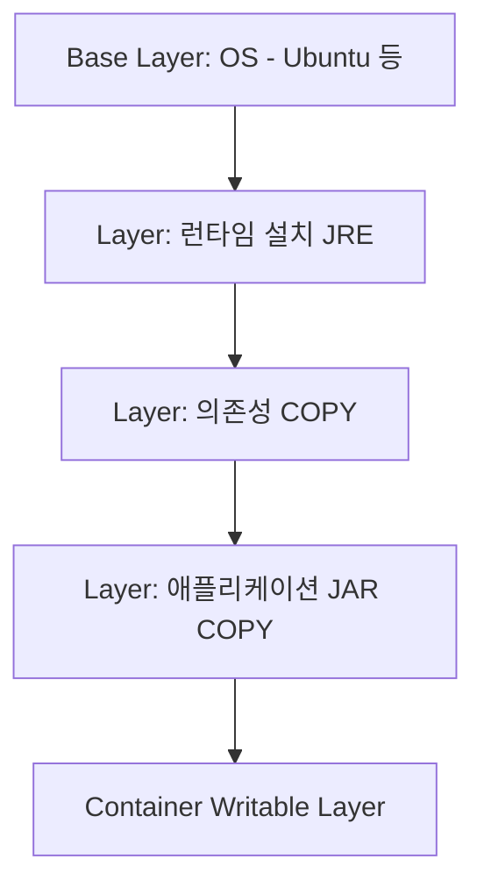

# Docker 이미지와 레이어 구조

## 핵심 정의
Docker 이미지(image)는 컨테이너 실행에 필요한 파일시스템과 실행 설정(entrypoint, 환경변수, 포트 등 메타데이터)을 담은 읽기 전용 템플릿이다. 내부적으로는 여러 개의 레이어(layer)가 쌓인 구조로 되어 있으며, 파일시스템 레이어는 RUN/COPY/ADD 등 작업이 남긴 변경분(diff)이다. ENTRYPOINT/ENV 같은 설정 명령은 이미지 메타데이터를 바꾸며 반드시 파일시스템 레이어를 추가하는 것은 아니다. 이 레이어들은 유니온 파일시스템(union filesystem, Linux의 OverlayFS 등) 방식으로 겹쳐져 하나의 통합된 파일시스템처럼 보이게 된다.

이미지 자체는 OCI(Open Container Initiative) 이미지 스펙을 따르며, config와 layer blob을 가리키는 descriptor를 담은 매니페스트(manifest), 별도 실행 config JSON, 파일 변경분 layer blob으로 구성된다. 컨테이너를 실행하면 이 읽기 전용 레이어들 위에 컨테이너 전용의 얇은 쓰기 가능 레이어(writable layer)가 하나 추가된다.

## 동작 원리 / 구조

### 레이어와 캐시
빌드 작업은 입력·명령·의존성으로 캐시 여부를 결정하고, 산출물은 다이제스트(digest, 내용 해시)로 식별한다. 캐시가 유효하려면 이전 레이어까지 동일하고, 현재 명령어(및 `COPY`/`ADD`의 경우 대상 파일 내용)도 동일해야 한다. 일반적인 순차 단계에서는 그 결과에 의존하는 이후 단계도 다시 실행된다. BuildKit의 독립 stage나 COPY --link 같은 경로까지 모든 캐시가 사라지는 것은 아니다.

```dockerfile
FROM eclipse-temurin:21-jre-jammy
WORKDIR /app
ARG JAR_FILE=build/libs/app.jar
COPY ${JAR_FILE} app.jar
ENTRYPOINT ["java", "-jar", "app.jar"]
```

레이어 구조를 그림으로 보면:



### Copy-on-Write와 스토리지 드라이버
컨테이너가 하위 레이어에 존재하는 파일을 처음 수정하면 하위 읽기 전용 레이어는 건드리지 않고, 해당 파일을 쓰기 가능 레이어로 복사한 뒤 수정하는 copy-on-write(CoW) 방식을 사용한다. 이 동작을 관리하는 것이 스토리지 드라이버(storage driver)이며, Docker Engine29.0+ 신규 설치의 기본은 containerd image store와 snapshotter다. 이전 버전에서 업그레이드한 설치는 명시적으로 바꾸기 전 overlay2 같은 기존 graph driver를 유지할 수 있다. 여러 이미지가 같은 base 레이어(예: 동일한 JRE 이미지)를 공유하면 디스크에는 해당 레이어가 한 번만 저장되고, 여러 컨테이너가 참조만 한다.

### 이미지 삭제와 레이어 잔존
`docker rmi`로 이미지를 지워도 다른 이미지가 참조 중인 레이어는 실제로 삭제되지 않고 참조 카운트만 줄어든다. image prune은 기본적으로 dangling 이미지를 지우고 -a는 컨테이너가 참조하지 않는 미사용 이미지까지 대상으로 한다. build cache는 builder/buildx prune으로 관리하며 이미지 삭제 때 참조 없는 blob이 자동 정리될 수도 있다.

예제 JRE21 tag는 선택한 기준이며 최신성·불변성을 보장하지 않는다. build arg로 정확히 하나의 실행 JAR를 지정해 plain JAR나 여러 JAR wildcard 충돌을 피한다. 뒤 레이어에서 파일을 삭제해도 이전 레이어 blob에는 내용이 남는다. 시크릿은 COPY/ARG/ENV 대신 BuildKit secret mount로 전달하고 최종 산출물에 복사되지 않게 한다. RUN의 네트워크 패키지 저장소 변경은 명령이 같으면 캐시를 자동 무효화하지 않으며 COPY/ADD는 mtime만 바뀐 경우 캐시를 유지한다.

## 실무 관점
- **레이어 순서 최적화**: 변경 빈도가 낮은 것(OS 패키지 설치, 의존성 설치)을 앞쪽에, 변경 빈도가 높은 것(애플리케이션 코드)을 뒤쪽에 배치해 캐시 재사용률을 높인다. Spring Boot의 경우 의존성(`build.gradle`, `pom.xml`)을 먼저 `COPY`하고 의존성 다운로드를 수행한 뒤, 소스 코드를 나중에 `COPY`하는 방식이 표준 패턴이다.
- **멀티스테이지 빌드(multi-stage build)**: 빌드 도구(Gradle, Maven)와 컴파일 산출물이 섞인 무거운 이미지를 그대로 배포하지 않도록, 빌드 스테이지와 런타임 스테이지를 분리해 최종 이미지에는 실행에 필요한 JRE와 산출물만 남긴다. Spring Boot는 `spring-boot:build-image`(Cloud Native Buildpacks)나 레이어드 JAR(조회한 Boot4.1.1은 jarmode=tools) 기능으로 의존성/리소스/애플리케이션 클래스를 별도 레이어로 분리해 재빌드 시 변경분만 새로 캐시하도록 지원한다.
- **흔한 실수**: `COPY . .`를 최상단에서 실행해 코드 한 줄만 바뀌어도 이후 의존성 설치 레이어까지 캐시가 깨지는 패턴. `.dockerignore`를 설정하지 않아 `.git`, `node_modules`, 빌드 산출물 등이 컨텍스트로 전송되며 빌드가 느려지고 이미지가 비대해지는 문제.
- **이미지 크기와 보안**: 불필요한 레이어(디버그 도구, 캐시 파일)가 남으면 이미지가 커지고 공격 표면(attack surface)도 늘어난다. `alpine`이나 `distroless` 같은 경량 base 이미지, 멀티스테이지에서 최종 스테이지에 빌드 도구를 포함하지 않는 방식으로 대응한다.
- **튜닝 포인트**: `RUN` 명령어를 `&&`로 묶어 하나의 레이어로 합치면 레이어 수와 중간 산출물을 줄일 수 있지만, 캐시 세분화(granularity)와는 트레이드오프가 있다. BuildKit의 캐시 마운트(`--mount=type=cache`)를 사용하면 Gradle/Maven 의존성 캐시를 레이어에 굽지 않고 빌드 간 재사용할 수 있다.

### 빌드 시크릿을 바꿔도 캐시는 자동 무효화되지 않는다

BuildKit 시크릿 마운트의 내용은 빌드 캐시 체크섬에 포함되지 않는다. 시크릿 ID·마운트 경로 같은 속성은 포함되지만, 토큰 값만 교체하면 해당 RUN 단계가 캐시로 재사용될 수 있다. 따라서 토큰을 회수한 뒤 빌드가 성공했다는 사실만으로 새 토큰의 인증이나 의존성 다운로드를 실제로 수행했다고 판단하지 않는다.

새 인증 정보로 단계를 다시 실행해야 한다면 비밀이 아닌 교체 리비전을 캐시 무효화용 build argument로 전달하거나 필요한 단계의 캐시를 비활성화한다. 실제 시크릿 값을 ARG에 넣어 무효화하지 않는다. 또한 시크릿 마운트는 명령 실행 중 전달 수단이다. 빌드 명령이 그 값을 로그에 출력하거나 결과 파일에 복사하면 그 출력까지 보호해 주지 않으므로, 이미지·빌드 로그·산출물을 따로 확인한다.

## 심화 Q&A

### Q. `COPY`와 `ADD`는 캐시 무효화 관점에서 어떻게 다른가?
A. 둘 다 대상 파일의 내용 해시를 기준으로 캐시 유효성을 판단하지만, `ADD`는 원격 URL 다운로드나 tar 자동 압축 해제 같은 부가 기능이 있어 그 결과물이 매 빌드마다 달라질 수 있는(예: URL 컨텐츠 변경) 리스크가 있다. 예측 가능한 캐시 동작을 원하면 `ADD`보다 `COPY`를 기본으로 쓰고, 압축 해제나 원격 다운로드가 필요한 경우에만 `ADD`를 명시적으로 사용하는 것이 권장된다.

### Q. 같은 base 이미지를 쓰는 컨테이너 10개를 띄우면 디스크 사용량이 10배가 되는가?
A. 아니다. 읽기 전용 레이어는 이미지 간, 컨테이너 간 공유되며 디스크에 한 번만 존재한다. 각 컨테이너는 자신만의 얇은 쓰기 가능 레이어만 추가로 사용하므로, 실제 디스크 증가분은 컨테이너별 변경 데이터 양에 비례한다. 다만 컨테이너 내에서 대용량 쓰기가 발생하면(예: 로그를 컨테이너 파일시스템에 직접 쌓는 경우) CoW 오버헤드와 쓰기 가능 레이어 크기가 커질 수 있다.

### Q. 레이어드 JAR(layered jar)와 일반 fat JAR를 그대로 이미지에 넣는 방식의 차이는 무엇인가?
A. 일반 fat JAR를 통째로 `COPY`하면 애플리케이션 코드 한 줄만 바뀌어도 JAR 전체가 새 레이어로 취급되어 해당 JAR를 담은 레이어와 그에 의존하는 단계의 캐시가 무효화된다. Spring Boot의 레이어드 JAR 기능은 JAR 내부를 `dependencies`, `spring-boot-loader`, `snapshot-dependencies`, `application` 레이어로 나눠 각각 별도 Docker 레이어로 `COPY`하므로, 애플리케이션 코드 변경 시 `application` 레이어만 재빌드되고 의존성 레이어는 캐시가 유지된다.

### Q. 이미지 다이제스트(digest)와 태그(tag)의 차이는 무엇이며 왜 프로덕션에서 다이제스트 고정이 권장되는가?
A. 태그(예: `myapp:latest`)는 특정 시점에 특정 이미지를 가리키는 가변 포인터일 뿐이라 같은 태그라도 나중에 다른 내용의 이미지로 덮어써질 수 있다. 다이제스트(`sha256:...`)는 이미지 매니페스트의 내용 해시라 불변(immutable)이다. 프로덕션 배포나 CI/CD에서는 태그가 아니라 다이제스트를 고정해 배포 재현성(reproducibility)을 보장하는 것이 안전하다.

### Q. 멀티 아키텍처(multi-arch) 이미지는 레이어 구조와 어떤 관계가 있는가?
A. 멀티 아키텍처 이미지는 하나의 이미지 인덱스(manifest list) 아래 아키텍처별(amd64, arm64 등) 매니페스트와 그에 대응하는 레이어 셋이 별도로 존재하는 구조다. 즉 아키텍처별 바이너리 레이어는 다르지만 동일한 내용의 리소스 레이어는 digest가 같으면 공유 가능하며, 클라이언트는 자신의 아키텍처에 맞는 매니페스트만 pull한다. `docker buildx`로 여러 아키텍처를 한 번에 빌드해 하나의 태그 아래 인덱스로 묶는 것이 일반적인 방식이다.

### Q. 컨테이너를 삭제하지 않고 재시작만 반복하면 쓰기 가능 레이어는 어떻게 되는가?
A. 쓰기 가능 레이어는 컨테이너에 귀속되며 재시작(`docker restart`)해도 유지된다(컨테이너를 삭제하는 `docker rm`을 해야 사라진다). 따라서 재시작을 반복하며 로그나 임시 파일이 계속 쌓이면 쓰기 가능 레이어가 무한정 커질 수 있어, 상태를 유지해야 하는 데이터는 볼륨(volume)으로 분리하고 컨테이너 자체는 상태 비저장(stateless)으로 설계하는 것이 원칙이다.

## 관련 개념
- [[컨테이너 네트워킹]]
- [[컨테이너 이미지 보안 스캔]]
- [[CI-CD 파이프라인 구성]]

## 참고 자료

- [OCI Image Manifest](https://github.com/opencontainers/image-spec/blob/v1.1.1/manifest.md) — image-spec v1.1.1·config/layer descriptors. 확인: 2026-09-08.
- [Docker containerd image store](https://docs.docker.com/engine/storage/containerd/) — Engine29.0+ 신규설치 기본. 확인: 2026-09-08.
- [Docker Cache invalidation](https://docs.docker.com/build/cache/invalidation/) — 파일checksum·mtime 제외·RUN캐시. 확인: 2026-09-08.
- [Docker Pruning](https://docs.docker.com/engine/manage-resources/pruning/) — dangling image·unused image·build cache 구분. 확인: 2026-09-08.
- [Docker Build secrets](https://docs.docker.com/build/building/secrets/) — BuildKit secret mount. 확인: 2026-09-08.
- [Spring Boot Dockerfiles](https://docs.spring.io/spring-boot/reference/packaging/container-images/dockerfiles.html) — 4.1.1·jarmode=tools·layer extraction. 확인: 2026-09-08.

부분 재검증: 2026-10-04. [Docker Build cache invalidation](https://docs.docker.com/build/cache/invalidation/)과 [Build secrets](https://docs.docker.com/build/building/secrets/)에서 시크릿 내용/속성의 캐시 참여 차이와 RUN 시크릿 마운트 수명을 확인했다. 적용 범위는 문서의 Dockerfile frontend `docker/dockerfile:1` 및 BuildKit 시크릿 마운트이며 Engine·BuildKit 패치 버전별 재현은 하지 않았다. 로그·산출물 유출 경계는 마운트가 명령의 출력물을 정화하지 않는다는 설계상의 확인 항목이다. 실제 이미지 빌드·토큰 교체 시험은 수행하지 않았고 `verified`는 유지했다.
